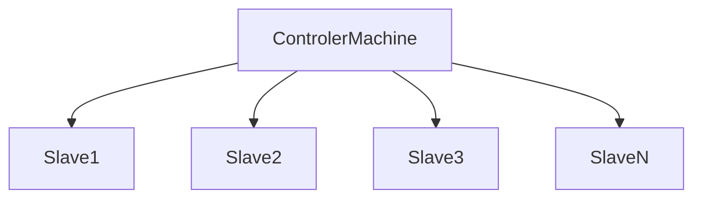

# SSH

## Login update

- before `ssh -t root@192.168.0.242 'cd /home/x ; bash'`

- after `ssh -t root@192.168.0.242 "cd /home/x ; bash"`
  - also `ssh -t root@192.168.0.242 "cd /home/x ; bash --login"`

Notice that **double quotation marks** changed after.

## Priv and pub key sign in(win to linux).

### Generate priv/pub keys

`ssh-keygen -t rsa`

saved in `user/.ssh`

### Pub key sent to server and apply key

```shell
cd ~/.ssh
cat id_rsa.pub_client >> authorized_keys
chmod 700 ../ssh
```

## SSH on Windows

### Install ssh(V8.6.0.0p1-Beta) on win7
- [tutorial](https://blog.csdn.net/baojunqinluo/article/details/134053559)

0. Download [link](https://github.com/PowerShell/Win32-OpenSSH/releases)
1. Configure environment variables and install service(opt if as client)
   1.  install service `install-sshd.ps1` within the folder.
   2.  `powershell.exe -ExecutionPolicy Bypass -File install-sshd.ps1`

### Priv and pub key sign in(win to win).

[tutorial](https://zhuanlan.zhihu.com/p/111812831)


服务端切换到`C:\ProgramData\ssh\`下（首次启动sshd后会生成该文件夹），打开`sshd_config`文件，

修改文件（以下是重点）：

确保以下3条没有被注释
```
PubkeyAuthentication yes
AuthorizedKeysFile	.ssh/authorized_keys
PasswordAuthentication no
```

确保以下2条有注释掉
```
#Match Group administrators
#       AuthorizedKeysFile __PROGRAMDATA__/ssh/administrators_authorized_keys
```

其余不做修改，基本都是已注释不启用。


-------------

windows10 ssh客户端访问windows10 的ssh服务端。authorized_keys文件的安全设置中，不能有继承，只保留administrator和system即可。

重启服务


## sshpass



### set `pub` key to slaves by shell

connect.sh

```shell
sshpass -p "$1" sftp  -o StrictHostKeyChecking=no "$2@$3" <<EOF
pwd
exit
EOF
```


```shell
bash <<'EOF'
slavesAddresses=("192.168.0.243" "192.168.0.244")
slavesUsers=("root" "root" )
slavesPwds=("joeyjoey" "joeyjoey")

for((i==0; i<${#slavesAddresses[@]}; i++))
do
    address=${slavesAddresses[i]}
    user=${slavesUsers[i]}
    pwd=${slavesPwds[i]}

    ./connect.sh $pwd $user $address
    sleep 2

    echo ""
done
EOF
```

### to run shell without file

```shell
bash <<'EOF'

pwd

EOF
```
