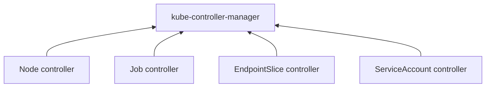
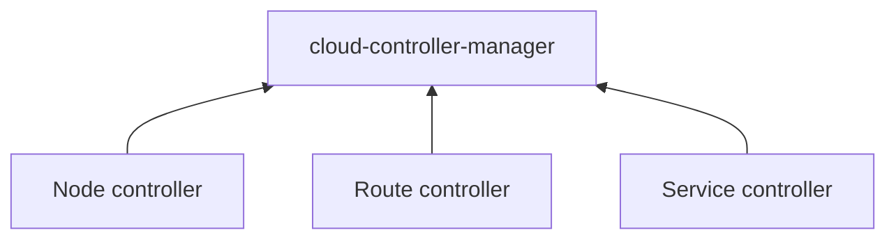
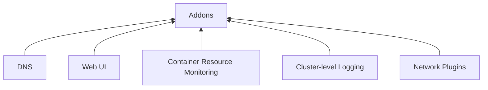

# cmp-1-k8s-concepts.md
- [cmp-1-k8s-concepts.md](#cmp-1-k8s-conceptsmd)
- [Objects in kubernetes-Overview](#objects-in-kubernetes-overview)
  - [Understanding Kubernetes objects](#understanding-kubernetes-objects)
    - [Object spec and status](#object-spec-and-status)
    - [Describing a Kubernetes object](#describing-a-kubernetes-object)
    - [Required fields](#required-fields)
  - [Server side field validation](#server-side-field-validation)
- [Kubernetes Object Management-Objects in kubernetes-Overview](#kubernetes-object-management-objects-in-kubernetes-overview)
  - [Management techniques](#management-techniques)
- [Object Names and IDs-Objects in kubernetes-Overview](#object-names-and-ids-objects-in-kubernetes-overview)
    - [UIDs](#uids)
- [Labels and Selectors-Objects in kubernetes-Overview](#labels-and-selectors-objects-in-kubernetes-overview)
  - [Motivation](#motivation)
  - [Syntax and character set](#syntax-and-character-set)
  - [Label selectors](#label-selectors)
    - [Equality-based requirement](#equality-based-requirement)
    - [Set-based requirement](#set-based-requirement)
- [Kubernetes-components-Overview](#kubernetes-components-overview)
  - [Control panel components](#control-panel-components)
    - [kube-apiserver](#kube-apiserver)
    - [etcd](#etcd)
    - [kube-scheduler](#kube-scheduler)
    - [kube-controller-manager](#kube-controller-manager)
    - [cloud-controller-manager](#cloud-controller-manager)
  - [Node Components](#node-components)
    - [kubelet](#kubelet)
    - [kube-proxy](#kube-proxy)
    - [Container runtime](#container-runtime)
  - [Addons](#addons)
    - [DNS](#dns)
    - [Web UI (Dashboard)](#web-ui-dashboard)
    - [Container Resource Monitoring](#container-resource-monitoring)
    - [Cluster-level Logging](#cluster-level-logging)
    - [Network Plugins](#network-plugins)
- [The Kubernetes API-Overview](#the-kubernetes-api-overview)
- [Cluster structure](#cluster-structure)
  - [Nodes](#nodes)
    - [Management](#management)
    - [Node status, hearbeats, controller,](#node-status-hearbeats-controller)
  - [Communication between Nodes and the Control Plane](#communication-between-nodes-and-the-control-plane)
  - [Controllers](#controllers)
  - [Leases](#leases)
- [Workloads](#workloads)
  - [pods](#pods)
- [Workload Management](#workload-management)
  - [built-in APIs:](#built-in-apis)
  - [Deployment](#deployment)
  - [StatefulSet](#statefulset)
  - [DaemonSet](#daemonset)
- [Services, Load Balancing, and Networking](#services-load-balancing-and-networking)
  - [Service](#service)
    - [Services in Kubernetes](#services-in-kubernetes)
    - [Defining a Service](#defining-a-service)
      - [Port definitions](#port-definitions)
    - [Endpoints](#endpoints)
  - [Ingress](#ingress)
    - [Terminology](#terminology)
  - [Ingress Controllers](#ingress-controllers)
  - [Gateway API](#gateway-api)
    - [Resource model](#resource-model)
  - [EndpointSlices](#endpointslices)
    - [EndpointSlice API](#endpointslice-api)
- [Api references](#api-references)
  - [API Overview](#api-overview)
- [Reference](#reference)
  - [API Overview](#api-overview-1)
  - [Command line tool (kubectl)](#command-line-tool-kubectl)
- [Workload Resources-Kubernetes API-Reference](#workload-resources-kubernetes-api-reference)
  - [PodTemplate](#podtemplate)


# Objects in kubernetes-Overview

[doc](https://kubernetes.io/docs/concepts/overview/working-with-objects/)

## Understanding Kubernetes objects

Kubernetes objects are persistent entities in the Kubernetes system. Kubernetes uses these  
entities **to represent the state of your cluster**.

To work with Kubernetes objects—whether to create, modify, or delete them—you'll need to use  
the **Kubernetes API**. 

### Object spec and status

`spec` providing a description of the characteristics you want the resource to have: its **desired state**.

The `status` describes the **current state** of the object, supplied and updated by the Kubernetes system and its components. 

### Describing a Kubernetes object

[doc](https://kubernetes.io/docs/concepts/overview/working-with-objects/#describing-a-kubernetes-object)


### Required fields

- apiVersion - Which version of the Kubernetes API you're using to create this object
- kind - What kind of object you want to create
- metadata - Data that helps uniquely identify the object, including a name string, UID, and optional namespace
- spec - What state you desire for **the object**


The [Kubernetes API Reference](https://kubernetes.io/docs/reference/kubernetes-api/) can help you find the **spec format** for all of the objects you can create using Kubernetes.


## Server side field validation 


# Kubernetes Object Management-Objects in kubernetes-Overview

## Management techniques 
Management technique | Operates on	| Recommended environment |	Supported writers |	Learning curve
|:---|:---:|:---:|:---:|:---:|
Imperative commands	             | Live objects	        | Development projects	| 1+	| Lowest
Imperative object configuration	 | Individual files	    | Production projects	  | 1	  | Moderate
Declarative object configuration | Directories of files	| Production projects	  | 1+	| Highest


# Object Names and IDs-Objects in kubernetes-Overview

- Each object in your cluster **has a Name** that is unique for that **type of resource**.  
  Every Kubernetes object also has a **UID** that is unique across your whole cluster.

### UIDs

- A Kubernetes systems-generated string **to uniquely identify objects**.

# Labels and Selectors-Objects in kubernetes-Overview

- Labels can be used **to organize** and **to select** subsets of objects.

## Motivation 

- Labels enable users to map their **own organizational structures** onto system objects

## Syntax and character set 

- Labels are *key/value pairs*.  
  Valid label keys have two segments: **an optional prefix and name**, separated by a slash (/).  

  The name segment is required and must be 63 characters or less.  
  beginning and ending with an alphanumeric character ([a-z0-9A-Z]) with dashes (-), underscores (_), dots (.)  

  ---

  The prefix is optional. If specified, the prefix must be a DNS subdomain:  
  a series of DNS labels separated by dots (.), not longer than 253 characters in total, followed by a slash (/).


- If the prefix is omitted  
  the label Key is presumed to be private to the user.  

  Automated system components (e.g. kube-scheduler, kube-controller-manager, kube-apiserver, kubectl, or other third-party automation) which add labels to end-user objects **must** specify a prefix.  
  


For example, here's a manifest for a Pod that has two labels environment: production and app: nginx:

```yaml
apiVersion: v1
kind: Pod
metadata:
  name: label-demo
  labels:
    environment: production
    app: nginx
spec:
  containers:
  - name: nginx
    image: nginx:1.14.2
    ports:
    - containerPort: 80
```

## Label selectors 

- Labels do not provide uniqueness.
- Via a label selector, the client/user can identify `a set of objects`.
- The API currently supports two types of selectors: **equality-based** and **set-based**.

### Equality-based requirement

Equality- or inequality-based requirements allow filtering by **label keys and values**. 

For example, the sample Pod below selects nodes with the label "accelerator=nvidia-tesla-p100".

```yaml
apiVersion: v1
kind: Pod
metadata:
  name: cuda-test
spec:
  containers:
    - name: cuda-test
      image: "registry.k8s.io/cuda-vector-add:v0.1"
      resources:
        limits:
          nvidia.com/gpu: 1
  nodeSelector:
    accelerator: nvidia-tesla-p100
```

### Set-based requirement

Set-based label requirements allow filtering keys according to **a set of values**.  
Three kinds of operators are supported: in,notin and exists (only the key identifier).  

For example:
```
environment in (production, qa)
tier notin (frontend, backend)
partition
!partition
```

- The first example selects all resources with key equal to `environment` and value equal to `production` or `qa`.
- The second example selects all resources with key equal to `tier` and values other than `frontend` and `backend`, and all resources with no labels with the tier key.
- The third example selects all resources including a label with key `partition`; no values are checked.
- The fourth example selects all resources without a label with key `partition`; no values are checked.

# Kubernetes-components-Overview
[doc](https://kubernetes.io/docs/concepts/overview/components/)


## Control panel components

>The control plane manages the worker nodes and the Pods in the cluster.  
>In production environments, the control plane usually runs across multiple  
>computers and a cluster usually runs multiple nodes, providing fault-tolerance  
>and high availability.

### kube-apiserver

* The API server is a component of the Kubernetes control plane   
  **that exposes the Kubernetes API**.  
  The API server is the front end for the Kubernetes control plane.

### etcd

* Consistent and highly-available **key value store** used as Kubernetes' backing store for all cluster data.

### kube-scheduler 

* Control plane component that watches for newly created Pods **with no assigned node**,  
  and selects a node for them to run on.

### kube-controller-manager 




- Node controller: Responsible for noticing and responding when **nodes** go down.
- Job controller: Watches for Job objects that represent **one-off tasks**, then creates Pods to run those tasks to completion.
- EndpointSlice controller: Populates EndpointSlice objects (to provide **a link** between Services and Pods).
- ServiceAccount controller: Create default **ServiceAccounts** for new namespaces.

### cloud-controller-manager 



 lets you link your cluster into your cloud provider's API, and separates out  
 the components that interact with that cloud platform *from components that  
 only interact with your cluster.*


- Node controller: For checking the cloud provider to determine if a node has been   
  deleted in the cloud after it - stops responding
- Route controller: For setting up routes in the underlying cloud infrastructure
- Service controller: For creating, updating and deleting cloud provider load balancers
---

## Node Components 


* Maintaining **running pods** and providing the Kubernetes **runtime environment**.

### kubelet

* It makes sure that containers are running in a Pod.

### kube-proxy 

 maintains **network rules** on nodes. These network rules allow network communication   
 to your Pods from network sessions **inside or outside** of your cluster.

### Container runtime 

---

## Addons



### DNS

### Web UI (Dashboard) 

### Container Resource Monitoring 

### Cluster-level Logging

### Network Plugins 


# The Kubernetes API-Overview

The Kubernetes API lets you query and manipulate the state of API objects in Kubernetes (for example: Pods,  
Namespaces, ConfigMaps, and Events).

Most operations can be performed through the kubectl command-line interface or other command-line tools, such  
as kubeadm, which in turn use the API. However, you can also access the API directly using REST calls.

# Cluster structure 

[link](https://kubernetes.io/docs/concepts/architecture/)

## Nodes

* Kubernetes runs your workload by placing containers into Pods to run on Nodes

### Management

* to have Nodes added to the API server
  1. a node self-registers to the control plane.
  2. manually add a Node object

### Node status, hearbeats, controller, 

---

## Communication between Nodes and the Control Plane

## Controllers

## Leases

# Workloads

## pods
[link](https://kubernetes.io/docs/concepts/workloads/pods/)  

* Pods are the smallest deployable units of computing **that you can create and manage in Kubernetes**.
* A Pod (as in a pod of whales or pea pod) **is a group of one or more containers.**
* A Pod is similar to a set of containers with shared namespaces and shared filesystem volumes
* Quiting
  * The Pod remains on that node until the Pod finishes execution,  
    the Pod object is deleted, the Pod is evicted for lack of resources,  
    or the node fails.

# Workload Management

[link](https://kubernetes.io/docs/concepts/workloads/controllers/)

## built-in APIs:
## Deployment
- A Deployment provides declarative updates for Pods and ReplicaSets.

## StatefulSet

## DaemonSet

# Services, Load Balancing, and Networking

[link](https://kubernetes.io/docs/concepts/services-networking/)

## Service

- a Service is a method for **exposing a network application**  
  that is running as one or more Pods in your cluster.

### Services in Kubernetes 

- The Service API, part of Kubernetes, is an abstraction to help you  
  expose groups of Pods over a network. Each Service object defines  
  a logical set of endpoints (usually these endpoints are Pods) along  
  with a policy about how to make those pods accessible.

### Defining a Service

#### Port definitions
Port definitions in Pods have names, and you can reference these names in the targetPort attribute of a Service.

### Endpoints

In the Kubernetes API, an Endpoints (the resource kind is plural) defines a list of network endpoints,  
typically referenced by a Service to define which Pods the traffic can be sent to.

## Ingress

- An API object that manages external access to the services in a cluster, typically HTTP.

### Terminology
- Node
- Cluster
- Edge router
- Cluster network
- Service: that identifies a set of Pods using label selectors.


## Ingress Controllers

In order for the Ingress resource to work, the cluster must have an ingress controller running.


## Gateway API

Make network services available by using an extensible, role-oriented, protocol-aware configuration  
mechanism. Gateway API is an add-on containing API kinds that provide dynamic infrastructure  
provisioning and advanced traffic routing.

- The NGINX Ingress Controller for Kubernetes works with the NGINX webserver (as a proxy).
- 
### Resource model 

- GatewayClass: Defines a set of gateways with common configuration and managed by a controller that  
  implements the class.

- Gateway: Defines an instance of traffic handling infrastructure, such as cloud load balancer.

- HTTPRoute: Defines HTTP-specific rules for mapping traffic from a Gateway listener to a representation  
  of backend network endpoints. These endpoints are often represented as a Service.


## EndpointSlices
Kubernetes' EndpointSlice API provides a way to track network endpoints within a Kubernetes cluster.  
EndpointSlices offer a more scalable and extensible alternative to Endpoints.

### EndpointSlice API 

an EndpointSlice contains references to a set of network endpoints. 

# Api references

[doc](https://kubernetes.io/docs/reference/generated/kubernetes-api/v1.29/#api-overview)

Kubernetes resources and "records of intent" are all stored as **API objects**.


## API Overview

You can use the Kubernetes API **to read and write Kubernetes resource objects** via a Kubernetes API endpoint.


# Reference

## API Overview
[link](https://kubernetes.io/docs/reference/using-api/)

The REST API is the fundamental fabric of Kubernetes. All operations and communications between components, and  
external user commands are REST API calls that the API Server handles. Consequently, everything in the Kubernetes  
platform is treated as an API object and has a corresponding entry in the API.

## Command line tool (kubectl)

[link](https://kubernetes.io/docs/reference/kubectl/)


# Workload Resources-Kubernetes API-Reference

<https://kubernetes.io/docs/reference/kubernetes-api/workload-resources/>

## PodTemplate

PodTemplate describes a template for creating copies of a predefined pod.


