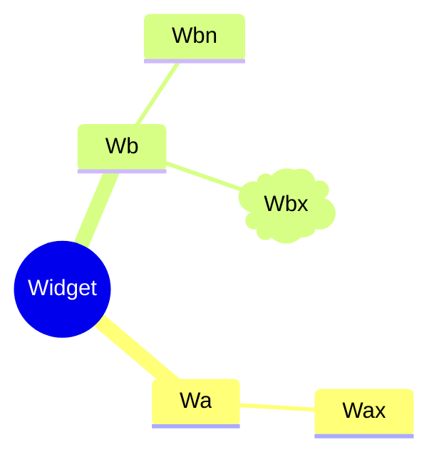
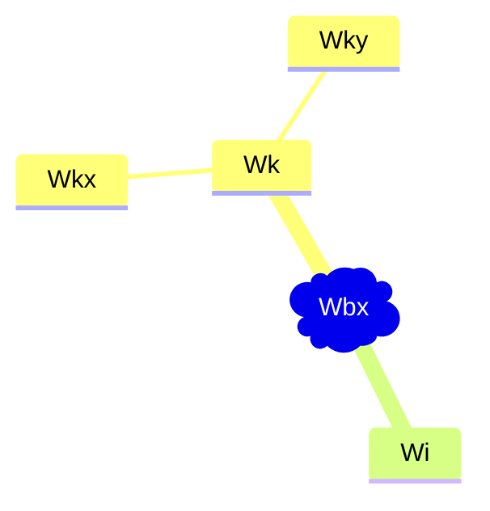

# cmp-14-vue3.md
- [cmp-14-vue3.md](#cmp-14-vue3md)
- [Scaffold](#scaffold)
  - [nodejs](#nodejs)
  - [debugger](#debugger)
  - [Ts](#ts)
  - [npm](#npm)
  - [sass](#sass)
  - [vue cli](#vue-cli)
  - [vite](#vite)
  - [vue router 4.x](#vue-router-4x)
  - [vue3](#vue3)
    - [modularization thought](#modularization-thought)
    - [api ref](#api-ref)
    - [single file component](#single-file-component)
    - [watcher](#watcher)
    - [props](#props)
    - [slot](#slot)
      - [custom events](#custom-events)
    - [custom components](#custom-components)
    - [element ui plus](#element-ui-plus)
- [-Essentials](#-essentials)
- [Template Syntax](#template-syntax)
  - [Text Interpolation](#text-interpolation)
  - [Raw HTML](#raw-html)
  - [Attribute Bindings](#attribute-bindings)
    - [Shorthand](#shorthand)
    - [Same-name Shorthand `3.4+`](#same-name-shorthand-34)
    - [Boolean Attributes](#boolean-attributes)
    - [Dynamically Binding Multiple Attributes](#dynamically-binding-multiple-attributes)
  - [Using JavaScript Expressions](#using-javascript-expressions)
    - [Calling Functions](#calling-functions)
    - [Restricted Globals Access](#restricted-globals-access)
  - [Directives](#directives)
    - [Arguments](#arguments)
    - [Dynamic Arguments](#dynamic-arguments)
    - [Dynamic Argument Value Constraints](#dynamic-argument-value-constraints)
    - [doc-Dynamic Argument Syntax Constraints](#doc-dynamic-argument-syntax-constraints)
  - [Modifiers](#modifiers)
- [🚴‍♂️ Reactivity Fundamentals](#️-reactivity-fundamentals)
  - [`ref()` - Declaring Reactive State](#ref---declaring-reactive-state)
  - [`<script setup>` - Declaring Reactive State](#script-setup---declaring-reactive-state)
  - [reactive()](#reactive)
  - [📖 Additional Ref Unwrapping Details](#-additional-ref-unwrapping-details)
- [Computed Properties](#computed-properties)
  - [Basic Example](#basic-example)
  - [Computed Caching vs. Methods](#computed-caching-vs-methods)
  - [Writable Computed](#writable-computed)
- [Class and Style Bindings](#class-and-style-bindings)
  - [Binding HTML Classes](#binding-html-classes)
    - [Binding to Objects](#binding-to-objects)
    - [Binding to Arrays](#binding-to-arrays)
    - [With Components](#with-components)
  - [Binding Inline Styles](#binding-inline-styles)
    - [Binding to Objects](#binding-to-objects-1)
- [Conditional Rendering](#conditional-rendering)
  - [v-if](#v-if)
  - [v-else](#v-else)
  - [v-else-if](#v-else-if)
  - [v-if on \<template\>](#v-if-on-template)
  - [v-show](#v-show)
- [List Rendering](#list-rendering)
  - [v-for](#v-for)
  - [📖 `v-for` with an Object](#-v-for-with-an-object)
- [Event Handling](#event-handling)
  - [Listening to Events](#listening-to-events)
    - [handler categories](#handler-categories)
  - [Inline Handlers](#inline-handlers)
  - [Method Handlers](#method-handlers)
  - [Calling Methods in Inline Handlers](#calling-methods-in-inline-handlers)
  - [Accessing Event Argument in Inline Handlers](#accessing-event-argument-in-inline-handlers)
  - [📖Event Modifiers](#event-modifiers)
  - [📖Key Modifiers](#key-modifiers)
  - [📖Mouse Button Modifiers](#mouse-button-modifiers)
- [Form Input Bindings](#form-input-bindings)
  - [Basic Usage](#basic-usage)
    - [Text](#text)
    - [Multiline text](#multiline-text)
    - [Checkbox](#checkbox)
    - [Radio](#radio)
    - [Select](#select)
  - [📖Modifiers](#modifiers-1)
    - [`.lazy`](#lazy)
    - [`.number`](#number)
    - [`.trim`](#trim)
  - [`v-model` with Components](#v-model-with-components)
- [Lifecycle Hooks](#lifecycle-hooks)
- [Watchers](#watchers)
  - [Basic example](#basic-example-1)
    - [📖Watch Source Types](#watch-source-types)
    - [watch a object - Watch Source Types](#watch-a-object---watch-source-types)
  - [Deep Watchers](#deep-watchers)
  - [Eager Watchers](#eager-watchers)
  - [Once Watchers `3.4+`](#once-watchers-34)
  - [watchEffect()](#watcheffect)
    - [`watch` vs. `watchEffect`](#watch-vs-watcheffect)
  - [Stopping a Watcher](#stopping-a-watcher)
- [-Scaling Up](#-scaling-up)
- [Single-File Components](#single-file-components)
  - [Introduction](#introduction)
- [Appendix](#appendix)
  - [API Ref](#api-ref-1)

# Scaffold

## nodejs

## debugger

* vscode 
* chrome extension of vue.js devtools

## Ts

* [ts](https://www.tslang.cn/docs/handbook/basic-types.html)
* [doc tsconfig-json](https://www.tslang.cn/docs/handbook/tsconfig-json.html)

## npm

* [doc npm](https://docs.npmjs.com/)
* [doc package.json](https://docs.npmjs.com/cli/v10/configuring-npm/package-json)
* [doc npm configurations](https://docs.npmjs.com/cli/v10/using-npm/config)

---

* [package.json](package.json)
* [doc script block](https://docs.npmjs.com/cli/v10/using-npm/scripts)

## sass

* [doc](https://sass-lang.com/documentation/syntax/)

## [vue cli](https://cli.vuejs.org/zh/guide/)

## [vite](https://cn.vitejs.dev/guide)

## [vue router 4.x](https://router.vuejs.org/zh/guide/)

## [vue3](https://cn.vuejs.org/guide/introduction.html)

### modularization thought


---


```
        R                   C
       / \                 / \ 
      A   B               K   I
    /  \   \            /   \     
   □    C   □          Y     X
```


### [api ref](https://cn.vuejs.org/api/)

### [single file component](https://cn.vuejs.org/guide/scaling-up/sfc.html)
* [example](src\views\system\user\index.vue)

### watcher

* [doc](https://vuejs.org/guide/essentials/watchers.html)
* [use](src\views\mall\product\spu\form\ProductAttributes.vue#L75)

### props

* [doc](https://cn.vuejs.org/guide/essentials/component-basics.html#passing-props)

### slot

* [doc](https://cn.vuejs.org/guide/components/slots.html#slot-content-and-outlet)

#### custom events

* [doc](https://cn.vuejs.org/guide/essentials/component-basics.html#listening-to-events)

### [custom components](src\components)


* [doc](https://cn.vitejs.dev/guide/env-and-mode.html)

### [element ui plus](https://element-plus.org/zh-CN/guide/design.html)

# -Essentials

# Template Syntax

## Text Interpolation

```html
<span>Message: {{ msg }}</span>
```

## Raw HTML

to use the v-html directive:
```html
<p>Using text interpolation: {{ rawHtml }}</p>
<p>Using v-html directive: <span v-html="rawHtml"></span></p>
```

## Attribute Bindings

use a v-bind directive:
```html
<div v-bind:id="dynamicId"></div>
```

If the bound value is null or undefined, then the attribute will be removed from the rendered element.

### Shorthand

```html
<div :id="dynamicId"></div>
```

### Same-name Shorthand `3.4+`

```html
<!-- same as :id="id" -->
<div :id></div>

<!-- this also works -->
<div v-bind:id></div>
```

### Boolean Attributes

```html
<button :disabled="isButtonDisabled">Button</button>
```

### Dynamically Binding Multiple Attributes

multiple attributes
```html
const objectOfAttrs = {
  id: 'container',
  class: 'wrapper'
}
```

using v-bind without an argument:
```html
<div v-bind="objectOfAttrs"></div>
```

## Using JavaScript Expressions

```html
{{ number + 1 }}

{{ ok ? 'YES' : 'NO' }}

{{ message.split('').reverse().join('') }}

<div :id="`list-${id}`"></div>
```

In Vue templates, JavaScript expressions can be used in the following positions:

- Inside text interpolations (mustaches)
- In the attribute value of any Vue directives (special attributes that start with v-)

### Calling Functions

It is possible to call a component-exposed method inside a binding expression:
```html
<time :title="toTitleDate(date)" :datetime="date">
  {{ formatDate(date) }}
</time>
```

### Restricted Globals Access

Template expressions are sandboxed and only have access to `a restricted list of globals`.

## Directives

Directives are special attributes with the v- prefix.

A directive's job is to reactively apply updates to the DOM when the value of its expression changes.
```html
<p v-if="seen">Now you see me</p>
```
Here, the v-if directive would remove / insert the <p> element based on the truthiness of the value of the expression seen.

### Arguments

Some directives can take an "argument", denoted by a colon after the directive name.  

For example, the `v-bind` directive is used to reactively update an HTML attribute:
```html
<a v-bind:href="url"> ... </a>

<!-- shorthand -->
<a :href="url"> ... </a>
```

Here, href is the argument, 


Another example is the `v-on` directive, which listens to DOM events:
```html
<a v-on:click="doSomething"> ... </a>

<!-- shorthand -->
<a @click="doSomething"> ... </a>
```
Here, the argument is the event name to listen to: click.  
v-on has a corresponding shorthand, namely the `@` character.

### Dynamic Arguments

in a directive argument
```html
<!--
Note that there are some constraints to the argument expression,
as explained in the "Dynamic Argument Value Constraints" and "Dynamic Argument Syntax Constraints" sections below.
-->
<a v-bind:[attributeName]="url"> ... </a>

<!-- shorthand -->
<a :[attributeName]="url"> ... </a>
```

Similarly, you can use dynamic arguments to bind a handler to a dynamic event name:
```html
<a v-on:[eventName]="doSomething"> ... </a>

<!-- shorthand -->
<a @[eventName]="doSomething"> ... </a>
```

In this example, when eventName's value is "focus", v-on:[eventName] will be equivalent to v-on:focus.

### Dynamic Argument Value Constraints

with the exception of **null**. The special value **null** can be used to explicitly remove the binding. Any other **non-string** value will trigger a warning.

### doc-Dynamic Argument Syntax Constraints

For example, the following is invalid:
```html
<!-- This will trigger a compiler warning. -->
<a :['foo' + bar]="value"> ... </a>
```

## Modifiers

which indicate that a directive should be bound in some special way. 

For example, the `.prevent` modifier tells the `v-on` directive to call `event.preventDefault()` on the triggered event:
```html
<form @submit.prevent="onSubmit">...</form>
```

# 🚴‍♂️ Reactivity Fundamentals

## `ref()` - Declaring Reactive State

using the ref() function:
```html
import { ref } from 'vue'

const count = ref(0)
```

<span style='font-size: 15px;'>**To access refs in a component's template**</span>  
```js
import { ref } from 'vue'

export default {
  // `setup` is a special hook dedicated for the Composition API.
  setup() {
    const count = ref(0)

    // expose the ref to the template
    return {
      count
    }
  }
}
```

```html
<div>{{ count }}</div>
```


mutate a ref directly in event handlers:
```html
<button @click="count++">
  {{ count }}
</button>
```

## `<script setup>` - Declaring Reactive State

We can simplify the usage with `<script setup>`:
```html
<script setup>
import { ref } from 'vue'

const count = ref(0)

function increment() {
  count.value++
}
</script>

<template>
  <button @click="increment">
    {{ count }}
  </button>
</template>
```


## reactive()

Unlike a ref which wraps the inner value in a special object, `reactive()` makes an object itself reactive:

## 📖 Additional Ref Unwrapping Details


# Computed Properties

## Basic Example

A convince for repeated calculations.

from 
```html
const author = reactive({
  name: 'John Doe',
  books: [
    'Vue 2 - Advanced Guide',
    'Vue 3 - Basic Guide',
    'Vue 4 - The Mystery'
  ]
})

<p>Has published books:</p>
<span>{{ author.books.length > 0 ? 'Yes' : 'No' }}</span>
```

to
```html
// a computed ref
const publishedBooksMessage = computed(() => {
  return author.books.length > 0 ? 'Yes' : 'No'
})
</script>

<template>
  <p>Has published books:</p>
  <span>{{ publishedBooksMessage }}</span>
</template>
```

## Computed Caching vs. Methods

computed properties are cached based on their reactive dependencies.

## Writable Computed

can create one by providing both a getter and a setter
```html
<script setup>
import { ref, computed } from 'vue'

const firstName = ref('John')
const lastName = ref('Doe')

const fullName = computed({
  // getter
  get() {
    return firstName.value + ' ' + lastName.value
  },
  // setter
  set(newValue) {
    // Note: we are using destructuring assignment syntax here.
    [firstName.value, lastName.value] = newValue.split(' ')
  }
})
</script>
```

Now when you run `fullName.value = 'John Doe'`, the setter will be invoked and firstName and lastName will be updated accordingly.

# Class and Style Bindings

provides special enhancements when v-bind is used with class and style. In addition to strings, the expressions can also evaluate to objects or arrays.

## Binding HTML Classes

### Binding to Objects
```html
<div :class="{ active: isActive }"></div>
```
The above syntax means the presence of the `active` class will be determined by the truthiness of the data property `isActive`.

---

multiple classes  
In addition, the `:class` directive can also co-exist with the plain class attribute.

```html
const isActive = ref(true)
const hasError = ref(false)

<div class="static" :class="{ active: isActive, 'text-danger': hasError }"></div>
```
It will render:
```html
<div class="static active"></div>
```

<span style='font-size: 15px;'>**Independent object**</span>  
The bound object doesn't have to be inline:
```html
const classObject = reactive({
  active: true,
  'text-danger': false
})

<div :class="classObject"></div>
```

This will render:
```html
<div class="active"></div>
```

<span style='font-size: 15px;'>**Bind to a computed property**</span>  
We can also bind to a computed property that returns an object. This is a common and powerful pattern:
```html
const isActive = ref(true)
const error = ref(null)

const classObject = computed(() => ({
  active: isActive.value && !error.value,
  'text-danger': error.value && error.value.type === 'fatal'
}))

<div :class="classObject"></div>
```

### Binding to Arrays

### With Components


## Binding Inline Styles

### Binding to Objects


# Conditional Rendering

## v-if

The block will only be rendered if the directive's expression returns a truthy value.
```html
<h1 v-if="awesome">Vue is awesome!</h1>
```

## v-else

You can use the `v-else` directive to indicate an "else block" for `v-if`:
```html
<button @click="awesome = !awesome">Toggle</button>

<h1 v-if="awesome">Vue is awesome!</h1>
<h1 v-else>Oh no 😢</h1>
```

## v-else-if

## v-if on \<template\>

## v-show


# List Rendering

## v-for

template expressions have access to all parent scope properties.

```html
const items = ref([{ message: 'Foo' }, { message: 'Bar' }])

<li v-for="item in items">
  {{ item.message }}
</li>
```

with index 
```html
const parentMessage = ref('Parent')
const items = ref([{ message: 'Foo' }, { message: 'Bar' }])

<li v-for="(item, index) in items">
  {{ parentMessage }} - {{ index }} - {{ item.message }}
</li>
```

nested `v-for`
```html
<li v-for="item in items">
  <span v-for="childItem in item.children">
    {{ item.message }} {{ childItem }}
  </span>
</li>
```

`of` as the delimiter
```html
<div v-for="item of items"></div>
```

## 📖 `v-for` with an Object


# Event Handling

## Listening to Events

The usage would be `v-on:click="handler"` or with the shortcut, `@click="handler"`.  

### handler categories 

- inline handlers
- method handlers

## Inline Handlers

```html
const count = ref(0)

<button @click="count++">Add 1</button>
<p>Count is: {{ count }}</p>
```

## Method Handlers

```html
const name = ref('Vue.js')

function greet(event) {
  alert(`Hello ${name.value}!`)
  // `event` is the native DOM event
  if (event) {
    alert(event.target.tagName)
  }
}
<!-- `greet` is the name of the method defined above -->
<button @click="greet">Greet</button>
```

## Calling Methods in Inline Handlers

```html
function say(message) {
  alert(message)
}
<button @click="say('hello')">Say hello</button>
<button @click="say('bye')">Say bye</button>
```

## Accessing Event Argument in Inline Handlers

You can pass it into a method using the special `$event` variable, or use an inline arrow function:
```html
<!-- using $event special variable -->
<button @click="warn('Form cannot be submitted yet.', $event)">
  Submit
</button>

<!-- using inline arrow function -->
<button @click="(event) => warn('Form cannot be submitted yet.', event)">
  Submit
</button>
```
```javascript
function warn(message, event) {
  // now we have access to the native event
  if (event) {
    event.preventDefault()
  }
  alert(message)
}
```

## 📖Event Modifiers

## 📖Key Modifiers

When listening for keyboard events, we often need to check for specific keys. 

## 📖Mouse Button Modifiers

# Form Input Bindings

It can be cumbersome to manually wire up value bindings and change event listeners:
```html
<input
  :value="text"
  @input="event => text = event.target.value">  
```

to
```html
<input v-model="text">
```

## Basic Usage

### Text

```html
<p>Message is: {{ message }}</p>
<input v-model="message" placeholder="edit me" />
```

### Multiline text

```html
<span>Multiline message is:</span>
<p style="white-space: pre-line;">{{ message }}</p>
<textarea v-model="message" placeholder="add multiple lines"></textarea>
```

### Checkbox

```html
<input type="checkbox" id="checkbox" v-model="checked" />
<label for="checkbox">{{ checked }}</label>
```

### Radio

```html
<div>Picked: {{ picked }}</div>

<input type="radio" id="one" value="One" v-model="picked" />
<label for="one">One</label>

<input type="radio" id="two" value="Two" v-model="picked" />
<label for="two">Two</label>
```

### Select

```html
<div>Selected: {{ selected }}</div>

<select v-model="selected">
  <option disabled value="">Please select one</option>
  <option>A</option>
  <option>B</option>
  <option>C</option>
</select>
```

## 📖Modifiers

### `.lazy`

By default, v-model syncs the input with the data after each input event.  
You can add the lazy modifier to instead sync after change events:

### `.number`

### `.trim`

## `v-model` with Components


# Lifecycle Hooks

<details>
<summary>picture</summary>


</details>

[Ref](https://vuejs.org/api/composition-api-lifecycle.html#onmounted)

# Watchers

see also [Computed Properties](#computed-properties)

## Basic example

<u>"side effects" in reaction to state changes</u>

With Composition API, we can use the watch function to trigger a callback whenever a piece of reactive state changes:

```html
<script setup>
import { ref, watch } from 'vue'

const question = ref('')
const answer = ref('Questions usually contain a question mark. ;-)')
const loading = ref(false)

// watch works directly on a ref
watch(question, async (newQuestion, oldQuestion) => {
  if (newQuestion.includes('?')) {
    loading.value = true
    answer.value = 'Thinking...'
    try {
      const res = await fetch('https://yesno.wtf/api')
      answer.value = (await res.json()).answer
    } catch (error) {
      answer.value = 'Error! Could not reach the API. ' + error
    } finally {
      loading.value = false
    }
  }
})
</script>

<template>
  <p>
    Ask a yes/no question:
    <input v-model="question" :disabled="loading" />
  </p>
  <p>{{ answer }}</p>
</template>
```

### 📖Watch Source Types  

`watch`'s first argument can be different types of reactive "sources":  
it can be a ref (including computed refs), a reactive object, a getter function, or an array of multiple sources:
```js
const x = ref(0)
const y = ref(0)

// single ref
watch(x, (newX) => {
  console.log(`x is ${newX}`)
})

// getter
watch(
  () => x.value + y.value,
  (sum) => {
    console.log(`sum of x + y is: ${sum}`)
  }
)

// array of multiple sources
watch([x, () => y.value], ([newX, newY]) => {
  console.log(`x is ${newX} and y is ${newY}`)
})
```


### watch a object - Watch Source Types 

Do note that you can't watch a property of a reactive object like this:

```js
const obj = reactive({ count: 0 })

// this won't work because we are passing a number to watch()
watch(obj.count, (count) => {
  console.log(`count is: ${count}`)
})
```

instead, use a getter:
```js
// instead, use a getter:
watch(
  () => obj.count,
  (count) => {
    console.log(`count is: ${count}`)
  }
)
```

## Deep Watchers

When you call `watch()` directly on a reactive object, it will implicitly create *a deep watcher* - the callback will be triggered on all nested mutations:
```javascript
const obj = reactive({ count: 0 })

watch(obj, (newValue, oldValue) => {
  // fires on nested property mutations
  // Note: `newValue` will be equal to `oldValue` here
  // because they both point to the same object!
})

obj.count++
```

## Eager Watchers

<span style='font-size: 15px;'>**watch is lazy by default**</span>  
the callback won't be called until the watched source has changed.

<span style='font-size: 15px;'>**eagerly to get initial**</span>  
But in some cases we may want the same callback logic to be run eagerly - for example, we may want to fetch some initial data, and then re-fetch the data whenever relevant state changes.

<span style='font-size: 15px;'>**immediately**</span>  
We can force a watcher's callback to be executed immediately by passing the immediate: true option:
```javascript
watch(
  source,
  (newValue, oldValue) => {
    // executed immediately, then again when `source` changes
  },
  { immediate: true }
)
```

## Once Watchers `3.4+`

use the `once: true` option.
```javascript
watch(
  source,
  (newValue, oldValue) => {
    // when `source` changes, triggers only once
  },
  { once: true }
)
```

## watchEffect()

`watchEffect()` allows us to track the callback's reactive dependencies automatically.

from
```javascript
const todoId = ref(1)
const data = ref(null)

watch(
  todoId,
  async () => {
    const response = await fetch(
      `https://jsonplaceholder.typicode.com/todos/${todoId.value}`
    )
    data.value = await response.json()
  },
  { immediate: true }
)
```

to
```javascript
watchEffect(async () => {
  const response = await fetch(
    `https://jsonplaceholder.typicode.com/todos/${todoId.value}`
  )
  data.value = await response.json()
})
```


### `watch` vs. `watchEffect`

Their main difference is the way they track their reactive dependencies:

- `watch` only tracks the explicitly watched source.
- `watchEffect`, combines *dependency tracking* and *side effect* into one phase.  
  It automatically tracks every reactive property accessed during its synchronous execution.


## Stopping a Watcher

if the watcher is created in *an async callback*, it won't be bound to the owner component and must be stopped manually to avoid memory leaks.  

Here's an example:
```html
<script setup>
import { watchEffect } from 'vue'

// this one will be automatically stopped
watchEffect(() => {})

// ...this one will not!
setTimeout(() => {
  watchEffect(() => {})
}, 100)
</script>
```

<span style='font-size: 15px;'>**To manually stop a watcher**</span>  
use the returned handle function.  
This works for both watch and watchEffect:
```javascript
const unwatch = watchEffect(() => {})

// ...later, when no longer needed
unwatch()
```

<span style='font-size: 15px;'>**conditional watch**</span>  
If you need to wait for some async data, you can make your watch logic conditional instead:
```javascript
// data to be loaded asynchronously
const data = ref(null)

watchEffect(() => {
  if (data.value) {
    // do something when data is loaded
  }
})
```

# -Scaling Up

# Single-File Components

## Introduction

Vue Single-File Components (a.k.a. *.vue files, abbreviated as SFC) is a special file format  
that allows us to encapsulate the template, logic, and styling of a Vue component in a single file.  

Here's an example SFC:
```html
<script setup>
import { ref } from 'vue'
const greeting = ref('Hello World!')
</script>

<template>
  <p class="greeting">{{ greeting }}</p>
</template>

<style>
.greeting {
  color: red;
  font-weight: bold;
}
</style>
```

The full syntax is defined in the [SFC Syntax Specification](https://vuejs.org/api/sfc-spec.html).

# Appendix

## API Ref

[Ref](https://vuejs.org/api/composition-api-lifecycle.html)
