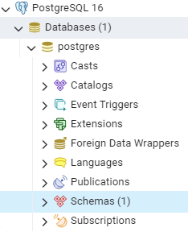
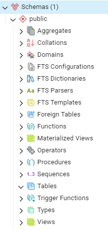

## Installation for multiple instances on single machine of Windows 

https://blog.csdn.net/qq_36959454/article/details/101849693

first one, install it step by step via official tutorial.

other ones, copy the folder installed.
- modify port, in `data/postgresql.conf`
- delete `postmaster.pid`
- install services, `pg_ctl.exe register -N "postgresql-x64-16-2" -D "C:\Program Files\PostgreSQL\16-2\data"`

## Comparison with MySQL

<https://www.cnblogs.com/blog5277/p/10658426.html>

## Objects under `database name` FROM ChatGPT

In PostgreSQL, the objects listed under the `postgres` database in the graphical interface represent different components and features of the database system. Here’s a brief explanation of each object:

1. **Casts**: 
   - **Purpose**: Define rules for converting one data type to another.
   - **Use**: Useful for ensuring that data type conversions happen correctly and as expected.

2. **Catalogs**: 
   - **Purpose**: Contain system tables and views that store metadata about the database objects.
   - **Use**: Used by PostgreSQL internally to manage databases, tables, columns, data types, functions, etc.

3. **Event Triggers**: 
   - **Purpose**: Allow execution of functions in response to certain database events (like `DDL` statements).
   - **Use**: Useful for auditing, enforcing business rules, or replicating schema changes.

4. **Extensions**: 
   - **Purpose**: Modules that add extra functionality to PostgreSQL.
   - **Use**: Can include additional data types, functions, operators, index types, etc. Examples include `PostGIS` for spatial data and `hstore` for key-value storage.

5. **Foreign Data Wrappers**: 
   - **Purpose**: Allow PostgreSQL to query and integrate data from external data sources.
   - **Use**: Can be used to connect to other databases or even files. For example, `postgres_fdw` allows querying other PostgreSQL servers.

6. **Languages**: 
   - **Purpose**: Supported procedural languages for writing functions and stored procedures.
   - **Use**: Default procedural language is `PL/pgSQL`, but you can add others like `PL/Python`, `PL/Perl`, etc.

7. **Publications**: 
   - **Purpose**: Define sets of changes (data modifications) to be replicated to subscribers.
   - **Use**: Part of PostgreSQL's logical replication feature.

8. **Schemas**: 
   - **Purpose**: Logical containers to organize and manage database objects (like tables, views, functions).
   - **Use**: Helps in organizing database objects into logical groups, providing namespace management.

9. **Subscriptions**: 
   - **Purpose**: Allow a database to receive changes from a publication.
   - **Use**: Part of PostgreSQL's logical replication feature, allowing changes to be propagated to subscribers.

These components collectively help in managing, extending, and using the PostgreSQL database system more effectively, providing a rich feature set for developers and administrators.

## Objects under `public schema` FROM ChatGPT

The objects under the `public` schema in PostgreSQL represent different types of database objects that you can create and manage within a schema. Here’s a detailed explanation of each object type:

1. **Aggregates**:
   - **Purpose**: Custom aggregate functions that process a set of input values to produce a single output value.
   - **Use**: Useful for operations like summing a column or calculating an average.

2. **Collations**:
   - **Purpose**: Define rules for sorting and comparing strings.
   - **Use**: Allow customization of string sorting and comparison to match locale-specific rules.

3. **Domains**:
   - **Purpose**: User-defined data types with optional constraints.
   - **Use**: Useful for enforcing additional constraints on a base data type (e.g., a domain for email addresses).

4. **FTS Configurations**:
   - **Full Text Search Configurations**
   - **Purpose**: Define how text search parses and searches documents.
   - **Use**: Useful for configuring how text search works for different languages or use cases.

5. **FTS Dictionaries**:
   - **Full Text Search Dictionaries**
   - **Purpose**: Define the lexemes (base forms of words) that are recognized during text search.
   - **Use**: Used to customize how words are processed and indexed for text search.

6. **FTS Parsers**:
   - **Full Text Search Parsers**
   - **Purpose**: Define how text is tokenized (split into words) for text search.
   - **Use**: Useful for customizing the tokenization process for different languages or requirements.

7. **FTS Templates**:
   - **Full Text Search Templates**
   - **Purpose**: Provide a template for creating new full text search dictionaries.
   - **Use**: Used when defining new types of text search dictionaries.

8. **Foreign Tables**:
   - **Purpose**: Tables that reference data stored outside the PostgreSQL database.
   - **Use**: Useful for querying data from external sources as if they were regular tables within PostgreSQL.

9. **Functions**:
   - **Purpose**: Stored procedures or functions that can be called with optional parameters to perform operations and return results.
   - **Use**: Useful for encapsulating reusable logic, performing calculations, and manipulating data.

10. **Materialized Views**:
    - **Purpose**: Views that store the result of a query physically, allowing for faster access.
    - **Use**: Useful for caching complex query results to improve performance.

11. **Operators**:
    - **Purpose**: Custom operators that define specific operations for data types.
    - **Use**: Useful for creating new ways to manipulate and compare data.

12. **Procedures**:
    - **Purpose**: Similar to functions, but designed for performing actions rather than returning values.
    - **Use**: Useful for encapsulating sequences of operations that modify the database state.

13. **Sequences**:
    - **Purpose**: Generate unique numeric values, often used for primary key columns.
    - **Use**: Useful for creating auto-incrementing columns.

14. **Tables**:
    - **Purpose**: The primary structure for storing data in rows and columns.
    - **Use**: Used to store and organize data within the database.

15. **Trigger Functions**:
    - **Purpose**: Functions that are automatically executed in response to certain events on a table or view (e.g., insert, update, delete).
    - **Use**: Useful for enforcing constraints, maintaining audit logs, and other automatic actions.

16. **Types**:
    - **Purpose**: User-defined data types.
    - **Use**: Useful for creating complex data structures tailored to specific application needs.

17. **Views**:
    - **Purpose**: Virtual tables defined by a query.
    - **Use**: Useful for simplifying complex queries, providing a level of abstraction, and improving security by restricting access to specific data.

These objects collectively allow you to define, manage, and manipulate data and logic within your PostgreSQL database, providing a powerful and flexible framework for database operations.