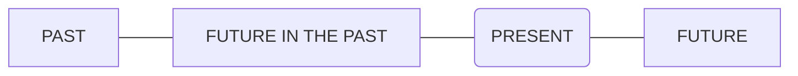

- [--Basic](#--basic)
- [Soundmark](#soundmark)
- [- Imperative verbs](#--imperative-verbs)
- [- Imperative sentences](#--imperative-sentences)
- [- Determiners](#--determiners)
- [- Articles](#--articles)
- [A or an?](#a-or-an)
- [Take note: school/university, etc.](#take-note-schooluniversity-etc)
- [- Personal forms](#--personal-forms)
- [- Question forms](#--question-forms)
- [Meaning and Use](#meaning-and-use)
- [Asking questions with ‘how’](#asking-questions-with-how)
- [- Comparatives and Superlatives](#--comparatives-and-superlatives)
- [- State verbs and action verbs](#--state-verbs-and-action-verbs)
- [meaning and use](#meaning-and-use-1)
- [- Quantifiers: all, every, each, both, neither, either](#--quantifiers-all-every-each-both-neither-either)
- [Meaning and use: all, every each](#meaning-and-use-all-every-each)
- [Meaning and use of both, neither, either](#meaning-and-use-of-both-neither-either)
- [- Subject-object questions](#--subject-object-questions)
- [Meaning and use](#meaning-and-use-2)
- [- 'Used to' and 'would'](#--used-to-and-would)
  - [Meaning and use](#meaning-and-use-3)
  - [Used to - Habit](#used-to---habit)
  - [Used to - State](#used-to---state)
  - [Would - Habit (not for states)](#would---habit-not-for-states)
- [-Tenses](#-tenses)
- [Past tenses](#past-tenses)
  - [Simple past](#simple-past)
  - [Past perfect](#past-perfect)
  - [Past continuous](#past-continuous)
  - [Past perfect continuous](#past-perfect-continuous)
- [Present tenses](#present-tenses)
  - [Simple present](#simple-present)
  - [Present perfect](#present-perfect)
  - [Present continuous](#present-continuous)
  - [Present perfect continuous](#present-perfect-continuous)
- [Future tenses](#future-tenses)
  - [Simple future](#simple-future)
  - [Future perfect](#future-perfect)
  - [Future continuous](#future-continuous)
  - [Future perfect continuous](#future-perfect-continuous)
- [Future in the past](#future-in-the-past)
- [-Conditionals](#-conditionals)
- [Past Conditionals](#past-conditionals)
  - [Past Real Conditional](#past-real-conditional)
  - [Past Unreal Conditional](#past-unreal-conditional)
- [Present Conditionals](#present-conditionals)
  - [Present Real Conditional](#present-real-conditional)
  - [Present Unreal Conditional](#present-unreal-conditional)
- [Future Conditionals](#future-conditionals)
  - [Future Real Conditional](#future-real-conditional)
  - [Future Unreal Conditional](#future-unreal-conditional)
- [Zero conditional](#zero-conditional)
- [First conditional(Future real conditional)](#first-conditionalfuture-real-conditional)
- [Second conditional](#second-conditional)
- [Third conditional](#third-conditional)
- [Mixed third/second conditional form](#mixed-thirdsecond-conditional-form)
- [Passive form](#passive-form)
- [E--Basic](#e--basic)
- [- Gerunds and Infinitives](#--gerunds-and-infinitives)
- [5. Followed by gerunds as obj](#5-followed-by-gerunds-as-obj)
- [6. Followed by infinitives as obj](#6-followed-by-infinitives-as-obj)
- [13. Followed by a gerund or an infinitive](#13-followed-by-a-gerund-or-an-infinitive)
- [20. Gerund and infinitive forms](#20-gerund-and-infinitive-forms)
- [- Participle  clause](#--participle--clause)
- [Present participle clauses](#present-participle-clauses)
- [Perfect participle clauses](#perfect-participle-clauses)

## --Basic

## Soundmark

https://pronunciationstudio.com/english-ipa-chart/

https://www.antimoon.com/how/pronunc-soundsipa.htm

https://www.xdf.cn/zhuanti/bd-phonetic-alphabet-card/index.html

## - Imperative verbs

https://www.grammarly.com/blog/imperative/

https://www.grammarly.com/blog/imperative-verbs/

What are imperative verbs  

The imperative verb is an action a speaker or writer wants someone else to do. 

## - Imperative sentences

https://www.grammarly.com/blog/imperative-sentences/

What is an imperative sentence?
When you make a request, offer advice, issue a command, or give an instruction, you use the imperative mood. 

## - Determiners

What is a determiner?  

A determiner, also known as a limiting adjective, is a word that appears before a noun, providing clarifying context about the number, definiteness, or ownership of the noun.

https://www.grammarly.com/blog/determiners/

## - Articles

https://www.bbc.co.uk/learningenglish/english/course/lower-intermediate/unit-8/tab/grammar

## A or an?
Use a before consonant sounds: a chair, a horse, a laptop

This includes letters u or eu when they are pronounced y (/j/): a university, a euro

Use an before vowel sounds. These words usually start with a, e, i, o, u: an architect, an idea, an umbrella

Also use an with words that start with the letter h when the h is not pronounced: an hour, an honour

## Take note: school/university, etc.

There is a special rule for these places: school, university, college, hospital, prison, church. Compare these examples:

The children go to school by bus.             I go to the school to help twice a week.

Ben's studying maths at university.       He works in the canteen at the university.

She was in hospital for three weeks.       Is there a shop in the hospital? 

If someone is at the place because they are a student / are sick / a prisoner, etc, we don't use the. If they are there for another reason, or we are talking about the building, we use the.

## - Personal forms

https://en.wikipedia.org/wiki/English_personal_pronouns

Singular  

| Person (gender) \ pronoun | Subject | Object | Dependent possessive   (determiner) | Independent possessive | Reflexive |
| ------------------------: | :-----: | :----: | :-------------------------------------: | :--------------------: | :-------: |
|                 **First** |    I    |   me   |                   my                    |          mine          |  myself   |
|                **Second** |   you   |  you   |                  your                   |         yours          | yourself  |
|       **Third-Masculine** |   he    |  him   |                   his                   |          his           |  himself  |
|        **Third-Feminine** |   she   |  her   |                   her                   |          hers          |  herself  |
|          **Third-Neuter** |   it    |   it   |                   its                   |          its           |  itself   |
|         **Third-Epicene** |  they   |  them  |                  their                  |         theirs         | themself  |

Plural  

| Person (gender) \ pronoun | Subject | Object | Dependent possessive    (determiner) | Independent possessive | Reflexive  |
| ------------------------: | :-----: | :----: | :--------------------------------------: | :--------------------: | :--------: |
|                 **First** |   we    |   us   |                   our                    |          ours          | ourselves  |
|                **Second** |   you   |  you   |                   your                   |         yours          | yourselves |
|                 **Third** |  they   |  them  |                  their                   |         theirs         | themselves |

## - Question forms

https://www.bbc.co.uk/learningenglish/english/course/lower-intermediate/unit-1/tab/grammar

## Meaning and Use

Yes/no questions  

often begin with the verb <u>to be</u>, but can also begin with <u>other auxiliary verbs</u>, such as do.  
We ask these when we want a yes or no answer.

Wh-questions  

start with <u>a question word</u>, such as <u>who, what, where, when, why or how.</u>  
We ask this type of question when we want different kinds of information.  
These questions cannot be answered with a yes or no.

## Asking questions with ‘how’

The question word how is usually combined with other words when asking for information, such as size, someone’s age, or the price of something.

## - Comparatives and Superlatives

http://www.bbc.co.uk/learningenglish/english/course/lower-intermediate/unit-13/tab/grammar

## - State verbs and action verbs

https://www.bbc.co.uk/learningenglish/english/course/lower-intermediate/unit-25/tab/grammar

## meaning and use

<u>Action verbs</u> describe things we do or things that happen. 

- Ted is playing football.
- The sun rose at six this morning.

We use <u>state verbs</u> to talk about attitudes, thoughts, senses or belonging. Sometimes, state verbs can also describe actions. Most state verbs are not used in the continuous (-ing) form.

- The children love ice cream.
- I believe in angels.

## - Quantifiers: all, every, each, both, neither, either

https://www.bbc.co.uk/learningenglish/english/course/intermediate/unit-3/tab/grammar

## Meaning and use: all, every each

Quantifiers are words that give us information about the number or amount of something.

All, every and each mean the whole number of something in a group, but there are differences in how we use them. 

<u>All</u> or <u>All the</u> is followed by a plural or uncountable noun. <u>Every</u> and <u>each</u> are followed by a singular noun.

## Meaning and use of both, neither, either

We use both (of), neither (of) and either (of) to talk about two people or things.

Both means this one AND the other.  
Neither means NOT this one AND NOT the other.  
Either means this one OR the other.

## - Subject-object questions

https://www.bbc.co.uk/learningenglish/english/course/lower-intermediate/unit-18/tab/grammar

## Meaning and use

A simple way of asking questions in English is by using <u>interrogatives, or question words, such as who or what.</u> These questions are called wh-questions and are used when asking for information. 

- What time is it?
- Who ate the biscuits?

Look at this sentence:

- Sally met David Beckham.

We can ask about the subject or object of this sentence:

- Asking about the subject: Who met David Beckham? Sally met David Beckham.

- Asking about the object: Who did Sally meet? Sally met David Beckham.

The first question is a subject question because who refers to the subject. There is no auxiliary. The second question is an object question because who refers to the object and comes before the auxiliary did.

## - 'Used to' and 'would'

https://www.bbc.co.uk/learningenglish/english/course/lower-intermediate/unit-29/tab/grammar

### Meaning and use

We can use <u>used to</u> and <u>would</u> to talk about things we did regularly in the past, but we don’t do now.  

We use used to for either habits or states in the past.  
Would is used only for past habits, not for past states.

### Used to - Habit

- Isabel used to sing in a band.
- Pablo didn’t use to drive to work.
- Did John use to study with you?

### Used to - State

- Bob used to be much shorter.
- I didn’t use to like art.
- Did Wayne use to belong to the debate team?
- Didn’t Margaret use to hate flying?

### Would - Habit (not for states)

- Since I always had that day free, I would shop for groceries every Monday.
- Since we were always in a hurry, we wouldn’t stop for tea on Fridays.
- Would you often stay for lunch?

## -Tenses

https://www.grammarly.com/blog/verb-tenses/

|              ASPECTS \ TIMES | PAST                    | PRESENT                    | FUTURE                    | FUTURE IN THE PAST   |
| ---------------------------: | :---------------------- | :------------------------- | :------------------------ | :------------------- |
|                   **SIMPLE** | simple past             | simple present             | simple future             | simple -             |
|                  **PERFECT** | past perfect            | present perfect            | future perfect            | perfect -            |
|               **CONTINUOUS** | past continuous         | present continuous         | future continuous         | continuous -         |
| **PERFECT   CONTINUOUS** | past perfect continuous | present perfect continuous | future perfect continuous | perfect continuous - |

|               ASPECTS \ TIMES | PAST           | PRESENT         | FUTURE               | FUTURE IN THE PAST    |
| ----------------------------: | :------------- | :-------------- | :------------------- | :-------------------- |
|                    **SAMPLE** | did            | do              | will do              | would do              |
|                   **PERFECT** | had done       | have done       | will have done       | would have done       |
|               **CONTINUOUTS** | was\were doing | doing           | will be doing        | would be doing        |
| **PERFECT   CONTINUOUTS** | had been doing | have been doing | will have been doing | would have been doing |

## Past tenses

### Simple past

We use the simple past to show actions completed in the past, with no extra emphasis. 

### Past perfect

shows that one past action happened <u>earlier than</u> another one. 

- She had arrived at the office before she realized it was Sunday. 
- I ran to my car when I noticed my wife had left already. 

### Past continuous

to show an <u>ongoing action</u> in the past, especially if the action <u>was interrupted</u> by another action.  
It’s also used for habitual actions that occurred in the past but not in the present.

### Past perfect continuous

used just like the past perfect tense, except it describes ongoing actions that happened in the past instead of a one-time occurence.  
It’s often used with the words when, until, and before <u>to connect it to another past action.</u>  

Before he got his first job as a writer, he had been working as a proofreader. 

I had been living on my friend’s couch for a year until they kicked me out. 

---

## Present tenses 

### Simple present

It’s used for individual actions or habitual actions in the present. 

### Present perfect

https://www.grammarly.com/blog/present-perfect-tense/

- An ongoing action that started in the past, but has not yet been completed 
- A series of the same action completed multiple times in the past, likely to happen again in the future
- An action that was completed very recently (often used with just or now)
- A change over time
- An uncompleted action that is expected to be finished (in the negative)
- To add significance to a completed action

### Present continuous

to show an action happening right now or in the near future. 

### Present perfect continuous

https://www.grammarly.com/blog/present-perfect-continuous-tense/

shows an ongoing action in the present that was started in the past. It is often used to emphasize the length of time. 

to talk about something that started in the past and is continuing at the present time.

## Future tenses

### Simple future

https://www.grammarly.com/blog/simple-future/

actions that have not happened yet but will later. 

### Future perfect

shows an action that will be completed in the future by a specified time.

### Future continuous

[will] + [be] + [present participle]

Use the future continuous tense for future actions happening over a period of time, especially when a specific time is mentioned.  
The future continuous tense also shows more certainty and likelihood than the simple future. 

### Future perfect continuous

[will] + [have] + [been] + [present participle]

The future perfect continuous depicts future ongoing actions that continue up until a certain point. Like the future perfect and future continuous, it’s used with a specified time.

## Future in the past

https://www.englishpage.com/verbpage/futureinpast.html

https://topenglishgrammar.com/future-in-the-past/

[could, would have done](https://www.perfect-english-grammar.com/could-have-should-have-would-have.html)

How to use it?  
We use the Future in the Past to shape the future of the past. To show <u>the future from the perspective of the past</u>.

## -Conditionals

https://www.englishpage.com/conditional/conditionalintro.html

## Past Conditionals

### Past Real Conditional

The past real conditional describes what you used to do in particular real-life situations. It suggests that your habits have changed and you do not usually do these things today.

[If / When ... simple past ..., ... simple past ...]

[... simple past... if / when ... simple past ...]

Verb of if part and main part are <u>simple past</u>.

### Past Unreal Conditional

is used to talk about imaginary situations in the past.

You can describe what you would have done differently or how something could have happened differently if circumstances had been different.

[If ... past perfect ..., ... would have + past participle ... ]

[... would have + past participle ... if ... past perfect ...]

Verb of if part is <u>past perfetct</u>, verb of main part is <u>would have + past participle</u>.

## Present Conditionals

### Present Real Conditional

[If / When ... simple present ..., ... simple present ...]

[... simple present ... if / when ... simple present ...]

The present real conditional (also called conditional 0) is used to talk about what you normally do in real-life situations.

Verbs of both of <u>if part</u> and <u>main part</u> are <u>simple present</u>.

### Present Unreal Conditional

[If ... simple past ..., ... would + verb ...]

[... would + verb ... if ... simple past ...]

The present unreal conditional (also called conditional 2) is used to talk about what you would generally do in imaginary situations.

Verb of if part is <u>simple past</u>, verb of main part is <u>would do</u>

## Future Conditionals

### Future Real Conditional

describes what you think you will do in a specific situation in the future. 

[If / When ... simple present ..., ... simple future ...]

[... simple future ... if / when ... simple present ...]

Verb of if\when part is <u>simple present</u>, verb of main part is <u>simple future</u>.

### Future Unreal Conditional

FORM 1 (Most Common Form)  

is used to talk about <u>imaginary situations</u> in the future.

[If ... simple past ..., ... would + verb ...]

[... would + verb ... if ... simple past ...]

Verb of if part is `simple past`, verb of main part is `would do`.

FORM 2  

[If ... were + present participle ..., ... would be + present participle ...]

[... would be + present participle ... if ... were + present participle ...]

Verb of if part is `were present participle`, verb of main part is `would be present participle`.

FORM 3  

Notice that this form is only different from Form 2 in the if-clause.

Native speakers use Form 3 to emphasize that the conditional form is a plan or prediction in the same way "be going to" is used to indicate a plan or prediction.

[If ... were going to + verb ..., ... would be + present participle ...]

[... would be + present participle ... if ... were going to + verb ...]

Verb of if part is `were were going to do`, verb of main part is `would be present participle`.

## Zero conditional

We use the zero conditional to talk about things which <u>always happen</u> if a particular action takes place. These can be scientific facts, or things we believe are always true.

- When you take exercise, your heart beats faster.
- If I drink milk, I get stomach ache.

We can use if or when with the same meaning:  
- If you take exercise, your heart beats faster.
- When I drink milk, I get stomach ache.

[zero & first](http://www.bbc.co.uk/learningenglish/english/course/intermediate/unit-5/tab/grammar)

## First conditional(Future real conditional)

We use the first conditional to talk about things which <u>might happen</u> if an action takes place.  
We use if for things which are likely to happen and when for things which are certain to happen.

- If I see Freddy later, I’ll give him the book. (I’m not certain I’ll see him.)
- When I see Freddy later, I’ll give him the book. (I’m certain I’ll see him.)
 
- If we go to the beach, I’ll take my swimsuit. (It isn’t certain we’ll go to the beach.)
- When we go to the beach, I’ll take my swimsuit. (It is certain we’ll go to the beach.)

## Second conditional

We use the second conditional in English when we want to talk about <u>unreal situations</u> or things we don’t think will happen.  
We use it to talk about the <u>possible results</u> of these situations. It is made like this:

A conditional sentence has two parts. The if part tells us about the unreal or unlikely situation.  
The would part tells us the possible results of this situation.

<u>if + past simple, … would + infinitive</u>

examples:  
- If we all recycled more, there would be a lot less waste in the world.
- If I lived by the sea, I’d go swimming every day.
- If I had more free time, I would be more relaxed.
- I would be more relaxed if I had more free time.

A conditional sentence has two parts. The `if` part tells us about the unreal or unlikely situation.  
The `would` part tells us the possible results of this situation.

We use the past simple in the `if` part – but second conditional sentences aren’t about the past.  
We use the past form to show that the situation isn’t real. The `would` part tells us the result of this imaginary situation.

## Third conditional

We use the third conditional to talk about <u>imagined past events</u>: things that might have happened in the past, but didn’t happen.

examples:  
- If I’d known it was your birthday, I’d have bought you a present.
- If the taxi had arrived on time, he wouldn’t have missed the plane.

the `if` part is the imaginary situation in the past, and the `main` part is what could have happened (but didn’t happen) as a result.  
We make the third conditional with <u>if + past perfect</u>, and <u>would have + past participle</u>.

We use the past perfect in the `if` part to show the situation is imaginary and didn’t actually happen.  
The `main` part of the sentence tells us the imaginary result of this situation.

- If there had been any snow, we’d have gone skiing. (There wasn’t any snow; we didn’t go skiing.)
- If it hadn’t been raining, we’d have had a picnic.(It was raining; we didn’t have a picnic.)

## Mixed third/second conditional form

https://www.bbc.co.uk/learningenglish/english/course/upper-intermediate/unit-8/tab/grammar

https://www.englishpage.com/conditional/mixedconditional.html

Sometimes *<u>unreal conditional</u>* sentences are mixed.

## Passive form

https://www.grammarly.com/blog/active-vs-passive-voice/

## E--Basic

## - Gerunds and Infinitives

https://www.englishpage.com/gerunds/part_1.htm

Continuous actions use GERUNDS after verb.

Brief actions OR abstract actions use INFINITIVES after verb.

https://www.englishpage.com/gerunds/index.htm

## 5. Followed by gerunds as obj

https://www.englishpage.com/gerunds/part_1.htm

https://www.englishpage.com/gerunds/infinitive_list.htm

## 6. Followed by infinitives as obj

https://www.englishpage.com/gerunds/part_1.htm

https://www.englishpage.com/gerunds/infinitive_list.htm

## 13. Followed by a gerund or an infinitive

https://www.englishpage.com/gerunds/part_3.htm

[List of Verbs Followed by a Gerund or Infinitive (Different Meaning)](https://www.englishpage.com/gerunds/gerund_or_infinitive_different_list.htm)

## 20. Gerund and infinitive forms

https://www.englishpage.com/gerunds/part_3.htm

## - Participle  clause 

https://www.grammaring.com/participle-clauses

## Present participle clauses

The subject of two actions are the same in common situation, 
but also could be different.

- Opening the envelope, I found two concert tickets. (I opened the envelope and I found two concert tickets.)
- The weather being nice, we decided to go for a picnic. (As the weather was nice, we decided to go for a picnic.)

## Perfect participle clauses

If we want to make it clear that an action happens before another one, we use a perfect participle for the earlier action.

