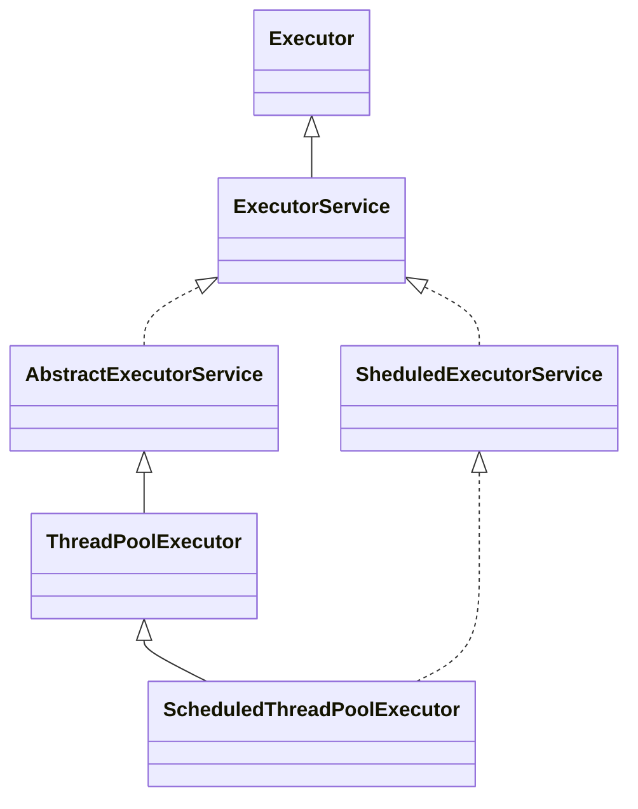
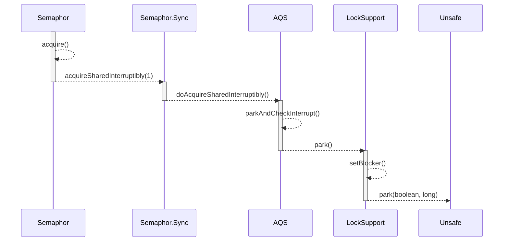

# java.md

# JVM

https://www.baeldung.com/jvm-parameters

https://www.geeksforgeeks.org/jvm-works-jvm-architecture/


# Stream API

- [package](https://docs.oracle.com/javase/8/docs/api/java/util/stream/package-summary.html)

- [stream api](https://docs.oracle.com/javase/8/docs/api/java/util/stream/Stream.html)

## Features 

### Paralleism


## Interface stream

https://docs.oracle.com/javase/8/docs/api/java/util/stream/Stream.html#map-java.util.function.Function-


# Exception 

## Checked Exception

1. 这些异常继承自java.lang.Exception类，但不继承自java.lang.RuntimeException类及其子类。
2. 编译器要求程序员必须显式地捕获（使用 try-catch 块）或者声明（在方法签名中通过 throws 关键字抛出）这些异常。如果不这样做，编译时就会报错。
3. 受检查异常通常用于表示那些预期可能在正常程序流中发生的、可以预见的问题，如文件未找到（FileNotFoundException）、网络连接失败等。

## Unchecked Exception 

1. 包括所有继承自java.lang.RuntimeException的异常以及java.lang.Error及其子类。
2. 编译器不会强制程序员对这类异常进行处理或声明。即使没有处理，代码也能顺利通过编译阶段。
3. 这类异常通常是由于编程错误导致的，例如空指针异常（NullPointerException）、数组越界异常（ArrayIndexOutOfBoundsException）等， 它们通常发生在运行时，并且应该在编码阶段尽量避免或修复。
4. 尽管不是必须处理，但良好的编程实践仍然建议程序员适当地处理非受检查异常，以确保程序健壮性。

# Multi-thread

https://github.com/zaiyunduan123/springboot-seckill?tab=readme-ov-file

https://www.baeldung.com/java-concurrency

## Thread

### state

<details>
<summary>img</summary>


</details>

```

                        NEW
                         ↓                     
                    +-----------+
                    | RUNNABLE           |
                    | ------------------ |
                    | WAITING <--------> | RUNNING | <--------> TIMED-WAITING |
                    | ↑↓                 |
                    | BLOCKED <--------> | READY   |
                    +-----------+
                         ↓
                     TERMINATED

```

### methods

- `thread.yield()`
- `thread.join()`


## Executors.java

<span style='font-size: 15px;'>**What is it?**</span>  
An object that executes submitted Runnable tasks. This interface provides a way of decoupling task submission from the mechanics of how each task will be run, including details of thread use, scheduling, etc. An Executor is normally used instead of explicitly creating threads. 

<span style='font-size: 15px;'>**Queuing**</span>  
An Executor is normally used instead of explicitly creating threads. For example, rather than invoking `new Thread(new(RunnableTask())).start()` for each of a set of tasks, you might use:

```
Executor executor = anExecutor;
executor.execute(new RunnableTask1());
executor.execute(new RunnableTask2());
...
```


Factory and utility methods for Executor, ExecutorService, ScheduledExecutorService, ThreadFactory,  
and Callable classes defined in this package.

## ThreadPoolExecutor.java

<span style='font-size: 15px;'>**What is it?**</span>  
An ExecutorService that executes each submitted task using one of possibly several pooled threads,  
normally configured using Executors factory methods.  

Thread pools address two different problems:  
they usually provide improved performance when executing large numbers of asynchronous tasks, <u>due to reduced per-task invocation overhead</u>,  
they provide a means of bounding and managing the resources, including <u>threads, consumed when executing a collection of tasks</u>.


### Core and maximum pool sizes

A ThreadPoolExecutor will automatically adjust the pool size (see getPoolSize) according to the  
bounds set by `corePoolSize (see getCorePoolSize)` and `maximumPoolSize (see getMaximumPoolSize)`.


<span style='font-size: 15px;'>**Threads used fewer than `corePoolSize`**</span>  
corePoolSize threads are running, a new thread is created to handle the request,  
even if other worker threads are idle. 

<span style='font-size: 15px;'>**Threads used more than `corePoolSize` and less than `maximumPoolSize`**</span>  

If there are **more than** `corePoolSize` but **less than** `maximumPoolSize` threads running, a new thread will be created **only if** the queue is full.

### Creating new threads

New threads are created using a ThreadFactory. If not otherwise specified, a Executors.  
defaultThreadFactory is used,

### Keep-alive times

If the pool currently has more than corePoolSize threads, excess threads will be terminated  
if they have been idle for more than the keepAliveTime (see getKeepAliveTime(TimeUnit)).


By default, the keep-alive policy applies only when there are more than corePoolSize threads.  
But method allowCoreThreadTimeOut(boolean) can be used to apply this time-out policy to core  
threads as well, so long as the keepAliveTime value is non-zero.

### Queuing

<span style='font-size: 15px;'>**What is it?**</span>  
Any `BlockingQueue` may be used to transfer and hold submitted tasks.  
The use of this queue interacts with pool sizing:  

- If **fewer than** `corePoolSize` threads are running, the Executor always prefers adding a new thread rather than queuing.
- If **corePoolSize or more threads** are running, the Executor always prefers queuing a request rather than adding a new thread.
- If a request **cannot be queued**, a new thread is created unless this **would exceed** maximumPoolSize, in which case,  
  the task **will be rejected**.

 
<span style='font-size: 15px;'>**Three general strategies for queuing**</span>  

1. Direct handoffs

A good default choice for a work queue is a `SynchronousQueue` that hands off tasks to threads without otherwise holding them.  
Here, an attempt to queue a task will fail if no threads are immediately available to run it, so a new thread will be constructed. 

Direct handoffs generally require unbounded `maximumPoolSizes` to avoid rejection of new submitted tasks.

2. Unbounded queues  

Using an unbounded queue (for example a `LinkedBlockingQueue` without a predefined capacity) will cause new tasks to wait in the queue when all `corePoolSize` threads are busy.  
Thus, no more than `corePoolSize` threads will ever be created. (And the value of the `maximumPoolSize` therefore doesn't have any effect.)

3. Bounded queues

A bounded queue (for example, an ArrayBlockingQueue) helps prevent resource exhaustion when used with finite maximumPoolSizes, but can be more difficult to tune and control.  


### ScheduledThreadPoolExecutor



## AQS

Provides a framework for implementing blocking locks and related synchronizers (semaphores, events, etc)  
that rely on **first-in-first-out** (FIFO) wait queues.  
This class is designed to be a useful basis for most kinds of synchronizers that rely on a single atomic  
**int value** to represent state.


This class supports either or both a default **exclusive mode and a shared mode**.  
When acquired in **exclusive mode**, attempted acquires by other threads cannot succeed.
**Shared mode** acquires by multiple threads may (but need not) succeed.


### Blocks a thread(node)




AbstractQueuedSynchronizer.java#parkAndCheckInterrupt()

## Differences Runnable and Callable

1. 返回值：

- Runnable: 实现了Runnable接口的类必须提供一个run()方法，该方法没有返回值（其签名是void run()）。
- Callable: 实现了Callable接口的类必须提供一个call()方法，这个方法可以有返回值，并且其返回类型由泛型参数指定。这意味着Callable的任务可以产生一个结果。

2. 异常处理：

- Runnable: run()方法不能抛出受检查的异常，如果需要抛出异常，通常会包装成运行时异常再抛出。
- Callable: call()方法可以抛出任何类型的异常，包括受检查异常。

3. 异步获取结果：

- Runnable: 由于没有返回值，无法直接从任务中获取计算的结果。
- Callable: 可以通过Future对象来获取call()方法执行完毕后的结果，Future对象可以通过ExecutorService.submit(Callable)方法提交任务后获得，调用Future.get()方法将阻塞直到结果准备好或抛出异常。


## Deadlock

https://www.geeksforgeeks.org/deadlock-in-java-multithreading/?ref=lbp

## CyclicBarrier

https://www.baeldung.com/java-cyclic-barrier

A CyclicBarrier is a synchronizer that allows a set of threads to wait for each other to reach a common execution point, also called a barrier.

## CountDownLatch

https://www.baeldung.com/java-countdown-latch

Simply put, a CountDownLatch has a counter field, which you can decrement as we require. We can then use it to block a calling thread until it’s been counted down to zero.

### 3. Waiting for a Pool of Threads to Complete

### 4. A Pool of Threads Waiting to Begin
