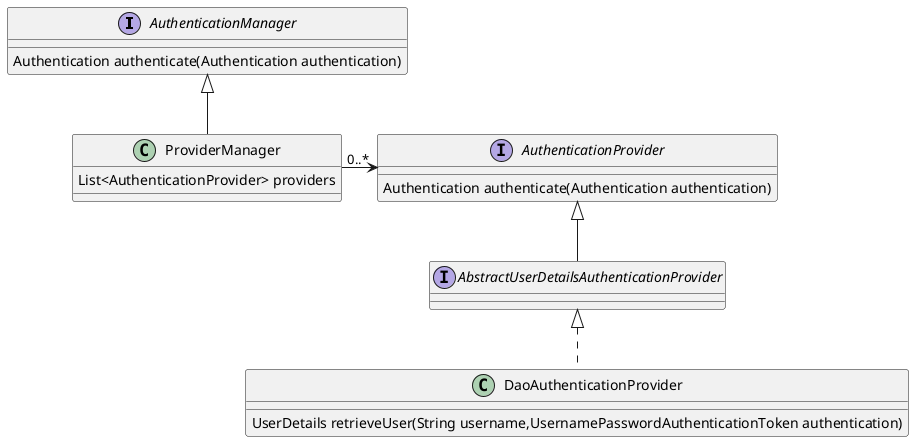
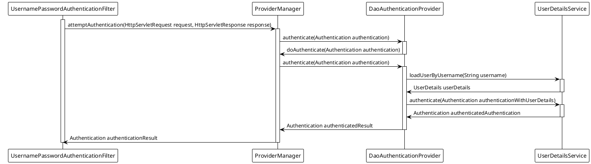

- [Password Storage](#password-storage)
- [-Servlet Applications](#-servlet-applications)
- [Architecture](#architecture)
  - [A Review of Filters](#a-review-of-filters)
  - [DelegatingFilterProxy](#delegatingfilterproxy)
  - [FilterChainProxy](#filterchainproxy)
  - [SecurityFilterChain](#securityfilterchain)
  - [Security Filters](#security-filters)
  - [Adding a Custom Filter to the Filter Chain](#adding-a-custom-filter-to-the-filter-chain)
  - [Handling Security Exceptions](#handling-security-exceptions)
- [--Authentication](#--authentication)
- [Servlet Authentication Architecture](#servlet-authentication-architecture)
  - [SecurityContextHolder](#securitycontextholder)
  - [Authentication](#authentication)
  - [`PENDING`GrantedAuthority](#pendinggrantedauthority)
  - [AuthenticationManager](#authenticationmanager)
  - [ProviderManager](#providermanager)
- [Method Security](#method-security)

---

[tutorial](https://www.iocoder.cn/Spring-Boot/Spring-Security/)  
[tutorial catalog](https://www.iocoder.cn/categories/Spring-Security/)

---

[samples](https://github.com/spring-projects/spring-security-samples/tree/5.8.x)  
[doc](https://docs.spring.io/spring-security/reference/5.8/index.html)  
[sevlet filter](https://www.geeksforgeeks.org/java-servlet-filter/)  
[sevlet filter2](https://www.geeksforgeeks.org/java-servlet-filter-with-example/)


# Password Storage

https://docs.spring.io/spring-security/reference/5.8/features/authentication/password-storage.html

# -Servlet Applications

# Architecture

## A Review of Filters

The picture below shows the typical layering of the handlers for a single HTTP request.

<details>
<summary>diagram</summary>


</details>

In a Spring MVC application the `Servlet` is an instance of [DispatcherServlet](https://docs.spring.io/spring-framework/docs/5.3.34/reference/html/web.html#mvc-servlet).


The power of the Filter comes from the FilterChain that is passed into it.

```java
public void doFilter(ServletRequest request, ServletResponse response, FilterChain chain) {
	// do something before the rest of the application
    chain.doFilter(request, response); // invoke the rest of the application
    // do something after the rest of the application
}
```


## DelegatingFilterProxy

<span style='font-size: 16px;font-weight: 500'>What is it?</span>  
Spring provides a `Filter` implementation named [DelegatingFilterProxy](https://docs.spring.io/spring-framework/docs/5.3.34/javadoc-api/org/springframework/web/filter/DelegatingFilterProxy.html) that allows bridging between the Servlet container’s lifecycle and Spring’s ApplicationContext.

<span style='font-size: 16px;font-weight: 500'>function</span>  
The Servlet container allows registering `Filter`s using its own standards, but it is not aware of Spring defined Beans. `DelegatingFilterProxy` can be registered via standard Servlet container mechanisms, but <mark>delegate</mark> all the work to a Spring Bean that implements Filter.

<details>
<summary>diagram</summary>


</details>


`DelegatingFilterProxy` looks up Bean Filter0 from the ApplicationContext and then invokes Bean Filter0. The pseudo code of `DelegatingFilterProxy` can be seen below.

```java
public void doFilter(ServletRequest request, ServletResponse response, FilterChain chain) {
	// Lazily get Filter that was registered as a Spring Bean
	// For the example in DelegatingFilterProxy delegate is an instance of Bean Filter0
	Filter delegate = getFilterBean(someBeanName);
	// delegate work to the Spring Bean
	delegate.doFilter(request, response);
}
```


## FilterChainProxy

<span style='font-size: 16px;font-weight: 500'>What is it?</span>  
that allows delegating to many Filter instances through `SecurityFilterChain`. Since `FilterChainProxy` is a Bean, it is typically wrapped in a `DelegatingFilterProxy`.

<details>
<summary>diagram</summary>


</details>

## SecurityFilterChain

<span style='font-size: 16px;font-weight: 500'>Definition</span>  
`SecurityFilterChain` is used by `FilterChainProxy` to determine which Spring Security `Filter`s should be invoked for this request.

<details>
<summary>Diagram</summary>


</details>

---

`FilterChainProxy` can be used to determine which `SecurityFilterChain` should be used.  
This allows providing a totally separate configuration for different slices of your application.


<details>
<summary>Diagram</summary>


</details>


## Security Filters

<span style='font-size: 16px;font-weight: 500'>Configuring filters</span>  
```java
@Configuration
@EnableWebSecurity
public class SecurityConfig {

    @Bean
    public SecurityFilterChain filterChain(HttpSecurity http) throws Exception {
        http
            .csrf(Customizer.withDefaults())
            .authorizeHttpRequests(authorize -> authorize
                .anyRequest().authenticated()
            )
            .httpBasic(Customizer.withDefaults())
            .formLogin(Customizer.withDefaults());
        return http.build();
    }

}
```


## Adding a Custom Filter to the Filter Chain

since we need to know the current user, we need to add it after the authentication filters.

```java
public class TenantFilter implements Filter {

    @Override
    public void doFilter(ServletRequest servletRequest, ServletResponse servletResponse, FilterChain filterChain) throws IOException, ServletException {
        HttpServletRequest request = (HttpServletRequest) servletRequest;
        HttpServletResponse response = (HttpServletResponse) servletResponse;

        String tenantId = request.getHeader("X-Tenant-Id"); (1)
        boolean hasAccess = isUserAllowed(tenantId); (2)
        if (hasAccess) {
            filterChain.doFilter(request, response); (3)
            return;
        }
        throw new AccessDeniedException("Access denied"); (4)
    }

}
```


Now, we need to add the filter to the security filter chain.

```java
@Bean
SecurityFilterChain filterChain(HttpSecurity http) throws Exception {
    http
        // ...
        .addFilterBefore(new TenantFilter(), AuthorizationFilter.class);
    return http.build();
}
```

## Handling Security Exceptions


# --Authentication

# Servlet Authentication Architecture

<span style='font-size: 16px;font-weight: 500'>Components</span>  
- *SecurityContextHolder* - The SecurityContextHolder is where Spring Security stores the details of who is authenticated.

- *SecurityContext* - is obtained from the SecurityContextHolder and contains the Authentication of the currently authenticated user.

- *Authentication* - Can be the input to AuthenticationManager to provide the credentials a user has provided to authenticate or the current user from the SecurityContext.

- GrantedAuthority - An authority that is granted to the principal on the Authentication (i.e. roles, scopes, etc.)

- *AuthenticationManager* - the API that defines how Spring Security’s Filters perform authentication.

- *ProviderManager* - the most common implementation of AuthenticationManager.

- *AuthenticationProvider* - used by ProviderManager to perform a specific type of authentication.

- Request Credentials with AuthenticationEntryPoint - used for requesting credentials from a client (i.e. redirecting to a log in page, sending a WWW-Authenticate response, etc.)

- AbstractAuthenticationProcessingFilter - a base Filter used for authentication. This also gives a good idea of the high level flow of authentication and how pieces work together.

## SecurityContextHolder

At the heart of Spring Security’s authentication model is the `SecurityContextHolder`. It contains the `SecurityContext`.

<details>
<summary>Diagram</summary>


</details>


The `SecurityContextHolder` is where Spring Security stores the details of who is authenticated.

## Authentication

The Authentication serves two main purposes within Spring Security:

- An input to **AuthenticationManager** to provide the credentials a user has provided to authenticate. When used in this scenario, `isAuthenticated()` returns false.

- Represents the currently authenticated user. The current Authentication can be obtained from the `SecurityContext`.

The Authentication contains:

- `principal` - identifies the user. When authenticating with a username/password this is often an instance of `UserDetails`.

- `credentials` - often a password. In many cases this will be cleared after the user is authenticated to ensure it is not leaked.

- `authorities` - the `GrantedAuthoritys` are high level permissions the user is granted. A few examples are roles or scopes.

## `PENDING`GrantedAuthority

`GrantedAuthority`s are high level permissions the user is granted. A few examples are roles or scopes.

## AuthenticationManager

AuthenticationManager is the API that defines how Spring Security’s Filters perform authentication.     

## ProviderManager

ProviderManager is the most commonly used implementation of AuthenticationManager. ProviderManager delegates to a List of AuthenticationProviders.







# Method Security
