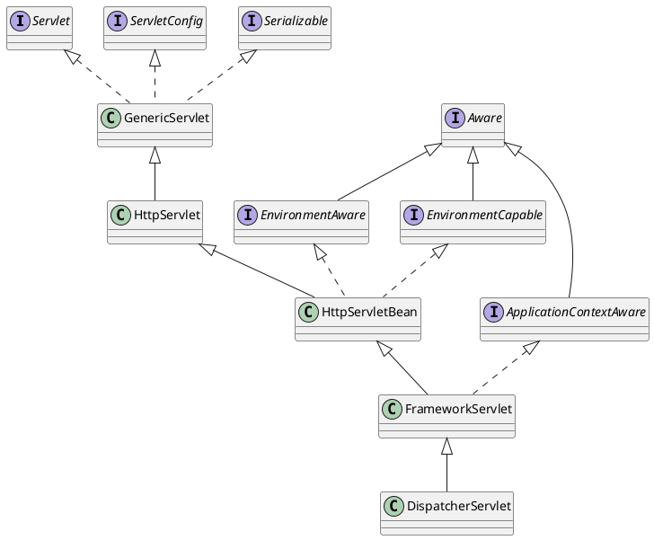
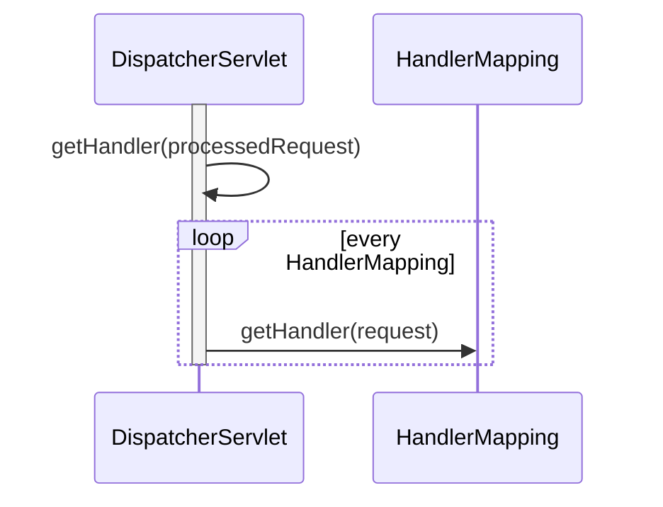
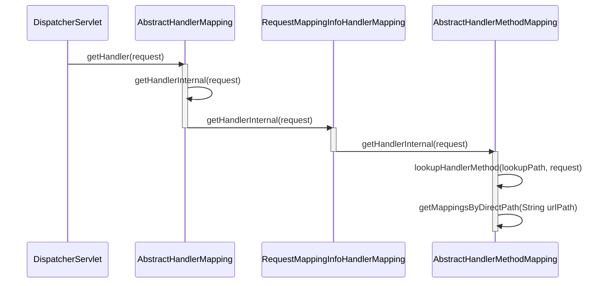
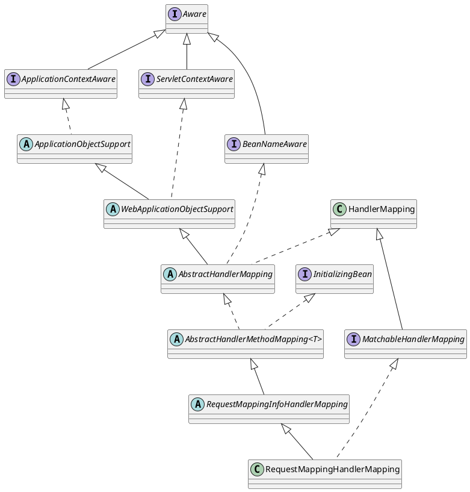

# [DispatcherServlet](https://docs.spring.io/spring-framework/docs/6.0.17/javadoc-api/org/springframework/web/servlet/DispatcherServlet.html)

##  Hierarchy

**FrameworkServlet**  
Base servlet for Spring's web framework. Provides integration with a Spring application context, in a JavaBean-based overall solution.

**HttpServlet**  
Simple extension of HttpServlet which treats its config parameters (init-param entries within the servlet tag in web.xml) as bean properties.

**Aware**  
A marker superinterface indicating that a bean is eligible to be notified by the Spring container of a particular framework object through a callback-style method.  
The actual method signature is determined by individual subinterfaces but should typically consist of just one void-returning method that accepts a single argument.

## doDispatch(,)

### RequestMappingHandlerMapping.getHandler(request)

## RequestMappingHandlerMapping

