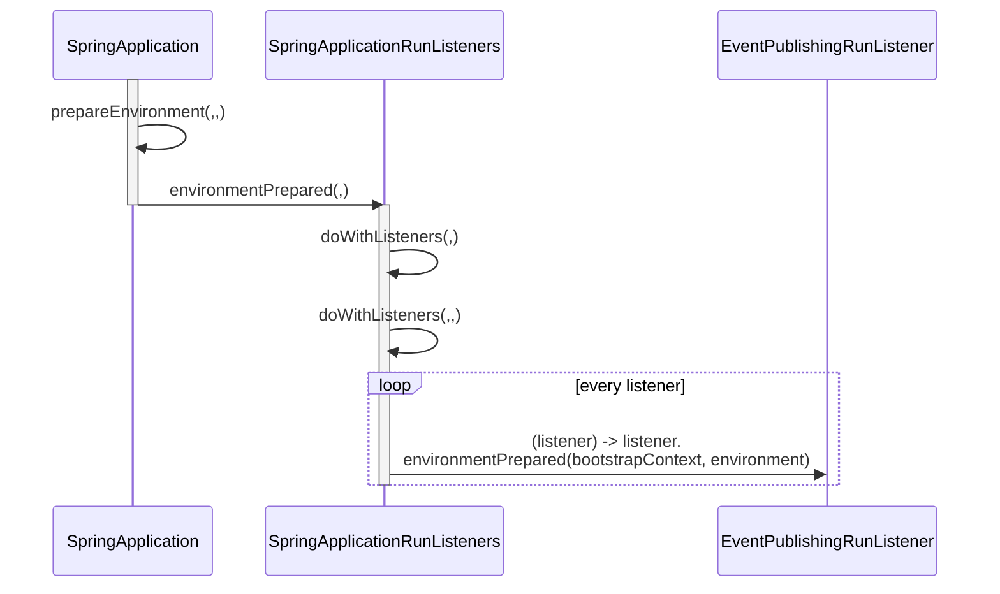
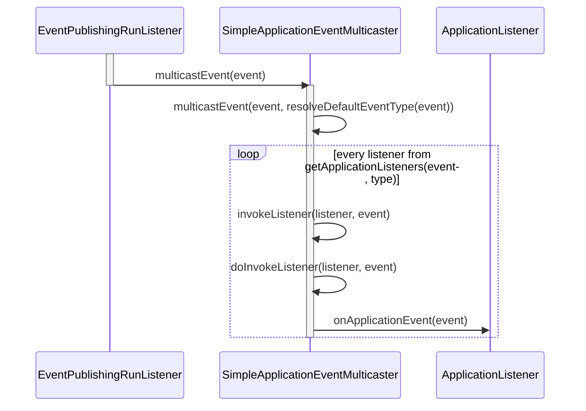
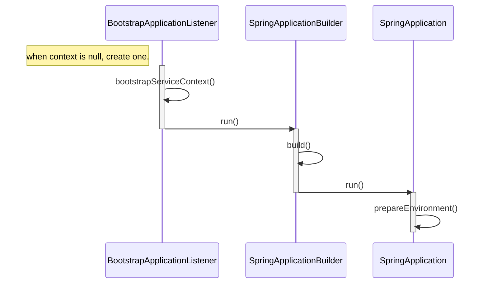
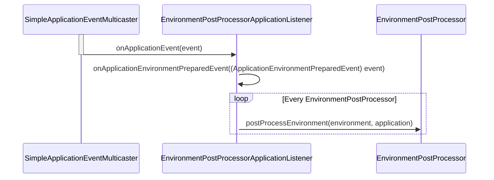
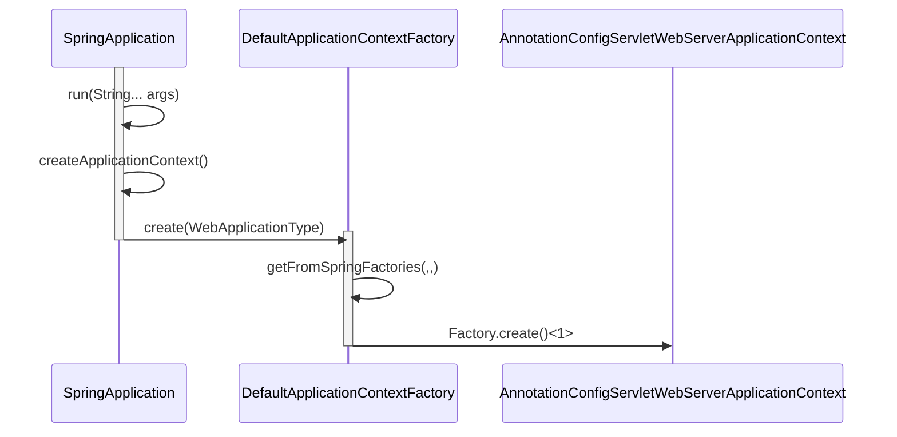
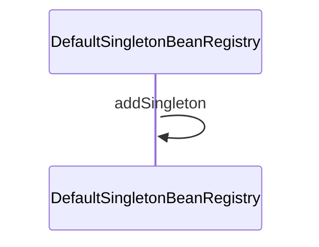
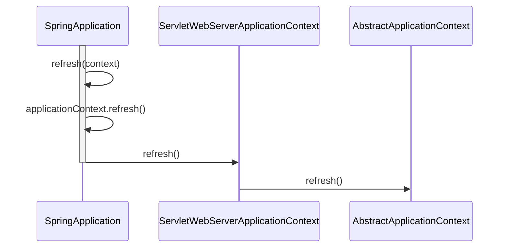
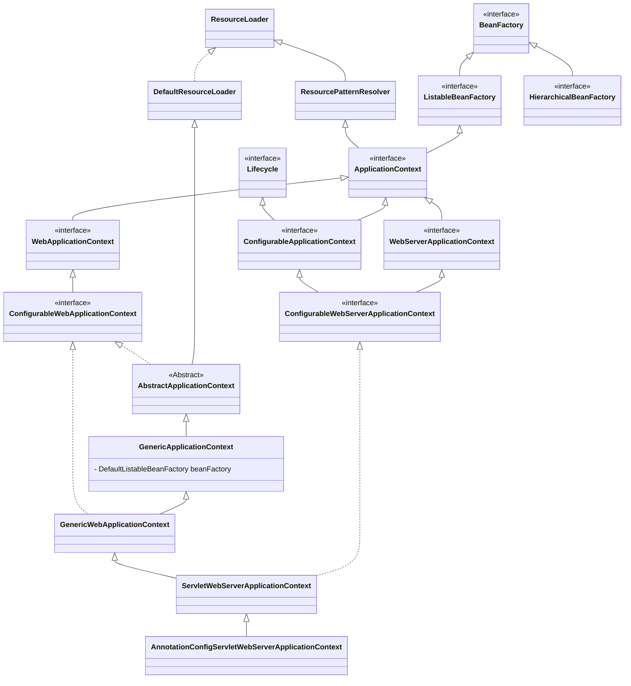
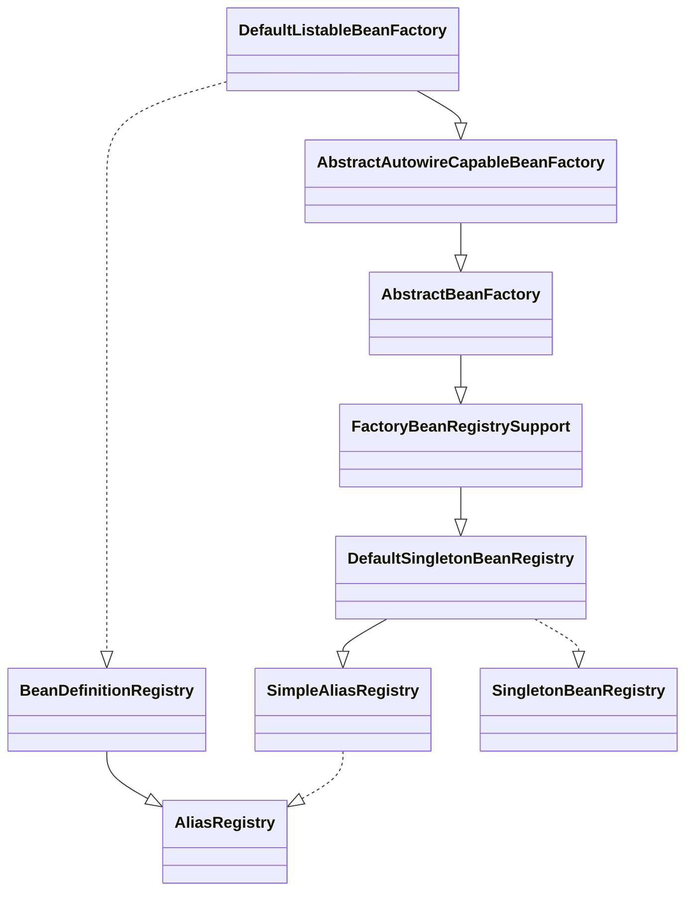
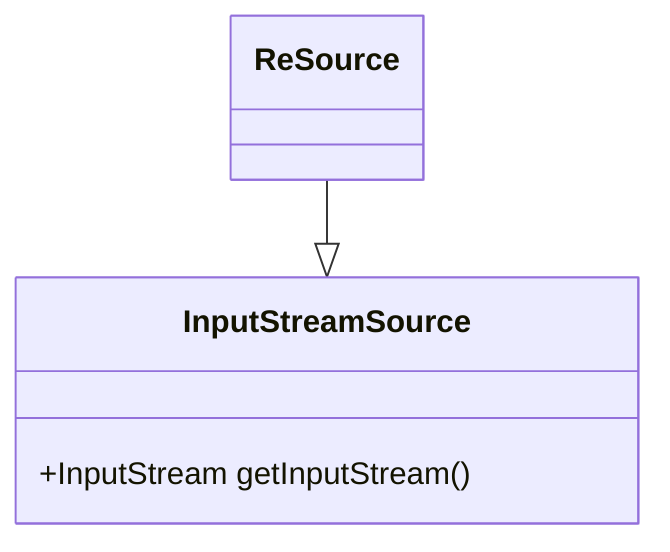

# SpringApplication.ConfigurableApplicationContext.run(String... args)

## prepareEnvironment(listeners, bootstrapContext, applicationArguments);






---

for other steps after `prepareEnvironment()`, see also upon diagram



## second call `SpringApplication.run()`


<span style='font-size: 15px;'>**Done already**</span>  
in `BootstrapApplicationListener.java` 
```java
// don't listen to events in a bootstrap context
if (environment.getPropertySources().contains(BOOTSTRAP_PROPERTY_SOURCE_NAME)) {
  return;
}
```

<span style='font-size: 15px;'>**EnvironmentPostProcessorApplicationListener**</span>  



<span style='font-size: 15px;'>**ConfigDataEnvironmentPostProcessor**</span>  


## createApplicationContext()



- <1>  
    ```java
    @Override
    public ConfigurableApplicationContext create(WebApplicationType webApplicationType) {
        return (webApplicationType != WebApplicationType.SERVLET) ? null
                : new AnnotationConfigServletWebServerApplicationContext();
    }
    ```

## prepareContext(bootstrapContext, context, environment, listeners, applicationArguments, printedBanner)

### beanFactory.registerSingleton("springApplicationArguments", applicationArguments);





## context.addBeanFactoryPostProcessor(new LazyInitializationBeanFactoryPostProcessor());

## refreshContext(context)



### AbstractApplicationContext#refresh

add configs

```java
public void refresh() throws BeansException, IllegalStateException {
		synchronized (this.startupShutdownMonitor) {
			StartupStep contextRefresh = this.applicationStartup.start("spring.context.refresh");

			// Prepare this context for refreshing.
			prepareRefresh();

			// Tell the subclass to refresh the internal bean factory.
			ConfigurableListableBeanFactory beanFactory = obtainFreshBeanFactory();

			// Prepare the bean factory for use in this context.
			prepareBeanFactory(beanFactory);

			try {
				// Allows post-processing of the bean factory in context subclasses.
				postProcessBeanFactory(beanFactory);

				StartupStep beanPostProcess = this.applicationStartup.start("spring.context.beans.post-process");
				// Invoke factory processors registered as beans in the context.
				invokeBeanFactoryPostProcessors(beanFactory);

				// Register bean processors that intercept bean creation.
				registerBeanPostProcessors(beanFactory);
				beanPostProcess.end();

				// Initialize message source for this context.
				initMessageSource();

				// Initialize event multicaster for this context.
				initApplicationEventMulticaster();

				// Initialize other special beans in specific context subclasses.
        // <1> ServletWebServerApplicationContext.onRefresh()
				onRefresh();

				// Check for listener beans and register them.
				registerListeners();

				// Instantiate all remaining (non-lazy-init) singletons.
				finishBeanFactoryInitialization(beanFactory);

				// Last step: publish corresponding event.
				finishRefresh();
			}

			catch (BeansException ex) {
				if (logger.isWarnEnabled()) {
					logger.warn("Exception encountered during context initialization - " +
							"cancelling refresh attempt: " + ex);
				}

				// Destroy already created singletons to avoid dangling resources.
				destroyBeans();

				// Reset 'active' flag.
				cancelRefresh(ex);

				// Propagate exception to caller.
				throw ex;
			}

			finally {
				// Reset common introspection caches in Spring's core, since we
				// might not ever need metadata for singleton beans anymore...
				resetCommonCaches();
				contextRefresh.end();
			}
		}
	}
```

ServletWebServerApplicationContext
```java
	@Override
	protected void onRefresh() {
		super.onRefresh();
		try {
			createWebServer();
		}
		catch (Throwable ex) {
			throw new ApplicationContextException("Unable to start web server", ex);
		}
	}


```


## AnnotationConfigServletWebServerApplicationContext




- [BeanFactory](https://docs.spring.io/spring-framework/docs/6.0.17/javadoc-api/org/springframework/beans/factory/BeanFactory.html)
  - The root interface for accessing a Spring bean container.
  
- [ApplicationContext](https://docs.spring.io/spring-framework/docs/6.0.17/javadoc-api/org/springframework/context/ApplicationContext.html)
  - Central interface to provide configuration for an application. This is read-only while the application is running, but may be reloaded if the implementation supports this.

- [ResourceLoader]()
  - Strategy interface for loading resources (e.g., class path or file system resources).

- [ResourcePatternResolver]()
  - Strategy interface for resolving a location pattern (for example, an Ant-style path pattern) into Resource objects.
  - [Ant style pattern](https://docs.spring.io/spring-framework/docs/6.0.17/javadoc-api/org/springframework/util/AntPathMatcher.html)
  

## DefaultListableBeanFactory



Thinking about some decorations of central word before of after them, can figure out the purposes from the author.  
like simple, default, support, abstract etc, a class has some semantic actions to the word related.  

For expanding features, interfaces combined others, abstract classes realized interfaces, and concrete classes bound with both of formers or other concrete classes.


## Resource loading




## classes REF

- [InputStreamSource]()
  - Simple interface for objects that are sources for an `InputStream`.

- [Resource]
  - Interface for a resource descriptor that abstracts from the actual type of underlying resource, such as a file or class path resource.

- [ProtocolResolver](https://docs.spring.io/spring-framework/docs/6.0.17/javadoc-api/org/springframework/core/io/ProtocolResolver.html)
  - A resolution strategy for protocol-specific resource handles.