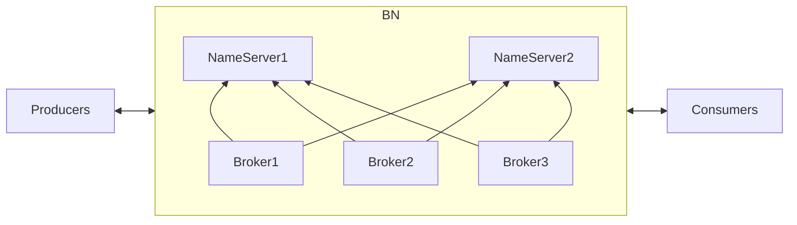

# mid-1-rocketmq.md

# infos
| component         | info                           |
| ---:              | :---                           |
| jdk               | 11.0.21                        |
| rocketmq          | rocketmq-all-5.0.0-bin-release |
| operating system  | Ubuntu server 22.04            |

# Connection diagram

# Launch

1. **configure jvm args** in *bin/runserver.sh* and *bin/runbroker.sh*
2. `export NAMESRV_ADDR=127.0.0.1:9876` to environment, e.g *~/.bashrc*
3. add `namesrvAddr=192.168.0.241:9876` network address for external usages,   
   and `brokerIP1=xxx` to *conf/broker.conf*
4. run name server `nohup sh bin/mqnamesrv &`
5. run broker `nohup sh bin/mqbroker -c conf/broker.conf &`
6. log `tail -f ~/logs/rocketmqlogs/namesrv.log`, `tail -f ~/logs/rocketmqlogs/broker.log`
7. send msgs `sh bin/tools.sh org.apache.rocketmq.example.quickstart.Producer`
8. listen msgs `sh bin/tools.sh org.apache.rocketmq.example.quickstart.Consumer`

# Message types

- [doc](https://rocketmq.apache.org/zh/docs/featureBehavior/01normalmessage)

## General message 

- 一般应用于微服务解耦、事件驱动、数据集成等场景，且对消息的处理时机、处理顺序没有特别要求。

## Timed message 

---

## Ordered message

- Different message groups, inconsistent, can be consumed orderly.

Diagram

-  

---

## Transactional message 

- 分布式系统调用的特点为一个核心业务逻辑的执行，同时需要调用多个下游业务进行处理。  
  因此，如何保证核心业务和多个下游业务的执行结果完全一致，是分布式事务需要解决的主要问题。
- 将上述基于XA事务的方案进行简化，将订单系统变更作为**本地事务**，**剩下的**系统变更作为普通消息  
  的下游来执行，事务分支简化成普通消息+订单表事务，充分利用消息异步化的能力缩短链路，提高并发度。 
  - 

    
Diagram

    
    
    
    

Transactional message

- 

### XA pattern

- [XA](https://dtm.pub/practice/xa.html)
  - 

    
XA pattern

    

    
    

