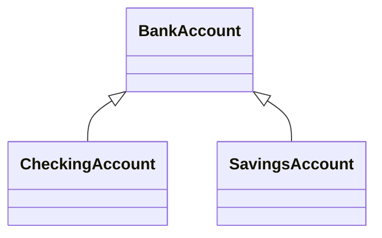
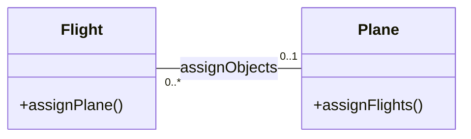
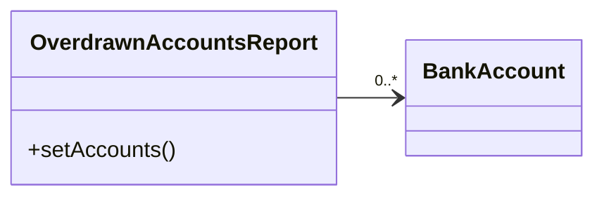
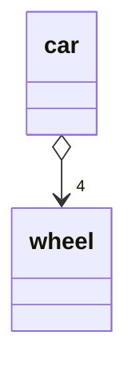
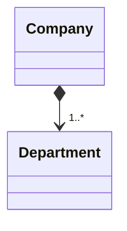
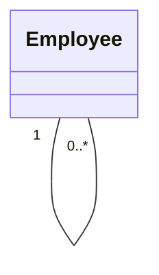

# modeling.md

# Class diagram
[tutorial](https://developer.ibm.com/articles/the-class-diagram/)

## Inheritance
A **solid line** is drawn from the child class (the class inheriting the behavior) with a closed,  
**unfilled arrowhead** (or triangle) pointing to the super class.



## Associations

Certain objects will be related to each other.

### Bi-association

This means that **both classes** are aware of each other and their relationship.




The Flight is associated with a specific Plane.  
A Plane knows about its association with the Flight class.


### Uni-directional association

Two classes are related, but **only one** class knows that the relationship exists.




The OverdrawnAccountsReport knows about the BankAccount class,  
but BankAccount does'n know former.

### Association class

To include another class because it includes **valuable information** about the relationship.

```
        solid line
     0..*
Flight--------------FrequentFlyer
            .     0..*
            .
            .
            .
            .
       MileageCredit
```

## Aggregation

Aggregation is **a special type of association** used to model a "whole to its parts" relationship.   

In *basic aggregation* relationships, the lifecycle of a part class **is independent** from the whole class's lifecycle.  
For example, we can think of Car as a whole entity and Car Wheel as part of the overall Car.

When the part class's lifecycle **is not independent** from that of the whole class — this is called *composition aggregation*.  
For example, the relationship of a company to its departments. Both Company and Departments are modeled as classes,  
and a department cannot exist before a company exists. Here the Department class's instance is dependent upon the  
existence of the Company class's instance.

### Basic aggregation
That one class is a part of another class. In an aggregation relationship, the child class instance **can outlive** its  
parent class. 



### Composition aggregation



A Company class instance will **always have** at least one Department class instance. Because the relationship is a  
composition relationship, when the Company instance is removed/destroyed, the Department instance is automatically  
removed/destroyed as well. Another important feature of composition aggregation is that the part class can only be  
related to one instance of the parent class (e.g. the Company class in our example).

### Reflexive associations
When a class is associated to itself, this does not mean that a class's instance is related to itself, but that an  
instance of the class is related to **another instance of the class**.



Means that an instance of Employee can be the manager of another Employee instance. However, because the relationship  
role of "manages" has a multiplicity of 0..*; an Employee might not have any other Employees to manage.


# Component diagram 

[Component diagram](https://developer.ibm.com/articles/the-component-diagram/)

The component diagram's main purpose is to show the structural relationships between the components of a system.  

## The basics


## Modeling a component's interfaces Provided/Required

A typical component diagram includes more information. A component element can have additional compartments  
stacked **below the name compartment**.

A component is **an autonomous unit** that provides one or more public interfaces. The interfaces provided represent  
the formal contract of services the component provides to its consumers/clients.

Figure shows the Order component having a second compartment that denotes what interfaces the Order component provides and requires. 


## Another approach to modeling a component's interfaces

To showing a component's provided/required interfaces using interface symbols.

The interface symbols with a complete circle at their end represent an interface that the component provides.  
Interface symbols with only a half circle at their end (a.k.a. sockets) represent an interface that the component requires.  


Even though Figure 4 looks much different from Figure 3, both figures provide the same information — i.e., the Order  
component provides two interfaces: OrderEntry and AccountPayable, and the Order component requires the Person interface.

## Modeling a component's relationships

When showing a component's relationship with other components, the lollipop and socket notation must also include a dependency  
arrow (as used in the class diagram).  
On a component diagram with lollipops and sockets, note that the dependency arrow comes out of the consuming (requiring) socket  
and its arrow head connects with the provider's lollipop,

A component diagram that shows how the Order System component depends on other components.  


## Showing a component's internal structure

To show a component's inner structure, you merely draw the component larger than normal and place the inner parts inside  
the name compartment of the encompassing component.


The Store component provides the interface of OrderEntry and requires the interface of Account. The Store component  
is made up of three components: Order, Customer, and Product components.

This square is called a port. In a simplistic sense, ports provide a way to model **how** a component's provided/required   
interfaces relate to its internal parts.

By using a port, our diagram is able to de-couple the internals of the Store component from external entities.  

The OrderEntry port delegates to the Order component's OrderEntry interface for processing. Also, the internal  
Customer component's required Account interface is delegated to the Store component's required Account interface port. 


# ER diagram

drawn by `MySQL workbench`

[tutorial](https://www.lucidchart.com/pages/er-diagrams)

[tutorial2](https://drawio-app.com/blog/entity-relationship-diagrams-with-draw-io/)

<details>
<summary>example</summary>


</details>

## The components and features of an ER diagram

ER Diagrams are composed of entities, relationships and attributes. They also depict cardinality,  
which defines relationships in terms of numbers.

### Entity

A definable thing—such as a person, object, concept or event—**that can have data stored about it**.  
Think of entities as nouns. Examples: a customer, student, car or product. Typically shown as a  
rectangle.

- Entity type  
  A group of **definable things**, such as students or athletes, whereas the entity would be the specific  
  student or athlete. Other examples: customers, cars or products.

- Entity set (records)  
  Same as an entity type, but defined at a particular point in time, such as students enrolled in a   
  class on the first day(registration table).  
  Other examples: Customers who purchased last month, cars currently registered in Florida. A related  
  term is instance, in which the specific person or car would be an instance of the entity set.

- Entity categories  
  Entities are categorized as strong, weak or associative.  
  A **strong entity** can be defined solely by **its own attributes**, while a **weak entity** cannot.  
  An **associative entity** associates entities (or elements) within an entity set. 

  - weak entity
    例如，在一个“订单详情”（Order Detail）实体集中，每个订单详情不能单独由其自身属性识别，需要依赖于订单号  
    （来自“订单”实体）和其他属性组合才能确保唯一性。因此，“订单详情”就是一个弱实体集。

- Entity keys  
  Refers to an attribute that uniquely defines an entity in an entity set. Entity keys can be super, candidate or primary.  
  Super key: A set of attributes (one or more) that together define an entity in an entity set.  
  Candidate key: A minimal super key, meaning **it has the least possible number of attributes to still be a super key.**  
  An entity set may have more than one candidate key.  
  Primary key: A candidate key chosen by the database designer to uniquely identify the entity set.  
  Foreign key: Identifies the relationship between entities.

### Relationship

How entities act upon each other or are associated with each other. Think of relationships as **verbs**.  

For example, the named student might register for a course. The two entities would be the student and the course,  
and the relationship depicted is the act of enrolling, connecting the two entities in that way. Relationships are  
typically shown as diamonds or labels directly on the connecting lines.

Recursive relationship: The same entity participates more than once in the relationship.

### Attribute

A property or characteristic of an entity. Often shown as an oval or circle.

- Descriptive attribute  
  A property or characteristic of a relationship (versus of an entity.)

- Attribute categories  
  Attributes are categorized as simple, composite, derived, as well as single-value or multi-value.  

  Simple: Means the attribute value is atomic and can’t be further divided, such as a phone number.  
  Composite: Sub-attributes spring from an attribute.  
  Derived: Attributed is calculated or otherwise derived from another attribute, such as age from a birthdate.  
  Multi-value: More than one attribute value is denoted, such as multiple phone numbers for a person.  
  Single-value: Just one attribute value. 

The types can be combined, such as: simple single-value attributes or composite multi-value attributes.  


### Cardinality

Defines the numerical attributes of the relationship between two entities or entity sets.

```

zero 
————————————o——

one
————————————|——

one and only one
————————————|—|—

many
             /
—————————————————
             \

```


#### One or zero


#### Only One


#### Many or zero


#### Many or one


