## x

### Branch

branch: develop  
last commit: Up\version/to/644  

### Configs
as 2021.1.1.23-windows

jdk 1.8-211


### Important components

#### smack-tcp

- org.jivesoftware.smack.tcp
  - XMPPTCPConnection.java
    - Creates a socket connection to an XMPP server.

#### build.gradler

from
```gradle
// Top-level build file where you can add configuration options common to all sub-projects/modules.
buildscript {
    repositories {
        jcenter()
        google()
        maven { url 'https://maven.fabric.io/public' }
    }
    dependencies {
        classpath 'com.android.tools.build:gradle:3.4.2'
        classpath "io.realm:realm-gradle-plugin:3.1.1"
        classpath 'com.neenbedankt.gradle.plugins:android-apt:1.8'
        classpath 'com.frogermcs.androiddevmetrics:androiddevmetrics-plugin:0.4'
        classpath 'io.fabric.tools:gradle:1.25.4'
        classpath 'com.google.gms:google-services:4.2.0'
    }
}

allprojects {
    repositories {
        jcenter()
        google()
        maven { url "https://jitpack.io" }
        maven { url 'https://oss.sonatype.org/content/repositories/snapshots' }
        maven { url 'http://igniterealtime.org/repo' }
        maven { url 'https://maven.fabric.io/public' }
    }
}

```


to
```gradle
// Top-level build file where you can add configuration options common to all sub-projects/modules.
buildscript {
    repositories {
        jcenter()
        google()
        maven { url 'https://maven.fabric.io/public' }
        maven { url 'https://repo1.maven.org/maven2'}
        maven {url 'https://maven.aliyun.com/repository/public'}
        maven {url 'https://maven.aliyun.com/repository/central'}
        maven {url "https://igniterealtime.org/repo/"}
    }
    dependencies {
        classpath 'com.android.tools.build:gradle:3.4.2'
        classpath "io.realm:realm-gradle-plugin:3.1.1"
        classpath 'com.neenbedankt.gradle.plugins:android-apt:1.8'
        classpath 'com.frogermcs.androiddevmetrics:androiddevmetrics-plugin:0.4'
        classpath 'io.fabric.tools:gradle:1.25.4'
        classpath 'com.google.gms:google-services:4.2.0'
    }
}

allprojects {
    repositories {
        jcenter()
        google()
        maven { url "https://jitpack.io" }
        maven { url 'https://oss.sonatype.org/content/repositories/snapshots' }
        maven { url 'http://igniterealtime.org/repo' }
        maven { url 'https://maven.fabric.io/public' }
        maven { url 'https://repo1.maven.org/maven2'}
        maven {url 'https://maven.aliyun.com/repository/public'}
        maven {url 'https://maven.aliyun.com/repository/central'}
        maven {url "https://igniterealtime.org/repo/"}
    }
}

```

#### build.gradlea

from
```gradle
ext {
   smackVerstion = 'xxxxxx'
}
```

to
```gradle
ext {
   smackVerstion = '4.2.1-SNAPSHOT'
}

ext {
   smackVerstion = '4.2.1-beta1'
}
```

---

from
```gradle
implementation "com.github.str4tocaster.smack:smack-android-extensions:$smackVerstion"
implementation "com.github.str4tocaster.smack:smack-experimental:$smackVerstion"
implementation "com.github.str4tocaster.smack:smack-tcp:$smackVerstion"
implementation "com.github.str4tocaster.smack:smack-resolver-dnsjava:$smackVerstion"
```

to
```gradle
implementation "org.igniterealtime.smack:smack-android-extensions:$smackVersion"
implementation "org.igniterealtime.smack:smack-experimental:$smackVersion"
implementation "org.igniterealtime.smack:smack-tcp:$smackVersion"
implementation "org.igniterealtime.smack:smack-resolver-dnsjava:$smackVersion"
```


#### TLSMode

from
```java
SecurityMode.legacy;
```

to
```java
SecurityMode.required;
```

#### XMPPTCPConnection

```java
ConnectionConfiguration.SecurityMode.legacy 
```

to
```java
SecurityMode.required
```

#### BookmarksManager

```java
bookmarkManager.cleanCache();
```
to
```java
//bookmarkManager.cleanCache();
```


### Add account

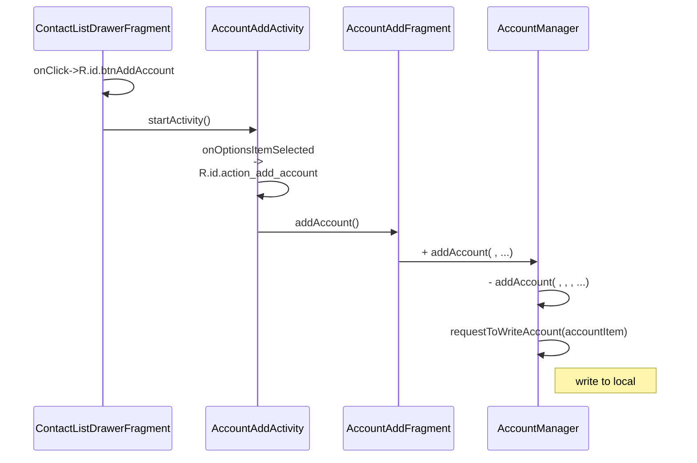
```mermaid
sequenceDiagram
    ContactListDrawerFragment->>ContactListDrawerFragment: onClick->R.id.btnAddAccount
    ContactListDrawerFragment->>AccountAddActivity: startActivity()
    AccountAddActivity->>AccountAddActivity: onOptionsItemSelected<br>-><br>R.id.action_add_account
    AccountAddActivity->>AccountAddFragment: addAccount()
    AccountAddFragment->>AccountManager: + addAccount( , ...)
    AccountManager->>AccountManager: - addAccount( , , , ...)    
    AccountManager->>AccountManager: requestToWriteAccount(accountItem)
    Note right of AccountManager: write to local
```

### Query account

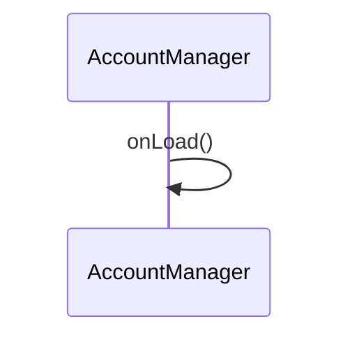
```mermaid
sequenceDiagram
    AccountManager->>AccountManager: onLoad()
```

### Connect to server 

create connection

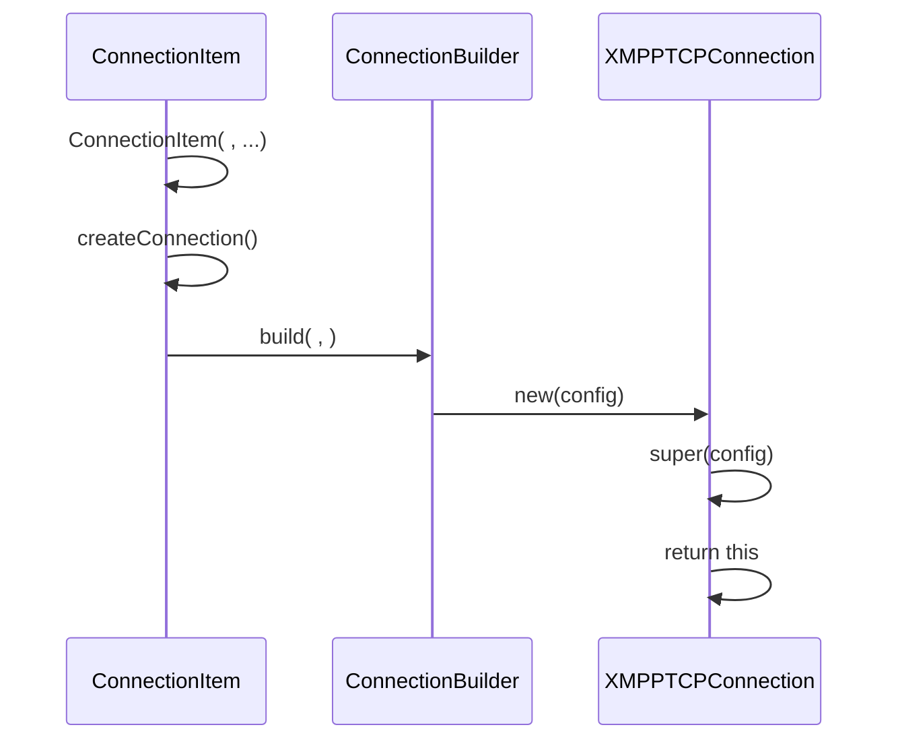
```mermaid
sequenceDiagram
    ConnectionItem->>ConnectionItem: ConnectionItem( , ...)
    ConnectionItem->>ConnectionItem: createConnection()
    ConnectionItem->>ConnectionBuilder: build( , )
    ConnectionBuilder->>XMPPTCPConnection: new(config)
    XMPPTCPConnection->>XMPPTCPConnection: super(config)
    XMPPTCPConnection->>XMPPTCPConnection: return this
```

---

connect to server
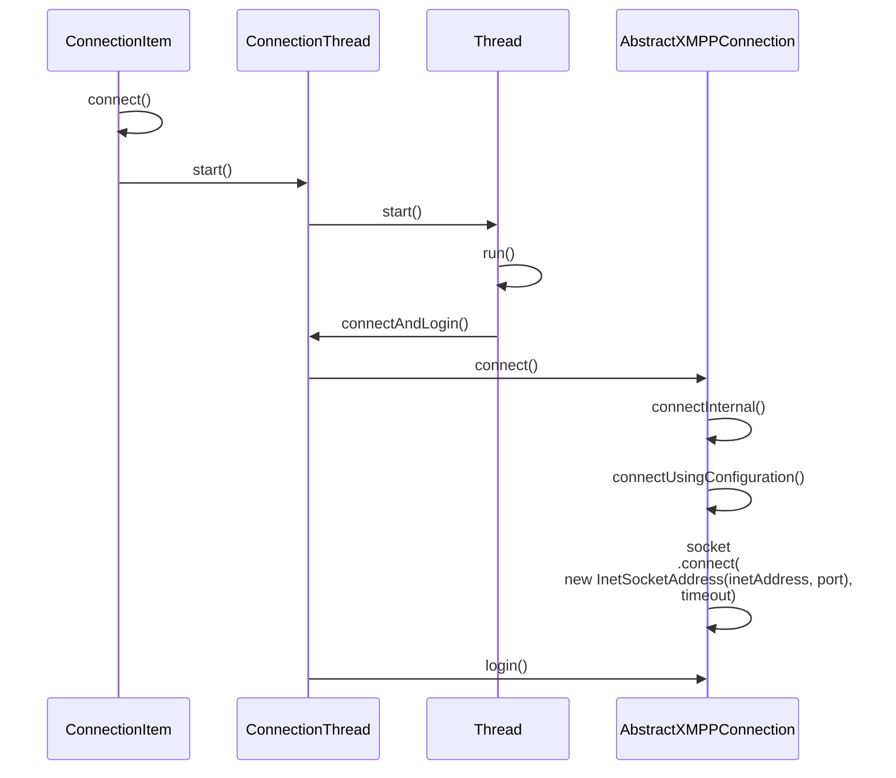
```mermaid
sequenceDiagram
    ConnectionItem->>ConnectionItem: connect()
    ConnectionItem->>ConnectionThread: start()
    ConnectionThread->>Thread: start()
    Thread->>Thread: run()
    Thread->>ConnectionThread: connectAndLogin()
    ConnectionThread->>AbstractXMPPConnection: connect()
    AbstractXMPPConnection->>AbstractXMPPConnection: connectInternal()
    AbstractXMPPConnection->>AbstractXMPPConnection: connectUsingConfiguration()
    AbstractXMPPConnection->>AbstractXMPPConnection: socket<br>.connect(<br>new InetSocketAddress(inetAddress, port), <br>timeout)
    ConnectionThread->>AbstractXMPPConnection: login()
```

---

login

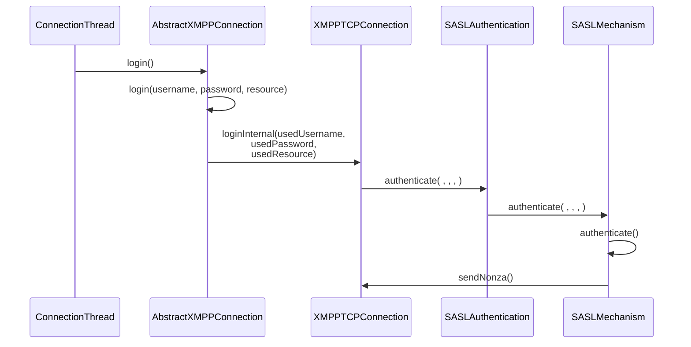
```mermaid
sequenceDiagram
    ConnectionThread->>AbstractXMPPConnection: login()
    AbstractXMPPConnection->>AbstractXMPPConnection: login(username, password, resource)
    AbstractXMPPConnection->>XMPPTCPConnection: loginInternal(usedUsername, <br>usedPassword, <br>usedResource)
    XMPPTCPConnection->>SASLAuthentication: authenticate( , , , )
    SASLAuthentication->>SASLMechanism: authenticate( , , , )
    SASLMechanism->>SASLMechanism: authenticate()
    SASLMechanism->>XMPPTCPConnection: sendNonza()
```


## netty

`import java.nio.channels.Selector;`

`import io.netty.channel.Channel;`


## opfe

branch: 4.9.0

### TODOS

#### voice message

by file upload

### Environment

mvn 3.6.3  
jdk 17.09  

### Server Bootstrap with Netty & Messages handling

https://mermaid.live/edit

https://github.com/igniterealtime/Openfire/blob/main/documentation/diagrams/netty-message-handling.md

https://github.com/igniterealtime/Openfire/blob/main/documentation/diagrams/netty-server-bootstrap.md

### Important components

- org.jivesoftware.openfire
  - XMPPServer.java
    - The main XMPP server that will load, initialize and start all the server's modules. 
  - net    
    - StanzaHandler.java  
        A StanzaHandler is the main responsible for handling incoming stanzas.
  - nio
    - NettyConnection.java  
        Represents a connection on the server
    - NettyConnectionHandler.java  
        A NettyConnectionHandler is responsible for creating new sessions, destroying sessions   
        and delivering received XML stanzas to the proper StanzaHandler.
  - spi
    - NettyConnectionAcceptor.java  
        Responsible for accepting new (socket) connections, using Java NIO implementation provided by the Netty framework.
    - NettyServerInitializer.java  
        Creates a newly configured ChannelPipeline for a new channel.
 

### Packets receiving

`org.jivesoftware.openfire.nio.NettyConnectionHandler#129#channelRead0(ChannelHandlerContext ctx, String message)`

### User authentication

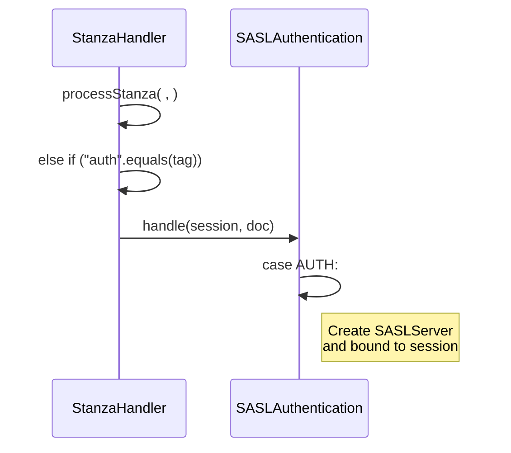
```mermaid
sequenceDiagram
    StanzaHandler->>StanzaHandler: processStanza( , )
    StanzaHandler->>StanzaHandler: else if ("auth".equals(tag))
    StanzaHandler->>SASLAuthentication: handle(session, doc)
    SASLAuthentication->>SASLAuthentication: case AUTH:
    Note right of SASLAuthentication: Create SASLServer<br> and bound to session
```

### Connection establishment

Client connection

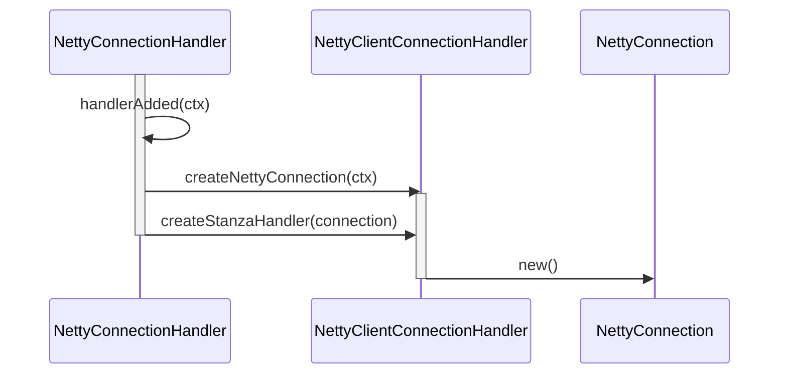
```mermaid
sequenceDiagram
    activate NettyConnectionHandler
    NettyConnectionHandler->>NettyConnectionHandler: handlerAdded(ctx)
    NettyConnectionHandler->>NettyClientConnectionHandler: createNettyConnection(ctx)

    activate NettyClientConnectionHandler
    NettyConnectionHandler->>NettyClientConnectionHandler: createStanzaHandler(connection)
    deactivate NettyConnectionHandler

    NettyClientConnectionHandler->>NettyConnection: new()
    deactivate NettyClientConnectionHandler
```


### Create client session

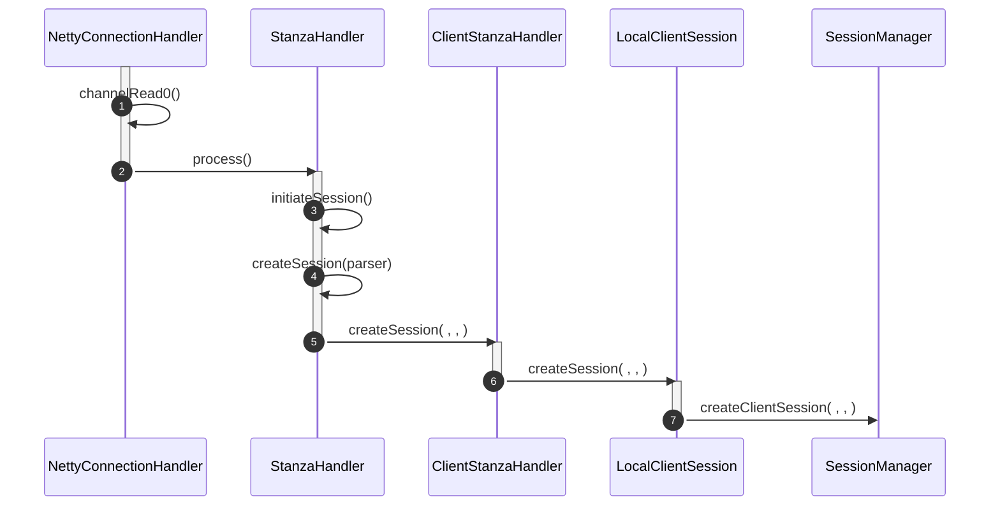
```mermaid
sequenceDiagram
    autonumber
    activate NettyConnectionHandler
    NettyConnectionHandler->>NettyConnectionHandler: channelRead0()
    NettyConnectionHandler->>StanzaHandler: process()
    deactivate NettyConnectionHandler

    activate StanzaHandler
    StanzaHandler->>StanzaHandler: initiateSession()
    StanzaHandler->>StanzaHandler: createSession(parser)
    StanzaHandler->>ClientStanzaHandler: createSession( , , )
    deactivate StanzaHandler

    activate ClientStanzaHandler
    ClientStanzaHandler->>LocalClientSession: createSession( , , )
    deactivate ClientStanzaHandler

    activate LocalClientSession
    LocalClientSession->>SessionManager: createClientSession( , , )
    deactivate LocalClientSession
```


### Openfire Message Handling with Netty

The following diagram shows how network messages (e.g. TLS, XMPP stanzas) are processed by the Netty-based networking layer in Openfire.

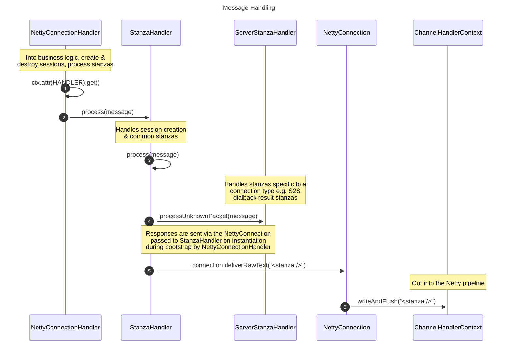
```mermaid

sequenceDiagram title Message Handling
    autonumber
    
    Note over NettyConnectionHandler: Into business logic, create & <br/> destroy sessions, process stanzas
    NettyConnectionHandler->>+NettyConnectionHandler: ctx.attr(HANDLER).get()
    NettyConnectionHandler->>+StanzaHandler: process(message)
    Note over StanzaHandler: Handles session creation <br /> & common stanzas
    StanzaHandler->>+StanzaHandler: process(message)
    Note over ServerStanzaHandler: Handles stanzas specific to a <br /> connection type e.g. S2S <br />dialback result stanzas
    StanzaHandler->>+ServerStanzaHandler: processUnknownPacket(message)
    Note over ServerStanzaHandler, StanzaHandler: Responses are sent via the NettyConnection <br /> passed to StanzaHandler on instantiation <br />during bootstrap by NettyConnectionHandler
    StanzaHandler->>+NettyConnection: connection.deliverRawText("<stanza />")
    Note over ChannelHandlerContext: Out into the Netty pipeline
    NettyConnection->>+ChannelHandlerContext: writeAndFlush("<stanza />")

```

### Add contacts

```xml
<iq id='cAvaB-331' type='set'><query xmlns='jabber:iq:roster'><item jid='116@d113' name='' subscription='none'></item></query></iq>
```


## spk

branch: master

last commit: SPARK-2122: Add DOAP file for project

### Environment

- maven 3.6.3
- jdk 11
 

### Login

`core/src/main/java/org/jivesoftware/gui/LoginUIPanel.java#1254`

```java
connection = new XMPPTCPConnection(retrieveConnectionConfiguration());
connection.connect();

connection.login(getLoginUsername(), getLoginPassword(), resourcepart);
```

#### session

#### option dialog, Self Signed certificate

`core/src/main/java/org/jivesoftware/gui/LoginUIPanel.java#1329-1353`

`ACCEPT_SELF_SIGNED = true`

#### option dialog, Certificate not in the TrustStore

add to

#### Add certificate to local storage

get lastFailedChain

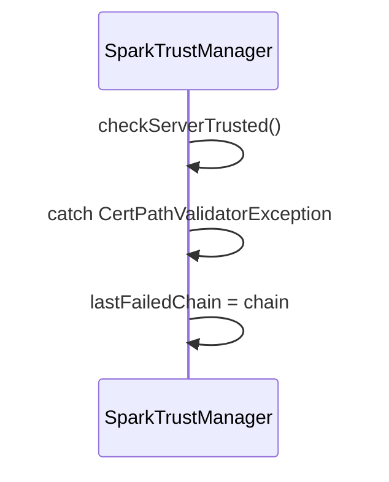
```mermaid
sequenceDiagram
    SparkTrustManager->>SparkTrustManager: checkServerTrusted()
    SparkTrustManager->>SparkTrustManager: catch CertPathValidatorException
    SparkTrustManager->>SparkTrustManager: lastFailedChain = chain
```


login first
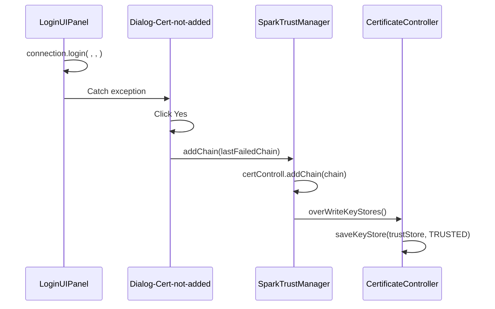
```mermaid
sequenceDiagram
    LoginUIPanel->>LoginUIPanel: connection.login( , , )
    LoginUIPanel->>Dialog-Cert-not-added: Catch exception
    Dialog-Cert-not-added->>Dialog-Cert-not-added: Click Yes
    Dialog-Cert-not-added->>SparkTrustManager: addChain(lastFailedChain)
    SparkTrustManager->>SparkTrustManager: certControll.addChain(chain)
    SparkTrustManager->>CertificateController: overWriteKeyStores()
    CertificateController->>CertificateController: saveKeyStore(trustStore, TRUSTED)
```


login after
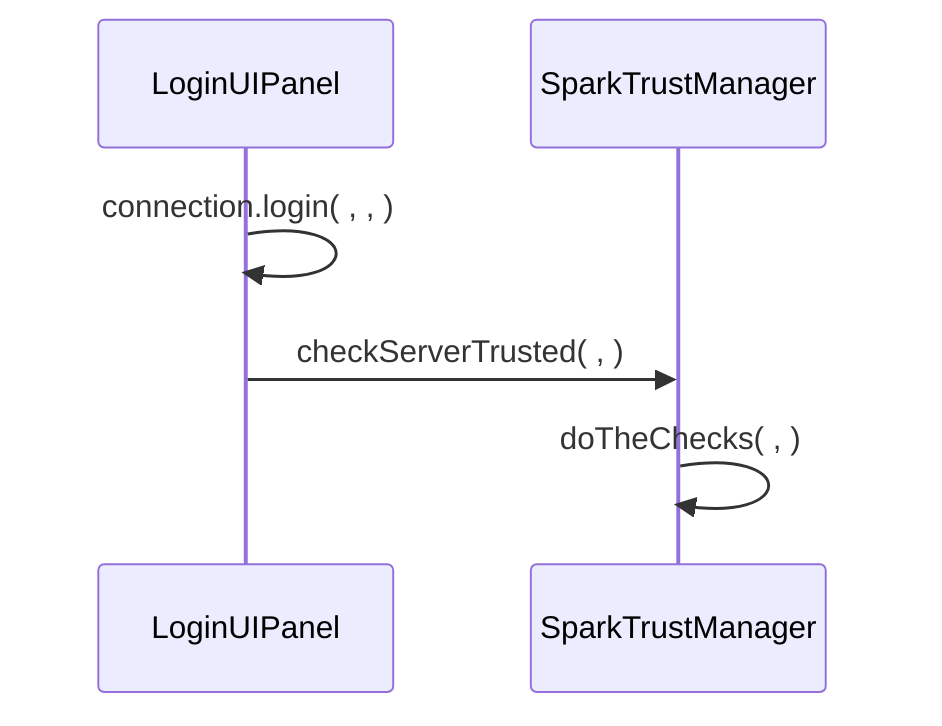
```mermaid
sequenceDiagram
    LoginUIPanel->>LoginUIPanel: connection.login( , , )
    LoginUIPanel->>SparkTrustManager: checkServerTrusted( , )
    SparkTrustManager->>SparkTrustManager: doTheChecks( , )
```

load certificate from local storage 
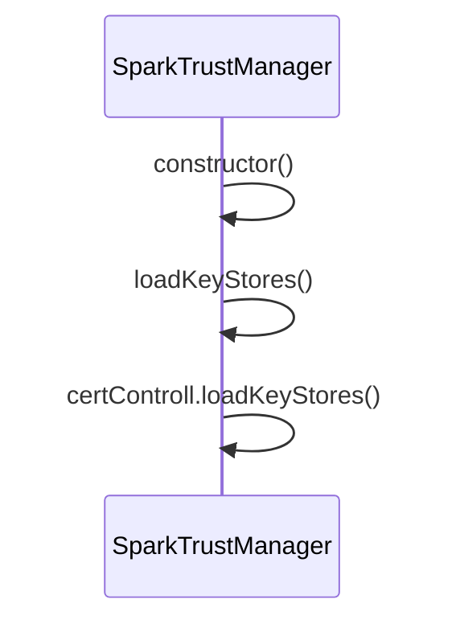
```mermaid
sequenceDiagram
    SparkTrustManager->>SparkTrustManager: constructor()
    SparkTrustManager->>SparkTrustManager: loadKeyStores()
    SparkTrustManager->>SparkTrustManager: certControll.loadKeyStores()
```


### Logout

`core/src/main/java/org/jivesoftware/MainWindow.java#259`

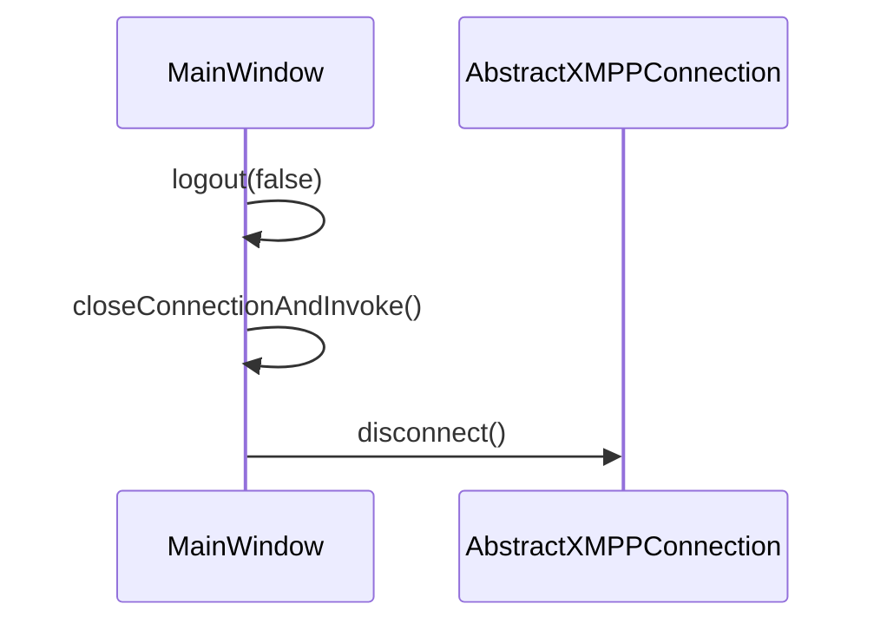
```mermaid
sequenceDiagram
    MainWindow->>MainWindow: logout(false)
    MainWindow->>MainWindow: closeConnectionAndInvoke()
    MainWindow->>AbstractXMPPConnection: disconnect()
```


### Contacts list

`core/src/main/java/org/jivesoftware/spark/ui/ContactGroup.java#303`


build offline list

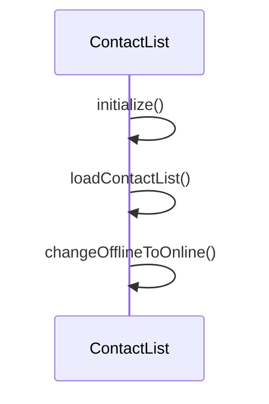
```mermaid
sequenceDiagram
    ContactList->>ContactList: initialize()
    ContactList->>ContactList: loadContactList()
    ContactList->>ContactList: changeOfflineToOnline()

```

---

updates for online user

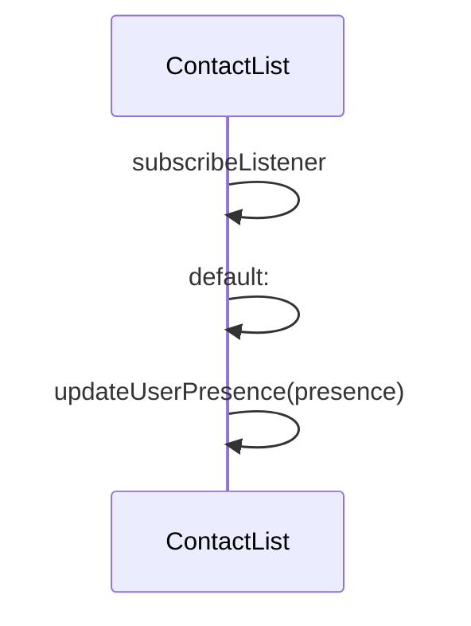
```mermaid
sequenceDiagram
    ContactList->>ContactList: subscribeListener
    ContactList->>ContactList: default:
    ContactList->>ContactList: updateUserPresence(presence)
```


### Search contacts

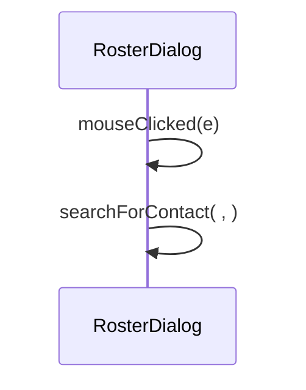
```mermaid
sequenceDiagram
    RosterDialog->>RosterDialog: mouseClicked(e)
    RosterDialog->>RosterDialog: searchForContact( , )
```

### Add contacts

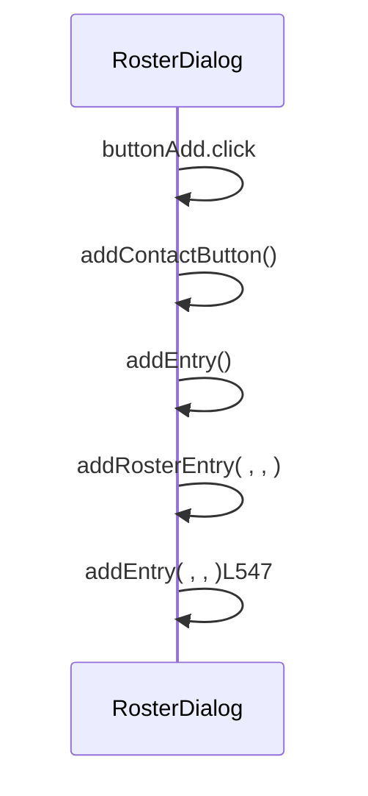
```mermaid
sequenceDiagram
    RosterDialog->>RosterDialog: buttonAdd.click
    RosterDialog->>RosterDialog: addContactButton()
    RosterDialog->>RosterDialog: addEntry()
    RosterDialog->>RosterDialog: addRosterEntry( , , )
    RosterDialog->>RosterDialog: addEntry( , , )L547
```

### Agree or deny adding

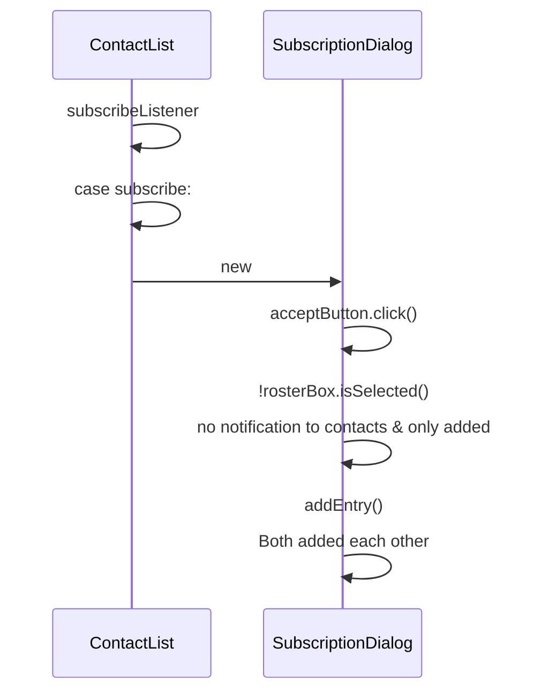
```mermaid
sequenceDiagram
    ContactList->>ContactList: subscribeListener
    ContactList->>ContactList: case subscribe:
    ContactList->>SubscriptionDialog: new
    SubscriptionDialog->>SubscriptionDialog: acceptButton.click()
    SubscriptionDialog->>SubscriptionDialog: !rosterBox.isSelected()<br><br>no notification to contacts & only added
    SubscriptionDialog->>SubscriptionDialog: addEntry() <br><br> Both added each other
```

### Single chat

`core/src/main/java/org/jivesoftware/spark/ui/rooms/ChatRoomImpl.java#295`

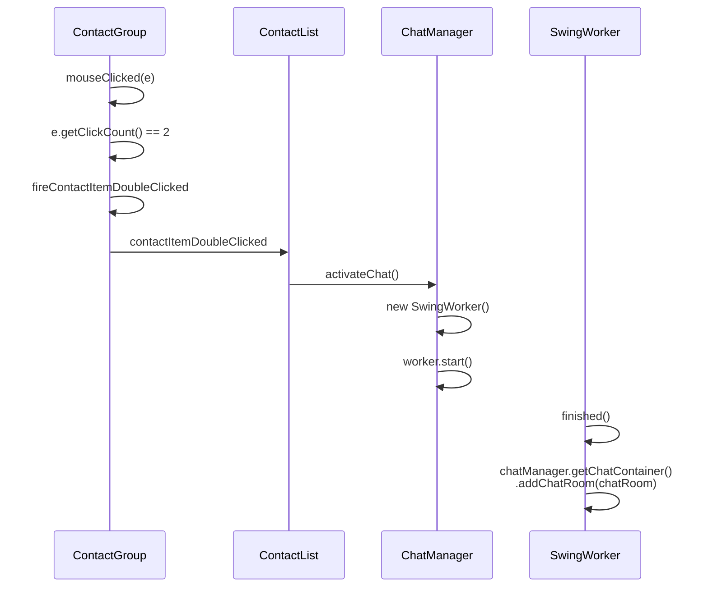
```mermaid
sequenceDiagram

    ContactGroup->>ContactGroup: mouseClicked(e)
    ContactGroup->>ContactGroup: e.getClickCount() == 2
    ContactGroup->>ContactGroup: fireContactItemDoubleClicked
    ContactGroup->>ContactList: contactItemDoubleClicked
    ContactList->>ChatManager: activateChat()
    ChatManager->>ChatManager: new SwingWorker()
    ChatManager->>ChatManager: worker.start()
    SwingWorker->>SwingWorker: finished()
    SwingWorker->>SwingWorker: chatManager.getChatContainer()<br>.addChatRoom(chatRoom)

```

---

Send messages

```mermaid
sequenceDiagram
    ChatRoom->>ChatRoom: checkForEnter(e)
    ChatRoom->>ChatRoom: sendMessage()
    ChatRoom->>ChatRoom: sendMessage(text)
    ChatRoom->>ChatRoom: sendMessage(message)
    ChatRoom->>AbstractXMPPConnection: sendStanza(message)
```


---

Receiving messages

```mermaid
sequenceDiagram
    ChatRoomImpl->>ChatRoomImpl: processStanza
```


### Group chat

#### Create room

```mermaid
sequenceDiagram
    ConferenceRoomBrowser->>ConferenceRoomBrowser: createButton.click()
    ConferenceRoomBrowser->>ConferenceRoomBrowser: actionPerformed()
    ConferenceRoomBrowser->>ConferenceRoomBrowser: createRoom()
```


---

#### Join room

```mermaid
sequenceDiagram
    ConferenceRoomBrowser->>ConferenceRoomBrowser: mouseClicked(e)
    ConferenceRoomBrowser->>ConferenceRoomBrowser: enterRoom()
    ConferenceRoomBrowser->>ConferenceRoomBrowser: chatManager<br>.getChatContainer()<br>.getChatRoom(roomJID)
    ConferenceRoomBrowser->>ConferenceRoomBrowser: catch
    ConferenceRoomBrowser->>ConferenceUtils: joinConferenceOnSeperateThread
    ConferenceUtils->>ConferenceUtils: joinConferenceOnSeperateThread
    ConferenceUtils->>JoinRoomSwingWorker: start()
    JoinRoomSwingWorker->>JoinRoomSwingWorker: construct()
    JoinRoomSwingWorker->>UIComponentRegistry: createGroupChatRoom(groupChat);

```


core/src/main/java/org/jivesoftware/spark/ui/rooms/GroupChatRoom.java


---


#### Getting participants

`core/src/main/java/org/jivesoftware/spark/ui/conferences/GroupChatParticipantList.java#169`

---

#### Receiving messages

```mermaid
sequenceDiagram
    GroupChatRoom->>GroupChatRoom: processStanza()
    GroupChatRoom->>GroupChatRoom: handleMessagePacket()
    GroupChatRoom->>TranscriptWindow: insertMessage()
```


---

#### Send messages

```mermaid
sequenceDiagram
    GroupChatRoom->>GroupChatRoom: sendMessage()
```


### fileupload

### messages saving


## Spk res to HL


when importing code of spark, cause gradle doesn't import any packages about swing, naming, so it has to be done by repacking jar.


`jmod extract java.desktop.jmod --dir ./output`

`jar cf java-desktop-17.jar -C java.desktop\classes .`


`D: && cd D:\jdk17-jar`  
`D:\liaoyj\DevelopmentResources\jdk-17.0.9\bin\jmod extract D:\liaoyj\DevelopmentResources\jdk-17.0.9\jmods\java.desktop.jmod --dir .\java.desktop`  

`D:\liaoyj\DevelopmentResources\jdk-17.0.9\bin\jar cf java-desktop-17.jar -C .\java.desktop\classes .`


