## Protocols 

### [Core](https://datatracker.ietf.org/doc/html/rfc3920)

#### 9.  XML Stanzas

#### 9.2.3.  IQ Semantics

### [Instant Messaging and Presence](https://datatracker.ietf.org/doc/html/rfc6121)
 
## xmpp extensions

- https://xmpp.org/extensions/


### [Service Discovery xep-0030](https://xmpp.org/extensions/xep-0030.html)
### [Stream Management xep-0198](https://xmpp.org/extensions/xep-0198.html)
### [XMPP Ping xep-0199](https://xmpp.org/extensions/xep-0199.html)


<br/>


## x

### Branch

branch: develop  
last commit: Up\version/to/644  

### Configs
as 2021.1.1.23-windows

jdk 1.8-211

- build.gradle r

from
```gradle
// Top-level build file where you can add configuration options common to all sub-projects/modules.
buildscript {
    repositories {
        jcenter()
        google()
        maven { url 'https://maven.fabric.io/public' }
    }
    dependencies {
        classpath 'com.android.tools.build:gradle:3.4.2'
        classpath "io.realm:realm-gradle-plugin:3.1.1"
        classpath 'com.neenbedankt.gradle.plugins:android-apt:1.8'
        classpath 'com.frogermcs.androiddevmetrics:androiddevmetrics-plugin:0.4'
        classpath 'io.fabric.tools:gradle:1.25.4'
        classpath 'com.google.gms:google-services:4.2.0'
    }
}

allprojects {
    repositories {
        jcenter()
        google()
        maven { url "https://jitpack.io" }
        maven { url 'https://oss.sonatype.org/content/repositories/snapshots' }
        maven { url 'http://igniterealtime.org/repo' }
        maven { url 'https://maven.fabric.io/public' }
    }
}

```


to
```gradle
// Top-level build file where you can add configuration options common to all sub-projects/modules.
buildscript {
    repositories {
        jcenter()
        google()
        maven { url 'https://maven.fabric.io/public' }
        maven { url 'https://repo1.maven.org/maven2'}
        maven {url 'https://maven.aliyun.com/repository/public'}
        maven {url 'https://maven.aliyun.com/repository/central'}
        maven {url "https://igniterealtime.org/repo/"}
    }
    dependencies {
        classpath 'com.android.tools.build:gradle:3.4.2'
        classpath "io.realm:realm-gradle-plugin:3.1.1"
        classpath 'com.neenbedankt.gradle.plugins:android-apt:1.8'
        classpath 'com.frogermcs.androiddevmetrics:androiddevmetrics-plugin:0.4'
        classpath 'io.fabric.tools:gradle:1.25.4'
        classpath 'com.google.gms:google-services:4.2.0'
    }
}

allprojects {
    repositories {
        jcenter()
        google()
        maven { url "https://jitpack.io" }
        maven { url 'https://oss.sonatype.org/content/repositories/snapshots' }
        maven { url 'http://igniterealtime.org/repo' }
        maven { url 'https://maven.fabric.io/public' }
        maven { url 'https://repo1.maven.org/maven2'}
        maven {url 'https://maven.aliyun.com/repository/public'}
        maven {url 'https://maven.aliyun.com/repository/central'}
        maven {url "https://igniterealtime.org/repo/"}
    }
}

```

#### build.gradle a

from
```gradle
ext {
   smackVerstion = 'xxxxxx'
}
```

to
```gradle
ext {
   smackVerstion = '4.2.1-SNAPSHOT'
}

ext {
   smackVerstion = '4.2.1-beta1'
}
```

---

from
```gradle
implementation "com.github.str4tocaster.smack:smack-android-extensions:$smackVerstion"
implementation "com.github.str4tocaster.smack:smack-experimental:$smackVerstion"
implementation "com.github.str4tocaster.smack:smack-tcp:$smackVerstion"
implementation "com.github.str4tocaster.smack:smack-resolver-dnsjava:$smackVerstion"
```

to
```gradle
implementation "org.igniterealtime.smack:smack-android-extensions:$smackVersion"
implementation "org.igniterealtime.smack:smack-experimental:$smackVersion"
implementation "org.igniterealtime.smack:smack-tcp:$smackVersion"
implementation "org.igniterealtime.smack:smack-resolver-dnsjava:$smackVersion"
```


#### TLSMode

from
```java
SecurityMode.legacy;
```

to
```java
SecurityMode.required;
```

#### XMPPTCPConnection

or use `XMPPTCPConnection` from library.

```java
ConnectionConfiguration.SecurityMode.legacy 
```

to
```java
SecurityMode.required
```

#### BookmarksManager

```java
bookmarkManager.cleanCache();
```
to
```java
//bookmarkManager.cleanCache();
```

### Important components

#### XMPPTCPConnection.java#connection#reading#writing

- `org.jivesoftware.smack.tcp`
  - `XMPPTCPConnection.java`
    - Creates a socket connection to an XMPP server.
    - `protected class PacketReader`
      - Reading data from input stream of socket by binding `packetReader.parser = PacketParserUtils.newXmppParser(reader)` and  
        reading `parser.next();` 
    - `protected class PacketWriter`
      - Pending packets sent to block queue, blocking read to packets from the queue by `nextStreamElement()`, then send to server  
        check out `PacketWriter-writePackets()`

##### Send data

PacketWriter initialization see also   
[connect-to-server](#connect-to-server-1)

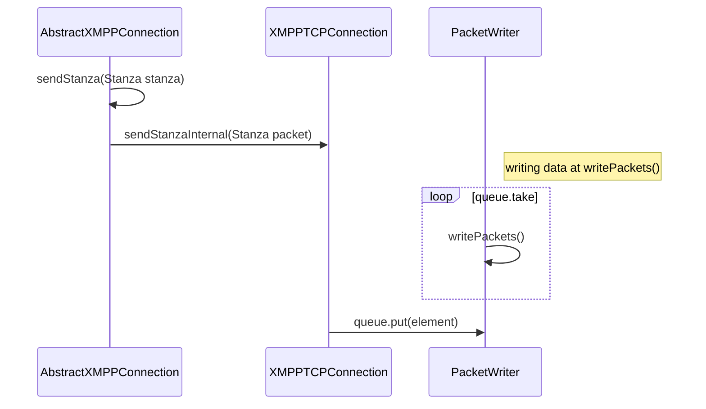
```mermaid
sequenceDiagram
    AbstractXMPPConnection->>AbstractXMPPConnection: sendStanza(Stanza stanza)
    AbstractXMPPConnection->>XMPPTCPConnection: sendStanzaInternal(Stanza packet)
    Note right of PacketWriter: writing data at writePackets()
    loop queue.take
        PacketWriter->>PacketWriter: writePackets()
    end
    
    XMPPTCPConnection->>PacketWriter: queue.put(element)    
```

`XMPPTCPConnection.java#PacketWriter`
```java
private void writePackets() {
    //...
    openStream();
    while (!done()) {
        Element element = nextStreamElement();
        //...
    }
    //...
}

private Element nextStreamElement() {
    //...
    packet = queue.take();
    //...
    return packet;
}
```

##### Read data

`XMPPTCPConnection.java`
```java
private void initReaderAndWriter() throws IOException {
    //...
    InputStream is = socket.getInputStream();
    reader = new BufferedReader(new InputStreamReader(is, "UTF-8"));
    //...
}
```


```java
//Resets the parser using the latest connection's reader.
void openStream() throws SmackException, InterruptedException {
    //...
    packetReader.parser = PacketParserUtils.newXmppParser(reader);
    //...
}
```

<br/>  


When to `openStream`

Initialize stream
```java
private void writePackets() {
    try {
        openStream();
    }
}
```
<br/>

Reset stream
```java
private void parsePackets() {
    try {
        while (!done) {
            switch (eventType) {
                case XmlPullParser.START_TAG:
                    switch (name) {
                        case "proceed":
                            // L1059 Secure the connection by negotiating TLS
                            openStream();
                            break;                            
                        case Success.ELEMENT:
                            // L1099
                            openStream();
                            break;
                        case Compressed.ELEMENT:
                            // L1110
                            openStream();
                            break;
                    }
            }
        }
    }
}

```


<br/>  

`XMPPTCPConnection.java#PacketReader`
```java
private void parsePackets() {
    //...
    int eventType = parser.getEventType();
    while (!done) {   
        eventType = parser.next();
    }
    //...
}
```


### Important app components 

- `BaseManagerInterface.java (com.xabber.android.data)`
- `OnPacketListener (com.xabber.android.data.connection.listeners)`
  - `VCardManager (com.xabber.android.data.extension.vcard)`
  - `AvatarManager (com.xabber.android.data.extension.avatar)`
  - `AttentionManager (com.xabber.android.data.extension.attention)`
  - `NextMamManager (com.xabber.android.data.extension.mam)`
  - `XTokenManager (com.xabber.android.data.extension.xtoken)`
  - `ChatMarkerManager (com.xabber.android.data.extension.chat_markers)`
  - `ReceiptManager (com.xabber.android.data.message)`
  - `SSNManager (com.xabber.android.data.extension.ssn)`
  - `PushManager (com.xabber.android.data.push)`
  - `MUCManager (com.xabber.android.data.extension.muc)`
  - `XMPPAuthManager (com.xabber.android.data.xaccount)`
  - `PresenceManager (com.xabber.android.data.roster)`
    - Process contact's presence information.
  - `ChatStateManager (com.xabber.android.data.extension.cs)`
  - `LastActivityInteractor (com.xabber.android.data.extension.iqlast)`
    - Receive Last Activity for user.
  - `MessageManager (com.xabber.android.data.message)`


- `AbstractChat.java (com.xabber.android.data.message)`
  - Chat instance

- `ConnectionItem.java (com.xabber.android.data.connection)`
- `AccountItem.java (com.xabber.android.data.account)`


### Connect to server 

[accept client connection](#accept-client-connection)

#### create connection

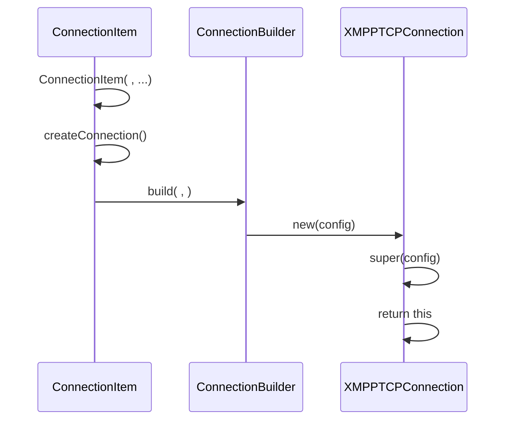
```mermaid
sequenceDiagram
    ConnectionItem->>ConnectionItem: ConnectionItem( , ...)
    ConnectionItem->>ConnectionItem: createConnection()
    ConnectionItem->>ConnectionBuilder: build( , )
    ConnectionBuilder->>XMPPTCPConnection: new(config)
    XMPPTCPConnection->>XMPPTCPConnection: super(config)
    XMPPTCPConnection->>XMPPTCPConnection: return this
```

---

#### connect to server
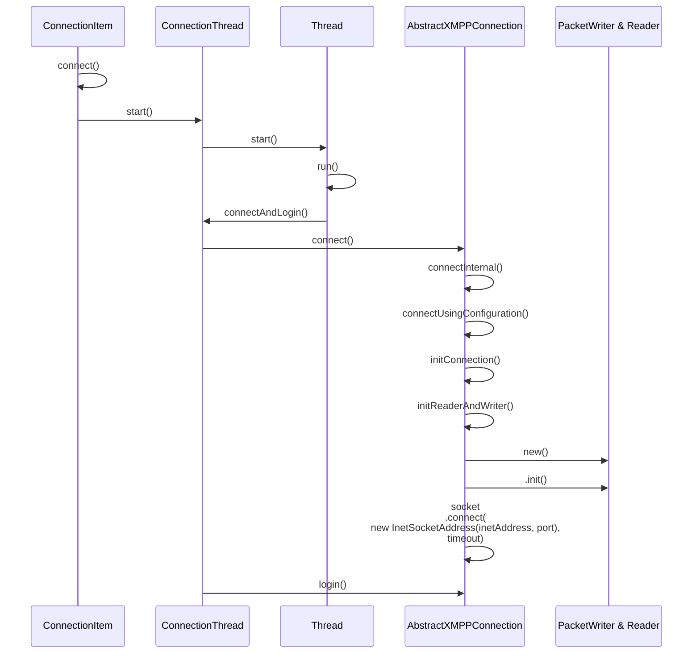
```mermaid
sequenceDiagram
    ConnectionItem->>ConnectionItem: connect()
    ConnectionItem->>ConnectionThread: start()
    ConnectionThread->>Thread: start()
    Thread->>Thread: run()
    Thread->>ConnectionThread: connectAndLogin()
    ConnectionThread->>AbstractXMPPConnection: connect()
    AbstractXMPPConnection->>AbstractXMPPConnection: connectInternal()
    AbstractXMPPConnection->>AbstractXMPPConnection: connectUsingConfiguration()
    AbstractXMPPConnection->>AbstractXMPPConnection: initConnection()
    AbstractXMPPConnection->>AbstractXMPPConnection: initReaderAndWriter()
    AbstractXMPPConnection->>PacketWriter & Reader: new()
    AbstractXMPPConnection->>PacketWriter & Reader: .init();
    AbstractXMPPConnection->>AbstractXMPPConnection: socket<br>.connect(<br>new InetSocketAddress(inetAddress, port), <br>timeout)
    ConnectionThread->>AbstractXMPPConnection: login()
```

---

#### login

https://datatracker.ietf.org/doc/html/rfc4422#autoid-6

```
C: Request authentication exchange
S: Initial challenge
C: Initial response
<additional challenge/response messages>
S: Outcome of authentication exchange
```

```

15:15:43.620 com.xabber.android.beta I/Smack: 
SENT (1): <auth xmlns='urn:ietf:params:xml:ns:xmpp-sasl' mechanism='SCRAM-SHA-1'>biwsbj1waG9uZTEscj1AXEppJX1TXFM9b1RrWXJkVUoqQVZfVD9ES0o3QTV9Vw==</auth>

15:15:43.722 com.xabber.android.beta I/Smack: 
RECV (1): <challenge xmlns="urn:ietf:params:xml:ns:xmpp-sasl">cj1AXEppJX1TXFM9b1RrWXJkVUoqQVZfVD9ES0o3QTV9V2NhMGY1ZmM3LTY2NDItNGY1Zi05ZDg2LWNmMGM0ZDlkNTIyMSxzPWJTWnk3L25SMHdQMjNuSE5JaWRPZXZLeTl0WVJ2YjNqLGk9NDA5Ng==</challenge>

15:15:43.747 com.xabber.android.beta I/Smack: 
SENT (1): <response xmlns='urn:ietf:params:xml:ns:xmpp-sasl'>Yz1iaXdzLHI9QFxKaSV9U1xTPW9Ua1lyZFVKKkFWX1Q/REtKN0E1fVdjYTBmNWZjNy02NjQyLTRmNWYtOWQ4Ni1jZjBjNGQ5ZDUyMjEscD11a25Xc2V6dk9Fd3ExdlFObFN2ZWFkdzEyOW89</response>

15:15:43.765 com.xabber.android.beta I/Smack: 
RECV (1): <success xmlns="urn:ietf:params:xml:ns:xmpp-sasl">dj1qeE91TmE3ZytJTlBtZjBJMjJ3YlltUFA5UG89</success>

-------------------------------------------------------------------------------------------------------------------------------------------------------------------------

15:15:46.962 org.jivesoftware.openfire.nio.NettyConnectionHandler - Handler on /192.168.0.113:5222--/192.168.0.35:51616 
received: <auth xmlns='urn:ietf:params:xml:ns:xmpp-sasl' mechanism='SCRAM-SHA-1'>biwsbj1waG9uZTEscj1AXEppJX1TXFM9b1RrWXJkVUoqQVZfVD9ES0o3QTV9Vw==</auth>

15:15:46.974 org.jivesoftware.openfire.nio.NettyConnection - 
Sending: <challenge xmlns="urn:ietf:params:xml:ns:xmpp-sasl">cj1AXEppJX1TXFM9b1RrWXJkVUoqQVZfVD9ES0o3QTV9V2NhMGY1ZmM3LTY2NDItNGY1Zi05ZDg2LWNmMGM0ZDlkNTIyMSxzPWJTWnk3L25SMHdQMjNuSE5JaWRPZXZLeTl0WVJ2YjNqLGk9NDA5Ng==</challenge>

15:15:47.035 org.jivesoftware.openfire.nio.NettyConnectionHandler - Handler on /192.168.0.113:5222--/192.168.0.35:51616 
received: <response xmlns='urn:ietf:params:xml:ns:xmpp-sasl'>Yz1iaXdzLHI9QFxKaSV9U1xTPW9Ua1lyZFVKKkFWX1Q/REtKN0E1fVdjYTBmNWZjNy02NjQyLTRmNWYtOWQ4Ni1jZjBjNGQ5ZDUyMjEscD11a25Xc2V6dk9Fd3ExdlFObFN2ZWFkdzEyOW89</response>

15:15:47.040 org.jivesoftware.openfire.nio.NettyConnection - 
Sending: <success xmlns="urn:ietf:params:xml:ns:xmpp-sasl">dj1qeE91TmE3ZytJTlBtZjBJMjJ3YlltUFA5UG89</success>    
```


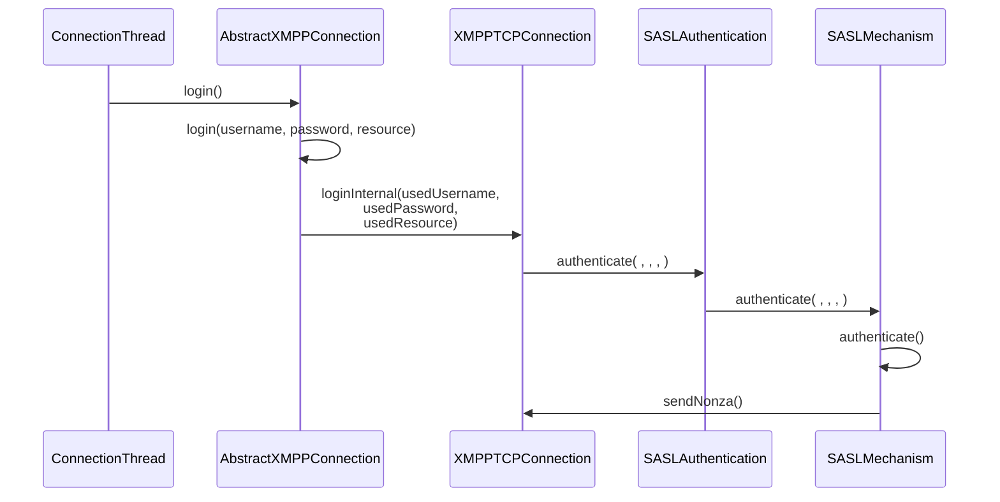
```mermaid
sequenceDiagram
    ConnectionThread->>AbstractXMPPConnection: login()
    AbstractXMPPConnection->>AbstractXMPPConnection: login(username, password, resource)
    AbstractXMPPConnection->>XMPPTCPConnection: loginInternal(usedUsername, <br>usedPassword, <br>usedResource)
    XMPPTCPConnection->>SASLAuthentication: authenticate( , , , )
    SASLAuthentication->>SASLMechanism: authenticate( , , , )
    SASLMechanism->>SASLMechanism: authenticate()
    SASLMechanism->>XMPPTCPConnection: sendNonza()
```


### Packets receiving

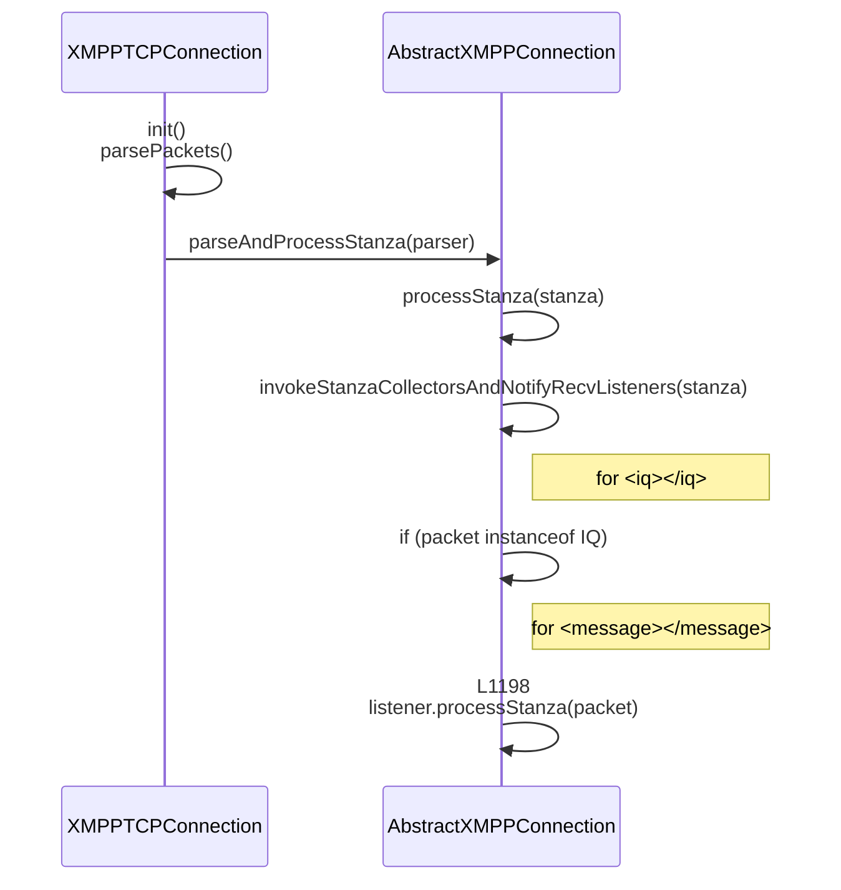
```mermaid
sequenceDiagram
    XMPPTCPConnection->>XMPPTCPConnection: init()<br>parsePackets()
    XMPPTCPConnection->>AbstractXMPPConnection: parseAndProcessStanza(parser)
    AbstractXMPPConnection->>AbstractXMPPConnection: processStanza(stanza)
    AbstractXMPPConnection->>AbstractXMPPConnection: invokeStanzaCollectorsAndNotifyRecvListeners(stanza)
    Note right of AbstractXMPPConnection: for <iq></iq>
    AbstractXMPPConnection->>AbstractXMPPConnection: if (packet instanceof IQ)
    Note right of AbstractXMPPConnection: for <message></message>
    AbstractXMPPConnection->>AbstractXMPPConnection: L1198<br>listener.processStanza(packet)
```

### Add contacts

#### components

- `com.xabber.android.data.roster`
  - `AccountRosterListener.java`
  - `GroupManager.java`
  - `PresenceManager.java`
  - `RosterManager.java`

- `com.xabber.android.data.extension.iqlast`
  - `LastActivityInteractor.java`

### Add account

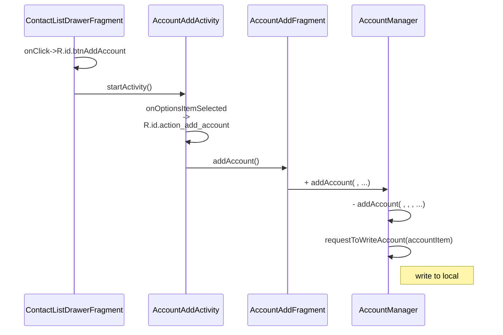
```mermaid
sequenceDiagram
    ContactListDrawerFragment->>ContactListDrawerFragment: onClick->R.id.btnAddAccount
    ContactListDrawerFragment->>AccountAddActivity: startActivity()
    AccountAddActivity->>AccountAddActivity: onOptionsItemSelected<br>-><br>R.id.action_add_account
    AccountAddActivity->>AccountAddFragment: addAccount()
    AccountAddFragment->>AccountManager: + addAccount( , ...)
    AccountManager->>AccountManager: - addAccount( , , , ...)    
    AccountManager->>AccountManager: requestToWriteAccount(accountItem)
    Note right of AccountManager: write to local
```

### Query account

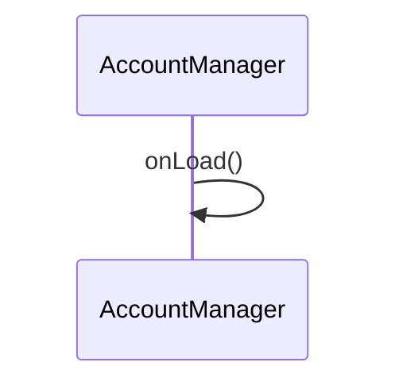
```mermaid
sequenceDiagram
    AccountManager->>AccountManager: onLoad()
```

## netty

`import java.nio.channels.Selector;`

`import io.netty.channel.Channel;`


## opfe

branch: 4.9.0

### TODOS

#### voice message

by file upload

#### Message retraction

### Add a new feature

- read protocols
- Sending & parsing data at client side  
- Receiving & responding data at server side

### Environment

mvn 3.6.3  
jdk 17.09  

### Load config

`xmppserver/src/main/java/org/jivesoftware/util/JiveGlobals.java`


### Server Bootstrap with Netty & Messages handling

https://mermaid.live/edit

https://github.com/igniterealtime/Openfire/blob/main/documentation/diagrams/netty-message-handling.md

https://github.com/igniterealtime/Openfire/blob/main/documentation/diagrams/netty-server-bootstrap.md

### Important components

- `org.jivesoftware.openfire`
  - `XMPPServer.java`
    - The main XMPP server that will load, initialize and start all the server's modules. 
  - `PacketDeliverer.java`
    - Delivers packets to locally connected streams. 
  - `SessionManager.java`
    - Manages the sessions associated with an account.
  - handler
    - `IQHandler.java`
      - Check out those `subclasses`
  - net    
    - `StanzaHandler.java`
      - A StanzaHandler is the main responsible for handling incoming stanzas.
  - nio
    - `NettyConnection.java`
      - Represents a connection on the server
    - `NettyConnectionHandler.java`
      - A NettyConnectionHandler is responsible for creating new sessions, destroying sessions   
        and delivering received XML stanzas to the proper StanzaHandler.
  - spi
    - `NettyConnectionAcceptor.java`
      - Responsible for accepting new (socket) connections, using Java NIO implementation provided by the Netty framework.
    - `NettyServerInitializer.java`
      - Creates a newly configured `ChannelPipeline` for a new channel.
 

### Packets receiving

`org.jivesoftware.openfire.nio.NettyConnectionHandler.java`
- `#129#channelRead0(ChannelHandlerContext ctx, String message)`

### Responses writing

`org.jivesoftware.openfire.nio.NettyConnection.java`
- `#285#deliver(Packet packet)`
- `#325#deliverRawText(String text)`

### Server Bootstrap with modules

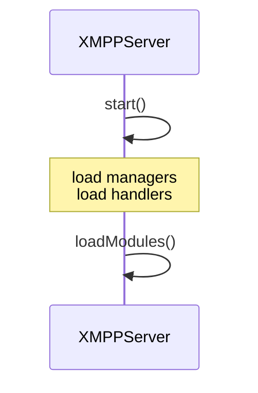
```mermaid
sequenceDiagram
    XMPPServer->>XMPPServer: start()
    Note over XMPPServer: load managers<br>load handlers
    XMPPServer->>XMPPServer: loadModules()
```

#### XMPPServer code snippets

<details>
<summary>XMPPServer</summary>

```java
private void loadModules() {
        // Load boot modules
        loadModule(RoutingTableImpl.class.getName());
        loadModule(AuditManagerImpl.class.getName());
        loadModule(RosterManager.class.getName());
        loadModule(PrivateStorage.class.getName());
        // Load core modules
        loadModule(PresenceManagerImpl.class.getName());
        loadModule(SessionManager.class.getName());
        loadModule(PacketRouterImpl.class.getName());
        loadModule(IQRouter.class.getName());
        loadModule(MessageRouter.class.getName());
        loadModule(PresenceRouter.class.getName());
        loadModule(MulticastRouter.class.getName());
        loadModule(PacketTransporterImpl.class.getName());
        loadModule(PacketDelivererImpl.class.getName());
        loadModule(TransportHandler.class.getName());
        loadModule(OfflineMessageStrategy.class.getName());
        loadModule(OfflineMessageStore.class.getName());
        loadModule(VCardManager.class.getName());
        // Load standard modules
        loadModule(IQBindHandler.class.getName());
        loadModule(IQSessionEstablishmentHandler.class.getName());
        loadModule(IQPingHandler.class.getName());
        loadModule(IQBlockingHandler.class.getName());
        loadModule(IQPrivateHandler.class.getName());
        loadModule(IQRegisterHandler.class.getName());
        loadModule(IQRosterHandler.class.getName());
        loadModule(IQEntityTimeHandler.class.getName());
        loadModule(IQvCardHandler.class.getName());
        loadModule(IQVersionHandler.class.getName());
        loadModule(IQLastActivityHandler.class.getName());
        loadModule(PresenceSubscribeHandler.class.getName());
        loadModule(PresenceUpdateHandler.class.getName());
        loadModule(IQOfflineMessagesHandler.class.getName());
        loadModule(IQPEPHandler.class.getName());
        loadModule(IQPEPOwnerHandler.class.getName());
        loadModule(MulticastDNSService.class.getName());
        loadModule(IQSharedGroupHandler.class.getName());
        loadModule(AdHocCommandHandler.class.getName());
        loadModule(IQPrivacyHandler.class.getName());
        loadModule(DefaultFileTransferManager.class.getName());
        loadModule(FileTransferProxy.class.getName());
        loadModule(MediaProxyService.class.getName());
        loadModule(PubSubModule.class.getName());
        loadModule(IQDiscoInfoHandler.class.getName());
        loadModule(IQDiscoItemsHandler.class.getName());
        loadModule(UpdateManager.class.getName());
        loadModule(InternalComponentManager.class.getName());
        loadModule(MultiUserChatManager.class.getName());
        loadModule(IQMessageCarbonsHandler.class.getName());
        loadModule(ArchiveManager.class.getName());
        loadModule(CertificateStoreManager.class.getName());
        loadModule(EntityCapabilitiesManager.class.getName());
        loadModule(SoftwareVersionManager.class.getName());
        loadModule(SoftwareServerVersionManager.class.getName());

        // Load this module always last since we don't want to start listening for clients
        // before the rest of the modules have been started
        loadModule(ConnectionManagerImpl.class.getName());
        loadModule(ClusterMonitor.class.getName());
        // Keep a reference to the internal component manager
        componentManager = getComponentManager();
    }
```

</details>

### Accept client connection

[connect-to-server](#connect-to-server)

#### Connection establishment

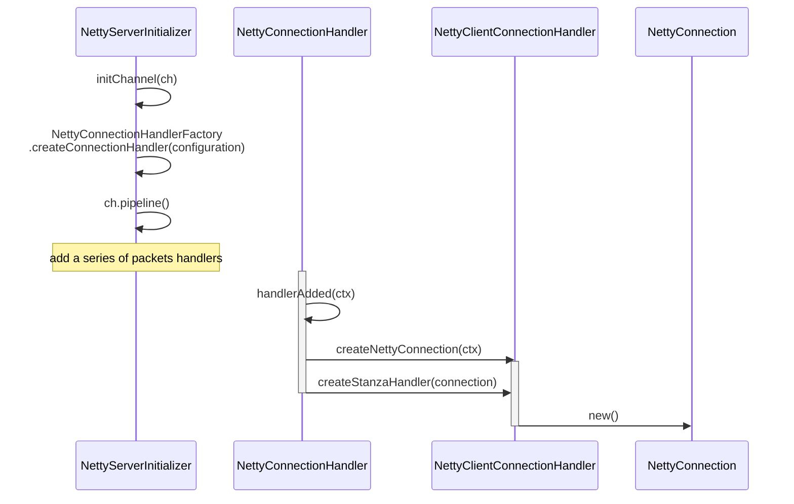
```mermaid
sequenceDiagram
    NettyServerInitializer->>NettyServerInitializer: initChannel(ch)
    NettyServerInitializer->>NettyServerInitializer: NettyConnectionHandlerFactory<br>.createConnectionHandler(configuration)
    NettyServerInitializer->>NettyServerInitializer: ch.pipeline()
    Note over NettyServerInitializer: add a series of packets handlers
    
    activate NettyConnectionHandler
    NettyConnectionHandler->>NettyConnectionHandler: handlerAdded(ctx)

    NettyConnectionHandler->>NettyClientConnectionHandler: createNettyConnection(ctx)

    activate NettyClientConnectionHandler
    NettyConnectionHandler->>NettyClientConnectionHandler: createStanzaHandler(connection)
    deactivate NettyConnectionHandler

    NettyClientConnectionHandler->>NettyConnection: new()
    deactivate NettyClientConnectionHandler
```


#### Create client session

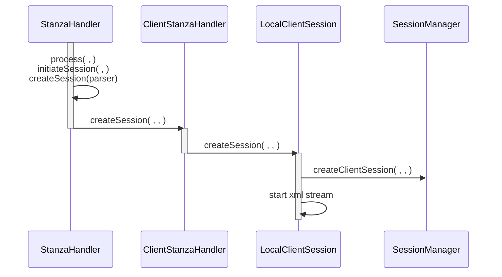
```mermaid
sequenceDiagram

    activate StanzaHandler
    StanzaHandler->>StanzaHandler: process( , )<br>initiateSession( , )<br>createSession(parser)
    StanzaHandler->>ClientStanzaHandler: createSession( , , )
    deactivate StanzaHandler

    activate ClientStanzaHandler
    ClientStanzaHandler->>LocalClientSession: createSession( , , )
    deactivate ClientStanzaHandler

    activate LocalClientSession
    LocalClientSession->>SessionManager: createClientSession( , , )
    LocalClientSession->>LocalClientSession: start xml stream
    deactivate LocalClientSession
```


#### Start xml stream (client side log)

  
Smack: SENT (0):
```xml
<stream:stream xmlns='jabber:client' to='d113' xmlns:stream='http://etherx.jabber.org/streams' version='1.0' from='phone1@d113' xml:lang='en'>
```

Smack: RECV (0):
```xml
<?xml version="1.0" encoding="UTF-8"?>
<stream:stream xmlns:stream="http://etherx.jabber.org/streams" from="d113" id="3minndt7yt"
    version="1.0" xmlns="jabber:client" xml:lang="en">
    <stream:features>
        <starttls xmlns="urn:ietf:params:xml:ns:xmpp-tls" />
        <limits xmlns="urn:xmpp:stream-limits:0">
            <max-bytes>1048576</max-bytes>
            <idle-seconds>360</idle-seconds>
        </limits>
        <mechanisms xmlns="urn:ietf:params:xml:ns:xmpp-sasl">
            <mechanism>PLAIN</mechanism>
            <mechanism>SCRAM-SHA-1</mechanism>
            <mechanism>CRAM-MD5</mechanism>
            <mechanism>DIGEST-MD5</mechanism>
        </mechanisms>
        <compression xmlns="http://jabber.org/features/compress">
            <method>zlib</method>
        </compression>
        <ver xmlns="urn:xmpp:features:rosterver" />
        <register xmlns="http://jabber.org/features/iq-register" />
        <c hash="sha-1" node="https://www.igniterealtime.org/projects/openfire/"
            ver="8xOPs4AQRdWosQy5ksVjA9//vFo="
            xmlns="http://jabber.org/protocol/caps" />
        <limits xmlns="urn:xmpp:stream-limits:0">
            <max-bytes>1048576</max-bytes>
            <idle-seconds>360</idle-seconds>
        </limits>
    </stream:features>
```

Smack: SENT (0):
```xml
<starttls xmlns='urn:ietf:params:xml:ns:xmpp-tls'></starttls>
```

Smack: RECV (0):
```xml
<proceed xmlns="urn:ietf:params:xml:ns:xmpp-tls"/>
```

Smack: SENT (0):
```xml
<stream:stream xmlns='jabber:client' to='d113' xmlns:stream='http://etherx.jabber.org/streams' version='1.0' from='phone1@d113' xml:lang='en'>
```

Smack: RECV (0):

reset stream

```xml
<?xml version="1.0" encoding="UTF-8"?>
<stream:stream xmlns:stream="http://etherx.jabber.org/streams" from="d113" id="3minndt7yt"
    version="1.0" xmlns="jabber:client" xml:lang="en">
    <stream:features>
        <mechanisms xmlns="urn:ietf:params:xml:ns:xmpp-sasl">
            <mechanism>PLAIN</mechanism>
            <mechanism>SCRAM-SHA-1</mechanism>
            <mechanism>CRAM-MD5</mechanism>
            <mechanism>DIGEST-MD5</mechanism>
        </mechanisms>
        <compression xmlns="http://jabber.org/features/compress">
            <method>zlib</method>
        </compression>
        <ver xmlns="urn:xmpp:features:rosterver" />
        <register xmlns="http://jabber.org/features/iq-register" />
        <c hash="sha-1" node="https://www.igniterealtime.org/projects/openfire/"
            ver="8xOPs4AQRdWosQy5ksVjA9//vFo="
            xmlns="http://jabber.org/protocol/caps" />
        <limits xmlns="urn:xmpp:stream-limits:0">
            <max-bytes>1048576</max-bytes>
            <idle-seconds>360</idle-seconds>
        </limits>
    </stream:features>
```


Smack: XMPPConnection connected (XMPPTCPConnection[phone1@d113/xabber-android-oXAQLcl3] (0))

#### Close stream

```java
private void writePackets() {
    //L1464
    try {
        writer.write("</stream:stream>");
        writer.flush();
    }
}
```


#### User authentication

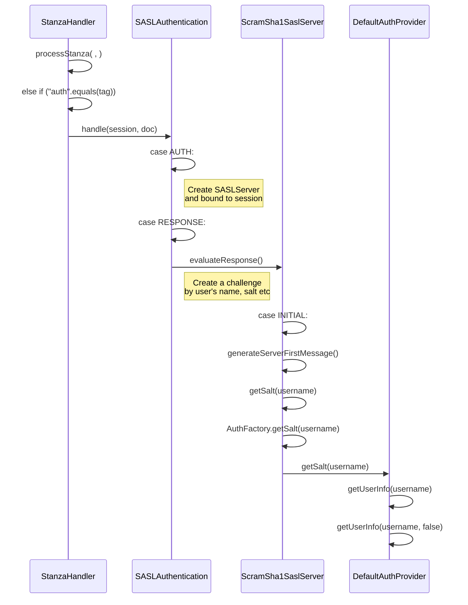
```mermaid
sequenceDiagram
    StanzaHandler->>StanzaHandler: processStanza( , )
    StanzaHandler->>StanzaHandler: else if ("auth".equals(tag))
    StanzaHandler->>SASLAuthentication: handle(session, doc)
    SASLAuthentication->>SASLAuthentication: case AUTH:
    Note right of SASLAuthentication: Create SASLServer<br> and bound to session
    SASLAuthentication->>SASLAuthentication: case RESPONSE:
    SASLAuthentication->>ScramSha1SaslServer: evaluateResponse()
    Note right of SASLAuthentication: Create a challenge<br> by user's name, salt etc
    ScramSha1SaslServer->>ScramSha1SaslServer: case INITIAL:
    ScramSha1SaslServer->>ScramSha1SaslServer: generateServerFirstMessage()
    ScramSha1SaslServer->>ScramSha1SaslServer: getSalt(username)
    ScramSha1SaslServer->>ScramSha1SaslServer: AuthFactory.getSalt(username)
    ScramSha1SaslServer->>DefaultAuthProvider: getSalt(username)
    DefaultAuthProvider->>DefaultAuthProvider: getUserInfo(username)
    DefaultAuthProvider->>DefaultAuthProvider: getUserInfo(username, false)
    
```


### Openfire Message Handling with Netty

The following diagram shows how network messages (e.g. TLS, XMPP stanzas) are processed by the Netty-based networking layer in Openfire.

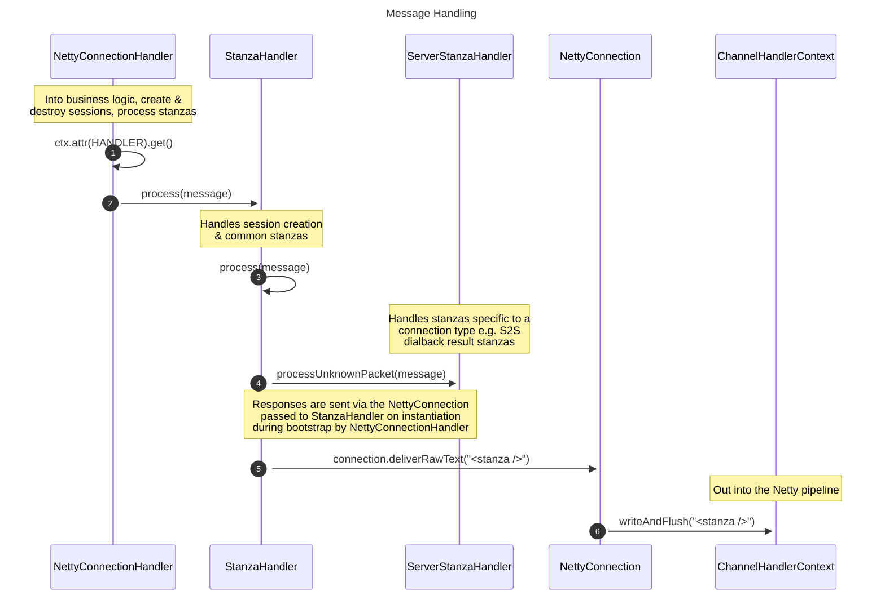
```mermaid

sequenceDiagram title Message Handling
    autonumber
    
    Note over NettyConnectionHandler: Into business logic, create & <br/> destroy sessions, process stanzas
    NettyConnectionHandler->>+NettyConnectionHandler: ctx.attr(HANDLER).get()
    NettyConnectionHandler->>+StanzaHandler: process(message)
    Note over StanzaHandler: Handles session creation <br /> & common stanzas
    StanzaHandler->>+StanzaHandler: process(message)
    Note over ServerStanzaHandler: Handles stanzas specific to a <br /> connection type e.g. S2S <br />dialback result stanzas
    StanzaHandler->>+ServerStanzaHandler: processUnknownPacket(message)
    Note over ServerStanzaHandler, StanzaHandler: Responses are sent via the NettyConnection <br /> passed to StanzaHandler on instantiation <br />during bootstrap by NettyConnectionHandler
    StanzaHandler->>+NettyConnection: connection.deliverRawText("<stanza />")
    Note over ChannelHandlerContext: Out into the Netty pipeline
    NettyConnection->>+ChannelHandlerContext: writeAndFlush("<stanza />")

```

### IQ packets routing to handler

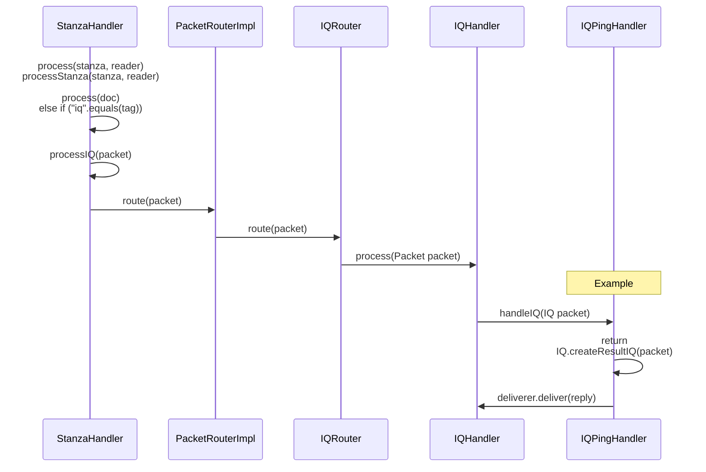
```mermaid
sequenceDiagram
    StanzaHandler->>StanzaHandler: process(stanza, reader)<br>processStanza(stanza, reader)<br><br>process(doc)<br>else if ("iq".equals(tag))
    StanzaHandler->>StanzaHandler: processIQ(packet)
    StanzaHandler->>PacketRouterImpl: route(packet)
    PacketRouterImpl->>IQRouter: route(packet)
    IQRouter->>IQHandler: process(Packet packet)
    Note over IQPingHandler: Example
    IQHandler->>IQPingHandler: handleIQ(IQ packet)
    IQPingHandler->>IQPingHandler: return<br>IQ.createResultIQ(packet);
    IQPingHandler->>IQHandler: deliverer.deliver(reply)
```

### Packets delivery 

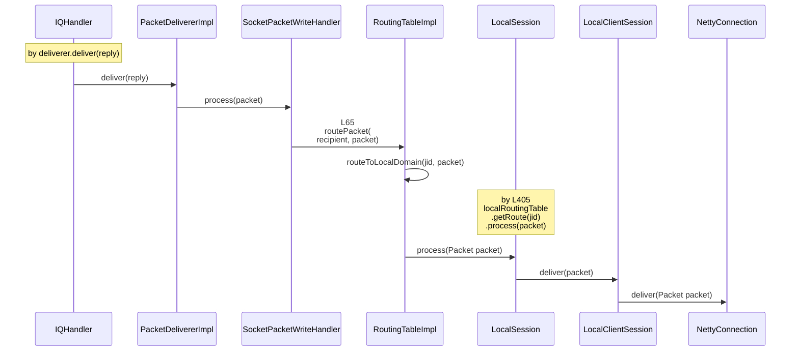
```mermaid
sequenceDiagram
    Note over IQHandler: by deliverer.deliver(reply)
    IQHandler->>PacketDelivererImpl: deliver(reply)
    PacketDelivererImpl->>SocketPacketWriteHandler: process(packet)
    SocketPacketWriteHandler->>RoutingTableImpl: L65<br>routePacket(<br>recipient, packet)
    RoutingTableImpl->>RoutingTableImpl: routeToLocalDomain(jid, packet)
    Note over LocalSession: by L405<br>localRoutingTable<br>.getRoute(jid)<br>.process(packet);
    RoutingTableImpl->>LocalSession: process(Packet packet)
    LocalSession->>LocalClientSession: deliver(packet)
    LocalClientSession->>NettyConnection: deliver(Packet packet)
    
```
see also [responses-writing](#responses-writing)

### Add contacts

```xml
<iq id='cAvaB-331' type='set'><query xmlns='jabber:iq:roster'><item jid='116@d113' name='' subscription='none'></item></query></iq>
```

### Plugin httpfileupload

#### TODOS

- User authentication

#### Setting local repo

`plugins/openfire-httpFileUpload-plugin/src/java/org/igniterealtime/openfire/plugins/httpfileupload/HttpFileUploadPlugin.java#getFileRepoFromProperties()`

at `distribution/src/conf/openfire.xml`

## opfe admin 

### Add user 

## spk

branch: master

last commit: SPARK-2122: Add DOAP file for project

### Environment

- maven 3.6.3
- jdk 11
 
 #### open smack debugger

 from code `core/src/main/java/org/jivesoftware/gui/LoginUIPanel.java#L752`


 from configuration file `C:\Users\{Username}\AppData\Roaming\Spark\spark.properties`, modify `debuggerEnabled=false` to `debuggerEnabled=true`  
`core/src/main/resources/default.properties` `DEBUGGER_ENABLED = false` to `DEBUGGER_ENABLED = true`

### Login

`core/src/main/java/org/jivesoftware/gui/LoginUIPanel.java#1254`

```java
connection = new XMPPTCPConnection(retrieveConnectionConfiguration());
connection.connect();

connection.login(getLoginUsername(), getLoginPassword(), resourcepart);
```

#### session

#### option dialog, Self Signed certificate

`core/src/main/java/org/jivesoftware/gui/LoginUIPanel.java#1329-1353`

`ACCEPT_SELF_SIGNED = true`

#### option dialog, Certificate not in the TrustStore

add to

#### Add certificate to local storage

get lastFailedChain

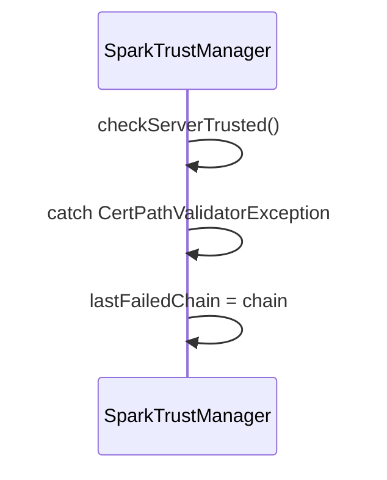
```mermaid
sequenceDiagram
    SparkTrustManager->>SparkTrustManager: checkServerTrusted()
    SparkTrustManager->>SparkTrustManager: catch CertPathValidatorException
    SparkTrustManager->>SparkTrustManager: lastFailedChain = chain
```


login first
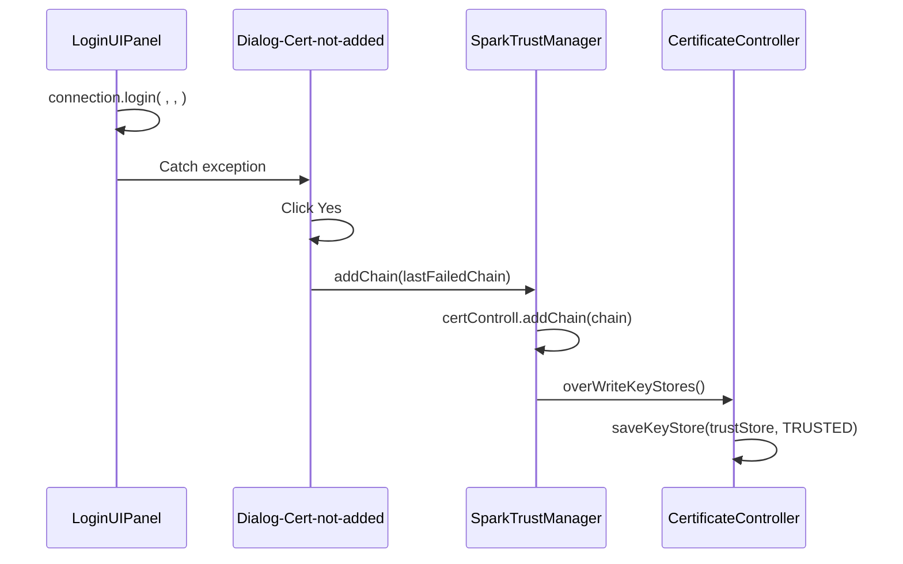
```mermaid
sequenceDiagram
    LoginUIPanel->>LoginUIPanel: connection.login( , , )
    LoginUIPanel->>Dialog-Cert-not-added: Catch exception
    Dialog-Cert-not-added->>Dialog-Cert-not-added: Click Yes
    Dialog-Cert-not-added->>SparkTrustManager: addChain(lastFailedChain)
    SparkTrustManager->>SparkTrustManager: certControll.addChain(chain)
    SparkTrustManager->>CertificateController: overWriteKeyStores()
    CertificateController->>CertificateController: saveKeyStore(trustStore, TRUSTED)
```


login after
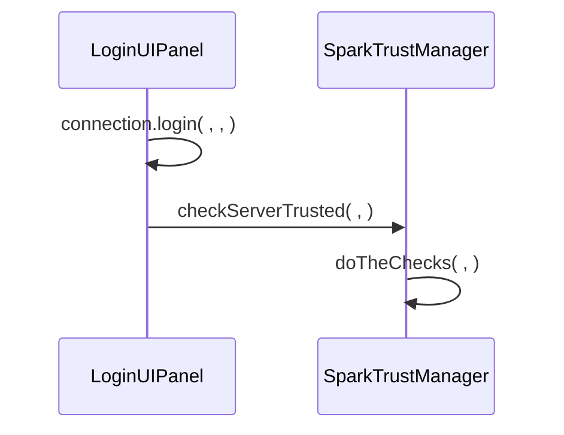
```mermaid
sequenceDiagram
    LoginUIPanel->>LoginUIPanel: connection.login( , , )
    LoginUIPanel->>SparkTrustManager: checkServerTrusted( , )
    SparkTrustManager->>SparkTrustManager: doTheChecks( , )
```

load certificate from local storage 
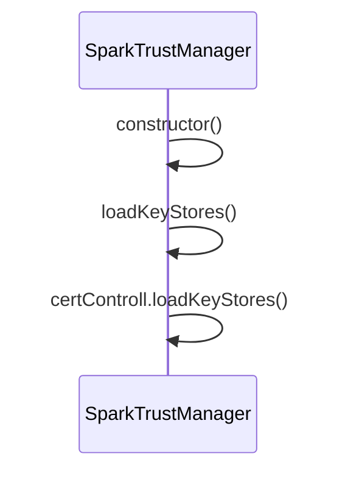
```mermaid
sequenceDiagram
    SparkTrustManager->>SparkTrustManager: constructor()
    SparkTrustManager->>SparkTrustManager: loadKeyStores()
    SparkTrustManager->>SparkTrustManager: certControll.loadKeyStores()
```

### Load ext plugin

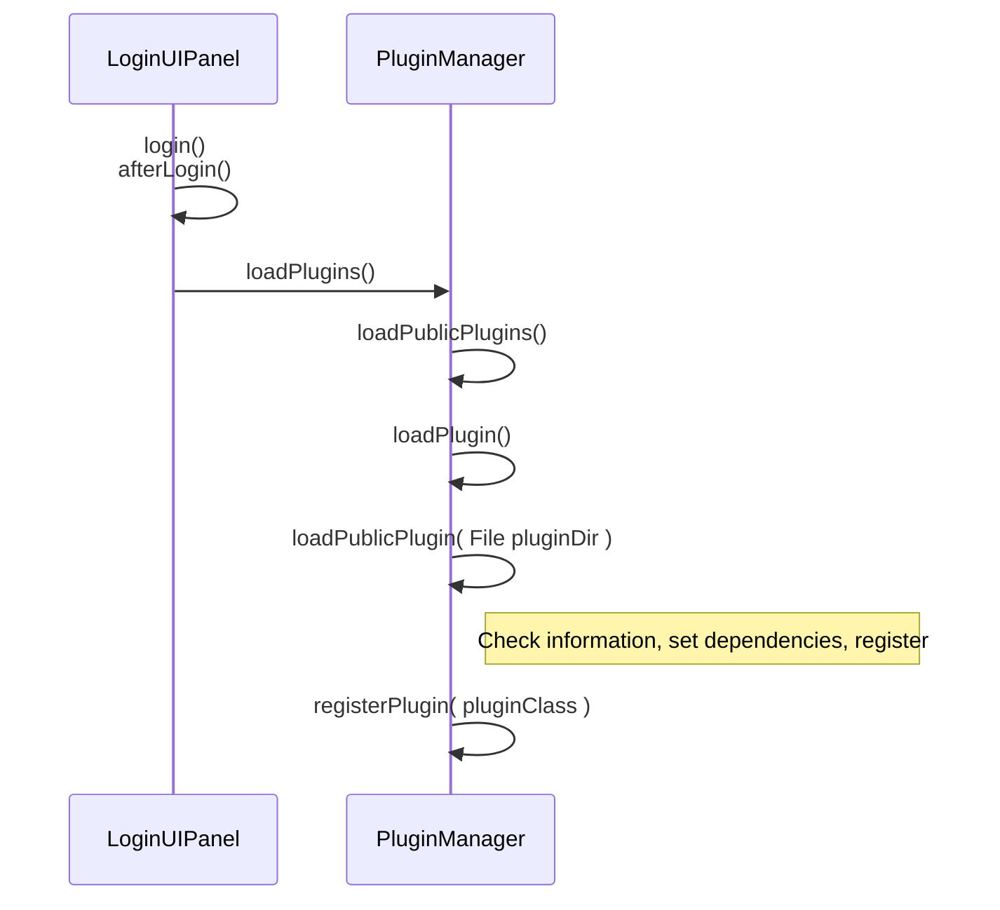
```mermaid
sequenceDiagram
    LoginUIPanel->>LoginUIPanel: login()<br>afterLogin()
    LoginUIPanel->>PluginManager: loadPlugins()    
    PluginManager->>PluginManager: loadPublicPlugins()
    PluginManager->>PluginManager: loadPlugin()
    PluginManager->>PluginManager: loadPublicPlugin( File pluginDir )
    Note right of PluginManager: Check information, set dependencies, register  
    PluginManager->>PluginManager: registerPlugin( pluginClass )

```

#### Add upload file btn

Loading `SparkFileUploadPlugin` from `.jar` at `C:\Users\{user}\AppData\Roaming\Spark\plugins`

`src/main/java/org/jivesoftware/spark/plugin/fileupload/SparkFileUploadPlugin.java#chatRoomOpened()`


### Logout

`core/src/main/java/org/jivesoftware/MainWindow.java#259`

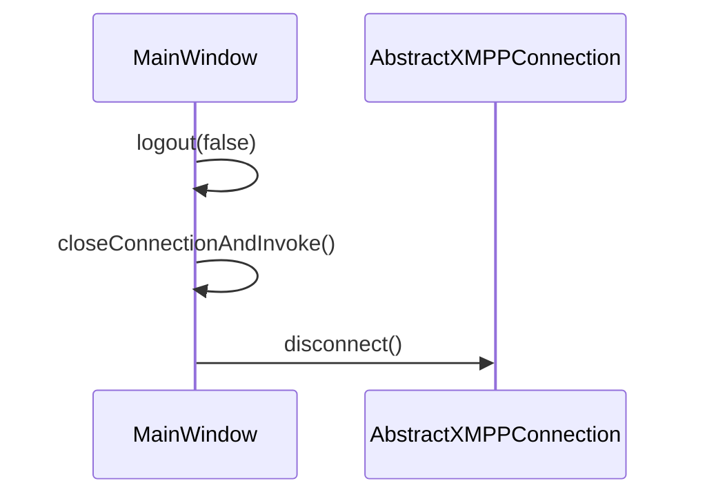
```mermaid
sequenceDiagram
    MainWindow->>MainWindow: logout(false)
    MainWindow->>MainWindow: closeConnectionAndInvoke()
    MainWindow->>AbstractXMPPConnection: disconnect()
```


### Contacts list

`core/src/main/java/org/jivesoftware/spark/ui/ContactGroup.java#303`


build offline list

```mermaid
sequenceDiagram
    ContactList->>ContactList: initialize()
    ContactList->>ContactList: loadContactList()
    ContactList->>ContactList: changeOfflineToOnline()

```

---

updates for online user

```mermaid
sequenceDiagram
    ContactList->>ContactList: subscribeListener
    ContactList->>ContactList: default:
    ContactList->>ContactList: updateUserPresence(presence)
```


### Search contacts

```mermaid
sequenceDiagram
    RosterDialog->>RosterDialog: mouseClicked(e)
    RosterDialog->>RosterDialog: searchForContact( , )
```

### Add contacts

```mermaid
sequenceDiagram
    RosterDialog->>RosterDialog: buttonAdd.click
    RosterDialog->>RosterDialog: addContactButton()
    RosterDialog->>RosterDialog: addEntry()
    RosterDialog->>RosterDialog: addRosterEntry( , , )
    RosterDialog->>RosterDialog: addEntry( , , )L547
```

### Agree or deny adding

```mermaid
sequenceDiagram
    ContactList->>ContactList: subscribeListener
    ContactList->>ContactList: case subscribe:
    ContactList->>SubscriptionDialog: new
    SubscriptionDialog->>SubscriptionDialog: acceptButton.click()
    SubscriptionDialog->>SubscriptionDialog: !rosterBox.isSelected()<br><br>no notification to contacts & only added
    SubscriptionDialog->>SubscriptionDialog: addEntry() <br><br> Both added each other
```

### Single chat

`core/src/main/java/org/jivesoftware/spark/ui/rooms/ChatRoomImpl.java#295`

```mermaid
sequenceDiagram

    ContactGroup->>ContactGroup: mouseClicked(e)
    ContactGroup->>ContactGroup: e.getClickCount() == 2
    ContactGroup->>ContactGroup: fireContactItemDoubleClicked
    ContactGroup->>ContactList: contactItemDoubleClicked
    ContactList->>ChatManager: activateChat()
    ChatManager->>ChatManager: new SwingWorker()
    ChatManager->>ChatManager: worker.start()
    SwingWorker->>SwingWorker: finished()
    SwingWorker->>SwingWorker: chatManager.getChatContainer()<br>.addChatRoom(chatRoom)

```

---

Send messages

```mermaid
sequenceDiagram
    ChatRoom->>ChatRoom: checkForEnter(e)
    ChatRoom->>ChatRoom: sendMessage()
    ChatRoom->>ChatRoom: sendMessage(text)
    ChatRoom->>ChatRoom: sendMessage(message)
    ChatRoom->>AbstractXMPPConnection: sendStanza(message)
```


---

Receiving messages

```mermaid
sequenceDiagram
    ChatRoomImpl->>ChatRoomImpl: processStanza
```


### Group chat

#### Create room

```mermaid
sequenceDiagram
    ConferenceRoomBrowser->>ConferenceRoomBrowser: createButton.click()
    ConferenceRoomBrowser->>ConferenceRoomBrowser: actionPerformed()
    ConferenceRoomBrowser->>ConferenceRoomBrowser: createRoom()
```


---

#### Join room

```mermaid
sequenceDiagram
    ConferenceRoomBrowser->>ConferenceRoomBrowser: mouseClicked(e)
    ConferenceRoomBrowser->>ConferenceRoomBrowser: enterRoom()
    ConferenceRoomBrowser->>ConferenceRoomBrowser: chatManager<br>.getChatContainer()<br>.getChatRoom(roomJID)
    ConferenceRoomBrowser->>ConferenceRoomBrowser: catch
    ConferenceRoomBrowser->>ConferenceUtils: joinConferenceOnSeperateThread
    ConferenceUtils->>ConferenceUtils: joinConferenceOnSeperateThread
    ConferenceUtils->>JoinRoomSwingWorker: start()
    JoinRoomSwingWorker->>JoinRoomSwingWorker: construct()
    JoinRoomSwingWorker->>UIComponentRegistry: createGroupChatRoom(groupChat);

```


core/src/main/java/org/jivesoftware/spark/ui/rooms/GroupChatRoom.java


---


#### Getting participants

`core/src/main/java/org/jivesoftware/spark/ui/conferences/GroupChatParticipantList.java#169`

---

#### Receiving messages

```mermaid
sequenceDiagram
    GroupChatRoom->>GroupChatRoom: processStanza()
    GroupChatRoom->>GroupChatRoom: handleMessagePacket()
    GroupChatRoom->>TranscriptWindow: insertMessage()
```


---

#### Send messages

```mermaid
sequenceDiagram
    GroupChatRoom->>GroupChatRoom: sendMessage()
```


### fileupload

```mermaid
sequenceDiagram
    ChatRoomDecorator->>ChatRoomDecorator: fileuploadButton<br>.addActionListener{e -> }
    ChatRoomDecorator->>ChatRoomDecorator: getUploadUrl<br>(room, Message.Type.chat)
    ChatRoomDecorator->>ChatRoomDecorator: handleUpload<br>(file, room, type)
    Note right of ChatRoomDecorator: when putUrl is avaliable
    ChatRoomDecorator->>ChatRoomDecorator: uploadFile(file, response, room, type);
```

### toXML()

#### target
```xml
<iq xmlns='jabber:client' id='RKI49-1' type='get'>
    <request xmlns='urn:xmpp:http:upload:0'>
        <size>111</size>
        <filename>test.txt</filename>
    </request>
</iq>
```

#### example class, from spark
```java
public class UploadRequest extends IQ {
    public static final String NAMESPACE = "urn:xmpp:http:upload:0";

    private String filename;
    private long filesize;

    public String getUrl = null;
    public String putUrl = null;

    public UploadRequest(){super( "request", NAMESPACE );}

    public UploadRequest(String filename, long filesize){
        super( "request", NAMESPACE );
        this.filename = filename;
        this.filesize = filesize;
    }

    @Override
    protected IQChildElementXmlStringBuilder getIQChildElementBuilder( IQChildElementXmlStringBuilder buf ){
        buf.rightAngleBracket();
        buf.element("size", Long.toString( filesize ));
        buf.element("filename", filename);
        return buf;
    }
    //...
}
```

```mermaid
sequenceDiagram
    main()->>UploadRequest: new UploadRequest("test.txt", 111)
    UploadRequest->>IQ: super( "request", NAMESPACE )
    IQ->>IQ: this(IqData.EMPTY, <br>childElementName, <br>childElementNamespace)
    IQ->>IQ: this.childElementName <br>= childElementName<br><br>this.childElementNamespace <br>= childElementNamespace
    main()->>Element: uploadRequest.toXML();
    Element->>Element: toXML(XmlEnvironment.EMPTY)
    Element->>IQ: toXML(XmlEnvironment)
```

```mermaid
sequenceDiagram
    IQ->>IQ: toXML(XmlEnvironment)
    IQ->>XmlStringBuilder: new (this, <br>enclosingXmlEnvironment)
    XmlStringBuilder->>XmlStringBuilder: this( , , , )
    XmlStringBuilder->>XmlStringBuilder: halfOpenElement
    Note right of XmlStringBuilder:  sb.append('<').append(name) 
    XmlStringBuilder->>XmlStringBuilder: xmlnsAttribute(xmlNs);
    Note right of XmlStringBuilder:  append namespace;
    IQ->>IQ: appendInnerXml(buf)
    IQ->>IQ: new IQChildElementXmlStringBuilder(<br>getChildElementName(), <br>getChildElementNamespace(), <br>null, xml.getXmlEnvironment())
    IQ->>IQ: xml.closeElement(iqChildElement.element);
    IQ->>IQ: buf.closeElement(IQ_ELEMENT);
```

#### parse xml

```xml
<iq type="result" id="GHKEU-415" from="httpfileupload.d113" to="117@d113/Spark">
    <slot xmlns="urn:xmpp:http:upload:0">
        <put url="https://d117:7443/httpfileupload/o6TAo87Xw-1IzjxhX204zYxTYOI/0test"/>
        <get url="https://d117:7443/httpfileupload/o6TAo87Xw-1IzjxhX204zYxTYOI/0test"/>
    </slot>
</iq>
```

```java
public class UploadRequest extends IQ {
    //...
    public static class Provider extends IQProvider<UploadRequest>  {
        public Provider() { super(); }

        public UploadRequest parse(XmlPullParser parser, int i, XmlEnvironment xmlEnvironment) throws XmlPullParserException, IOException {
            final UploadRequest uploadRequest = new UploadRequest();

            boolean done = false;
            while ( !done ) {
                XmlPullParser.Event eventType = parser.next();

                if ( eventType == XmlPullParser.Event.START_ELEMENT ) {
                    if ( parser.getName().equals( "put" ) ) {
                        uploadRequest.putUrl = parser.getAttributeValue(null, "url");
                    }
                    else if ( parser.getName().equals( "get" ) ) {
                        uploadRequest.getUrl = parser.getAttributeValue(null, "url");
                    }
                }

                else if ( eventType == XmlPullParser.Event.END_ELEMENT ) {
                    if ( parser.getName().equals( "slot" ) ) {
                        done = true;
                    }
                }
            }
            return uploadRequest;
        }
    }
}
```


### messages saving


## Spk res to AD


when importing code of spark, cause gradle doesn't import any packages about swing, naming, so it has to be done by repacking jar.


`jmod extract java.desktop.jmod --dir ./output`

`jar cf java-desktop-17.jar -C java.desktop\classes .`


`D: && cd D:\jdk17-jar`  
`D:\liaoyj\DevelopmentResources\jdk-17.0.9\bin\jmod extract D:\liaoyj\DevelopmentResources\jdk-17.0.9\jmods\java.desktop.jmod --dir .\java.desktop`  

`D:\liaoyj\DevelopmentResources\jdk-17.0.9\bin\jar cf java-desktop-17.jar -C .\java.desktop\classes .`


