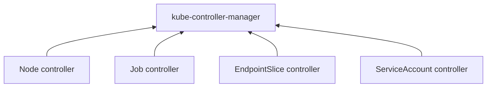
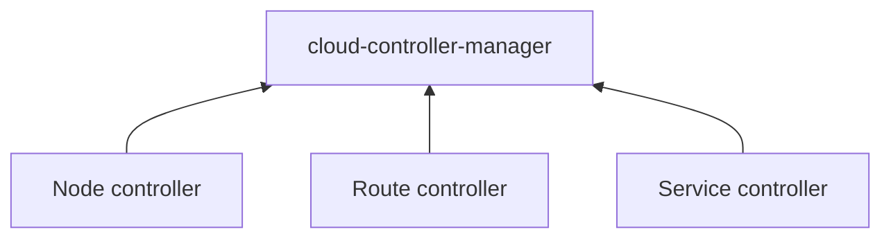
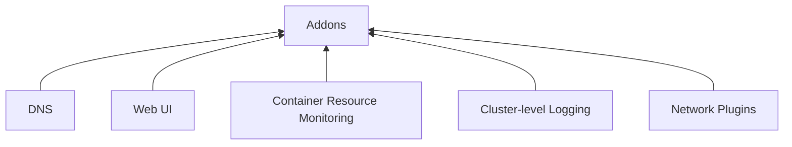

- [-Overview](#-overview)
- [Objects in kubernetes](#objects-in-kubernetes)
  - [Understanding Kubernetes objects](#understanding-kubernetes-objects)
    - [Object spec and status](#object-spec-and-status)
    - [Describing a Kubernetes object](#describing-a-kubernetes-object)
    - [Required fields](#required-fields)
- [Kubernetes Object Management](#kubernetes-object-management)
  - [Management techniques](#management-techniques)
- [Object Names and IDs](#object-names-and-ids)
    - [UIDs](#uids)
- [Labels and Selectors](#labels-and-selectors)
  - [Motivation](#motivation)
  - [Syntax and character set](#syntax-and-character-set)
  - [Label selectors](#label-selectors)
    - [Equality-based requirement](#equality-based-requirement)
    - [Set-based requirement(in cmd)](#set-based-requirementin-cmd)
  - [API](#api)
    - [LIST and WATCH filtering](#list-and-watch-filtering)
    - [Set references in API objects](#set-references-in-api-objects)
- [Kubernetes components](#kubernetes-components)
  - [Control panel components](#control-panel-components)
    - [kube-apiserver](#kube-apiserver)
    - [etcd](#etcd)
    - [kube-scheduler](#kube-scheduler)
    - [kube-controller-manager](#kube-controller-manager)
    - [cloud-controller-manager](#cloud-controller-manager)
  - [Node Components](#node-components)
    - [kubelet](#kubelet)
    - [kube-proxy](#kube-proxy)
    - [Container runtime](#container-runtime)
  - [Addons](#addons)
    - [DNS](#dns)
    - [Web UI (Dashboard)](#web-ui-dashboard)
    - [Container Resource Monitoring](#container-resource-monitoring)
    - [Cluster-level Logging](#cluster-level-logging)
    - [Network Plugins](#network-plugins)
- [The Kubernetes API](#the-kubernetes-api)
- [Cluster structure](#cluster-structure)
  - [Nodes](#nodes)
    - [Management](#management)
    - [Node status, hearbeats, controller,](#node-status-hearbeats-controller)
  - [Communication between Nodes and the Control Plane](#communication-between-nodes-and-the-control-plane)
  - [Controllers](#controllers)
  - [Leases](#leases)
- [-Workloads](#-workloads)
  - [pods](#pods)
- [Workload Management](#workload-management)
- [Deployment](#deployment)
  - [Use Case](#use-case)
- [ReplicaSet](#replicaset)
- [StatefulSet](#statefulset)
- [DaemonSet](#daemonset)
- [Jobs](#jobs)
- [CronJob](#cronjob)
- [-Services, Load Balancing, and Networking](#-services-load-balancing-and-networking)
- [Service](#service)
  - [Services in Kubernetes](#services-in-kubernetes)
  - [Defining a Service](#defining-a-service)
    - [Port definitions](#port-definitions)
    - [Services without selectors](#services-without-selectors)
    - [EndpointSlices](#endpointslices)
    - [Endpoints](#endpoints)
    - [Multi-port Services](#multi-port-services)
  - [Service type](#service-type)
  - [Headless Services](#headless-services)
  - [Discovering services](#discovering-services)
    - [Environment variables](#environment-variables)
    - [DNS](#dns-1)
- [~~Ingress~~](#ingress)
    - [Terminology](#terminology)
- [~~Ingress Controllers~~](#ingress-controllers)
- [Gateway API](#gateway-api)
    - [Resource model](#resource-model)
  - [EndpointSlices](#endpointslices-1)
    - [EndpointSlice API](#endpointslice-api)
- [DNS for Services and Pods](#dns-for-services-and-pods)
  - [Services](#services)
    - [A/AAAA records](#aaaaa-records)
    - [SRV records](#srv-records)
- [-Storage](#-storage)
- [Volumes](#volumes)
  - [Types of volumes](#types-of-volumes)
    - [secret](#secret)
  - [REF](#ref)
- [Projected Volumes](#projected-volumes)
- [-Configuration](#-configuration)
- [ConfigMaps](#configmaps)
- [Secrets](#secrets)
- [-Security](#-security)
- [Service Accounts](#service-accounts)
  - [What are service accounts?](#what-are-service-accounts)
    - [Default service accounts](#default-service-accounts)
  - [Use cases for Kubernetes service accounts](#use-cases-for-kubernetes-service-accounts)
- [Controlling Access to the Kubernetes API](#controlling-access-to-the-kubernetes-api)
  - [Transport security](#transport-security)
  - [Authentication](#authentication)
  - [Authorization](#authorization)
  - [Admission control](#admission-control)
  - [API Overview](#api-overview)
- [Role Based Access Control Good Practices](#role-based-access-control-good-practices)
- [-Reference](#-reference)
- [API Overview](#api-overview-1)
- [--API Access Control](#--api-access-control)
- [Using RBAC Authorization](#using-rbac-authorization)
  - [API objects](#api-objects)
    - [Role and ClusterRole](#role-and-clusterrole)
  - [RoleBinding and ClusterRoleBinding](#rolebinding-and-clusterrolebinding)
- [-- Kubernetes API](#---kubernetes-api)
- [Workload Resources](#workload-resources)
  - [Pod](#pod)
  - [PodTemplate](#podtemplate)
  - [ReplicationController](#replicationcontroller)
  - [Deployment](#deployment-1)
  - [ReplicaSet](#replicaset-1)
- [Service Resources](#service-resources)
  - [Service](#service-1)
- [Config and Storage Resources](#config-and-storage-resources)
  - [Volume](#volume)
- [Authentication Resources](#authentication-resources)
  - [ServiceAccount](#serviceaccount)
- [Common Definitions](#common-definitions)
  - [LabelSelector](#labelselector)
  - [ObjectMeta](#objectmeta)
- [-- Setup tools](#---setup-tools)
- [Kubeadm](#kubeadm)
- [-- Command line tool (kubectl)](#---command-line-tool-kubectl)
- [-------------------------------------------------](#-------------------------------------------------)
- [Api references](#api-references)


# -Overview

*Overview*

# Objects in kubernetes

[doc](https://kubernetes.io/docs/concepts/overview/working-with-objects/)

## Understanding Kubernetes objects

Kubernetes objects are persistent entities in the Kubernetes system. Kubernetes uses these  
entities <mark>to represent the state of your cluster</mark>.

To work with Kubernetes objects—whether to create, modify, or delete them—you'll need to use  
the <u>Kubernetes API</u>. 

### Object spec and status

`spec` providing a description of the characteristics you want the resource to have: its <u>desired state</u>.

The `status` describes the <u>current state</u> of the object, supplied and updated by the Kubernetes system and its components. 

### Describing a Kubernetes object

[doc](https://kubernetes.io/docs/concepts/overview/working-with-objects/#describing-a-kubernetes-object)


### Required fields

- apiVersion   
  Which version of the Kubernetes API you're using to create this object
- kind   
  What kind of object you want to create
- metadata   
  Data that helps uniquely identify the object, including a name string, UID, and optional namespace
- spec  
  What state you desire for <u>the object</u>


The [Kubernetes API Reference](https://kubernetes.io/docs/reference/kubernetes-api/) can help you find the <u>spec format</u> for all of the objects you can create using Kubernetes.

*Overview/Objects in kubernetes*

# Kubernetes Object Management

## Management techniques 

| Management technique             |     Operates on      | Recommended environment | Supported writers | Learning curve |
| :------------------------------- | :------------------: | :---------------------: | :---------------: | :------------: |
| Imperative commands              |     Live objects     |  Development projects   |        1+         |     Lowest     |
| Imperative object configuration  |   Individual files   |   Production projects   |         1         |    Moderate    |
| Declarative object configuration | Directories of files |   Production projects   |        1+         |    Highest     |

*Overview/Objects in kubernetes*

# Object Names and IDs

- Each object in your cluster <u>has a Name</u> that is unique for that <u>type of resource</u>.  
  Every Kubernetes object also has a <u>UID</u> that is unique across your whole cluster.

### UIDs

- A Kubernetes systems-generated string <u>to uniquely identify objects</u>.

*Overview/Objects in kubernetes*

# Labels and Selectors

- Labels are intended to be used to specify identifying attributes of objects.
- Labels can be used <u>to organize</u> and <u>to select</u> subsets of objects.

```yaml
"metadata": {
  "labels": {
    "key1" : "value1",
    "key2" : "value2"
  }
}
```


## Motivation 

- Labels enable users to map their <u>own organizational structures</u> onto system objects

## Syntax and character set 

- Labels are *key/value pairs*.  
  Valid label keys have two segments: <u>an optional prefix and name</u>, separated by a slash (/).  
  
  ---

  The prefix is optional. If specified, the prefix must be a DNS subdomain:  

- If the prefix is omitted  
  the label Key is presumed to be private to the user.  

  Automated system components (e.g. kube-scheduler, kube-controller-manager, kube-apiserver, kubectl, or other third-party automation) which add labels to end-user objects <u>must</u> specify a prefix.  
  
For example, here's a manifest for a Pod that has two labels environment: production and app: nginx:

```yaml
apiVersion: v1
kind: Pod
metadata:
  name: label-demo
  labels:
    environment: production
    app: nginx
spec:
  containers:
  - name: nginx
    image: nginx:1.14.2
    ports:
    - containerPort: 80
```

## Label selectors 

- Labels do not provide uniqueness.
- Via a label selector, the client/user can identify `a set of objects`.
- The API currently supports two types of selectors: <u>equality-based</u> and <u>set-based</u>.

### Equality-based requirement

Equality- or inequality-based requirements allow filtering by <u>label keys and values</u>. 

For example, the sample Pod below selects nodes with the label "accelerator=nvidia-tesla-p100".

```yaml
apiVersion: v1
kind: Pod
metadata:
  name: cuda-test
spec:
  containers:
    - name: cuda-test
      image: "registry.k8s.io/cuda-vector-add:v0.1"
      resources:
        limits:
          nvidia.com/gpu: 1
  nodeSelector:
    accelerator: nvidia-tesla-p100
```

### Set-based requirement(in cmd)

Set-based label requirements allow filtering keys according to <u>a set of values</u>.  
Three kinds of operators are supported: in,notin and exists (only the key identifier).  

For example:
```
environment in (production, qa)
tier notin (frontend, backend)
partition
!partition
```

- The first example selects all resources with key equal to `environment` and value equal to `production` or `qa`.
- The second example selects all resources with key equal to `tier` and values other than `frontend` and `backend`, and all resources with no labels with the tier key.
- The third example selects all resources including a label with key `partition`; no values are checked.
- The fourth example selects all resources without a label with key `partition`; no values are checked.

*Overview*

## API

### LIST and WATCH filtering

### Set references in API objects


# Kubernetes components

[doc](https://kubernetes.io/docs/concepts/overview/components/)


## Control panel components

>The control plane manages the worker nodes and the Pods in the cluster.  
>In production environments, the control plane usually runs across multiple  
>computers and a cluster usually runs multiple nodes, providing fault-tolerance  
>and high availability.

### kube-apiserver

* The API server is a component of the Kubernetes control plane   
  *that exposes the Kubernetes API*.  
  The API server is the front end for the Kubernetes control plane.

### etcd

* Consistent and highly-available <u>key value store</u> used as Kubernetes' backing store for all cluster data.

### kube-scheduler 

* Control plane component that watches for newly created Pods <u>with no assigned node</u>,  
  and selects a node for them to run on.

### kube-controller-manager 




- Node controller: Responsible for noticing and responding when <u>nodes</u> go down.
- Job controller: Watches for Job objects that represent <u>one-off tasks</u>, then creates Pods to run those tasks to completion.
- EndpointSlice controller: Populates EndpointSlice objects (to provide <u>a link</u> between Services and Pods).
- ServiceAccount controller: Create default <u>ServiceAccounts</u> for new namespaces.

### cloud-controller-manager 



 lets you link your cluster into your cloud provider's API, and separates out  
 the components that interact with that cloud platform *from components that  
 only interact with your cluster.*


- Node controller: For checking the cloud provider to determine if a node has been   
  deleted in the cloud after it - stops responding
- Route controller: For setting up routes in the underlying cloud infrastructure
- Service controller: For creating, updating and deleting cloud provider load balancers
---

## Node Components 

* Maintaining <u>running pods</u> and providing the Kubernetes <u>runtime environment</u>.

### kubelet

* It makes sure that containers are running in a Pod.

### kube-proxy 

 maintains <u>network rules</u> on nodes. These network rules allow network communication   
 to your Pods from network sessions <u>inside or outside</u> of your cluster.

### Container runtime 

---

## Addons



### DNS

Cluster DNS is a DNS server, in addition to the other DNS server(s) in your environment, which serves `DNS records` for Kubernetes services.

Containers started by Kubernetes automatically include this DNS server in their DNS searches.

### Web UI (Dashboard) 

### Container Resource Monitoring 

### Cluster-level Logging

### Network Plugins 

*Overview*

# The Kubernetes API

The Kubernetes API lets you query and manipulate the state of API objects in Kubernetes (for example: Pods,  
Namespaces, ConfigMaps, and Events).

Most operations can be performed through the kubectl command-line interface or other command-line tools, such  
as kubeadm, which in turn use the API. However, you can also access the API directly using REST calls.

# Cluster structure 

[link](https://kubernetes.io/docs/concepts/architecture/)

## Nodes

* Kubernetes runs your workload by placing containers into Pods to run on Nodes

### Management

* to have Nodes added to the API server
  1. a node self-registers to the control plane.
  2. manually add a Node object

### Node status, hearbeats, controller, 

---

## Communication between Nodes and the Control Plane

## Controllers

## Leases

# -Workloads

## pods

[link](https://kubernetes.io/docs/concepts/workloads/pods/)  

* Pods are the smallest deployable units of computing <u>that you can create and manage in Kubernetes</u>.
* A Pod (as in a pod of whales or pea pod) <u>is a group of one or more containers.</u>
* A Pod is similar to a set of containers with shared namespaces and shared filesystem volumes
* Quiting
  * The Pod remains on that node until the Pod finishes execution,  
    the Pod object is deleted, the Pod is evicted for lack of resources,  
    or the node fails.

*Workloads*

# Workload Management

[link](https://kubernetes.io/docs/concepts/workloads/controllers/)


# Deployment

A Deployment provides declarative <u>updates</u> for Pods and ReplicaSets.

## Use Case 

- Create a Deployment to rollout a ReplicaSet. 
- Declare the new state of the Pods
- 


# ReplicaSet

A ReplicaSet's purpose is to maintain `a stable set of replica Pods` running at any given time.  
As such, it is often used to guarantee the availability of a specified number of identical Pods.

# StatefulSet


# DaemonSet


# Jobs

- **Do what**  
  A Job *creates* one or more Pods and will continue to retry execution of the Pods  
  until a specified number of them successfully terminate. 

- **When completed**  
  As pods successfully complete, the Job *tracks* the successful completions.  
  When a specified number of successful completions is reached, the task (ie, Job) is complete.  
  Deleting a Job will clean up the Pods it created.

- **Resume**  
  Suspending a Job will delete its `active Pods` until the Job is resumed again.


# CronJob

A *CronJob* creates Jobs on a repeating schedule.

# -Services, Load Balancing, and Networking

[link](https://kubernetes.io/docs/concepts/services-networking/)

*Services, Load Balancing, and Networking/concepts*

# Service

- a `Service` is a method for <u>exposing a network application</u>  
  that is running as one or more Pods in your cluster.

## Services in Kubernetes 

- The Service API, part of Kubernetes, is an abstraction to help you  
  *expose groups of Pods* over a network. Each Service object defines  
  a logical set of endpoints (usually these endpoints are Pods) along  
  with a policy about how to make those pods accessible.

## Defining a Service

### Port definitions

Port definitions in Pods have names, and you can reference these names in the `targetPort` attribute of a Service.

For example  
we can bind the targetPort of the Service to the Pod port in the following way:
```yaml
apiVersion: v1
kind: Pod
metadata:
  name: nginx
  labels:
    app.kubernetes.io/name: proxy
spec:
  containers:
  - name: nginx
    image: nginx:stable
    ports:
      - containerPort: 80
        name: http-web-svc

---
apiVersion: v1
kind: Service
metadata:
  name: nginx-service
spec:
  selector:
    app.kubernetes.io/name: proxy
  ports:
  - name: name-of-service-port
    protocol: TCP
    port: 80
    targetPort: http-web-svc
``` 


### Services without selectors 

when used with a corresponding set of *EndpointSlices* objects and without a selector,  
the Service can abstract other kinds of backends,  
including ones that run outside the cluster.


<span style='font-size: 15px;'>**Reference external service**</span>  
- You want to have an external database cluster in production, but in your test environment you use your own databases.
- You want to point your Service to a Service in *a different Namespace* or on *another cluster*.
- You are migrating a workload to Kubernetes. While evaluating the approach, you run only *a portion of your backends* in Kubernetes.

### EndpointSlices 

EndpointSlices are objects that represent a subset (a slice) of *the backing network endpoints* for a Service.

### Endpoints

In the Kubernetes API, an Endpoints (the resource kind is plural) defines a list of network endpoints,  
typically referenced by a Service to define which Pods the traffic can be sent to.

### Multi-port Services 

When using multiple ports for a Service, you must give all of your ports names so that these are unambiguous.  

For example:
```yaml
apiVersion: v1
kind: Service
metadata:
  name: my-service
spec:
  selector:
    app.kubernetes.io/name: MyApp
  ports:
    - name: http
      protocol: TCP
      port: 80
      targetPort: 9376
    - name: https
      protocol: TCP
      port: 443
      targetPort: 9377
```

## Service type

For some parts of your application (for example, frontends)  
you may want to expose a Service onto `an external IP address`,  
one that's accessible from outside of your cluster.

available type values:

<span style='font-size: 15px;'>**ClusterIP**</span>  
Exposes the Service on a cluster-internal IP.  
This is the `default` that is used if you don't explicitly specify a type for a Service. 

You can expose the Service to the public internet using an Ingress or a Gateway.
 
<span style='font-size: 15px;'>**NodePort**</span>  
Exposes the Service on each Node's IP at a static port (the NodePort).


<span style='font-size: 15px;'>**LoadBalancer**</span>  
Exposes the Service externally using an external load balancer.  
Kubernetes does not directly offer a load balancing component;  
you must provide one, or you can integrate your Kubernetes cluster with a cloud provider.

<span style='font-size: 15px;'>**ExternalName**</span>  
Maps the Service to the contents of the externalName field (for example, to the hostname api.foo.bar.example).  
The mapping configures your cluster's DNS server to return a CNAME record with that external hostname value.  
No proxying of any kind is set up.


## Headless Services 

Sometimes you don't need load-balancing and a single Service IP. In this case, you can create what are  
termed headless Services, by explicitly specifying "None" for the cluster IP address (.spec.clusterIP).

## Discovering services 

For clients running *inside* your cluster, Kubernetes supports two primary modes of finding a Service:  
`environment variables` and `DNS`

### Environment variables 


### DNS

If DNS has been enabled throughout your cluster then all Pods should automatically be able to resolve Services by their `DNS name`.

The Kubernetes DNS server is the only way to access `ExternalName` Services. 

*Services, Load Balancing, and Networking/concepts*

# ~~Ingress~~

- An API object that manages external access to the services in a cluster, typically HTTP.

### Terminology
- Node
- Cluster
- Edge router
- Cluster network
- Service: that identifies a set of Pods using label selectors.

*Services, Load Balancing, and Networking/concepts*

# ~~Ingress Controllers~~

In order for the Ingress resource to work, the cluster must have an ingress controller running.

*Services, Load Balancing, and Networking/concepts*

# Gateway API

Make network services available by using an extensible, role-oriented, protocol-aware configuration  
mechanism. Gateway API is an add-on containing API kinds that provide dynamic infrastructure  
provisioning and advanced traffic routing.

- The NGINX Ingress Controller for Kubernetes works with the NGINX webserver (as a proxy).
- 
### Resource model 

- GatewayClass:  
  Defines a set of gateways with common configuration and managed by a controller that  
  implements the class.

- Gateway:  
  Defines an instance of traffic handling infrastructure, such as cloud load balancer.

- HTTPRoute:  
  Defines HTTP-specific rules for mapping traffic from a Gateway listener to a representation  
  of backend network endpoints. These endpoints are often represented as a Service.

## EndpointSlices

Kubernetes' EndpointSlice API provides a way to track network endpoints within a Kubernetes cluster.  
EndpointSlices offer a more scalable and extensible alternative to Endpoints.

### EndpointSlice API 

an EndpointSlice contains references to a set of network endpoints. 

*Services, Load Balancing, and Networking/concepts*

# DNS for Services and Pods

Kubernetes creates DNS records for Services and Pods. You can contact Services with consistent <u>*DNS names*</u> instead of IP addresses.

Kubelet configures Pods' DNS so that *running containers* can lookup Services by name rather than IP.

Services defined in the cluster are assigned DNS names. By default, a client Pod's DNS search list includes the Pod's own namespace and the cluster's default domain.

## Services 

### A/AAAA records 

### SRV records

SRV Records are created for named ports that are part of normal or headless services.

the SRV record has the form `_port-name._port-protocol.my-svc.my-namespace.svc.cluster-domain.example`


https://kubernetes.io/docs/tasks/administer-cluster/dns-debugging-resolution/

# -Storage

# Volumes

[link](https://kubernetes.io/docs/concepts/storage/volumes/)

A directory containing data, accessible to the containers in a pod.

## Types of volumes 

### secret 

A secret volume is used to pass sensitive information, such as passwords, to Pods.


## REF 

https://kubernetes.io/docs/reference/kubernetes-api/config-and-storage-resources/volume/#Volume

# Projected Volumes

A projected volume maps several existing volume sources into the same directory.


# -Configuration

*Configuration/concepts*

# ConfigMaps

A ConfigMap is an API object used to store non-confidential data in key-value pairs.  
Pods can consume ConfigMaps as environment variables, command-line arguments, or as configuration files in a volume.

# Secrets

A Secret is an object that contains a small amount of sensitive data such as a password, a token, or a key.


# -Security 

<https://kubernetes.io/docs/concepts/security/>

# Service Accounts

## What are service accounts? 

provides <u>a distinct identity</u> in a Kubernetes cluster.

Application Pods, system components, and entities inside and outside the cluster can use a specific ServiceAccount's credentials to identify as that `ServiceAccount`. 

### Default service accounts 

<span style='font-size: 15px;'>**need permissions**</span>  
The default service accounts in each namespace get no permissions by default other than the [default API discovery permissions](https://kubernetes.io/docs/reference/access-authn-authz/rbac/#default-roles-and-role-bindings) that Kubernetes grants to all authenticated principals if role-based access control (RBAC) is enabled.

<span style='font-size: 15px;'>**default assignment**</span>  
If you deploy a Pod in a namespace, and you don't manually assign a ServiceAccount to the Pod, Kubernetes assigns the default `ServiceAccount` for that namespace to the Pod.

## Use cases for Kubernetes service accounts 

https://kubernetes.io/docs/concepts/security/service-accounts/#use-cases


# Controlling Access to the Kubernetes API

Both human users and Kubernetes service accounts can be authorized for API access.  
When a request reaches the API, it goes through several stages,  
illustrated in the following diagram

<details>
<summary>Diagram </summary>


</details>

## Transport security 

using `TLS`.

## Authentication

configures the API server to run one or more Authenticator modules.  
Authenticators are described in more detail in [Authentication](https://kubernetes.io/docs/reference/access-authn-authz/authentication/).

<span style='font-size: 15px;font-weight: bold;'>Authentication modules include</span>
- client certificates
- password
- and plain tokens
- bootstrap tokens
- and JSON Web Tokens (used for service accounts).

<span style='font-size: 15px;'>**Multiple authentication modules**</span>  

can be specified, in which case each one is tried in sequence, until one of them succeeds.

## Authorization

The request is authorized if an existing policy declares that the user has permissions to complete the requested action.

## Admission control 

Admission Control modules are software modules that can modify or reject requests. 

## API Overview

You can use the Kubernetes API <ul>to read and write Kubernetes resource objects</u> via a Kubernetes API endpoint.

# Role Based Access Control Good Practices

Kubernetes RBAC is a key security control to ensure that cluster users and workloads have only the access to resources required to execute their roles.


# -Reference

*Reference/*

# API Overview

[link](https://kubernetes.io/docs/reference/using-api/)

The REST API is the fundamental fabric of Kubernetes. All operations and communications between components, and  
external user commands are REST API calls that the API Server handles. Consequently, everything in the Kubernetes  
platform is treated as an API object and has a corresponding entry in the API.

*Reference/*

# --API Access Control

*Reference/API Access Control*

# Using RBAC Authorization

https://kubernetes.io/docs/reference/access-authn-authz/rbac/

## API objects

### Role and ClusterRole

- Role, has namespace 
- ClusterRole, hasn't namespace 

<span style='font-size: 15px;'>**ClusterRoles uses**</span>  
1. define permissions on namespaced resources and be granted access within individual namespace(s)
2. define permissions on namespaced resources and be granted access across all namespaces
3. define permissions on cluster-scoped resources

---

If you want to define a role within a namespace, use a Role; if you want to define a role cluster-wide, use a ClusterRole.

## RoleBinding and ClusterRoleBinding 

A role binding grants the permissions defined in a role to a user or set of users.


# -- Kubernetes API

# Workload Resources

<https://kubernetes.io/docs/reference/kubernetes-api/workload-resources/>

## Pod

Pod is a collection of containers that can run on a host. This resource is created by clients and scheduled onto hosts.

- **spec**([PodSpec](https://kubernetes.io/docs/reference/kubernetes-api/workload-resources/pod-v1/#PodSpec))
  - **containers** ([]Container), required
    - **name**  
    - **image** (string)
    - **imagePullPolicy** (string)(optional)
    - **volumeMounts** ([]VolumeMount)
      - >Pod volumes to mount into the container's filesystem. Cannot be updated.
      - >VolumeMount describes a mounting of a Volume within a container.
        - **mountPath** (string), required
          - >Path within the container at which the volume should be mounted. Must not contain ':'.
        - **name** (string), required
        - **mountPropagation**  (string)
          - >mountPropagation determines how mounts are propagated from the host to container and the other way around.
          - >When not set, MountPropagationNone is used. This field is beta in 1.10.
  - **volumes**
    - >List of volumes that can be mounted by containers belonging to the pod.
    - see also[volume](#volume)
  - **serviceAccountName (string)**
    - >ServiceAccountName is the name of the ServiceAccount to use to run this pod. 
    - >https://kubernetes.io/docs/tasks/configure-pod-container/configure-service-account/

<span style='font-size: 15px;'>**[example](https://github.com/easegress-io/easegress/blob/main/docs/04.Cloud-Native/4.2.Gateway-API.md#deploy-backend-services)**</span>  
```yaml
spec:
  containers:
  - name: hello-v1
    image: "us-docker.pkg.dev/google-samples/containers/gke/hello-app:1.0"
    env:
    - name: "PORT"
      value: "50001"
  - name: hello-v2
    image: "us-docker.pkg.dev/google-samples/containers/gke/hello-app:2.0"
    env:
    - name: "PORT"
      value: "50002"
```

## PodTemplate

PodTemplate describes a template for creating copies of a predefined pod.

- template (PodTemplateSpec)  
    - metadata(ObjectMeta)
    - spec([PodSpec](#pod))

## ReplicationController

ReplicationController represents the configuration of a replication controller.

`spec (ReplicationControllerSpec) > template (PodTemplateSpec)`

## Deployment 

Deployment enables declarative updates for Pods and ReplicaSets.

- **spec** ([DeploymentSpec](https://kubernetes.io/docs/reference/kubernetes-api/workload-resources/deployment-v1/#DeploymentSpec)) 
  - **selector** ([LabelSelector](#labelselector)), required
    - >Label selector for pods. Existing ReplicaSets whose pods are selected by this will be the ones affected by this deployment. It must match the pod template's labels.
  - **template** ([PodTemplateSpec](#podtemplate))

## ReplicaSet

ReplicaSet ensures that a specified number of pod replicas are running at any given time.

- **spec** (ReplicaSetSpec)
  - **selector** (LabelSelector), required
    - >Selector is a label query over pods that should match the replica count.
  - **template** [PodTemplateSpec](#podtemplate)
  - **replicas** (int32)
    - >Replicas is the number of desired replicas. 
    - >This is a pointer to distinguish between explicit zero and unspecified. Defaults to 1. 

*Reference/Kubernetes API*

# Service Resources

<https://kubernetes.io/docs/reference/kubernetes-api/service-resources/>

## Service

Service is `a named abstraction of software service` (for example, mysql) consisting of local port (for example 3306) that the proxy listens on, and the selector that determines which pods will answer requests sent through the proxy.

- **spec** (ServiceSpec)
  - **ports** ([]ServicePort)
    - **ports.port** (int32), required
      - >The port that will be exposed by this service.
    - **ports.targetPort** (IntOrString)
      - >Number or name of the port to access on the pods targeted by the service.  
        Number must be in the range 1 to 65535. Name must be an IANA_SVC_NAME.  
        ---
        >If this is a string, it will be looked up as a named port in the target Pod's container ports.  
        If this is not specified, the value of the 'port' field is used (an identity map).  
        This field is ignored for services with clusterIP=None, and should be omitted or set equal to the 'port' field.
    - **ports.nodePort (int32)**
      - >The port on each node on which this service is exposed when type is NodePort or LoadBalancer.
    - **ports.name** (string)
  - **selector** (map[string]string)
    - Route service traffic to pods with label keys and values matching this selector.
  - **type** (string)
    - >type determines how the Service is exposed. Defaults to ClusterIP.
    - >"ExternalName" aliases this service to the specified externalName. Several other fields do not apply to ExternalName services.

A middle line in front of an item start, marking it and with followers as an item of an array.
```yaml
- port: 80
  protocol: TCP
  targetPort: 8080
```

*Reference/Kubernetes API*

# Config and Storage Resources

## Volume

[link](https://kubernetes.io/docs/reference/kubernetes-api/config-and-storage-resources/volume/)

Volume represents a named volume in a pod that may be accessed by any container in the pod.

# Authentication Resources 

## ServiceAccount

- **Example**  
  ```yaml
  apiVersion: v1
  kind: ServiceAccount
  metadata:
    name: bookinfo-details
    labels:
      account: details
  ```
  
# Common Definitions

[doc](https://kubernetes.io/docs/reference/kubernetes-api/common-definitions/)


## LabelSelector

A label selector is a label query over a set of resources.  
The result of `matchLabels` and `matchExpressions` are <mark>ANDed</mark>.  
An empty label selector matches <u>all objects</u>.  
A null label selector matches <u>no objects</u>.

- [selector](https://kubernetes.io/docs/reference/kubernetes-api/common-definitions/label-selector/)
  - matchExpressions ([]LabelSelectorRequirement)
    - > `matchExpressions` is a list of label selector requirements. The requirements are ANDed.  
        *A label selector requirement is a selector that contains `values`, `a key`, and `an operator` that relates the key and values.*
    - matchExpressions.key (string), required
      - >key is the label key that the selector applies to.
    - matchExpressions.operator (string), required
      - >operator represents a key's relationship to a set of values.  
        Valid operators are <u>In, NotIn, Exists and DoesNotExist</u>.
    - matchExpressions.values ([]string)
      - >values is an array of string values.  
        If the operator is `In` or `NotIn`, the values array must be non-empty.  
        If the operator is `Exists` or `DoesNotExist`, the values array must be empty.  
        This array is replaced during a strategic merge patch.
  - matchLabels (map[string]string)
    - >`matchLabels` is a map of {key,value} pairs.  
      A single {key,value} in the matchLabels map is equivalent to an element of `matchExpressions`,  
      whose key field is "`key`", the operator is "`In`", and the values array contains only "`value`".  
      The requirements are ANDed.


## ObjectMeta

[ObjectMeta](https://kubernetes.io/docs/reference/kubernetes-api/common-definitions/object-meta/#ObjectMeta) is metadata that <u>all persisted resources must have</u>, which includes all objects users must create.

- **name** (string)
  - >Name must be unique within a namespace.
  - >https://kubernetes.io/docs/concepts/overview/working-with-objects/names/#names
- **generateName** (string)
  - >GenerateName is an optional prefix, used by the server, to generate a unique name 
  - >ONLY IF the <mark>Name</mark> field has not been provided.
  - >If this field is used, the name returned to the client will be different than the name passed. This value will also be combined with <u>a unique suffix</u>. 
- **namespace** (string)
  - >Namespace defines the space within which each name must be unique.   
    An empty namespace is equivalent to the "default" namespace,
- **labels** (map[string]string)
  - >Map of string keys and values that can be used to organize and categorize (scope and select) objects. 


# -- Setup tools

# Kubeadm

*Reference/*

# -- Command line tool (kubectl) 

[link](https://kubernetes.io/docs/reference/kubectl/)

# -------------------------------------------------

# Api references

[doc](https://kubernetes.io/docs/reference/generated/kubernetes-api/v1.29/#api-overview)

Kubernetes resources and "records of intent" are all stored as <ul>API objects</u>.