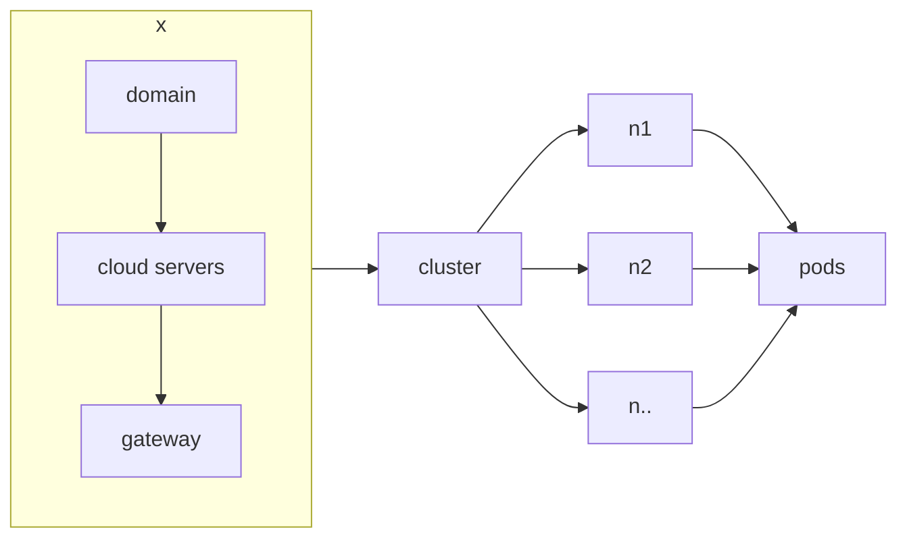
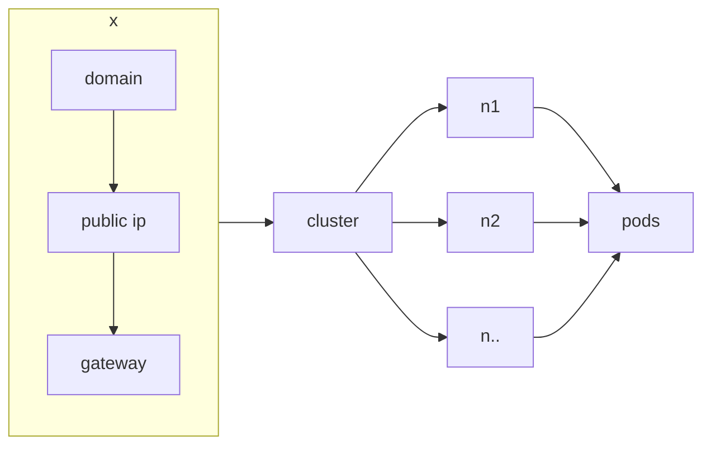
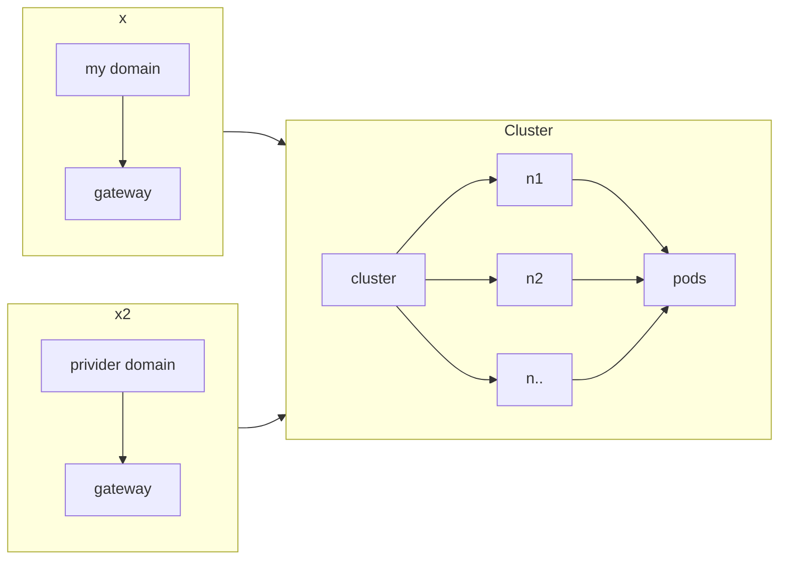

### VPC solution

```mermaid
flowchart  LR
    subgraph x
        direction TB
        domain --> 1[cloud servers] --> gateway
    end
    x --> cluster --> n1 & n2 & n.. --> pods

```

### Machine room solution

```mermaid
flowchart  LR
    subgraph x
        direction TB
        domain --> 1[public ip] --> gateway
    end
    x --> cluster --> n1 & n2 & n.. --> pods

```

### ingress solution

```mermaid
flowchart  LR
    subgraph x
        direction TB
        v[my domain] --> g1[gateway]
    end

    subgraph x2
        direction TB
        a[privider domain] --> g2[gateway]
    end

    subgraph Cluster
        direction LR
        cluster --> n1 & n2 & n.. --> pods
    end
    x --> Cluster

    x2 --> Cluster

```