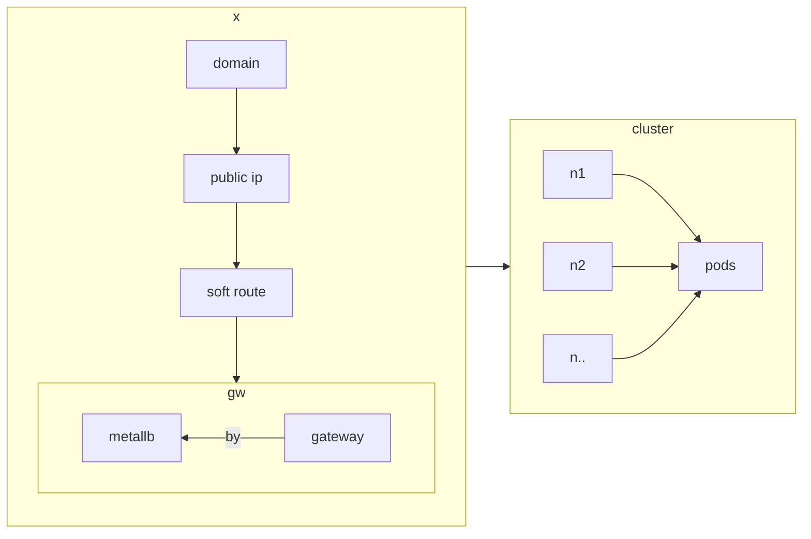
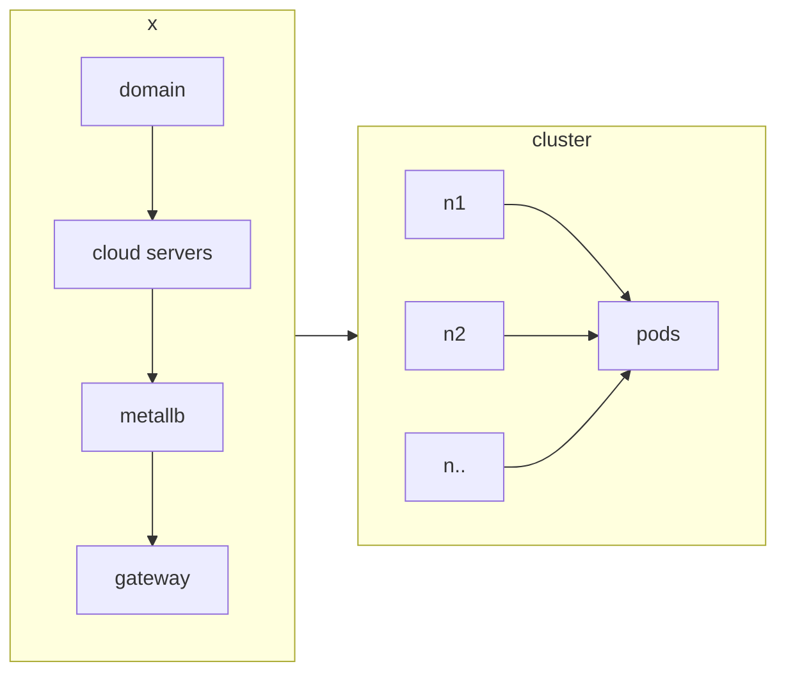
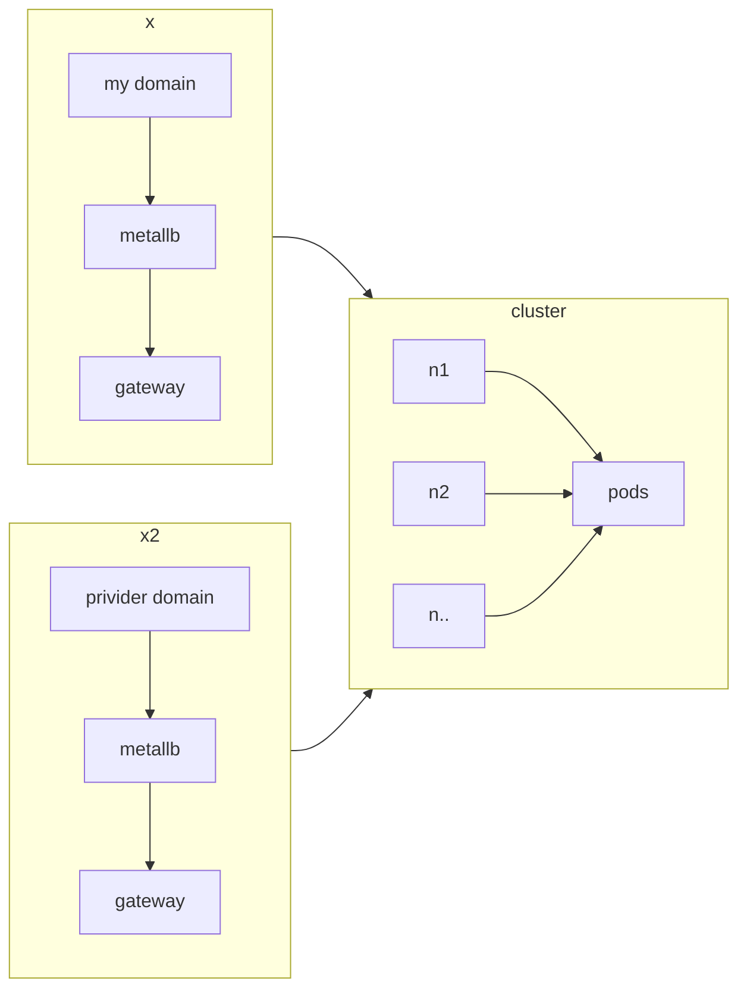

### Machine room solution

```mermaid
flowchart  LR
    subgraph x
        direction TB
        domain --> 1[public ip] --> sr[soft route] --> gw
    end
    subgraph gw
        direction RL
        gateway -->|by| metallb 
    end
    subgraph cluster
        direction LR
        n1 & n2 & n.. --> pods
    end
    x --> cluster

```

### VPC solution

```mermaid
flowchart  LR
    subgraph x
        direction TB
        domain --> 1[cloud servers] --> metallb --> gateway
    end
    subgraph cluster
        direction LR
        n1 & n2 & n.. --> pods
    end
    x --> cluster

```

### ingress solution

```mermaid
flowchart  LR
    subgraph x
        direction TB
        v[my domain] --> metallb --> g1[gateway]
    end

    subgraph x2
        direction TB
        a[privider domain] --> m2[metallb] --> g2[gateway]
    end

    subgraph cluster
        direction LR
        n1 & n2 & n.. --> pods
    end
    x --> cluster

    x2 --> cluster

```