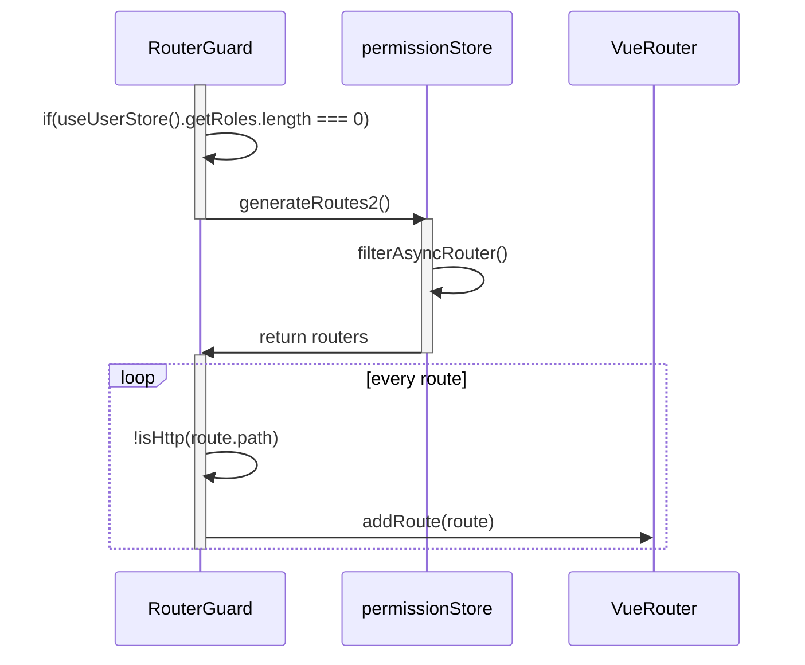

# Scaffold

## ES6

## Nodejs

## Package management 

look at `package.json`

[doc](https://docs.npmjs.com/cli/v6/configuring-npm/package-json/)

### upgrade

to "vue": "3.4.21",  
to "vue-types": "^5.1.1",

## Typescript

look at `tsconfig.json`

[tsconfig](https://www.typescriptlang.org/tsconfig/)

- Include - inclue   
  include Specifies an array of filenames or patterns to include in the program. These filenames are resolved relative to the directory containing the tsconfig.json file.

- Paths - paths  
  A series of entries which re-map imports to lookup locations relative to the baseUrl if set, or to the tsconfig file itself otherwise.

- Types - types  
  If types is specified, only packages listed will be included in the global scope.


## JSX and TSX

"@vitejs/plugin-vue-jsx": "^3.1.0",

imported at `vite.config.ts`, `import VueJsx from '@vitejs/plugin-vue-jsx'`


## Vite

[vite.config.js](https://cn.vitejs.dev/config/)

### .env

[check out](https://cn.vitejs.dev/guide/env-and-mode.html)

look at `.env` `.env.*`

## Vue 

## Vue router

### Gets routers starts with router guard

RouterGuard: `src\permission.ts`



### permissionStore

src\store\modules\permission.ts


## I18n

## Pinia

## Element plus

## Unocss 

### css tips

create `uno.config.ts`

## Postcss

## Scss

## Less

<span style='font-size: 15px;'>**namespace config**</span>  
at `src\styles\variables.module.less`
```javascript
// 命名空间
@adminNamespace: v;
// el命名空间
@elNamespace: el;

// 导出变量
:export {
  namespace: @adminNamespace;
  elNamespace: @elNamespace;
}
```

<span style='font-size: 15px;'>**vite.config.ts**</span>  
```javascript
css: {
  preprocessorOptions: {
    less: {
      additionalData: '@import "./src/styles/variables.module.less";',
      javascriptEnabled: true
    }
  }
},
```

## Global css

at `src\styles\var.css`

imported at `src\styles\index.less`

final import at `main.ts`, `import '@/styles/index.less'` 

## Configs

### ConfigGlobal

`src\components\ConfigGlobal\src\ConfigGlobal.vue`


# Configs

<details>
<summary>ran, update for package.json</summary>

```json
{
  "name": "ruoyi-vue-plus",
  "version": "5.0.0-SNAPSHOT",
  "description": "RuoYi-Vue-Plus多租户管理系统",
  "author": "LionLi",
  "license": "MIT",
  "scripts": {
    "dev": "vite serve --mode development",
    "serve": "vite serve --mode development",
    "start": "vite serve --mode development",
    "build:prod": "vite build --mode production &&vue-tsc --noEmit",
    "preview": "vite preview",
    "lint": "eslint src/**/*.{ts,js,vue} --fix",
    "prepare": "husky install",
    "prettier": "prettier --write ."
  },
  "repository": {
    "type": "git",
    "url": "https://gitee.com/JavaLionLi/plus-ui.git"
  },
  "dependencies": {
    "@iconify/iconify": "^3.1.1",
    "@iconify/vue": "^4.1.1",
    "@wangeditor/editor": "^5.1.23",
    "@wangeditor/editor-for-vue": "^5.1.10",
    "@zxcvbn-ts/core": "^3.0.4",

    "@amap/amap-jsapi-loader": "^1.0.1",
    "@codemirror/lang-html": "^6.4.3",
    "@codemirror/lang-javascript": "^6.1.8",
    "@codemirror/lang-json": "^6.0.1",
    "@codemirror/theme-one-dark": "^6.1.2",
    "@element-plus/icons-vue": "2.1.0",
    "@vueup/vue-quill": "1.1.0",
    "@vueuse/core": "^10.9.0",
    "Buffer": "^0.0.0",
    "animate.css": "^4.1.1",
    "await-to-js": "^3.0.0",
    "axios": "^1.6.8",
    "codemirror": "^6.0.1",
    "dayjs": "^1.11.10",
    "echarts": "5.4.1",
    "element-plus": "2.6.1",
    "file-saver": "2.0.5",
    "fuse.js": "6.6.2",
    "js-cookie": "3.0.1",
    "jsencrypt": "3.3.1",
    "mitt": "^3.0.1",
    "mqtt": "^4.3.7",
    "nprogress": "^0.2.0",
    "path-browserify": "1.0.1",
    "path-to-regexp": "6.2.0",
    "pinia": "^2.1.7",
    "pinia-plugin-persistedstate": "^3.2.1",
    "screenfull": "6.0.0",
    "vue": "3.4.21",
    "vue-draggable-plus": "^0.3.5",
    "vue-codemirror": "^6.1.1",
    "vue-cropper": "1.0.3",
    "vue-echarts": "^6.6.0",
    "vue-i18n": "9.10.2",
    "vue-json-pretty": "^2.4.0",
    "vue-router": "^4.3.0",
    "vue-types": "^5.1.1",
    "vue3-ts-jsoneditor": "^2.9.0",
    "web-storage-cache": "^1.1.1",
    "xgplayer": "^3.0.14",
    "monaco-editor": "^0.48.0"
  },
  "devDependencies": {
    "@commitlint/cli": "^19.2.1",
    "@commitlint/config-conventional": "^19.1.0",
    "@iconify/json": "^2.2.194",
    "@intlify/unplugin-vue-i18n": "^3.0.1",
    "@types/fs-extra": "^11.0.4",
    "@types/inquirer": "^9.0.7",
    "@types/lodash-es": "^4.17.12",
    "@types/mockjs": "^1.0.10",
    "@types/qrcode": "^1.5.5",
    "@types/qs": "^6.9.14",
    "@types/sortablejs": "^1.15.8",

    "@types/file-saver": "2.0.5",
    "@types/js-cookie": "3.0.3",
    "@types/node": "18.14.2",
    "@types/nprogress": "0.2.0",
    "@types/path-browserify": "^1.0.0",
    "@typescript-eslint/eslint-plugin": "5.56.0",
    "@typescript-eslint/parser": "5.56.0",
    "@unocss/preset-attributify": "^0.50.6",
    "@unocss/preset-icons": "^0.50.6",
    "@unocss/preset-uno": "^0.50.6",
    "@vitejs/plugin-vue": "^5.0.4",
    "@vitejs/plugin-vue-jsx": "^3.1.0",
    "@vue/compiler-sfc": "3.2.45",
    "autoprefixer": "^10.4.19",
    "chalk": "^5.3.0",
    "eslint": "8.36.0",
    "eslint-config-prettier": "8.8.0",
    "eslint-plugin-prettier": "4.2.1",
    "eslint-plugin-vue": "9.9.0",
    "fast-glob": "^3.2.11",
    "husky": "7.0.4",
    "inquirer": "^9.2.16",
    "less": "^4.2.0",
    "postcss": "^8.4.38",
    "postcss-html": "^1.6.0",
    "postcss-less": "^6.0.0",
    "prettier": "^3.2.5",
    "sass": "1.56.1",
    "rimraf": "^5.0.5",
    "rollup": "^4.13.0",
    "rollup-plugin-visualizer": "^5.12.0",
    "stylelint": "^16.2.1",
    "stylelint-config-html": "^1.1.0",
    "stylelint-config-recommended": "^14.0.0",
    "stylelint-config-standard": "^36.0.0",
    "stylelint-order": "^6.0.4",
    "terser": "^5.29.2",
    "typescript": "5.4.3",
    "unocss": "^0.58.6",
    "unplugin-auto-import": "0.17.6",
    "unplugin-icons": "0.15.1",
    "unplugin-vue-components": "0.23.0",
 
    "vite": "5.2.2",
    "vite-plugin-ejs": "^1.7.0",
    "vite-plugin-eslint": "^1.8.1",
    "vite-plugin-mock": "2.9.6",
    "vite-plugin-progress": "^0.0.7",
    "vite-plugin-purge-icons": "^0.10.0",
    "vite-plugin-style-import": "2.0.0",
    "vite-plugin-svg-icons": "^2.0.1",
    "vite-plugin-url-copy": "^1.1.4",
    "vite-plugin-compression": "0.5.1",
    "vite-plugin-vue-setup-extend": "^0.4.0",
    "vitest": "^0.29.7",
    "vue-eslint-parser": "9.1.0",
    "vue-tsc": "^2.0.7"
  }
}

```


</details>


<details>
<summary>ran, update for tsconfig.json</summary>

```javascript
{
  "compilerOptions": {
    "target": "es2022",
    "useDefineForClassFields": true,
    "module": "esnext",
    "moduleResolution": "node",
    "strict": true,
    "jsx": "preserve",
    "sourceMap": true,
    "resolveJsonModule": true,
    "esModuleInterop": true,
    "jsxImportSource": "vue",
    "lib": ["esnext", "dom"],
    "baseUrl": "./",
    "allowJs": true,
    "forceConsistentCasingInFileNames": true,
    "allowSyntheticDefaultImports": true,
    "strictFunctionTypes": false,
    "noUnusedLocals": true,
    "noUnusedParameters": true,
    "experimentalDecorators": true,
    "noImplicitAny": false,
    "skipLibCheck": true,
    "paths": {
      "@/*": ["src/*"]
    },
    // TODO to be updated
    "types": [      
      "vite/client"
    ],

  },
  "include": ["src/**/*.ts", "src/**/*.tsx", "src/**/*.vue", "src/types/**/*.d.ts"],
  "exclude": ["node_modules", "dist", "**/*.js"]
}

```


</details>


<details>
<summary>uno.config.ts</summary>

```javascript
import { defineConfig, toEscapedSelector as e, presetUno, presetIcons } from 'unocss'
import transformerVariantGroup from '@unocss/transformer-variant-group'
import { loadEnv } from 'vite'

const root = process.cwd()

const createPresetIcons = () => {
// ....
}

export default defineConfig({
// ...UnoCSS options
rules: [
    [
    /^overflow-ellipsis$/,
    ([], { rawSelector }) => {
        const selector = e(rawSelector)
        return `
${selector} {
text-overflow: ellipsis;
}
`
    }
    ],
    [
    /^custom-hover$/,
    ([], { rawSelector }) => {
        const selector = e(rawSelector)
        return `
${selector} {
display: flex;
height: 100%;
padding: 1px 10px 0;
cursor: pointer;
align-items: center;
transition: background var(--transition-time-02);
}
/* you can have multiple rules */
${selector}:hover {
background-color: var(--top-header-hover-color);
}
.dark ${selector}:hover {
background-color: var(--el-bg-color-overlay);
}
`
    }
    ],
    [
    /^layout-border__left$/,
    ([], { rawSelector }) => {
        const selector = e(rawSelector)
        return `
${selector}:before {
content: "";
position: absolute;
top: 0;
left: 0;
width: 1px;
height: 100%;
background-color: var(--el-border-color);
z-index: 3;
}
`
    }
    ],
    [
    /^layout-border__right$/,
    ([], { rawSelector }) => {
        const selector = e(rawSelector)
        return `
${selector}:after {
content: "";
position: absolute;
top: 0;
right: 0;
width: 1px;
height: 100%;
background-color: var(--el-border-color);
z-index: 3;
}
`
    }
    ],
    [
    /^layout-border__top$/,
    ([], { rawSelector }) => {
        const selector = e(rawSelector)
        return `
${selector}:before {
content: "";
position: absolute;
top: 0;
left: 0;
width: 100%;
height: 1px;
background-color: var(--el-border-color);
z-index: 3;
}
`
    }
    ],
    [
    /^layout-border__bottom$/,
    ([], { rawSelector }) => {
        const selector = e(rawSelector)
        return `
${selector}:after {
content: "";
position: absolute;
bottom: 0;
left: 0;
width: 100%;
height: 1px;
background-color: var(--el-border-color);
z-index: 3;
}
`
    }
    ]
],
// presets: [presetUno({ dark: 'class', attributify: false }), ...createPresetIcons()],
transformers: [transformerVariantGroup()],
content: {
    pipeline: {
    include: [/\.(vue|svelte|[jt]sx|mdx?|astro|elm|php|phtml|html|ts)($|\?)/]
    }
}
})

```


<details>
<summary>postcss.config.js</summary>

```javascript
module.exports = {
  plugins: {
    autoprefixer: {}
  }
}

```


</details>

</details>


# Css config

## unocss hints on vscode

from `vue-element-plus-admin` copies

0. updates version to `unocss`
1. add package
   ```json
   "@unocss/transformer-variant-group": "^0.58.6",
   ```
2. create and add content to `uno.config.ts`
   <details>
   <summary>uno.config.ts</summary>
   
   ```javascript
    import { defineConfig, toEscapedSelector as e, presetUno, presetIcons } from 'unocss'
    import transformerVariantGroup from '@unocss/transformer-variant-group'
    import { loadEnv } from 'vite'

    const root = process.cwd()

    const createPresetIcons = () => {
    // ....
    }

    export default defineConfig({
    // ...UnoCSS options
    rules: [
        [
        /^overflow-ellipsis$/,
        ([], { rawSelector }) => {
            const selector = e(rawSelector)
            return `
    ${selector} {
    text-overflow: ellipsis;
    }
    `
        }
        ],
        [
        /^custom-hover$/,
        ([], { rawSelector }) => {
            const selector = e(rawSelector)
            return `
    ${selector} {
    display: flex;
    height: 100%;
    padding: 1px 10px 0;
    cursor: pointer;
    align-items: center;
    transition: background var(--transition-time-02);
    }
    /* you can have multiple rules */
    ${selector}:hover {
    background-color: var(--top-header-hover-color);
    }
    .dark ${selector}:hover {
    background-color: var(--el-bg-color-overlay);
    }
    `
        }
        ],
        [
        /^layout-border__left$/,
        ([], { rawSelector }) => {
            const selector = e(rawSelector)
            return `
    ${selector}:before {
    content: "";
    position: absolute;
    top: 0;
    left: 0;
    width: 1px;
    height: 100%;
    background-color: var(--el-border-color);
    z-index: 3;
    }
    `
        }
        ],
        [
        /^layout-border__right$/,
        ([], { rawSelector }) => {
            const selector = e(rawSelector)
            return `
    ${selector}:after {
    content: "";
    position: absolute;
    top: 0;
    right: 0;
    width: 1px;
    height: 100%;
    background-color: var(--el-border-color);
    z-index: 3;
    }
    `
        }
        ],
        [
        /^layout-border__top$/,
        ([], { rawSelector }) => {
            const selector = e(rawSelector)
            return `
    ${selector}:before {
    content: "";
    position: absolute;
    top: 0;
    left: 0;
    width: 100%;
    height: 1px;
    background-color: var(--el-border-color);
    z-index: 3;
    }
    `
        }
        ],
        [
        /^layout-border__bottom$/,
        ([], { rawSelector }) => {
            const selector = e(rawSelector)
            return `
    ${selector}:after {
    content: "";
    position: absolute;
    bottom: 0;
    left: 0;
    width: 100%;
    height: 1px;
    background-color: var(--el-border-color);
    z-index: 3;
    }
    `
        }
        ]
    ],
    // presets: [presetUno({ dark: 'class', attributify: false }), ...createPresetIcons()],
    transformers: [transformerVariantGroup()],
    content: {
        pipeline: {
        include: [/\.(vue|svelte|[jt]sx|mdx?|astro|elm|php|phtml|html|ts)($|\?)/]
        }
    }
    })

   ```
   
   </details>

## Login.vue

<details>
<summary>code</summary>

```html
<script setup lang="ts">
import { LoginForm, RegisterForm } from './components'
import { ThemeSwitch } from '@/components/ThemeSwitch'
import { LocaleDropdown } from '@/components/LocaleDropdown'
import { useI18n } from '@/hooks/web/useI18n'
import { getCssVar, underlineToHump } from '@/utils'
import { useAppStore } from '@/store/modules/app'
import { useDesign } from '@/hooks/web/useDesign'
import { ref } from 'vue'
import { ElScrollbar } from 'element-plus'

const { getPrefixCls } = useDesign()

const prefixCls = getPrefixCls('login')

const appStore = useAppStore()

const { t } = useI18n()

const isLogin = ref(true)

const toRegister = () => {
  isLogin.value = false
}

const toLogin = () => {
  isLogin.value = true
}

const themeChange = () => {
  const color = getCssVar('--el-bg-color')
  appStore.setMenuTheme(color)
  appStore.setHeaderTheme(color)
}
</script>

<template>
  <div
    :class="prefixCls"
    class="h-[100%] relative lt-xl:bg-[var(--login-bg-color)] lt-sm:px-10px lt-xl:px-10px lt-md:px-10px"
  >
    <ElScrollbar class="h-full">
      <div class="relative flex mx-auto min-h-100vh">
        <div
          :class="`${prefixCls}__left flex-1 bg-gray-500 bg-opacity-20 relative p-30px lt-xl:hidden`"
        >
          <div class="flex items-center relative text-white">
            
            <span class="text-20px font-bold">{{ underlineToHump(appStore.getTitle) }}</span>
          </div>
          <div class="flex justify-center items-center h-[calc(100%-60px)]">
            <TransitionGroup
              appear
              tag="div"
              enter-active-class="animate__animated animate__bounceInLeft"
            >
              
              <div class="text-3xl text-white" key="2">{{ t('login.welcome') }}</div>
              <div class="mt-5 font-normal text-white text-14px" key="3">
                {{ t('login.message') }}
              </div>
            </TransitionGroup>
          </div>
        </div>
        <div class="flex-1 p-30px lt-sm:p-10px dark:bg-[var(--login-bg-color)] relative">
          <div
            class="flex justify-between items-center text-white at-2xl:justify-end at-xl:justify-end"
          >
            <div class="flex items-center at-2xl:hidden at-xl:hidden">
              
              <span class="text-20px font-bold">{{ underlineToHump(appStore.getTitle) }}</span>
            </div>

            <div class="flex justify-end items-center space-x-10px">
              <ThemeSwitch @change="themeChange" />
              <LocaleDropdown class="lt-xl:text-white dark:text-white" />
            </div>
          </div>
          <Transition appear enter-active-class="animate__animated animate__bounceInRight">
            <div
              class="h-auto flex items-center m-auto w-[100%] at-2xl:max-w-500px at-xl:max-w-500px at-md:max-w-500px at-lg:max-w-500px"
            >
              <LoginForm
                v-if="isLogin"
                class="p-20px h-auto m-auto lt-xl:rounded-3xl lt-xl:light:bg-white"
                @to-register="toRegister"
              />
              <RegisterForm
                v-else
                class="p-20px h-auto m-auto lt-xl:rounded-3xl lt-xl:light:bg-white"
                @to-login="toLogin"
              />
            </div>
          </Transition>
        </div>
      </div>
    </ElScrollbar>
  </div>
</template>

<style lang="less" scoped>
@prefix-cls: ~'@{adminNamespace}-login';

.@{prefix-cls} {
  overflow: auto;

  &__left {
    &::before {
      position: absolute;
      top: 0;
      left: 0;
      z-index: -1;
      width: 100%;
      height: 100%;
      background-image: url('@/assets/svgs/login-bg.svg');
      background-position: center;
      background-repeat: no-repeat;
      content: '';
    }
  }
}
</style>

```


</details>


