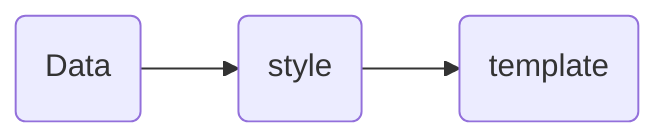

# fontend-v3.3

from <https://github.com/kailong321200875/vue-element-plus-admin/tree/master>

- check out
  - [vue3](../main-tech/vue3/vue3.md)
  - [vue-element-plus-admin.md](./vue-element-plus-admin.md)
  - [vue-element-plus-admin.md#analysis](./vue-element-plus-admin.md#analysis)

## Scaffold in this

### unplugin-vue-components

https://github.com/unplugin/unplugin-vue-components

```javascript
// vite.config.ts
import Components from 'unplugin-vue-components/vite'

export default defineConfig({
  plugins: [
    Components({ /* options */ }),
  ],
})
```


## Component structure

### Vue component

```
┌ └ ┐ ┘ ─ │ ├ ┤ ┬ ┴ ┼ 
```

- html
  - other vue components
  - other JSX/TSX components
- ts/js
- style

### JSX/TSX component

- js/ts
- vue component
- style

### A page

- vue compnents or jsx/tsx compnents
- api calling
- html
- js/ts
- style

## Layout Rendering

`src\layout\components\useRenderLayout.tsx`

https://github.com/kailong321200875/vue-element-plus-admin/blob/master/src/layout/components/useRenderLayout.tsx

four types layout
```javascript
renderClassic,
renderTopLeft,
renderTop,
renderCutMenus
```

---

rendering main tree menu, top tools head(breadcrumb, buttons, avatar), tags view in layout view.  
inside the `<AppView>` to render a specific layout, some sub pages.

```javascript
export const useRenderLayout = () => {
    ...
    const renderClassic = () => {
        return (
          <>
            <div
              class={[
                'absolute top-0 left-0 h-full layout-border__right',
                { '!fixed z-3000': mobile.value }
              ]}
            >
              {logo.value ? (
                <Logo
                  class={[
                    'bg-[var(--left-menu-bg-color)] relative',
                    {
                      '!pl-0': mobile.value && collapse.value,
                      'w-[var(--left-menu-min-width)]': appStore.getCollapse,
                      'w-[var(--left-menu-max-width)]': !appStore.getCollapse
                    }
                  ]}
                  style="transition: all var(--transition-time-02);"
                ></Logo>
              ) : undefined}
              <Menu class={[{ '!h-[calc(100%-var(--logo-height))]': logo.value }]}></Menu>
            </div>
            <div
              class={[
                `${prefixCls}-content`,
                'absolute top-0 h-[100%]',
                {
                  'w-[calc(100%-var(--left-menu-min-width))] left-[var(--left-menu-min-width)]':
                    collapse.value && !mobile.value && !mobile.value,
                  'w-[calc(100%-var(--left-menu-max-width))] left-[var(--left-menu-max-width)]':
                    !collapse.value && !mobile.value && !mobile.value,
                  'fixed !w-full !left-0': mobile.value
                }
              ]}
              style="transition: all var(--transition-time-02);"
            >
              <ElScrollbar
                v-loading={pageLoading.value}
                class={[
                  `${prefixCls}-content-scrollbar`,
                  {
                    '!h-[calc(100%-var(--top-tool-height)-var(--tags-view-height))] mt-[calc(var(--top-tool-height)+var(--tags-view-height))]':
                      fixedHeader.value
                  }
                ]}
              >
                <div
                  class={[
                    {
                      'fixed top-0 left-0 z-10': fixedHeader.value,
                      'w-[calc(100%-var(--left-menu-min-width))] !left-[var(--left-menu-min-width)]':
                        collapse.value && fixedHeader.value && !mobile.value,
                      'w-[calc(100%-var(--left-menu-max-width))] !left-[var(--left-menu-max-width)]':
                        !collapse.value && fixedHeader.value && !mobile.value,
                      '!w-full !left-0': mobile.value
                    }
                  ]}
                  style="transition: all var(--transition-time-02);"
                >
                  <ToolHeader
                    class={[
                      'bg-[var(--top-header-bg-color)]',
                      {
                        'layout-border__bottom': !tagsView.value
                      }
                    ]}
                  ></ToolHeader>

                  {tagsView.value ? (
                    <TagsView class="layout-border__top layout-border__bottom"></TagsView>
                  ) : undefined}
                </div>

                <AppView></AppView>
              </ElScrollbar>
            </div>
          </>
        )
      }
    }
    ...
  }
```


---

in `src\layout\Layout.vue`

listen to changing of layout setting
```javascript
...
const layout = computed(() => appStore.getLayout)
...
const renderLayout = () => {
  switch (unref(layout)) {
    case 'classic':
    case 'topLeft':
    case 'top':
    case 'cutMenu':
    default:
      break
  }
}
```


## Menu Rendering

Routers

`src\router\modules\remaining.ts`

`types\router.d.ts`

---

`src\layout\components\Menu\src\Menu.vue` 

By

```javascript
const { renderMenuItem } = useRenderMenuItem(unref(menuMode))
return renderMenuItem(unref(routers))
```

---

`src\layout\components\Menu\src\components\useRenderMenuItem.tsx`

render submenu recursively
```javascript
const renderMenuItem = (routers: AppRouteRecordRaw[], parentPath = '/') => {

  ...
  
  return (
    <ElSubMenu
      index={fullPath}
      popperClass={
        menuMode === 'vertical' ? `${preFixCls}--vertical` : `${preFixCls}--horizontal`
      }
    >
      {{
        title: () => renderMenuTitle(meta),
        default: () => renderMenuItem(v.children!, fullPath)
      }}
    </ElSubMenu>
  )

  ...

}

```
for
```javascript
{{
  title: () => renderMenuTitle(meta),
  default: () => renderMenuItem(v.children!, fullPath)
}}
```
see also
[rendering slots](https://vuejs.org/guide/extras/render-function.html#rendering-slots)


## Store (pinia)

`src\store`

https://github.com/kailong321200875/vue-element-plus-admin/blob/master/src/store/index.ts

## Other components having learnt

### src\views\system\user\index.vue

- UserAssignRoleForm.vue
- UserForm.vue
- UserImportForm.vue
- DeptTree.vue
  - handletree
  - watch(deptName)
  - nodeclick

### src\components\ContentWrap\src\ContentWrap.vue

- 
  ```html
  <template>
    <ElCard :class="[prefixCls, 'mb-15px']" shadow="never">
      <template v-if="title" #header>
        <div class="flex items-center">
          <ElTooltip v-if="message" effect="dark" placement="right">
            <template #content> </template>          
          </ElTooltip>
        </div>
      </template>
      <div>
        <slot></slot>
      </div>
    </ElCard>
  </template>
  ```  
  ```typescript
  import ContentWrap from './src/ContentWrap.vue'
  export { ContentWrap }
  ```
  
    - the name slots & default slot
    - reexport component for renaming

<br/><br/><br/><br/><br/><br/><br/><br/>

## 0.1 list

可参考 [系统管理 -> 岗位管理] 菜单：

- API 接口：`/src/api/system/post/index.ts`
- 列表界面：`/src/views/system/post/index.vue`
- 表单界面：`/src/views/system/post/PostForm.vue`



## 0.2 tree

可参考 [系统管理 -> 部门管理] 菜单：

- API 接口：`/src/api/system/dept/index.ts`
- 列表界面：`/src/views/system/dept/index.vue`
- 表单界面：`/src/views/system/dept/DeptForm.vue`


## Crud component 

[table component](https://kailong110120130.gitee.io/vue-element-plus-admin-doc/components/table.html)  

- UI `src\views\system\mail\account\index.vue`
- data `src\views\system\mail\account\account.data.ts`
