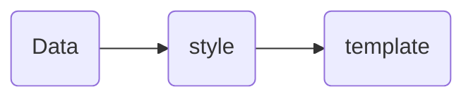

# ryvp-cloud-frontend.md

from <https://github.com/kailong321200875/vue-element-plus-admin/tree/master>


- check out
  - [vue3](../main-tech/vue3/vue3.md)
  - [vue-element-plus-admin.md](./vue-element-plus-admin.md)

## A .vue

```
html
----
ts
----
style
```


## 0.1 普通列表

可参考 [系统管理 -> 岗位管理] 菜单：

- API 接口：`/src/api/system/post/index.ts`
- 列表界面：`/src/views/system/post/index.vue`
- 表单界面：`/src/views/system/post/PostForm.vue`



## 0.2 树形列表

可参考 [系统管理 -> 部门管理] 菜单：

- API 接口：`/src/api/system/dept/index.ts`
- 列表界面：`/src/views/system/dept/index.vue`
- 表单界面：`/src/views/system/dept/DeptForm.vue`


## Crud component 

[table component](https://kailong110120130.gitee.io/vue-element-plus-admin-doc/components/table.html)  

- UI `src\views\system\mail\account\index.vue`
- data `src\views\system\mail\account\account.data.ts`
