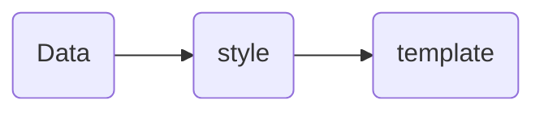

# ryvp-cloud-frontend.md

from <https://github.com/kailong321200875/vue-element-plus-admin/tree/master>

## AutoImport

<https://github.com/unplugin/unplugin-auto-import>

Configured at `build\vite\index.ts`
<details>
<summary>code</summary>

```javascript
return [
  ...,
  AutoImport({
    include: [
      /\.[tj]sx?$/, // .ts, .tsx, .js, .jsx
      /\.vue$/,
      /\.vue\?vue/, // .vue
      /\.md$/ // .md
    ],
    imports: [
      'vue',
      'vue-router',
      // 可额外添加需要 autoImport 的组件
      {
        '@/hooks/web/useI18n': ['useI18n'],
        '@/hooks/web/useMessage': ['useMessage'],
        '@/hooks/web/useTable': ['useTable'],
        '@/hooks/web/useCrudSchemas': ['useCrudSchemas'],
        '@/utils/formRules': ['required'],
        '@/utils/dict': ['DICT_TYPE']
      }
    ],
    dts: 'src/types/auto-imports.d.ts',
    resolvers: [ElementPlusResolver()],
    eslintrc: {
      enabled: false, // Default `false`
      filepath: './.eslintrc-auto-import.json', // Default `./.eslintrc-auto-import.json`
      globalsPropValue: true // Default `true`, (true | false | 'readonly' | 'readable' | 'writable' | 'writeable')
    }
  }),
  ...
]
```

</details>


included at `tsconfig.json`
```js
"include": [
  ...
  "src/types/auto-imports.d.ts",
  ...
],
```


## AutoImportComponent

<https://github.com/unplugin/unplugin-vue-components#configuration>

Configured at `build\vite\index.ts`
<details>
<summary>code</summary>

```javascript
return [
  ...,
  Components({
    // 生成自定义 `auto-components.d.ts` 全局声明
    dts: 'src/types/auto-components.d.ts',
    // 自定义组件的解析器
    resolvers: [ElementPlusResolver()],
    globs: ["src/components/**/**.{vue, md}", '!src/components/DiyEditor/components/mobile/**']
  }),
  ...  
]
```

</details>


included at `tsconfig.json`
```js
"include": [
  ...
  "src/types/auto-components.d.ts"
  ...
],
```

## 0.1 普通列表

可参考 [系统管理 -> 岗位管理] 菜单：

- API 接口：`/src/api/system/post/index.ts`
- 列表界面：`/src/views/system/post/index.vue`
- 表单界面：`/src/views/system/post/PostForm.vue`



## 0.2 树形列表

可参考 [系统管理 -> 部门管理] 菜单：

- API 接口：`/src/api/system/dept/index.ts`
- 列表界面：`/src/views/system/dept/index.vue`
- 表单界面：`/src/views/system/dept/DeptForm.vue`


## Crud component 

[table component](https://kailong110120130.gitee.io/vue-element-plus-admin-doc/components/table.html)  

- UI `src\views\system\mail\account\index.vue`
- data `src\views\system\mail\account\account.data.ts`
