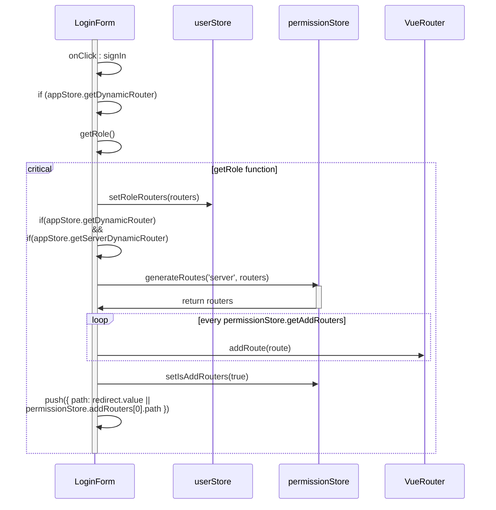
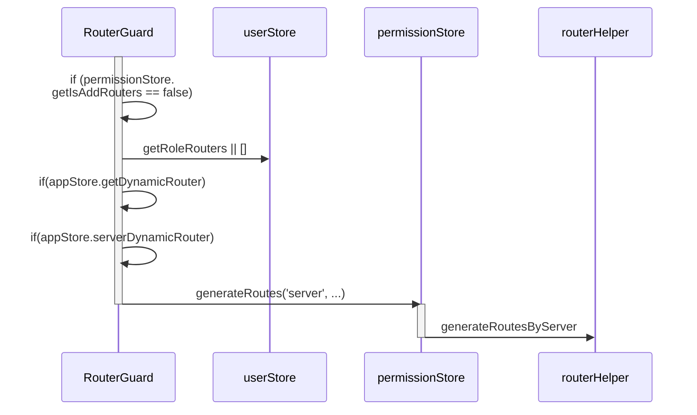
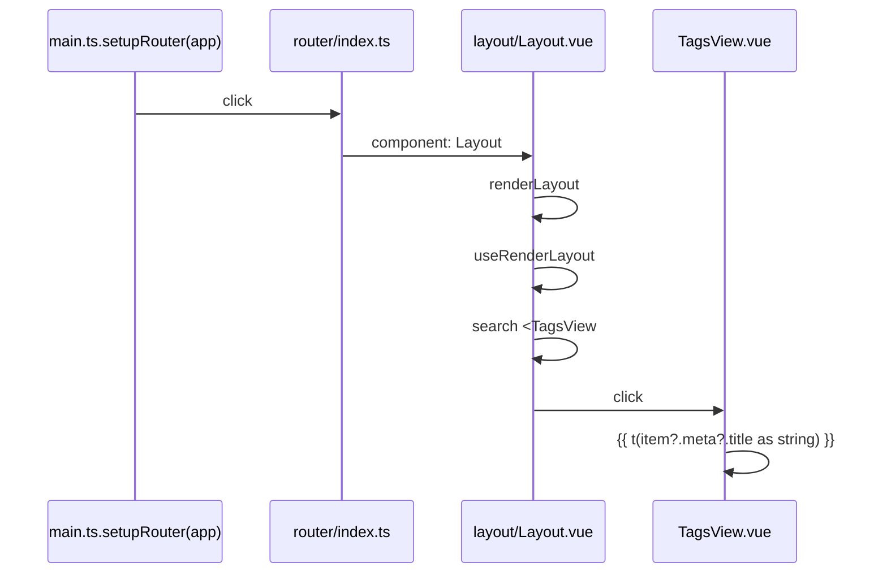

<https://github.com/kailong321200875/vue-element-plus-admin>

# Scaffold

## ES6

## Nodejs

## Package management 

look at `package.json`

[doc](https://docs.npmjs.com/cli/v6/configuring-npm/package-json/)

### upgrade

to "vue": "3.4.21",  
to "vue-types": "^5.1.1",

## Typescript

look at `tsconfig.json`

[tsconfig](https://www.typescriptlang.org/tsconfig/)


- Include - inclue   
  include Specifies an array of filenames or patterns to include in the program. These filenames are resolved relative to the directory containing the tsconfig.json file.

- Paths - paths  
  A series of entries which re-map imports to lookup locations relative to the baseUrl if set, or to the tsconfig file itself otherwise.

- Types - types  
  If types is specified, only packages listed will be included in the global scope.


## JSX and TSX

https://legacy.reactjs.org/docs/introducing-jsx.html

https://react.dev/learn/writing-markup-with-jsx

"@vitejs/plugin-vue-jsx": "^3.1.0",

imported at `vite.config.ts`, `import VueJsx from '@vitejs/plugin-vue-jsx'`


## Vite

[vite.config.js](https://cn.vitejs.dev/config/)

### .env

[check out](https://cn.vitejs.dev/guide/env-and-mode.html)

look at `.env` `.env.*`

type at `types/env.d.ts`

## Vue 

## Vue router

### Route store

`isAddRouters` allways is `false` whenever `usePermissionStore` to have been called.


```typescript
export const usePermissionStore = defineStore('permission', {
  state: (): PermissionState => ({
    routers: [],
    addRouters: [],
    isAddRouters: false,
    menuTabRouters: []
  }),
}
```


### Mock routers

`mock\role\index.mock.ts`

### Set routers when logined

from `src\views\Login\components\LoginForm.vue`



### Get routers from server, when logined but no routes

- RouterGuard: `src\permission.ts`



### Routes generating

`src\store\modules\permission.ts`

```javascript
generateRoutes(
  type: 'server' | 'frontEnd' | 'static',
  routers?: AppCustomRouteRecordRaw[] | string[]
)

routerMap = generateRoutesByServer(routers as AppCustomRouteRecordRaw[])
```

## I18n

## Pinia

## Element plus

## Unocss 

### css tips

create `uno.config.ts`

## Postcss

## Scss

## Less

<span style='font-size: 15px;'>**namespace config**</span>  
at `src\styles\variables.module.less`
```javascript
// 命名空间
@adminNamespace: v;
// el命名空间
@elNamespace: el;

// 导出变量
:export {
  namespace: @adminNamespace;
  elNamespace: @elNamespace;
}
```

<span style='font-size: 15px;'>**vite.config.ts**</span>  
```javascript
css: {
  preprocessorOptions: {
    less: {
      additionalData: '@import "./src/styles/variables.module.less";',
      javascriptEnabled: true
    }
  }
},
```


## Global css

at `src\styles\var.css`

imported at `src\styles\index.less`

final import at `main.ts`, `import '@/styles/index.less'` 

## Configs

### ConfigGlobal

`src\components\ConfigGlobal\src\ConfigGlobal.vue`

# Configs 

<details>
<summary>package.json</summary>

```javascript
{
  "name": "vue-element-plus-admin",
  "version": "2.7.0",
  "description": "一套基于vue3、element-plus、typesScript、vite4的后台集成方案。",
  "author": "Archer <502431556@qq.com>",
  "private": false,
  "scripts": {
    "i": "pnpm install",
    "dev": "pnpm vite --mode base",
    "ts:check": "pnpm vue-tsc --noEmit --skipLibCheck",
    "build:pro": "pnpm vite build --mode pro",
    "build:gitee": "pnpm vite build --mode gitee",
    "build:dev": "pnpm vite build --mode dev",
    "build:test": "pnpm vite build --mode test",
    "serve:pro": "pnpm vite preview --mode pro",
    "serve:dev": "pnpm vite preview --mode dev",
    "serve:test": "pnpm vite preview --mode test",
    "npm:check": "pnpx npm-check-updates -u",
    "clean": "pnpx rimraf node_modules",
    "clean:cache": "pnpx rimraf node_modules/.cache",
    "lint:eslint": "eslint --fix --ext .js,.ts,.vue ./src",
    "lint:format": "prettier --write --loglevel warn \"src/**/*.{js,ts,json,tsx,css,less,vue,html,md}\"",
    "lint:style": "stylelint --fix \"**/*.{vue,less,postcss,css,scss}\" --cache --cache-location node_modules/.cache/stylelint/",
    "lint:lint-staged": "lint-staged -c ./.husky/lintstagedrc.js",
    "prepare": "husky install",
    "p": "plop",
    "icon": "esno ./scripts/icon.ts"
  },
  "dependencies": {
    "@iconify/iconify": "^3.1.1",
    "@iconify/vue": "^4.1.1",
    "@vueuse/core": "^10.9.0",
    "@wangeditor/editor": "^5.1.23",
    "@wangeditor/editor-for-vue": "^5.1.10",
    "@zxcvbn-ts/core": "^3.0.4",
    "animate.css": "^4.1.1",
    "axios": "^1.6.8",
    "cropperjs": "^1.6.1",
    "dayjs": "^1.11.10",
    "driver.js": "^1.3.1",
    "echarts": "^5.5.0",
    "echarts-wordcloud": "^2.1.0",
    "element-plus": "2.6.1",
    "lodash-es": "^4.17.21",
    "mitt": "^3.0.1",
    "nprogress": "^0.2.0",
    "pinia": "^2.1.7",
    "pinia-plugin-persistedstate": "^3.2.1",
    "qrcode": "^1.5.3",
    "qs": "^6.12.0",
    "url": "^0.11.3",
    "vue": "3.4.21",
    "vue-draggable-plus": "^0.3.5",
    "vue-i18n": "9.10.2",
    "vue-json-pretty": "^2.4.0",
    "vue-router": "^4.3.0",
    "vue-types": "^5.1.1",
    "xgplayer": "^3.0.14",
    "monaco-editor": "^0.48.0"
  },
  "devDependencies": {
    "@commitlint/cli": "^19.2.1",
    "@commitlint/config-conventional": "^19.1.0",
    "@iconify/json": "^2.2.194",
    "@intlify/unplugin-vue-i18n": "^3.0.1",
    "@types/fs-extra": "^11.0.4",
    "@types/inquirer": "^9.0.7",
    "@types/lodash-es": "^4.17.12",
    "@types/mockjs": "^1.0.10",
    "@types/node": "^20.11.30",
    "@types/nprogress": "^0.2.3",
    "@types/qrcode": "^1.5.5",
    "@types/qs": "^6.9.14",
    "@types/sortablejs": "^1.15.8",
    "@typescript-eslint/eslint-plugin": "^7.3.1",
    "@typescript-eslint/parser": "^7.3.1",
    "@unocss/transformer-variant-group": "^0.58.6",
    "@vitejs/plugin-legacy": "^5.3.2",
    "@vitejs/plugin-vue": "^5.0.4",
    "@vitejs/plugin-vue-jsx": "^3.1.0",
    "autoprefixer": "^10.4.19",
    "chalk": "^5.3.0",
    "consola": "^3.2.3",
    "eslint": "^8.57.0",
    "eslint-config-prettier": "^9.1.0",
    "eslint-define-config": "^2.1.0",
    "eslint-plugin-prettier": "^5.1.3",
    "eslint-plugin-vue": "^9.23.0",
    "esno": "^4.7.0",
    "fs-extra": "^11.2.0",
    "husky": "^9.0.11",
    "inquirer": "^9.2.16",
    "less": "^4.2.0",
    "lint-staged": "^15.2.2",
    "mockjs": "^1.1.0",
    "plop": "^4.0.1",
    "postcss": "^8.4.38",
    "postcss-html": "^1.6.0",
    "postcss-less": "^6.0.0",
    "prettier": "^3.2.5",
    "rimraf": "^5.0.5",
    "rollup": "^4.13.0",
    "rollup-plugin-visualizer": "^5.12.0",
    "stylelint": "^16.2.1",
    "stylelint-config-html": "^1.1.0",
    "stylelint-config-recommended": "^14.0.0",
    "stylelint-config-standard": "^36.0.0",
    "stylelint-order": "^6.0.4",
    "terser": "^5.29.2",
    "typescript": "5.4.3",
    "unocss": "^0.58.6",
    "vite": "5.2.2",
    "vite-plugin-ejs": "^1.7.0",
    "vite-plugin-eslint": "^1.8.1",
    "vite-plugin-mock": "2.9.6",
    "vite-plugin-progress": "^0.0.7",
    "vite-plugin-purge-icons": "^0.10.0",
    "vite-plugin-style-import": "2.0.0",
    "vite-plugin-svg-icons": "^2.0.1",
    "vite-plugin-url-copy": "^1.1.4",
    "vue-tsc": "^2.0.7"
  },
  "packageManager": "pnpm@8.1.0",
  "engines": {
    "node": ">=18.0.0",
    "pnpm": ">=8.1.0"
  },
  "license": "MIT",
  "repository": {
    "type": "git",
    "url": "git+https://github.com/kailong321200875/vue-element-plus-admin.git"
  },
  "bugs": {
    "url": "https://github.com/kailong321200875/vue-element-plus-admin/issues"
  },
  "homepage": "https://github.com/kailong321200875/vue-element-plus-admin"
}

```


</details>


<details>
<summary>tsconfig.json</summary>

```javascript
{
  "compilerOptions": {
    "target": "esnext",
    "useDefineForClassFields": true,
    "module": "esnext",
    "moduleResolution": "node",
    "strict": true,
    "jsx": "preserve",
    "sourceMap": true,
    "resolveJsonModule": true,
    "esModuleInterop": true,
    "jsxImportSource": "vue",
    "lib": ["esnext", "dom"],
    "baseUrl": "./",
    "allowJs": true,
    "forceConsistentCasingInFileNames": true,
    "allowSyntheticDefaultImports": true,
    "strictFunctionTypes": false,
    "noUnusedLocals": true,
    "noUnusedParameters": true,
    "experimentalDecorators": true,
    "noImplicitAny": false,
    "skipLibCheck": true,
    "paths": {
      "@/*": ["src/*"]
    },
    "types": [
      "@intlify/unplugin-vue-i18n/types",
      "vite/client",
      "element-plus/global",
      "@types/qrcode",
      "vite-plugin-svg-icons/client"
    ]
  },
  "include": ["src", "types/**/*.d.ts", "mock/**/*.ts"]
  // "exclude": ["dist", "node_modules"]
}

```


</details>


<details>
<summary>vite.config.ts</summary>

```javascript
import { resolve } from 'path'
import { loadEnv } from 'vite'
import type { UserConfig, ConfigEnv } from 'vite'
import Vue from '@vitejs/plugin-vue'
import VueJsx from '@vitejs/plugin-vue-jsx'
import progress from 'vite-plugin-progress'
import EslintPlugin from 'vite-plugin-eslint'
import { ViteEjsPlugin } from 'vite-plugin-ejs'
import { viteMockServe } from 'vite-plugin-mock'
import PurgeIcons from 'vite-plugin-purge-icons'
import ServerUrlCopy from 'vite-plugin-url-copy'
import VueI18nPlugin from '@intlify/unplugin-vue-i18n/vite'
import { createSvgIconsPlugin } from 'vite-plugin-svg-icons'
import { createStyleImportPlugin, ElementPlusResolve } from 'vite-plugin-style-import'
import UnoCSS from 'unocss/vite'
import { visualizer } from 'rollup-plugin-visualizer'

// https://vitejs.dev/config/
const root = process.cwd()

function pathResolve(dir: string) {
  return resolve(root, '.', dir)
}

export default ({ command, mode }: ConfigEnv): UserConfig => {
  let env = {} as any
  const isBuild = command === 'build'
  if (!isBuild) {
    env = loadEnv(process.argv[3] === '--mode' ? process.argv[4] : process.argv[3], root)
  } else {
    env = loadEnv(mode, root)
  }
  return {
    base: env.VITE_BASE_PATH,
    plugins: [
      Vue({
        script: {
          // 开启defineModel
          defineModel: true
        }
      }),
      VueJsx(),
      ServerUrlCopy(),
      progress(),
      env.VITE_USE_ALL_ELEMENT_PLUS_STYLE === 'false'
        ? createStyleImportPlugin({
            resolves: [ElementPlusResolve()],
            libs: [
              {
                libraryName: 'element-plus',
                esModule: true,
                resolveStyle: (name) => {
                  if (name === 'click-outside') {
                    return ''
                  }
                  return `element-plus/es/components/${name.replace(/^el-/, '')}/style/css`
                }
              }
            ]
          })
        : undefined,
      EslintPlugin({
        cache: false,
        include: ['src/**/*.vue', 'src/**/*.ts', 'src/**/*.tsx'] // 检查的文件
      }),
      VueI18nPlugin({
        runtimeOnly: true,
        compositionOnly: true,
        include: [resolve(__dirname, 'src/locales/**')]
      }),
      createSvgIconsPlugin({
        iconDirs: [pathResolve('src/assets/svgs')],
        symbolId: 'icon-[dir]-[name]',
        svgoOptions: true
      }),
      PurgeIcons(),
      env.VITE_USE_MOCK === 'true'
        ? viteMockServe({
            ignore: /^\_/,
            mockPath: 'mock',
            localEnabled: !isBuild,
            prodEnabled: isBuild,
            injectCode: `
          import { setupProdMockServer } from '../mock/_createProductionServer'

          setupProdMockServer()
          `
          })
        : undefined,
      ViteEjsPlugin({
        title: env.VITE_APP_TITLE
      }),
      UnoCSS()
    ],

    css: {
      preprocessorOptions: {
        less: {
          additionalData: '@import "./src/styles/variables.module.less";',
          javascriptEnabled: true
        }
      }
    },
    resolve: {
      extensions: ['.mjs', '.js', '.ts', '.jsx', '.tsx', '.json', '.less', '.css'],
      alias: [
        {
          find: 'vue-i18n',
          replacement: 'vue-i18n/dist/vue-i18n.cjs.js'
        },
        {
          find: /\@\//,
          replacement: `${pathResolve('src')}/`
        }
      ]
    },
    esbuild: {
      pure: env.VITE_DROP_CONSOLE === 'true' ? ['console.log'] : undefined,
      drop: env.VITE_DROP_DEBUGGER === 'true' ? ['debugger'] : undefined
    },
    build: {
      target: 'es2015',
      outDir: env.VITE_OUT_DIR || 'dist',
      sourcemap: env.VITE_SOURCEMAP === 'true',
      // brotliSize: false,
      rollupOptions: {
        plugins: env.VITE_USE_BUNDLE_ANALYZER === 'true' ? [visualizer()] : undefined,
        // 拆包
        output: {
          manualChunks: {
            'vue-chunks': ['vue', 'vue-router', 'pinia', 'vue-i18n'],
            'element-plus': ['element-plus'],
            'wang-editor': ['@wangeditor/editor', '@wangeditor/editor-for-vue'],
            echarts: ['echarts', 'echarts-wordcloud']
          }
        }
      },
      cssCodeSplit: !(env.VITE_USE_CSS_SPLIT === 'false')
    },
    server: {
      port: 4000,
      proxy: {
        // 选项写法
        '/api': {
          target: 'http://127.0.0.1:8000',
          changeOrigin: true,
          rewrite: (path) => path.replace(/^\/api/, '')
        }
      },
      hmr: {
        overlay: false
      },
      host: '0.0.0.0'
    },
    optimizeDeps: {
      include: [
        'vue',
        'vue-router',
        'vue-types',
        'element-plus/es/locale/lang/zh-cn',
        'element-plus/es/locale/lang/en',
        '@iconify/iconify',
        '@vueuse/core',
        'axios',
        'qs',
        'echarts',
        'echarts-wordcloud',
        'qrcode',
        '@wangeditor/editor',
        '@wangeditor/editor-for-vue',
        'vue-json-pretty',
        '@zxcvbn-ts/core',
        'dayjs',
        'cropperjs'
      ]
    }
  }
}

```


</details>

<details>
<summary>.env.*</summary>


</details>


<details>
<summary>uno.config.ts</summary>

```javascript
import { defineConfig, toEscapedSelector as e, presetUno, presetIcons } from 'unocss'
import transformerVariantGroup from '@unocss/transformer-variant-group'
import { loadEnv } from 'vite'

const root = process.cwd()

const createPresetIcons = () => {
  const isBuild = !!process.argv[4]
  let env = {} as any
  if (!isBuild) {
    env = loadEnv(process.argv[3], root)
  } else {
    env = loadEnv(process.argv[4], root)
  }
  // @ts-ignore
  if (env.VITE_USE_ONLINE_ICON === 'true') {
    return []
  } else {
    return [
      presetIcons({
        prefix: ''
        // 由于默认加载的是所有的图标，启动会非常慢，可以在这里去加载需要的图标，确保启动速度
        // collections: {
        //   carbon: () => import('@iconify-json/carbon/icons.json').then(i => i.default),
        //   mdi: () => import('@iconify-json/mdi/icons.json').then(i => i.default),
        //   logos: () => import('@iconify-json/logos/icons.json').then(i => i.default),
        // }
      })
    ]
  }
}

export default defineConfig({
  // ...UnoCSS options
  rules: [
    [
      /^overflow-ellipsis$/,
      ([], { rawSelector }) => {
        const selector = e(rawSelector)
        return `
${selector} {
  text-overflow: ellipsis;
}
`
      }
    ],
    [
      /^custom-hover$/,
      ([], { rawSelector }) => {
        const selector = e(rawSelector)
        return `
${selector} {
  display: flex;
  height: 100%;
  padding: 1px 10px 0;
  cursor: pointer;
  align-items: center;
  transition: background var(--transition-time-02);
}
/* you can have multiple rules */
${selector}:hover {
  background-color: var(--top-header-hover-color);
}
.dark ${selector}:hover {
  background-color: var(--el-bg-color-overlay);
}
`
      }
    ],
    [
      /^layout-border__left$/,
      ([], { rawSelector }) => {
        const selector = e(rawSelector)
        return `
${selector}:before {
  content: "";
  position: absolute;
  top: 0;
  left: 0;
  width: 1px;
  height: 100%;
  background-color: var(--el-border-color);
  z-index: 3;
}
`
      }
    ],
    [
      /^layout-border__right$/,
      ([], { rawSelector }) => {
        const selector = e(rawSelector)
        return `
${selector}:after {
  content: "";
  position: absolute;
  top: 0;
  right: 0;
  width: 1px;
  height: 100%;
  background-color: var(--el-border-color);
  z-index: 3;
}
`
      }
    ],
    [
      /^layout-border__top$/,
      ([], { rawSelector }) => {
        const selector = e(rawSelector)
        return `
${selector}:before {
  content: "";
  position: absolute;
  top: 0;
  left: 0;
  width: 100%;
  height: 1px;
  background-color: var(--el-border-color);
  z-index: 3;
}
`
      }
    ],
    [
      /^layout-border__bottom$/,
      ([], { rawSelector }) => {
        const selector = e(rawSelector)
        return `
${selector}:after {
  content: "";
  position: absolute;
  bottom: 0;
  left: 0;
  width: 100%;
  height: 1px;
  background-color: var(--el-border-color);
  z-index: 3;
}
`
      }
    ]
  ],
  presets: [presetUno({ dark: 'class', attributify: false }), ...createPresetIcons()],
  transformers: [transformerVariantGroup()],
  content: {
    pipeline: {
      include: [/\.(vue|svelte|[jt]sx|mdx?|astro|elm|php|phtml|html|ts)($|\?)/]
    }
  }
})

```


</details>


# Wrappers

## HTML

- Vue
- Vue + JSX & Vue + TSX

## JS

- Typescript

## CSS

- Unocss
- Postcss
- Less
- Scss


# Analysis

## Layout structure

```
AppView.vue
—————————————————————————————————
|  <RouterView>  LayoutView     |
|  |—————————————————————————|  |  
|  |      |                  |  | 
|  |      |                  |  | 
|  | menu |  <RouterView>    |  | 
|  |      |                  |  | 
|  |      |  PagesView       |  | 
|  |      |                  |  | 
|  |—————————————————————————|  | 
|                               |
—————————————————————————————————
```


## Entry

### main.ts
```javascript
import App from './App.vue'
const setupAll = async () => {
  ...
  const app = createApp(App)
  app.mount('#app')
  ...
}
```


### App.vue

To render root layout at `<RouterView>`

```html
<template>
  <ConfigGlobal :size="currentSize">
    <RouterView :class="greyMode ? `${prefixCls}-grey-mode` : ''" />
  </ConfigGlobal>
</template>
```

### index.html

Entry point for vite-based app.

```html
<div id="app"><div>

<script type="module" src="/src/main.ts"></script>
```

## Layout.vue

`src\layout\components\useRenderLayout.tsx`

### Root layout structure
```javascript
const renderLayout = () => {
  switch (unref(layout)) {
    case 'classic':
      const { renderClassic } = useRenderLayout()
      return renderClassic()
    case 'topLeft':
      const { renderTopLeft } = useRenderLayout()
      return renderTopLeft()
    case 'top':
      const { renderTop } = useRenderLayout()
      return renderTop()
    case 'cutMenu':
      const { renderCutMenu } = useRenderLayout()
      return renderCutMenu()
    default:
      break
  }
}

export default defineComponent({
  name: 'Layout',
  setup() {
    return () => (
      <section id='jo-root' class={[prefixCls, `${prefixCls}__${layout.value}`, 'w-[100%] h-[100%] relative']}>
        {mobile.value && !collapse.value ? (
          <div
            class="absolute top-0 left-0 w-full h-full opacity-30 z-99 bg-[var(--el-color-black)]"
            onClick={handleClickOutside}
          ></div>
        ) : undefined}

        {renderLayout()}

        <Backtop></Backtop>

        <Setting></Setting>
      </section>
    )
  }
})
```

### Root layout renderer
```javascript
export const useRenderLayout = () => {

const renderClassic = () => {}
const renderTopLeft = () => {}
const renderTop = () => {}
const renderCutMenu = () => {}

}
```

<details>
<summary>renderClassic</summary>

```javascript
const renderClassic = () => {
    return (
      <>
        <div
          id='jo-left'
          class={[
            'absolute top-0 left-0 h-full layout-border__right',
            { '!fixed z-3000': mobile.value }
          ]}
        >
          {logo.value ? (
            <Logo
              class={[
                'bg-[var(--left-menu-bg-color)] relative',
                {
                  '!pl-0': mobile.value && collapse.value,
                  'w-[var(--left-menu-min-width)]': appStore.getCollapse,
                  'w-[var(--left-menu-max-width)]': !appStore.getCollapse
                }
              ]}
              style="transition: all var(--transition-time-02);"
            ></Logo>
          ) : undefined}
          <Menu class={[{ '!h-[calc(100%-var(--logo-height))]': logo.value }]}></Menu>
        </div>
        <div
          id='jo-right'
          class={[
            `${prefixCls}-content`,
            'absolute top-0 h-[100%]',
            {
              'w-[calc(100%-var(--left-menu-min-width))] left-[var(--left-menu-min-width)]':
                collapse.value && !mobile.value && !mobile.value,
              'w-[calc(100%-var(--left-menu-max-width))] left-[var(--left-menu-max-width)]':
                !collapse.value && !mobile.value && !mobile.value,
              'fixed !w-full !left-0': mobile.value
            }
          ]}
          style="transition: all var(--transition-time-02);"
        >
          <ElScrollbar
            v-loading={pageLoading.value}
            class={[
              `${prefixCls}-content-scrollbar`,
              {
                '!h-[calc(100%-var(--top-tool-height)-var(--tags-view-height))] mt-[calc(var(--top-tool-height)+var(--tags-view-height))]':
                  fixedHeader.value
              }
            ]}
          >
            <div
              class={[
                {
                  'fixed top-0 left-0 z-10': fixedHeader.value,
                  'w-[calc(100%-var(--left-menu-min-width))] !left-[var(--left-menu-min-width)]':
                    collapse.value && fixedHeader.value && !mobile.value,
                  'w-[calc(100%-var(--left-menu-max-width))] !left-[var(--left-menu-max-width)]':
                    !collapse.value && fixedHeader.value && !mobile.value,
                  '!w-full !left-0': mobile.value
                }
              ]}
              style="transition: all var(--transition-time-02);"
            >
              <ToolHeader
                class={[
                  'bg-[var(--top-header-bg-color)]',
                  {
                    'layout-border__bottom': !tagsView.value
                  }
                ]}
              ></ToolHeader>

              {tagsView.value ? (
                <TagsView class="layout-border__bottom layout-border__top"></TagsView>
              ) : undefined}
            </div>

            <AppView></AppView>
          </ElScrollbar>
        </div>
      </>
    )
  }
```


</details>


<details>
<summary>AppView.vue</summary>

```html
<script setup lang="ts">
import { useTagsViewStore } from '@/store/modules/tagsView'
import { useAppStore } from '@/store/modules/app'
import { Footer } from '@/components/Footer'
import { computed } from 'vue'

const appStore = useAppStore()

const footer = computed(() => appStore.getFooter)

const tagsViewStore = useTagsViewStore()

const getCaches = computed((): string[] => {
  return tagsViewStore.getCachedViews
})
</script>

<template>
  <section
    :class="[
      'flex-1 p-[var(--app-content-padding)] w-[calc(100%-var(--app-content-padding)-var(--app-content-padding))] bg-[var(--app-content-bg-color)] dark:bg-[var(--el-bg-color)]'
    ]"
  >
    <router-view>
      <template #default="{ Component, route }">
        <keep-alive :include="getCaches">
          <component :is="Component" :key="route.fullPath" />
        </keep-alive>
      </template>
    </router-view>
  </section>
  <Footer v-if="footer" />
</template>

```


</details>


### Solved

- structure of layout and router view 

## Pages view

`src\layout\components\AppView.vue`

<span style='font-size: 15px;'>**for all children**</span>  

```html
<router-view>
  <template #default="{ Component, route }">
    <keep-alive :include="getCaches">
      <component :is="Component" :key="route.fullPath" />
    </keep-alive>
  </template>
</router-view>
```


## Pinia

<span style='font-size: 15px;'>**Initialization**</span>  

`src\store\index.ts`

<span style='font-size: 15px;'>**concrete store**</span>  

`src\store\modules\*`

## Router

`src\router\index.ts`

## Router guard

`src\permission.ts`

### Router filtering

```javascript
router.beforeEach(async (to, from, next) => {
  ...
  if (appStore.getDynamicRouter) {
  appStore.serverDynamicRouter
    ? await permissionStore.generateRoutes('server', roleRouters as AppCustomRouteRecordRaw[])
    : await permissionStore.generateRoutes('frontEnd', roleRouters as string[])
  } else {
    await permissionStore.generateRoutes('static')
  }
  ...
}
```

### Update routers

`src\store\modules\permission.ts`

```javascript
actions: {
  generateRoutes(
    type: 'server' | 'frontEnd' | 'static',
    routers?: AppCustomRouteRecordRaw[] | string[]
  ): Promise<unknown> {
    ...
  }
}
```

### Solved

- Pinia uses
- Router filtering


## Login.vue

<span style='font-size: 15px;'>**Responsive**</span>  
```js
:class="`${prefixCls}__left flex-1 bg-gray-500 bg-opacity-20 relative p-30px lt-xl:hidden`"
```
here: `lt-xl:hidden`


<span style='font-size: 15px;'>**Get use info when logined**</span>  
```javascript
// 获取角色信息
const getRole = async () => {
  const formData = await getFormData<UserType>()
  const params = {
    roleName: formData.username
  }
  const res =
    appStore.getDynamicRouter && appStore.getServerDynamicRouter
      ? await getAdminRoleApi(params)
      : await getTestRoleApi(params)
  if (res) {
    const routers = res.data || []
    userStore.setRoleRouters(routers)
    appStore.getDynamicRouter && appStore.getServerDynamicRouter
      ? await permissionStore.generateRoutes('server', routers).catch(() => {})
      : await permissionStore.generateRoutes('frontEnd', routers).catch(() => {})

    permissionStore.getAddRouters.forEach((route) => {
      addRoute(route as RouteRecordRaw) // 动态添加可访问路由表
    })
    permissionStore.setIsAddRouters(true)
    push({ path: redirect.value || permissionStore.addRouters[0].path })
  }
}
```


### Solved

- responsive ui
  - `:class="`${prefixCls}__left flex-1 bg-gray-500 bg-opacity-20 relative p-30px lt-xl:hidden`"`
- unocss
  - `lt-xl:hidden`
- less 
  - `<style lang="less" scoped>`


## Menu.vue

file at `src\components\Menu\src\Menu.vue`

used at `src\layout\components\useRenderLayout.tsx`
```javascript
export const useRenderLayout = () => {
  // root layout
  const renderClassic = () => {
    return (
      <Menu class={[{ '!h-[calc(100%-var(--logo-height))]': logo.value }]}></Menu>
      )    
  }
}
```

### Toggle menu


<span style='font-size: 15px;'>**button open menu**</span>  

`src\layout\components\ToolHeader.vue`

```js
{layout.value !== 'top' ? (
          <div class="h-full flex items-center">
            {hamburger.value && layout.value !== 'cutMenu' ? (
              <Collapse class="custom-hover" color="var(--top-header-text-color)"></Collapse>
            ) : undefined}
            {breadcrumb.value ? <Breadcrumb class="<md:hidden"></Breadcrumb> : undefined}
          </div>
        ) : undefined}
```

<span style='font-size: 15px;'>**Watching changes**</span>  

changes `min-width` dynamically at `src\components\ConfigGlobal\src\ConfigGlobal.vue` by watching

```javascript
// 监听窗口变化
watch(
  () => width.value,
  (width: number) => {
    if (width < 768) {
      !appStore.getMobile ? appStore.setMobile(true) : undefined
      setCssVar('--left-menu-min-width', '0')
      appStore.setCollapse(true)
      appStore.getLayout !== 'classic' ? appStore.setLayout('classic') : undefined
    } else {
      appStore.getMobile ? appStore.setMobile(false) : undefined
      setCssVar('--left-menu-min-width', '64px')
    }
  },
  {
    immediate: true
  }
)
```

<span style='font-size: 15px;'>**Use dynamic width**</span>  

setting menu width dynamically at `src\components\Menu\src\Menu.vue`

```javascript
return () => (
      <div
        id={prefixCls}
        class={[
          `${prefixCls} ${prefixCls}__${unref(menuMode)}`,
          'h-[100%] overflow-hidden flex-col bg-[var(--left-menu-bg-color)]',
          {
            'w-[var(--left-menu-min-width)]': unref(collapse) && unref(layout) !== 'cutMenu',
            'w-[var(--left-menu-max-width)]': !unref(collapse) && unref(layout) !== 'cutMenu'
          }
        ]}
      >
        {renderMenuWrap()}
      </div>
    )
```

## Cut menu



add tag
```javascript
watch(
  () => currentRoute.value,
  () => {
    addTags()
    moveToCurrentTag()
  }
)
```
