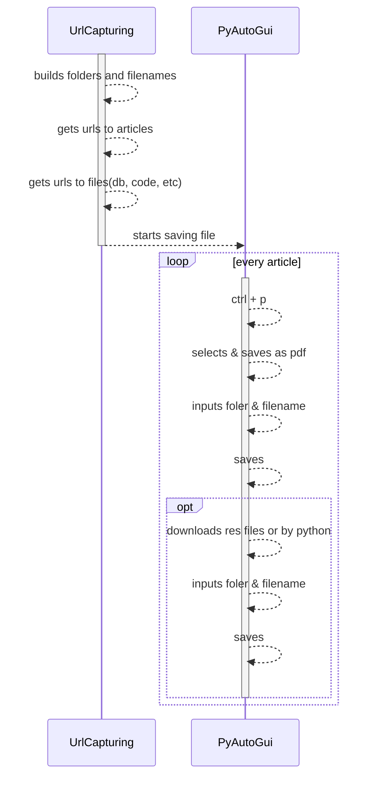
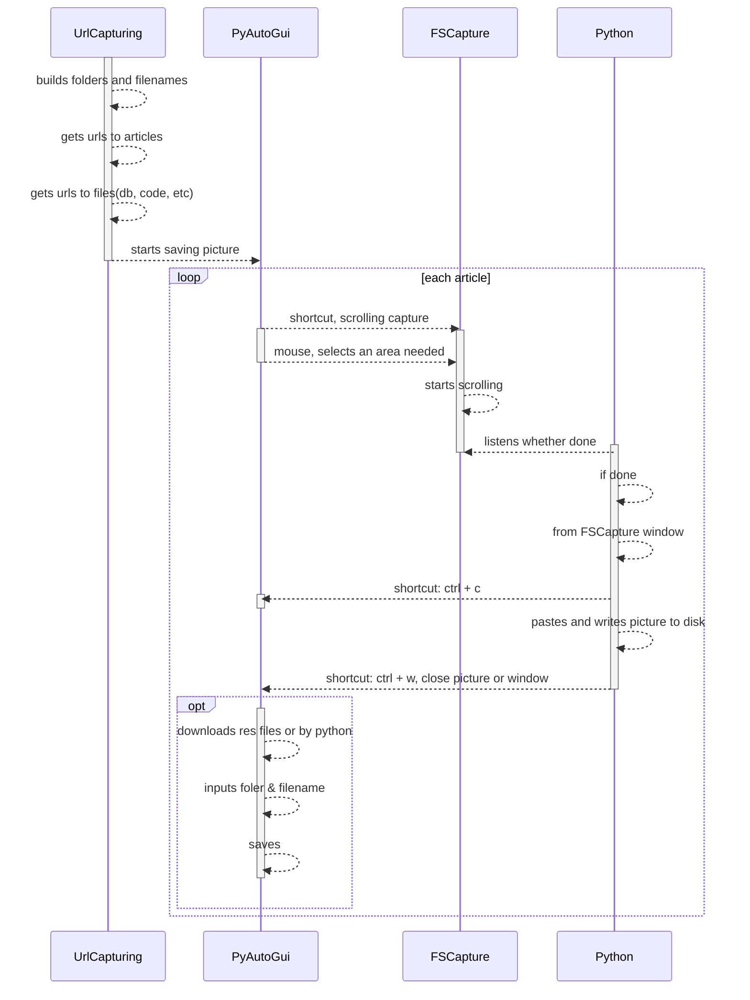

# z-article-capturing.md

## Debugging chain of responsibility 

- executed as sorted in list

## To save as pdf

### Tools

|comp|version|description
|---:|:---|---|
|python||script|
|firefox||logining & reuse page|
|selenium||open controlled browser|
|pyautogui||automation|


### Folder structure 

```json
[
    {
        "folder":"",
        "files":[
            {
                "url":"",
                "filename":"",
                "resFolder":"",
                "resFiles":[
                    {
                        "filename":"",
                        "url":""
                    }
                ]
            }
        ]
    }
]
```

### Diagram 



## To save as picture

### Tools

|comp|version|description
|---:|:---|---|
|python||script|
|firefox||logining & reuse page|
|selenium||open controlled browser|
|pyautogui||automation|
|coordination got||screen position|
|fscapture||scrolling capture|

### Diagram 


