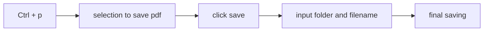
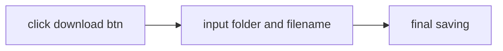
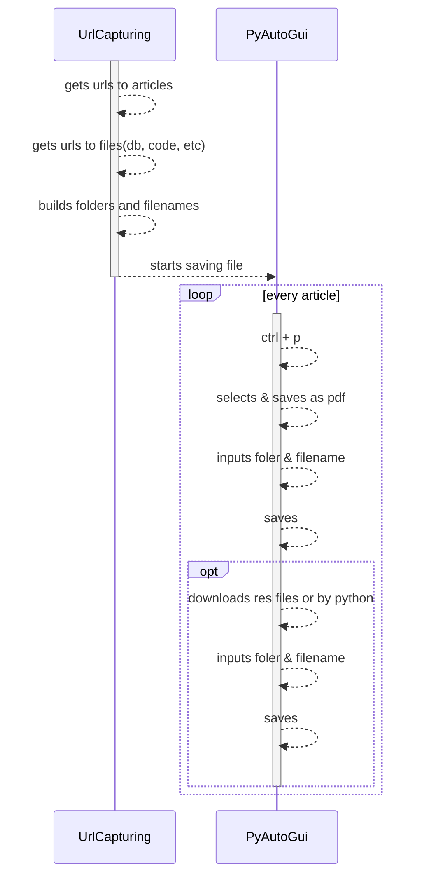
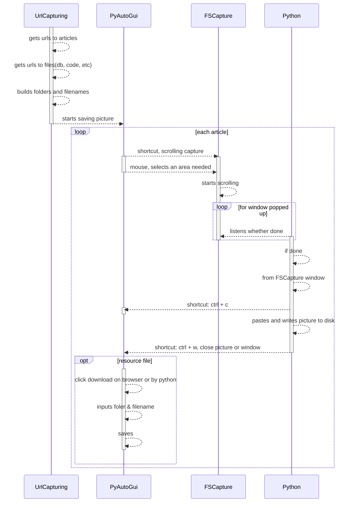

# z-article-capturing.md

## Debugging chain of responsibility 

- executed as sorted in list

## To save as pdf

### Tools

|      comp | version | description             |
| --------: | :------ | ----------------------- |
|    python |         | script                  |
|   firefox |         | logining & reuse page   |
|  selenium |         | open controlled browser |
| pyautogui |         | automation              |


### Folder structure 

```yaml
folder
    files(pdf)
        resFolder
            resFiles
```

### Chain of responsibility by pyautogui

<span style='font-size: 15px;'>**Save pdf chain**</span>  


<span style='font-size: 15px;'>**Save res file chain**</span>  



### Diagram 



## To save as picture

### Tools

|             comp | version | description             |
| ---------------: | :------ | ----------------------- |
|           python |         | script                  |
|          firefox |         | logining & reuse page   |
|         selenium |         | open controlled browser |
|        pyautogui |         | automation              |
| coordination got |         | screen position         |
|        fscapture |         | scrolling capture       |

### Diagram 


