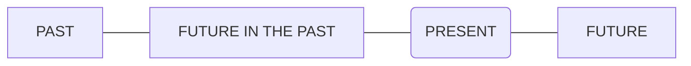

- [--Basic](#--basic)
- [Soundmark](#soundmark)
- [-Imperative verbs](#-imperative-verbs)
- [-Imperative sentences](#-imperative-sentences)
- [-Determiners](#-determiners)
- [-Articles](#-articles)
- [A or an?](#a-or-an)
- [Take note: school/university, etc.](#take-note-schooluniversity-etc)
- [-Personal forms](#-personal-forms)
- [-Question forms](#-question-forms)
- [Meaning and Use](#meaning-and-use)
- [Asking questions with ‘how’](#asking-questions-with-how)
- [-Comparatives and Superlatives](#-comparatives-and-superlatives)
- [-State verbs and action verbs](#-state-verbs-and-action-verbs)
- [meaning and use](#meaning-and-use-1)
- [-Quantifiers: all, every, each, both, neither, either](#-quantifiers-all-every-each-both-neither-either)
- [Meaning and use: all, every each](#meaning-and-use-all-every-each)
- [Meaning and use of both, neither, either](#meaning-and-use-of-both-neither-either)
- [-Subject-object questions](#-subject-object-questions)
- [Meaning and use](#meaning-and-use-2)
- [-'Used to' and 'would'](#-used-to-and-would)
  - [Meaning and use](#meaning-and-use-3)
  - [Used to - Habit](#used-to---habit)
  - [Used to - State](#used-to---state)
  - [Would - Habit (not for states)](#would---habit-not-for-states)
- [-Tenses](#-tenses)
- [Past tenses](#past-tenses)
  - [Simple past](#simple-past)
  - [Past perfect](#past-perfect)
  - [Past continuous](#past-continuous)
  - [Past perfect continuous](#past-perfect-continuous)
- [Present tenses](#present-tenses)
  - [Simple present](#simple-present)
  - [Present perfect](#present-perfect)
  - [Present continuous](#present-continuous)
  - [Present perfect continuous](#present-perfect-continuous)
- [Future tenses](#future-tenses)
  - [Simple future](#simple-future)
  - [Future perfect](#future-perfect)
  - [Future continuous](#future-continuous)
  - [Future perfect continuous](#future-perfect-continuous)
- [Future in the past](#future-in-the-past)
- [-Conditionals](#-conditionals)
- [Past Conditionals](#past-conditionals)
  - [Past Real Conditional](#past-real-conditional)
    - [IMPORTANT Used to](#important-used-to)
    - [IMPORTANT If / When](#important-if--when)
  - [Past Unreal Conditional](#past-unreal-conditional)
  - [Past Unreal Conditional-Patch](#past-unreal-conditional-patch)
    - [Could have + past participle](#could-have--past-participle)
    - [Should have + past participle](#should-have--past-participle)
    - [Would have + past participle](#would-have--past-participle)
- [Present Conditionals](#present-conditionals)
  - [Present Real Conditional](#present-real-conditional)
  - [Present Unreal Conditional](#present-unreal-conditional)
- [Future Conditionals](#future-conditionals)
  - [Future Real Conditional](#future-real-conditional)
  - [Future Unreal Conditional](#future-unreal-conditional)
- [Mixed third/second conditional form](#mixed-thirdsecond-conditional-form)
- [Passive form](#passive-form)
- [E--Basic](#e--basic)
- [-Gerunds and Infinitives](#-gerunds-and-infinitives)
- [5.Followed by gerunds as obj](#5followed-by-gerunds-as-obj)
- [6.Followed by infinitives as obj](#6followed-by-infinitives-as-obj)
- [5 \& 6, Followed by gerunds or infs in different meaning](#5--6-followed-by-gerunds-or-infs-in-different-meaning)
- [13.Followed by a gerund or an infinitive](#13followed-by-a-gerund-or-an-infinitive)
- [20.Gerund and infinitive forms](#20gerund-and-infinitive-forms)
- [-Participle clause](#-participle-clause)
- [Present participle clauses](#present-participle-clauses)
- [Perfect participle clauses](#perfect-participle-clauses)
- [Past participle clauses](#past-participle-clauses)
- [Participle clauses replacing a relative clause](#participle-clauses-replacing-a-relative-clause)
- [-E-Participle clause](#-e-participle-clause)
- [Participle](#participle)

## --Basic
a
## Soundmark

https://pronunciationstudio.com/english-ipa-chart/

https://www.antimoon.com/how/pronunc-soundsipa.htm

https://www.xdf.cn/zhuanti/bd-phonetic-alphabet-card/index.html

## -Imperative verbs

https://www.grammarly.com/blog/imperative/

https://www.grammarly.com/blog/imperative-verbs/

What are imperative verbs  

The imperative verb is an action a speaker or writer wants someone else to do. 

## -Imperative sentences

https://www.grammarly.com/blog/imperative-sentences/

What is an imperative sentence?
When you make a request, offer advice, issue a command, or give an instruction, you use the imperative mood. 

## -Determiners

What is a determiner?  

A determiner, also known as a limiting adjective, is a word that appears before a noun, providing clarifying context about the number, definiteness, or ownership of the noun.

https://www.grammarly.com/blog/determiners/

## -Articles

https://www.bbc.co.uk/learningenglish/english/course/lower-intermediate/unit-8/tab/grammar

## A or an?
Use a before consonant sounds: a chair, a horse, a laptop

This includes letters u or eu when they are pronounced y (/j/): a university, a euro

Use an before vowel sounds. These words usually start with a, e, i, o, u: an architect, an idea, an umbrella

Also use an with words that start with the letter h when the h is not pronounced: an hour, an honour

## Take note: school/university, etc.

There is a special rule for these places: school, university, college, hospital, prison, church. Compare these examples:

The children go to school by bus.             I go to the school to help twice a week.

Ben's studying maths at university.       He works in the canteen at the university.

She was in hospital for three weeks.       Is there a shop in the hospital? 

If someone is at the place because they are a student / are sick / a prisoner, etc, we don't use the. If they are there for another reason, or we are talking about the building, we use the.

## -Personal forms

https://en.wikipedia.org/wiki/English_personal_pronouns

Singular  

| Person (gender) \ pronoun | Subject | Object | Dependent possessive   (determiner) | Independent possessive | Reflexive |
| ------------------------: | :-----: | :----: | :-------------------------------------: | :--------------------: | :-------: |
|                 **First** |    I    |   me   |                   my                    |          mine          |  myself   |
|                **Second** |   you   |  you   |                  your                   |         yours          | yourself  |
|       **Third-Masculine** |   he    |  him   |                   his                   |          his           |  himself  |
|        **Third-Feminine** |   she   |  her   |                   her                   |          hers          |  herself  |
|          **Third-Neuter** |   it    |   it   |                   its                   |          its           |  itself   |
|         **Third-Epicene** |  they   |  them  |                  their                  |         theirs         | themself  |

Plural  

| Person (gender) \ pronoun | Subject | Object | Dependent possessive    (determiner) | Independent possessive | Reflexive  |
| ------------------------: | :-----: | :----: | :--------------------------------------: | :--------------------: | :--------: |
|                 **First** |   we    |   us   |                   our                    |          ours          | ourselves  |
|                **Second** |   you   |  you   |                   your                   |         yours          | yourselves |
|                 **Third** |  they   |  them  |                  their                   |         theirs         | themselves |

## -Question forms

https://www.bbc.co.uk/learningenglish/english/course/lower-intermediate/unit-1/tab/grammar

## Meaning and Use

Yes/no questions  

often begin with the verb <u>to be</u>, but can also begin with <u>other auxiliary verbs</u>, such as do.  
We ask these when we want a yes or no answer.

Wh-questions  

start with <u>a question word</u>, such as <u>who, what, where, when, why or how.</u>  
We ask this type of question when we want different kinds of information.  
These questions cannot be answered with a yes or no.

## Asking questions with ‘how’

The question word how is usually combined with other words when asking for information, such as size, someone’s age, or the price of something.

## -Comparatives and Superlatives

http://www.bbc.co.uk/learningenglish/english/course/lower-intermediate/unit-13/tab/grammar

## -State verbs and action verbs

https://www.bbc.co.uk/learningenglish/english/course/lower-intermediate/unit-25/tab/grammar

## meaning and use

<u>Action verbs</u> describe things we do or things that happen. 

- Ted is playing football.
- The sun rose at six this morning.

We use <u>state verbs</u> to talk about attitudes, thoughts, senses or belonging. Sometimes, state verbs can also describe actions. Most state verbs are not used in the continuous (-ing) form.

- The children love ice cream.
- I believe in angels.

## -Quantifiers: all, every, each, both, neither, either

https://www.bbc.co.uk/learningenglish/english/course/intermediate/unit-3/tab/grammar

## Meaning and use: all, every each

Quantifiers are words that give us information about the number or amount of something.

All, every and each mean the whole number of something in a group, but there are differences in how we use them. 

<u>All</u> or <u>All the</u> is followed by a plural or uncountable noun. <u>Every</u> and <u>each</u> are followed by a singular noun.

- All my plants have died.
- Cars were coming from all directions.
- All five men are hard workers.

 

- All wood tends to shrink.
- He has lost all his money.
- All this mail must be answered.

---

- She knows every student in the school.
- I could hear every word they said.
- We enjoyed every minute of our stay.
- Every day seemed the same to him.
- I read every last article in the newspaper (= all of them) .

 

- Each answer is worth 20 points.
- Each of the answers is worth 20 points.
- The answers are worth 20 points each.
- ‘Red or blue?’ ‘I'll take one of each, please.
- We each have our own car.
- There aren't enough books for everyone to have one each.
- They lost $40 each.

## Meaning and use of both, neither, either

We use both (of), neither (of) and either (of) to talk about two people or things.

Both means this one AND the other.  
Neither means NOT this one AND NOT the other.  
Either means this one OR the other.

## -Subject-object questions

https://www.bbc.co.uk/learningenglish/english/course/lower-intermediate/unit-18/tab/grammar

## Meaning and use

A simple way of asking questions in English is by using <u>interrogatives, or question words, such as who or what.</u> These questions are called wh-questions and are used when asking for information. 

- What time is it?
- Who ate the biscuits?

Look at this sentence:

- Sally met David Beckham.

We can ask about the subject or object of this sentence:

- Asking about the subject: Who met David Beckham? Sally met David Beckham.

- Asking about the object: Who did Sally meet? Sally met David Beckham.

The first question is a subject question because who refers to the subject. There is no auxiliary. The second question is an object question because who refers to the object and comes before the auxiliary did.

## -'Used to' and 'would'

https://www.bbc.co.uk/learningenglish/english/course/lower-intermediate/unit-29/tab/grammar

### Meaning and use

We can use <u>used to</u> and <u>would</u> to talk about things we did regularly in the past, but we don’t do now.  

We use used to for either habits or states in the past.  
Would is used only for past habits, not for past states.

### Used to - Habit

- Isabel used to sing in a band.
- Pablo didn’t use to drive to work.
- Did John use to study with you?

### Used to - State

- Bob used to be much shorter.
- I didn’t use to like art.
- Did Wayne use to belong to the debate team?
- Didn’t Margaret use to hate flying?

### Would - Habit (not for states)

- Since I always had that day free, I would shop for groceries every Monday.
- Since we were always in a hurry, we wouldn’t stop for tea on Fridays.
- Would you often stay for lunch?

## -Tenses

https://www.grammarly.com/blog/parts-of-speech/verb-tenses/

|              ASPECTS \ TIMES | PAST                    | PRESENT                    | FUTURE                    | FUTURE IN THE PAST   |
| ---------------------------: | :---------------------- | :------------------------- | :------------------------ | :------------------- |
|                   **SIMPLE** | simple past             | simple present             | simple future             | simple -             |
|                  **PERFECT** | past perfect            | present perfect            | future perfect            | perfect -            |
|               **CONTINUOUS** | past continuous         | present continuous         | future continuous         | continuous -         |
| **PERFECT   CONTINUOUS** | past perfect continuous | present perfect continuous | future perfect continuous | perfect continuous - |

|               ASPECTS \ TIMES | PAST           | PRESENT         | FUTURE               | FUTURE IN THE PAST    |
| ----------------------------: | :------------- | :-------------- | :------------------- | :-------------------- |
|                    **SAMPLE** | did            | do              | will do              | would do              |
|                   **PERFECT** | had done       | have done       | will have done       | would have done       |
|               **CONTINUOUTS** | was\were doing | doing           | will be doing        | would be doing        |
| **PERFECT   CONTINUOUTS** | had been doing | have been doing | will have been doing | would have been doing |

## Past tenses

### Simple past

We use the simple past to show actions completed in the past, with no extra emphasis. 

### Past perfect

shows that one past action happened <u>earlier than</u> another one. 

- She had arrived at the office before she realized it was Sunday. 
- I ran to my car when I noticed my wife had left already. 

### Past continuous

to show an <u>ongoing action</u> in the past, especially if the action <u>was interrupted</u> by another action.  
It’s also used for habitual actions that occurred in the past but not in the present.

### Past perfect continuous

used just like the past perfect tense, except it describes ongoing actions that happened in the past instead of a one-time occurence.  
It’s often used with the words when, until, and before <u>to connect it to another past action.</u>  

Before he got his first job as a writer, he had been working as a proofreader. 

I had been living on my friend’s couch for a year until they kicked me out. 

---

## Present tenses 

### Simple present

It’s used for individual actions or habitual actions in the present. 

### Present perfect

https://www.grammarly.com/blog/present-perfect-tense/

- An ongoing action that started in the past, but has not yet been completed 
- A series of the same action completed multiple times in the past, likely to happen again in the future
- An action that was completed very recently (often used with just or now)
- A change over time
- An uncompleted action that is expected to be finished (in the negative)
- To add significance to a completed action

### Present continuous

to show an action happening right now or in the near future. 

### Present perfect continuous

https://www.grammarly.com/blog/present-perfect-continuous-tense/

shows an ongoing action in the present that was started in the past. It is often used to emphasize the length of time. 

to talk about something that started in the past and is continuing at the present time.

## Future tenses

### Simple future

https://www.grammarly.com/blog/grammar/simple-future/

actions that have not happened yet but will later. 

### Future perfect

shows an action that will be completed in the future by a specified time.

### Future continuous

[will] + [be] + [present participle]

Use the future continuous tense for future actions happening <u>over a period of time</u>, especially when a specific time is mentioned.  
The future continuous tense also shows more certainty and likelihood than the simple future. 

### Future perfect continuous

[will] + [have] + [been] + [present participle]

The future perfect continuous depicts future ongoing actions that continue up <u>until a certain point</u>. Like the future perfect and future continuous, it’s used with a specified time.

## Future in the past

https://www.englishpage.com/verbpage/futureinpast.html

https://topenglishgrammar.com/future-in-the-past/

[could, would have done](https://www.perfect-english-grammar.com/could-have-should-have-would-have.html)

How to use it?  
We use the Future in the Past to shape the future of the past. To show <u>the future from the perspective of the past</u>.

## -Conditionals

https://www.englishpage.com/conditional/conditionalintro.html

## Past Conditionals

### Past Real Conditional

The past real conditional describes what you used to do in particular real-life situations. It suggests that your habits have changed and you do not usually do these things today.

[If / When ... simple past ..., ... simple past ...]  
[... simple past... if / when ... simple past ...]

Verbs of if part and main part are <u>simple past</u>.

Examples:
- If I went to a friend's house for dinner, I usually took a bottle of wine or some flowers. I don't do that anymore.
- When I had a day off from work, I often went to the beach. Now, I never get time off.
- If the weather was nice, she often walked to work. Now, she usually drives.
- Jerry always helped me with my homework when he had time. But he doesn't do that anymore.  
  A: What did you usually do when it rained?  
  B: I usually stayed at home.

#### IMPORTANT Used to

The form "used to" expresses the idea that something was an old habit that stopped in the past. 

#### IMPORTANT If / When

Both "if" and "when" are used in the past real conditional.  
Using "if" suggests that something happened *less frequently*.  
Using "when" suggests that something happened *regularly*.

### Past Unreal Conditional

is used to talk about imaginary situations in the past.  
You can describe what you would have done differently or how something could have happened differently if circumstances had been different.

[If ... past perfect ..., ... would have + past participle ... ]  
[... would have + past participle ... if ... past perfect ...]

Verb of if part is <u>past perfetct</u>, verb of main part is <u>would have + past participle</u>.

Examples:
- If I *had owned* a car, I *would have driven* to work. But I didn't own one, so I took the bus.
- She *would have traveled* around the world if she *had had* more money. But she didn't have much money, so she never traveled.
- I *would have read* more as a child if I *hadn't watched* so much TV. Unfortunately, I did watch a lot of TV, so I never read for entertainment.
- Mary *would have gotten* the job and moved to Japan if she *had studied* Japanese in school instead of French.
- If Jack *had worked* harder, he *would have earned* more money. Unfortunately, he was lazy and he didn't earn much.  
- A: What *would you have done* if you had won the lottery last week?  
  B: I would have bought a house.  
- A: What city would you have chosen if you had decided to move to the United States?  
  B: I would have chosen Seattle.  

### Past Unreal Conditional-Patch

https://www.perfect-english-grammar.com/could-have-should-have-would-have.html

These past modal verbs are all used hypothetically, to talk about things that didn't really happen in the past.

#### Could have + past participle

1: Could have + past participle means that something was possible in the past, or you had the ability to do something in the past, but that you didn't do it. (See also modals of ability.)

- I could have stayed up late, but I decided to go to bed early.
- They could have won the race, but they didn't try hard enough.
- Julie could have bought the book, but she borrowed it from the library instead.
- He could have studied harder, but he was too lazy and that's why he failed the exam.

Couldn't have + past participle means that something wasn't possible in the past, even if you had wanted to do it.
- I couldn't have arrived any earlier. There was a terrible traffic jam (= it was impossible for me to have arrived any earlier).
- He couldn't have passed the exam, even if he had studied harder. It's a really, really difficult exam.
  
2: We use could have + past participle when we want to make a guess about something that happened in the past. (See also modals of probability.) In this case, we don't know if what we're saying is true or not true. We're just talking about our opinion of what maybe happened.

Why is John late?
- He could have got stuck in traffic.
- He could have forgotten that we were meeting today.
- He could have overslept.

We can also choose to use might have + past participle to mean the same thing:
- He might have got stuck in traffic.
- He might have forgotten that we were meeting today.
- He might have overslept.

#### Should have + past participle

1: Should have + past participle can mean something that would have been a good idea, but that you didn't do it. It's like giving advice about the past when you say it to someone else, or regretting what you did or didn't do when you're talking about yourself.

Shouldn't have + past participle means that something wasn't a good idea, but you did it anyway.
- I should have studied harder! (= I didn't study very hard and so I failed the exam. I'm sorry about this now.)
- I should have gone to bed early (= I didn't go to bed early and now I'm tired).
- I shouldn't have eaten so much cake! (= I did eat a lot of cake and now I don't feel good.)
- You should have called me when you arrived (= you didn't call me and I was worried. I wish that you had called me).
- John should have left early, then he wouldn't have missed the plane (= but he didn't leave early and so he did miss the plane).

2: We can also use should have + past participle to talk about something that, if everything is normal and okay, we think has already happened. But we're not certain that everything is fine, so we use 'should have' and not the present perfect or past simple. It's often used with 'by now'.
- His plane should have arrived by now (= if everything is fine, the plane has arrived).
- John should have finished work by now (= if everything is normal, John has finished work).

We can also use this to talk about something that would have happened if everything was fine, but hasn't happened.
- Lucy should have arrived by now, but she hasn't.
  
####  Would have + past participle

1: Part of the third conditional.
- If I had had enough money, I would have bought a car (but I didn't have enough money, so I didn't buy a car).

2: Because 'would' (and will) can also be used to show if you want to do something or not (volition), we can also use would have + past participle to talk about something you wanted to do but didn't. This is very similar to the third conditional, but we don't need an 'if clause'.

- I would have gone to the party, but I was really busy.  
(= I wanted to go to the party, but I didn't because I was busy. If I hadn't been so busy, I would have gone to the party.)

- I would have called you, but I didn't know your number.  
(= I wanted to call you but I didn't know your number, so I didn't call you.)

-A: Nobody volunteered to help us with the fair  
B: I would have helped you. I didn't know you needed help.  
(= If I had known that you needed help, I would have helped you.)

## Present Conditionals

### Present Real Conditional

[If / When ... simple present ..., ... simple present ...]

[... simple present ... if / when ... simple present ...]

The present real conditional (also called conditional 0) is used to talk about what you normally do in real-life situations.

Verbs of both of <u>if part</u> and <u>main part</u> are <u>simple present</u>.

 

Examples:

- If I go to a friend's house for dinner, I usually take a bottle of wine or some flowers.
- When I have a day off from work, I often go to the beach.
- If the weather is nice, she walks to work.
- Jerry helps me with my homework when he has time.
- I read if there is nothing on TV.
- A: What do you do when it rains?  
  B: I stay at home.
- A: Where do you stay if you go to Sydney?  
  B: I stay with my friends near the harbor.

 

**IMPORTANT If / When**  
Using "if" suggests that something happens less frequently.  
Using "when" suggests that something happens regularly.

### Present Unreal Conditional

[If ... simple past ..., ... would + verb ...]

[... would + verb ... if ... simple past ...]

The present unreal conditional (also called conditional 2) is used to talk about what you would generally do in imaginary situations.

Verb of if part is <u>simple past</u>, verb of main part is <u>would do</u>

 

Examples:

- If I owned a car, I would drive to work. But I don't own a car.
- She would travel around the world if she had more money. But she doesn't have much money.
- I would read more if I didn't watch so much TV.
- Mary would move to Japan if she spoke Japanese.
- If they worked harder, they would earn more money.
- A: What would you do if you won the lottery?  
  B: I would buy a house.
- A: Where would you live if you moved to the U.S.?  
  B: I would live in Seattle.

 

**EXCEPTION If I were ...**  
In the present unreal conditional, the form "was" is not considered grammatically correct.  
In written English or in testing situations, you should always use "were."  
However, in everyday conversation, "was" is often used.

Examples:
- If he were French, he would live in Paris.
- If she were rich, she would buy a yacht.
- I would play basketball if I were taller.
- I would buy that computer if it were cheaper.
- I would buy that computer if it was cheaper. Not Correct (But often said in conversation.)

## Future Conditionals

### Future Real Conditional

describes what you think you will do in a specific situation in the future. 

[If / When ... simple present ..., ... simple future ...]

[... simple future ... if / when ... simple present ...]

Verb of if\when part is <u>simple present</u>, verb of main part is <u>simple future</u>.

Examples:

- If I go to my friend's house for dinner tonight, I will take a bottle of wine or some flowers.
  - I am still not sure if I will go to his house or not.
- When I have a day off from work, I am going to go to the beach.
  - I have to wait until I have a day off.
- If the weather is nice, she is going to walk to work.
  - It depends on the weather.
- Jerry will help me with my homework when he has time.
  - I have to wait until he has time.
- I am going to read if there is nothing on TV.
  - It depends on the TV schedule.
- A: What are you going to do if it rains?
- B: I am going to stay at home.

### Future Unreal Conditional

FORM 1 (Most Common Form)  

is used to talk about <u>imaginary situations</u> in the future.

[If ... simple past ..., ... would + verb ...]

[... would + verb ... if ... simple past ...]

Verb of if part is `simple past`, verb of main part is `would do`.

 

- If I had a day off from work next week, I would go to the beach.  
I don't have a day off from work.
- I am busy next week. If I had time, I would come to your party.  
I can't come.
- Jerry would help me with my homework tomorrow if he didn't have to work.  
He does have to work tomorrow.

 

FORM 2  

[If ... were + present participle ..., ... would be + present participle ...]

[... would be + present participle ... if ... were + present participle ...]

Verb of if part is `were present participle`, verb of main part is `would be present participle`.

 

- If I were going to Fiji next week, I would be taking my scuba diving gear with me. In if-clause and result  
I am not going to go to Fiji and I am not going to take my scuba gear with me.
- If I were not visiting my grandmother tomorrow, I would help you study. In if-clause  
I am going to visit my grandmother tomorrow.
- I am busy next week. If I had time, I would be coming to your party. In result  
I am not going to come to your party.

 

FORM 3  

Notice that this form is only different from Form 2 in the if-clause.

Native speakers use Form 3 to emphasize that the conditional form is a plan or prediction in the same way "be going to" is used to indicate a plan or prediction.

[If ... were going to + verb ..., ... would be + present participle ...]

[... would be + present participle ... if ... were going to + verb ...]

Verb of if part is `were were going to do`, verb of main part is `would be present participle`.

 

- If I were going to go to Fiji next week, I would be taking my scuba diving gear with me.  
I am not going to go to Fiji and I am not going to take my scuba gear with me.
- If I were not going to visit my grandmother tomorrow, I would help you study.  
I am going to visit my grandmother tomorrow.

 

## Mixed third/second conditional form

https://www.bbc.co.uk/learningenglish/english/course/upper-intermediate/unit-8/tab/grammar

https://www.englishpage.com/conditional/mixedconditional.html

## Passive form

https://www.grammarly.com/blog/active-vs-passive-voice/

## E--Basic

## -Gerunds and Infinitives

https://www.englishpage.com/gerunds/part_1.htm

Continuous actions use GERUNDS after verb.

Brief actions OR abstract actions use INFINITIVES after verb.

https://www.englishpage.com/gerunds/index.htm

## 5.Followed by gerunds as obj

https://www.englishpage.com/gerunds/part_1.htm

https://www.englishpage.com/gerunds/infinitive_list.htm

## 6.Followed by infinitives as obj

https://www.englishpage.com/gerunds/part_1.htm

https://www.englishpage.com/gerunds/infinitive_list.htm

## 5 & 6, Followed by gerunds or infs in different meaning

https://www.englishpage.com/gerunds/gerund_or_infinitive_different_list.htm

- begin
  - When "begin" is used in non-continuous tenses, you can either use a gerund or an infinitive.
    - She began singing.
    - She began to sing.
  - When "begin" is used in continuous tenses, an infinitive is used.
    - She is beginning to sing.
- forget 
  - When "forget" is used with a gerund, it means "to forget that you have done something."   
    The sentence above means that she read the book when she was a kid, and that she has forgotten that fact.
     - She forgot reading the book when she was a kid.
  - When forget is used with an infinitive, it means "to forget that you need to do something."   
    The sentence above means that she forgot that she needed to pay the rent.
    - She forgot to pay the rent this month.
- need
  - When "need" is used with a gerund, it takes on a passive meaning.
    - The house needs cleaning.
  - "Need" is usually used with an infinitive or an object + an infinitive.
    - He needs to call his boss.
    - He needs him to call his boss.
- remember
  - When "remember" is used with a gerund, it means "to remember that you have done something."
  - When "remember" is used with an infinitive, it means "to remember that you need to do something."
- start
  - When "start" is used in non-continuous tenses, you can either use a gerund or an infinitive.
  - When "start" is used in continuous tenses, an infinitive is used.
- try
  - try to do, do something as far as possible but no success.
  - try doing, can be done easily, that's some experiments.

## 13.Followed by a gerund or an infinitive

https://www.englishpage.com/gerunds/part_3.htm

[List of Verbs Followed by a Gerund or Infinitive (Different Meaning)](https://www.englishpage.com/gerunds/gerund_or_infinitive_different_list.htm)

## 20.Gerund and infinitive forms

https://www.englishpage.com/gerunds/part_3.htm

## -Participle clause 

https://www.grammaring.com/participle-clauses

## Present participle clauses

The subject of two actions are the same in common situation, 
but also could be different.

- Opening the envelope, I found two concert tickets. (I opened the envelope and I found two concert tickets.)
- The weather being nice, we decided to go for a picnic. (As the weather was nice, we decided to go for a picnic.)

## Perfect participle clauses

If we want to make it clear that an action happens before another one, we use a perfect participle for the earlier action:

- *Having washed the car*, I noticed a small scratch on the front right fender. (After I washed the car, I noticed a small scratch on the front right fender.)

Here the present participle (washing the car) would mean "while I was washing the car".

 

If the two actions do not follow each other immediately or if the first action happens over a period of time, we use a perfect participle instead of a present participle for the earlier action:

- *Having seen the film before*, I didn't want to go to the cinema.
- Mark knew the town well, *having lived there all his life*.

## Past participle clauses

If we want to make it clear that an action happens before another one, we use a perfect participle for the earlier action.
  - *Shocked by the explosion*, the people ran for shelter. (The people were shocked by the explosion and ran for shelter.)
  - The musicians stood up, *surrounded by thunderous applause*. (The musicians stood up while they were surrounded by thunderous applause.)

If we want to emphasise that an action happens before another one, we use a passive perfect participle:
  - *Having been nominated three times for an Oscar*, he is one of today's most acclaimed film directors.

## Participle clauses replacing a relative clause

A present participle clause can replace an active voice finite relative clause. The noun before the participle is the doer of the action:

- The man *driving the car* was not injured. (The man *who was driving the car* was not injured.)

Present participle clauses are possible even with verbs which are not normally used in the continuous form (state verbs):

- If you think you have received an e-mail *containing* a virus, you should delete it immediately. (If you think you have received an e-mail *which contains* a virus, delete it immediately.)

A past participle clause can replace a passive voice finite relative clause. The noun before the participle is its object:

- This is the last photograph *taken of my grandmother*. (This is the last photograph *that was taken of my grandmother*.)

## -E-Participle clause 

## Participle

- https://www.grammarly.com/blog/grammar/participle/  
  - What is a participial phrase?
  - What are perfect participles?

https://www.scribbr.com/verbs/participle/
