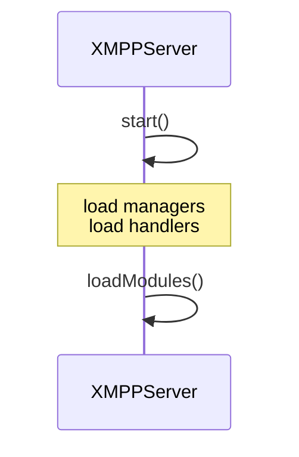
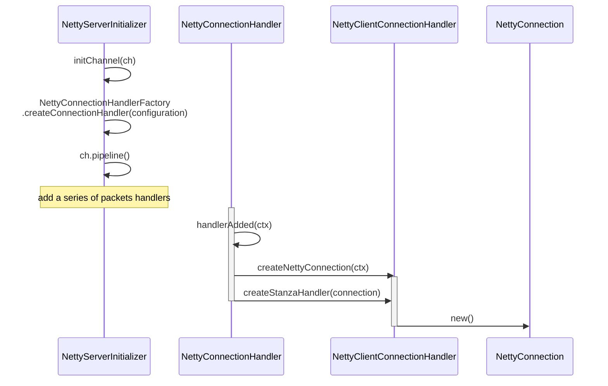
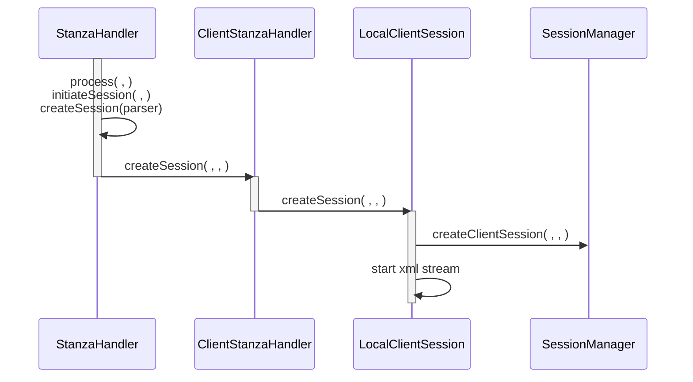
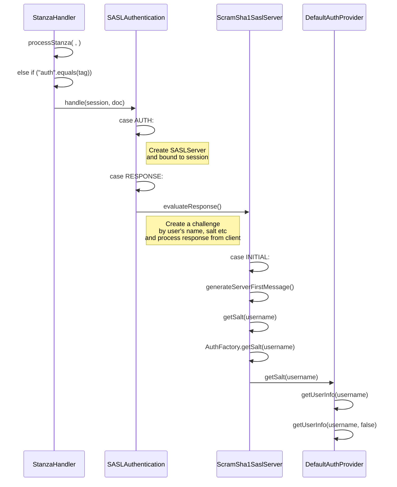
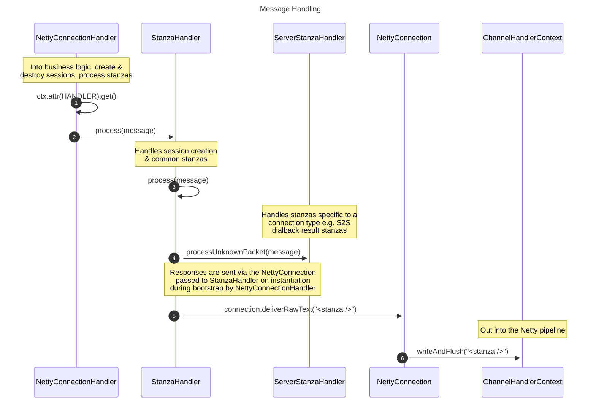
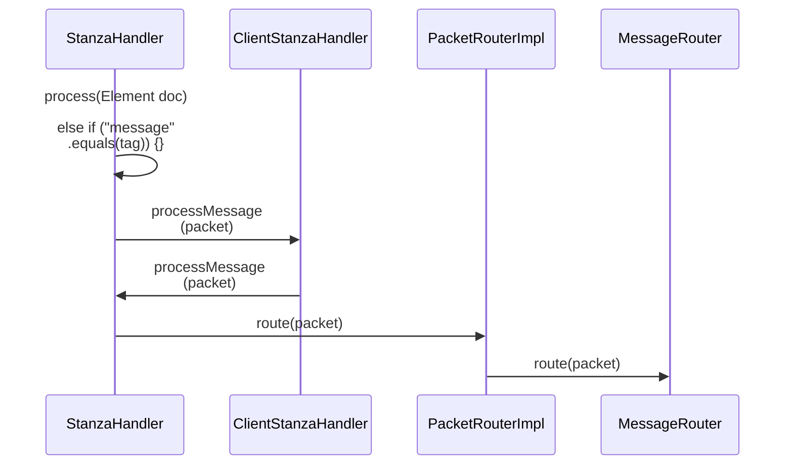
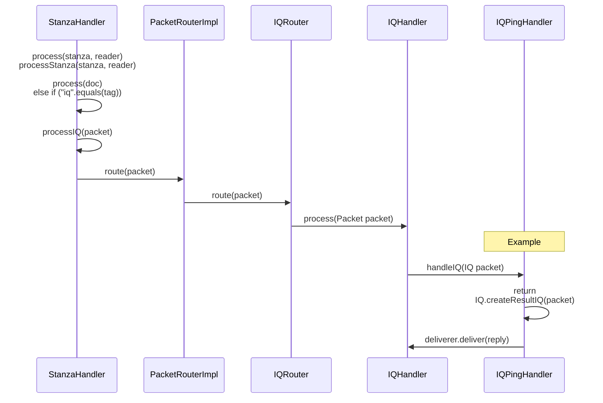
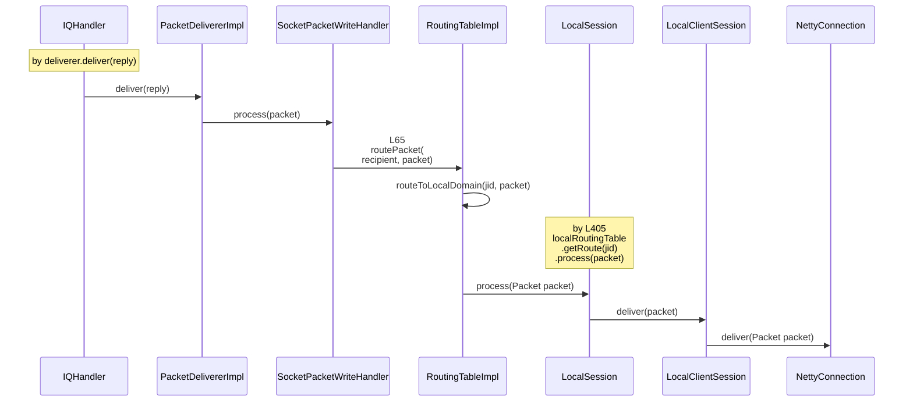
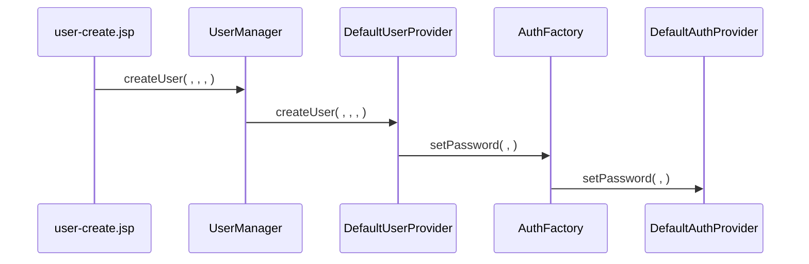
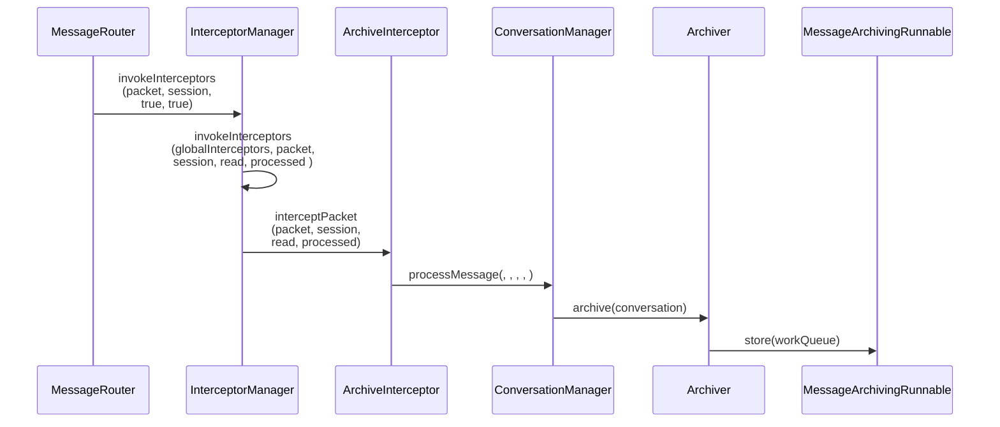

## Protocols 

### [Core](https://datatracker.ietf.org/doc/html/rfc3920)

#### 9.  XML Stanzas

#### 9.2.3.  IQ Semantics

### [Instant Messaging and Presence](https://datatracker.ietf.org/doc/html/rfc6121)
 
## xmpp extensions

- https://xmpp.org/extensions/


### [Service Discovery xep-0030](https://xmpp.org/extensions/xep-0030.html)
### [Stream Management xep-0198](https://xmpp.org/extensions/xep-0198.html)
### [XMPP Ping xep-0199](https://xmpp.org/extensions/xep-0199.html)


<br/>


## netty

`import java.nio.channels.Selector;`

`import io.netty.channel.Channel;`


## opfe

branch: 4.9.0

### TODOS

#### voice message

by file upload

#### Message retraction


#### Message archive 

ConversationManager.java, Modifications to messages saving 

---

是的，XMPP 通过 **XEP（XMPP Extension Protocols）扩展协议** 支持 **消息混合（图文、文件、消息引用等）**，常见的相关协议如下：  

## **1. 富文本消息（图文混合）** - **XEP-0393: Message Styling**  
**支持 Markdown / HTML 样式的消息格式**，可以用于 **图文混合**。  
```xml
<message from="alice@example.com" to="bob@example.com" type="chat">
    <body>Hello, Bob! Check this out:</body>
    <html xmlns="http://jabber.org/protocol/xhtml-im">
        <body xmlns="http://www.w3.org/1999/xhtml">
            <p>Hello, <b>Bob</b>!</p>
            
        </body>
    </html>
</message>
```
- `<body>`：普通文本消息  
- `<html>`：带有 HTML 格式的富文本（支持 ``）  

📌 **相关协议**：
- **XEP-0071: XHTML-IM**（早期的富文本支持）
- **XEP-0393: Message Styling**（新式文本格式化）

---

## **2. 文件传输（文字+文件）** - **XEP-0363: HTTP File Upload**  
XMPP 不直接传输文件，而是通过 **HTTP 方式上传和分享**。  
```xml
<message from="alice@example.com" to="bob@example.com" type="chat">
    <body>Here is the document:</body>
    <attachment xmlns="urn:xmpp:http:upload:0">
        <file url="https://files.example.com/document.pdf" size="12345" content-type="application/pdf"/>
    </attachment>
</message>
```
- 先用 **XEP-0363** 上传文件，获取 `URL`，然后发送给对方。  
- 也可以用 **XEP-0096（Jingle File Transfer）** 进行点对点传输（更复杂）。  

📌 **相关协议**：
- **XEP-0363: HTTP File Upload**（推荐）
- **XEP-0096: SI File Transfer**（较旧）

---

## **3. 消息引用（回复某条消息）** - **XEP-0372: References**  
支持 **消息引用 / 回复**，类似于 QQ、微信的“回复”功能。  
```xml
<message from="bob@example.com" to="alice@example.com" type="chat">
    <body>I agree with this!</body>
    <reference xmlns="urn:xmpp:reference:0" type="reply" begin="0" end="14" uri="xmpp:alice@example.com?message-id=12345"/>
</message>
```
- `type="reply"` 表示这是对某条消息的引用。  
- `uri="xmpp:alice@example.com?message-id=12345"` 指定引用的消息 ID。  

📌 **相关协议**：
- **XEP-0372: References**（标准引用机制）

---

## **4. 消息编辑 / 撤回** - **XEP-0308: Last Message Correction**  
支持 **消息修改（编辑）**，类似微信的“撤回并编辑”功能。  
```xml
<message from="alice@example.com" to="bob@example.com" type="chat">
    <replace xmlns="urn:xmpp:message-correct:0" id="12345"/>
    <body>Sorry, I meant "Hello, Bob!"</body>
</message>
```
- `<replace>` 指定 **要替换的消息 ID**，客户端显示时会自动更新。  

📌 **相关协议**：
- **XEP-0308: Last Message Correction**（标准消息编辑）

---

## **总结**
| 功能              | 相关 XEP           | 说明                             |
| ----------------- | ------------------ | -------------------------------- |
| **图文混合**      | XEP-0393, XEP-0071 | 发送富文本，支持 HTML & Markdown |
| **文字+文件**     | XEP-0363, XEP-0096 | HTTP 上传文件或 P2P 文件传输     |
| **消息引用**      | XEP-0372           | 支持回复某条消息                 |
| **消息编辑/撤回** | XEP-0308           | 编辑或撤回已发送的消息           |

**👉 结论**：XMPP 本身是轻量级的，但通过 **XEP 扩展**，可以实现 **富文本、文件传输、消息引用、编辑撤回等功能**，并适用于聊天应用的各种需求！ 🚀

### Debugging plugin

#### Remvoe appendix for assembly

`plugins/pom.xml`

```xml
<configuration>
    <appendAssemblyId>true</appendAssemblyId>
    <finalName>${plugin.name}</finalName>
    <attach>true</attach>
    //here added
    <appendAssemblyId>false</appendAssemblyId>
    <!-- This is where we use our shared assembly descriptor -->
    <descriptorRefs>
        <descriptorRef>openfire-plugin-assembly</descriptorRef>
    </descriptorRefs>
</configuration>
```


### Add a new feature

- read protocols
- Sending & parsing data at client side  
- Receiving & responding data at server side


### Environment

mvn 3.6.3  
jdk 17.09  

### Load config

`xmppserver/src/main/java/org/jivesoftware/util/JiveGlobals.java`


### Server Bootstrap with Netty & Messages handling

https://mermaid.live/edit

https://github.com/igniterealtime/Openfire/blob/main/documentation/diagrams/netty-message-handling.md

https://github.com/igniterealtime/Openfire/blob/main/documentation/diagrams/netty-server-bootstrap.md

### Important components

- `org.jivesoftware.openfire`
  - `XMPPServer.java`
    - The main XMPP server that will load, initialize and start all the server's modules. 
  - `PacketDeliverer.java`
    - Delivers packets to locally connected streams. 
  - `SessionManager.java`
    - Manages the sessions associated with an account.
  - handler
    - `IQHandler.java`
      - Check out those `subclasses`
  - net    
    - `StanzaHandler.java`
      - A StanzaHandler is the main responsible for handling incoming stanzas.
  - nio
    - `NettyConnection.java`
      - Represents a connection on the server
    - `NettyConnectionHandler.java`
      - A NettyConnectionHandler is responsible for creating new sessions, destroying sessions   
        and delivering received XML stanzas to the proper StanzaHandler.
  - spi
    - `NettyConnectionAcceptor.java`
      - Responsible for accepting new (socket) connections, using Java NIO implementation provided by the Netty framework.
    - `NettyServerInitializer.java`
      - Creates a newly configured `ChannelPipeline` for a new channel.
 

### Packets receiving

`org.jivesoftware.openfire.nio.NettyConnectionHandler.java`
- `#129#channelRead0(ChannelHandlerContext ctx, String message)`

### Responses writing

`org.jivesoftware.openfire.nio.NettyConnection.java`
- `#285#deliver(Packet packet)`
- `#325#deliverRawText(String text)`

### Server Bootstrap with modules



#### XMPPServer code snippets

<details>
<summary>XMPPServer</summary>

```java
private void loadModules() {
        // Load boot modules
        loadModule(RoutingTableImpl.class.getName());
        loadModule(AuditManagerImpl.class.getName());
        loadModule(RosterManager.class.getName());
        loadModule(PrivateStorage.class.getName());
        // Load core modules
        loadModule(PresenceManagerImpl.class.getName());
        loadModule(SessionManager.class.getName());
        loadModule(PacketRouterImpl.class.getName());
        loadModule(IQRouter.class.getName());
        loadModule(MessageRouter.class.getName());
        loadModule(PresenceRouter.class.getName());
        loadModule(MulticastRouter.class.getName());
        loadModule(PacketTransporterImpl.class.getName());
        loadModule(PacketDelivererImpl.class.getName());
        loadModule(TransportHandler.class.getName());
        loadModule(OfflineMessageStrategy.class.getName());
        loadModule(OfflineMessageStore.class.getName());
        loadModule(VCardManager.class.getName());
        // Load standard modules
        loadModule(IQBindHandler.class.getName());
        loadModule(IQSessionEstablishmentHandler.class.getName());
        loadModule(IQPingHandler.class.getName());
        loadModule(IQBlockingHandler.class.getName());
        loadModule(IQPrivateHandler.class.getName());
        loadModule(IQRegisterHandler.class.getName());
        loadModule(IQRosterHandler.class.getName());
        loadModule(IQEntityTimeHandler.class.getName());
        loadModule(IQvCardHandler.class.getName());
        loadModule(IQVersionHandler.class.getName());
        loadModule(IQLastActivityHandler.class.getName());
        loadModule(PresenceSubscribeHandler.class.getName());
        loadModule(PresenceUpdateHandler.class.getName());
        loadModule(IQOfflineMessagesHandler.class.getName());
        loadModule(IQPEPHandler.class.getName());
        loadModule(IQPEPOwnerHandler.class.getName());
        loadModule(MulticastDNSService.class.getName());
        loadModule(IQSharedGroupHandler.class.getName());
        loadModule(AdHocCommandHandler.class.getName());
        loadModule(IQPrivacyHandler.class.getName());
        loadModule(DefaultFileTransferManager.class.getName());
        loadModule(FileTransferProxy.class.getName());
        loadModule(MediaProxyService.class.getName());
        loadModule(PubSubModule.class.getName());
        loadModule(IQDiscoInfoHandler.class.getName());
        loadModule(IQDiscoItemsHandler.class.getName());
        loadModule(UpdateManager.class.getName());
        loadModule(InternalComponentManager.class.getName());
        loadModule(MultiUserChatManager.class.getName());
        loadModule(IQMessageCarbonsHandler.class.getName());
        loadModule(ArchiveManager.class.getName());
        loadModule(CertificateStoreManager.class.getName());
        loadModule(EntityCapabilitiesManager.class.getName());
        loadModule(SoftwareVersionManager.class.getName());
        loadModule(SoftwareServerVersionManager.class.getName());

        // Load this module always last since we don't want to start listening for clients
        // before the rest of the modules have been started
        loadModule(ConnectionManagerImpl.class.getName());
        loadModule(ClusterMonitor.class.getName());
        // Keep a reference to the internal component manager
        componentManager = getComponentManager();
    }
```

</details>

### Accept client connection

[connect-to-server](#connect-to-server)

#### Connection establishment




#### Create client session




#### Start xml stream (client side log)

  
Smack: SENT (0):
```xml
<stream:stream xmlns='jabber:client' to='d113' xmlns:stream='http://etherx.jabber.org/streams' version='1.0' from='phone1@d113' xml:lang='en'>
```

Smack: RECV (0):
```xml
<?xml version="1.0" encoding="UTF-8"?>
<stream:stream xmlns:stream="http://etherx.jabber.org/streams" from="d113" id="3minndt7yt"
    version="1.0" xmlns="jabber:client" xml:lang="en">
    <stream:features>
        <starttls xmlns="urn:ietf:params:xml:ns:xmpp-tls" />
        <limits xmlns="urn:xmpp:stream-limits:0">
            <max-bytes>1048576</max-bytes>
            <idle-seconds>360</idle-seconds>
        </limits>
        <mechanisms xmlns="urn:ietf:params:xml:ns:xmpp-sasl">
            <mechanism>PLAIN</mechanism>
            <mechanism>SCRAM-SHA-1</mechanism>
            <mechanism>CRAM-MD5</mechanism>
            <mechanism>DIGEST-MD5</mechanism>
        </mechanisms>
        <compression xmlns="http://jabber.org/features/compress">
            <method>zlib</method>
        </compression>
        <ver xmlns="urn:xmpp:features:rosterver" />
        <register xmlns="http://jabber.org/features/iq-register" />
        <c hash="sha-1" node="https://www.igniterealtime.org/projects/openfire/"
            ver="8xOPs4AQRdWosQy5ksVjA9//vFo="
            xmlns="http://jabber.org/protocol/caps" />
        <limits xmlns="urn:xmpp:stream-limits:0">
            <max-bytes>1048576</max-bytes>
            <idle-seconds>360</idle-seconds>
        </limits>
    </stream:features>
```

Smack: SENT (0):
```xml
<starttls xmlns='urn:ietf:params:xml:ns:xmpp-tls'></starttls>
```

Smack: RECV (0):
```xml
<proceed xmlns="urn:ietf:params:xml:ns:xmpp-tls"/>
```

Smack: SENT (0):
```xml
<stream:stream xmlns='jabber:client' to='d113' xmlns:stream='http://etherx.jabber.org/streams' version='1.0' from='phone1@d113' xml:lang='en'>
```

Smack: RECV (0):

reset stream

```xml
<?xml version="1.0" encoding="UTF-8"?>
<stream:stream xmlns:stream="http://etherx.jabber.org/streams" from="d113" id="3minndt7yt"
    version="1.0" xmlns="jabber:client" xml:lang="en">
    <stream:features>
        <mechanisms xmlns="urn:ietf:params:xml:ns:xmpp-sasl">
            <mechanism>PLAIN</mechanism>
            <mechanism>SCRAM-SHA-1</mechanism>
            <mechanism>CRAM-MD5</mechanism>
            <mechanism>DIGEST-MD5</mechanism>
        </mechanisms>
        <compression xmlns="http://jabber.org/features/compress">
            <method>zlib</method>
        </compression>
        <ver xmlns="urn:xmpp:features:rosterver" />
        <register xmlns="http://jabber.org/features/iq-register" />
        <c hash="sha-1" node="https://www.igniterealtime.org/projects/openfire/"
            ver="8xOPs4AQRdWosQy5ksVjA9//vFo="
            xmlns="http://jabber.org/protocol/caps" />
        <limits xmlns="urn:xmpp:stream-limits:0">
            <max-bytes>1048576</max-bytes>
            <idle-seconds>360</idle-seconds>
        </limits>
    </stream:features>
```


Smack: XMPPConnection connected (XMPPTCPConnection[phone1@d113/xabber-android-oXAQLcl3] (0))

#### Close stream

```java
private void writePackets() {
    //L1464
    try {
        writer.write("</stream:stream>");
        writer.flush();
    }
}
```


#### User authentication

see also [xabber#login](./xab.md#login)




### Openfire Message Handling with Netty

The following diagram shows how network messages (e.g. TLS, XMPP stanzas) are processed by the Netty-based networking layer in Openfire.



### \<Message\/> handling




### IQ packets routing to handler



### Packets delivery 


see also [responses-writing](#responses-writing)


### Create user




### Add contacts

```xml
<iq id='cAvaB-331' type='set'><query xmlns='jabber:iq:roster'><item jid='116@d113' name='' subscription='none'></item></query></iq>
```

### Plugin httpfileupload

#### TODOS

- User authentication

#### Setting local repo

`plugins/openfire-httpFileUpload-plugin/src/java/org/igniterealtime/openfire/plugins/httpfileupload/HttpFileUploadPlugin.java#getFileRepoFromProperties()`

at `distribution/src/conf/openfire.xml`

### Plugin monitoring

#### Message archive 

see also [message handling](#message-handling)




## opfe admin 

### Add user 