## spk

branch: master

last commit: SPARK-2122: Add DOAP file for project

### Environment

- maven 3.6.3
- jdk 11
 
 #### open smack debugger

 from code `core/src/main/java/org/jivesoftware/gui/LoginUIPanel.java#L752`


 from configuration file `C:\Users\{Username}\AppData\Roaming\Spark\spark.properties`, modify `debuggerEnabled=false` to `debuggerEnabled=true`  
`core/src/main/resources/default.properties` `DEBUGGER_ENABLED = false` to `DEBUGGER_ENABLED = true`

### Login

`core/src/main/java/org/jivesoftware/gui/LoginUIPanel.java#1254`

```java
connection = new XMPPTCPConnection(retrieveConnectionConfiguration());
connection.connect();

connection.login(getLoginUsername(), getLoginPassword(), resourcepart);
```

#### session

#### option dialog, Self Signed certificate

`core/src/main/java/org/jivesoftware/gui/LoginUIPanel.java#1329-1353`

`ACCEPT_SELF_SIGNED = true`

#### option dialog, Certificate not in the TrustStore

add to

#### Add certificate to local storage

get lastFailedChain

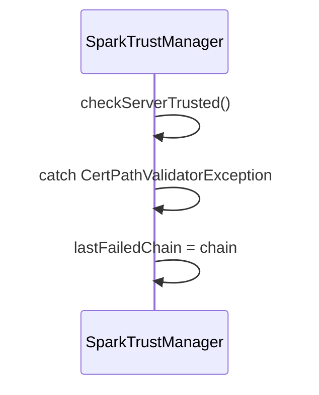
```mermaid
sequenceDiagram
    SparkTrustManager->>SparkTrustManager: checkServerTrusted()
    SparkTrustManager->>SparkTrustManager: catch CertPathValidatorException
    SparkTrustManager->>SparkTrustManager: lastFailedChain = chain
```


login first
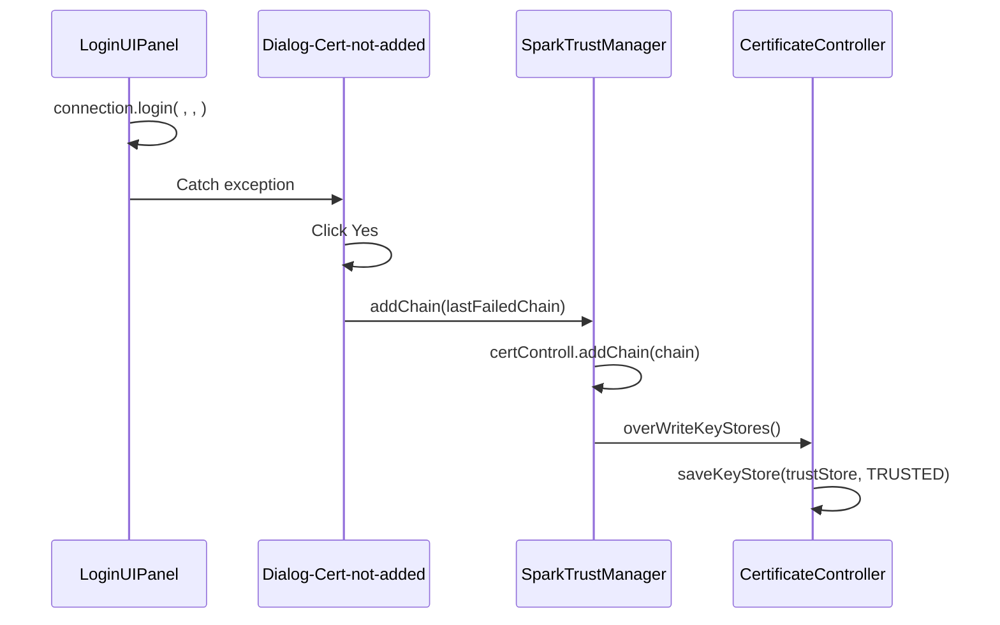
```mermaid
sequenceDiagram
    LoginUIPanel->>LoginUIPanel: connection.login( , , )
    LoginUIPanel->>Dialog-Cert-not-added: Catch exception
    Dialog-Cert-not-added->>Dialog-Cert-not-added: Click Yes
    Dialog-Cert-not-added->>SparkTrustManager: addChain(lastFailedChain)
    SparkTrustManager->>SparkTrustManager: certControll.addChain(chain)
    SparkTrustManager->>CertificateController: overWriteKeyStores()
    CertificateController->>CertificateController: saveKeyStore(trustStore, TRUSTED)
```


login after
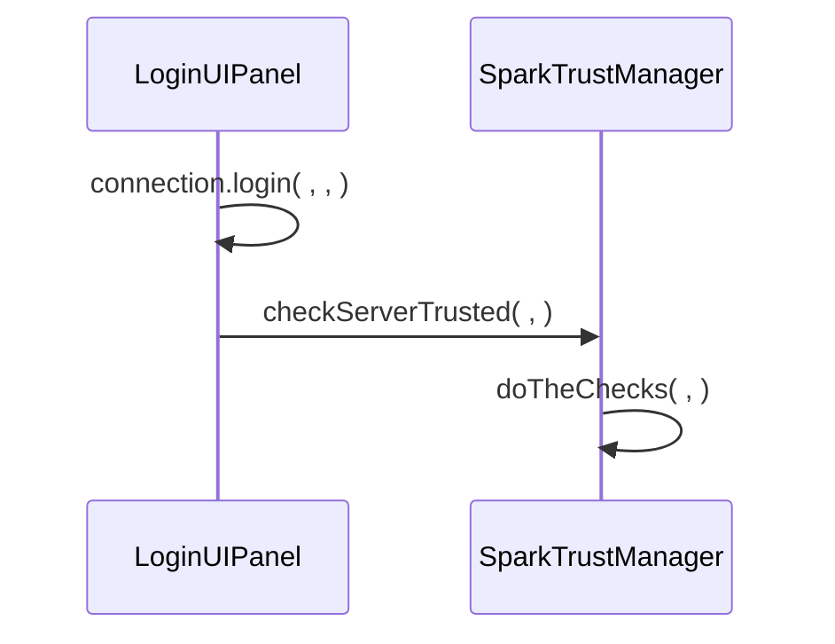
```mermaid
sequenceDiagram
    LoginUIPanel->>LoginUIPanel: connection.login( , , )
    LoginUIPanel->>SparkTrustManager: checkServerTrusted( , )
    SparkTrustManager->>SparkTrustManager: doTheChecks( , )
```

load certificate from local storage 
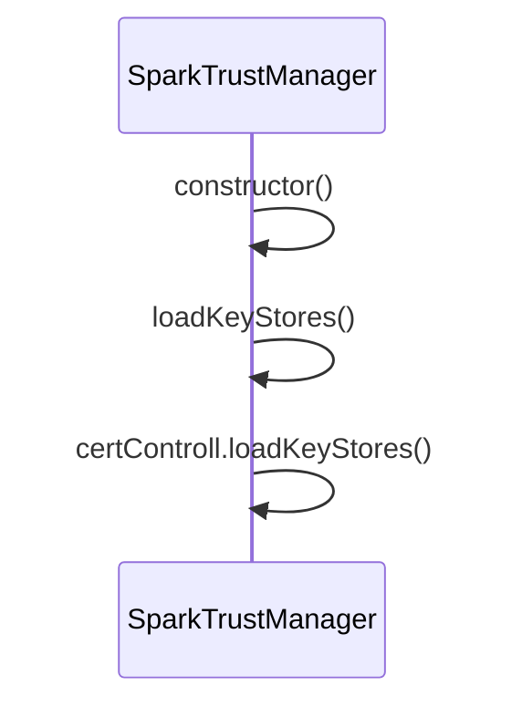
```mermaid
sequenceDiagram
    SparkTrustManager->>SparkTrustManager: constructor()
    SparkTrustManager->>SparkTrustManager: loadKeyStores()
    SparkTrustManager->>SparkTrustManager: certControll.loadKeyStores()
```

### Load ext plugin

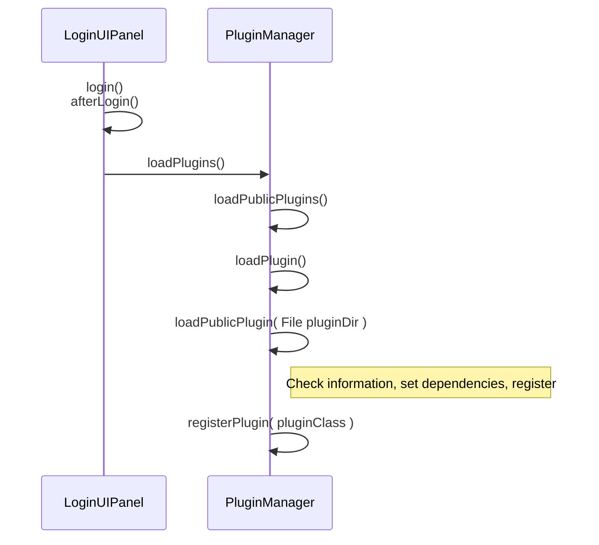
```mermaid
sequenceDiagram
    LoginUIPanel->>LoginUIPanel: login()<br>afterLogin()
    LoginUIPanel->>PluginManager: loadPlugins()    
    PluginManager->>PluginManager: loadPublicPlugins()
    PluginManager->>PluginManager: loadPlugin()
    PluginManager->>PluginManager: loadPublicPlugin( File pluginDir )
    Note right of PluginManager: Check information, set dependencies, register  
    PluginManager->>PluginManager: registerPlugin( pluginClass )

```

#### Add upload file btn

Loading `SparkFileUploadPlugin` from `.jar` at `C:\Users\{user}\AppData\Roaming\Spark\plugins`

`src/main/java/org/jivesoftware/spark/plugin/fileupload/SparkFileUploadPlugin.java#chatRoomOpened()`


### Logout

`core/src/main/java/org/jivesoftware/MainWindow.java#259`

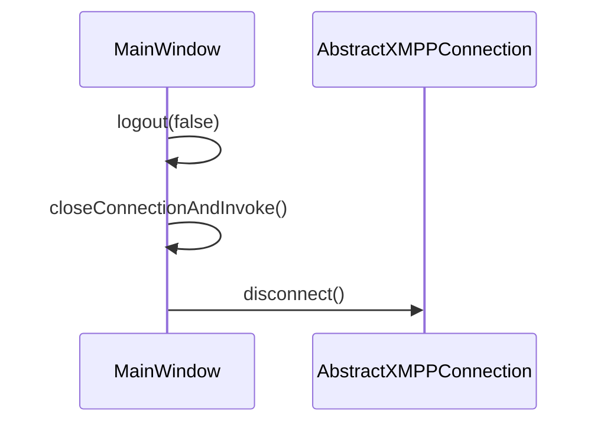
```mermaid
sequenceDiagram
    MainWindow->>MainWindow: logout(false)
    MainWindow->>MainWindow: closeConnectionAndInvoke()
    MainWindow->>AbstractXMPPConnection: disconnect()
```


### Contacts list

`core/src/main/java/org/jivesoftware/spark/ui/ContactGroup.java#303`


build offline list

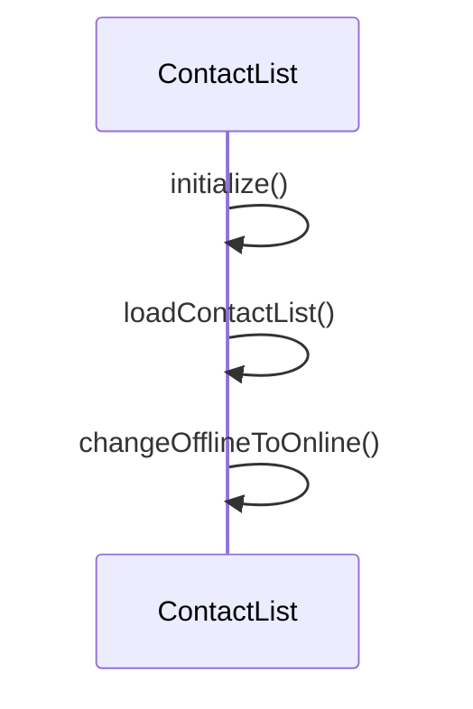
```mermaid
sequenceDiagram
    ContactList->>ContactList: initialize()
    ContactList->>ContactList: loadContactList()
    ContactList->>ContactList: changeOfflineToOnline()

```

---

updates for online user

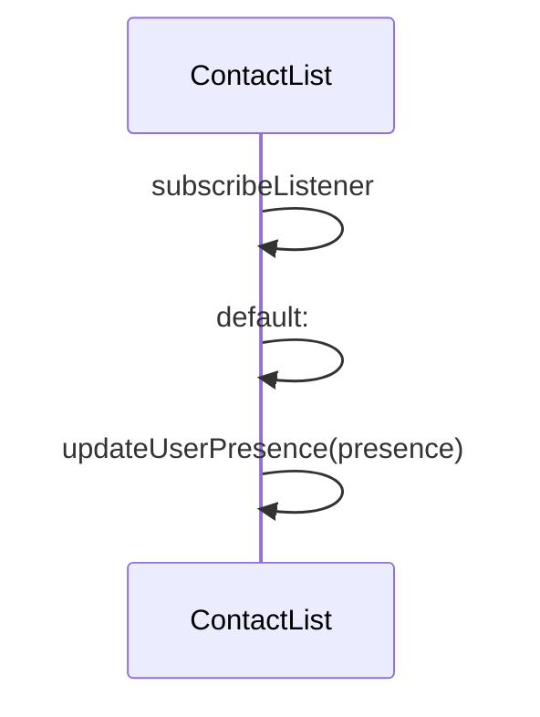
```mermaid
sequenceDiagram
    ContactList->>ContactList: subscribeListener
    ContactList->>ContactList: default:
    ContactList->>ContactList: updateUserPresence(presence)
```


### Search contacts

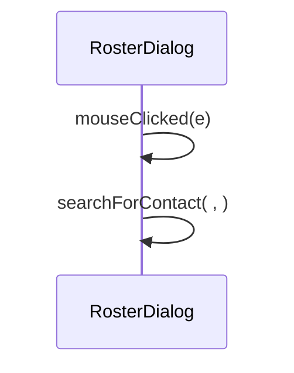
```mermaid
sequenceDiagram
    RosterDialog->>RosterDialog: mouseClicked(e)
    RosterDialog->>RosterDialog: searchForContact( , )
```

### Add contacts

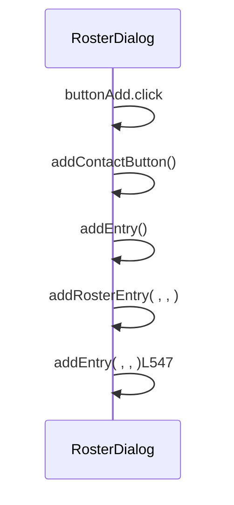
```mermaid
sequenceDiagram
    RosterDialog->>RosterDialog: buttonAdd.click
    RosterDialog->>RosterDialog: addContactButton()
    RosterDialog->>RosterDialog: addEntry()
    RosterDialog->>RosterDialog: addRosterEntry( , , )
    RosterDialog->>RosterDialog: addEntry( , , )L547
```

### Agree or deny adding

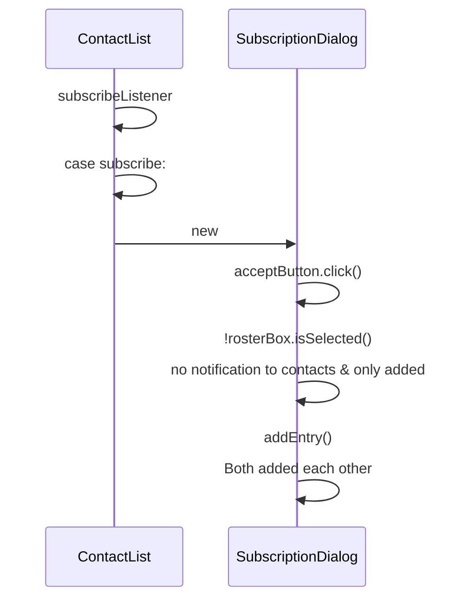
```mermaid
sequenceDiagram
    ContactList->>ContactList: subscribeListener
    ContactList->>ContactList: case subscribe:
    ContactList->>SubscriptionDialog: new
    SubscriptionDialog->>SubscriptionDialog: acceptButton.click()
    SubscriptionDialog->>SubscriptionDialog: !rosterBox.isSelected()<br><br>no notification to contacts & only added
    SubscriptionDialog->>SubscriptionDialog: addEntry() <br><br> Both added each other
```

### Single chat

`core/src/main/java/org/jivesoftware/spark/ui/rooms/ChatRoomImpl.java#295`

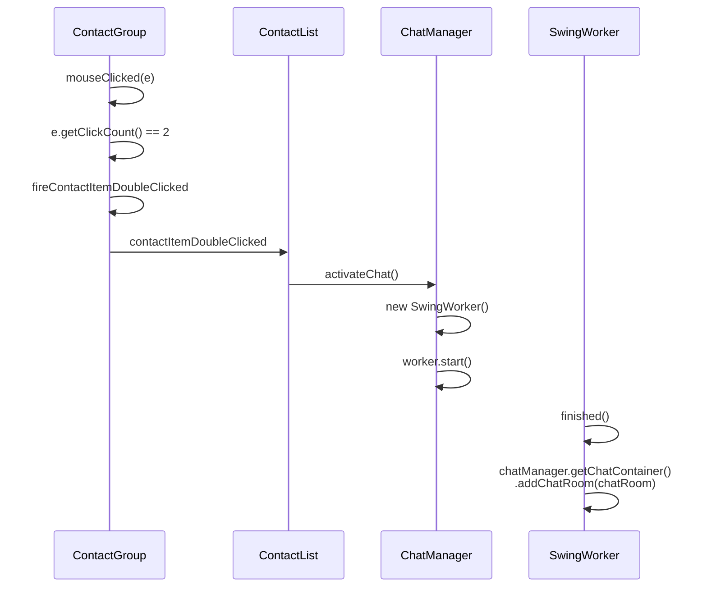
```mermaid
sequenceDiagram

    ContactGroup->>ContactGroup: mouseClicked(e)
    ContactGroup->>ContactGroup: e.getClickCount() == 2
    ContactGroup->>ContactGroup: fireContactItemDoubleClicked
    ContactGroup->>ContactList: contactItemDoubleClicked
    ContactList->>ChatManager: activateChat()
    ChatManager->>ChatManager: new SwingWorker()
    ChatManager->>ChatManager: worker.start()
    SwingWorker->>SwingWorker: finished()
    SwingWorker->>SwingWorker: chatManager.getChatContainer()<br>.addChatRoom(chatRoom)

```

---

Send messages

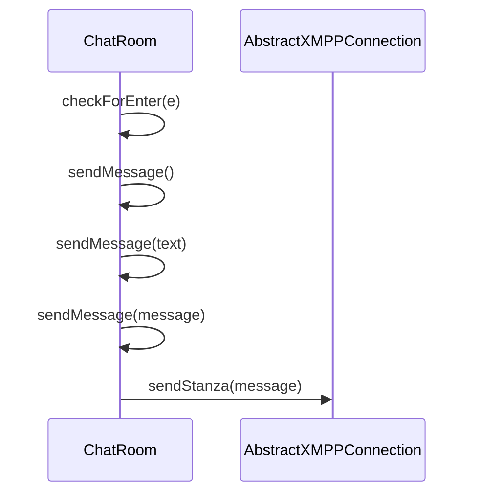
```mermaid
sequenceDiagram
    ChatRoom->>ChatRoom: checkForEnter(e)
    ChatRoom->>ChatRoom: sendMessage()
    ChatRoom->>ChatRoom: sendMessage(text)
    ChatRoom->>ChatRoom: sendMessage(message)
    ChatRoom->>AbstractXMPPConnection: sendStanza(message)
```


---

Receiving messages

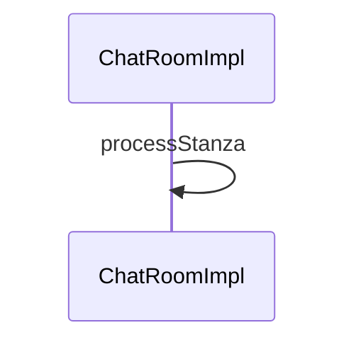
```mermaid
sequenceDiagram
    ChatRoomImpl->>ChatRoomImpl: processStanza
```


### Group chat

#### Create room

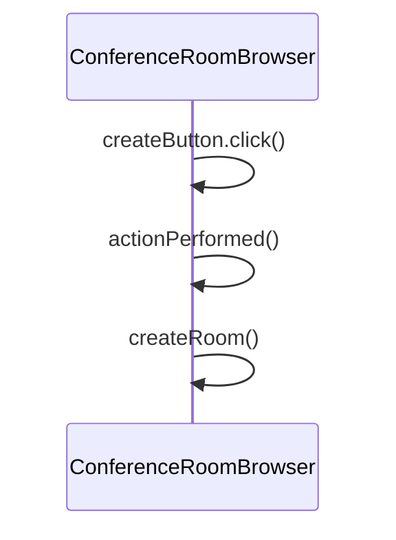
```mermaid
sequenceDiagram
    ConferenceRoomBrowser->>ConferenceRoomBrowser: createButton.click()
    ConferenceRoomBrowser->>ConferenceRoomBrowser: actionPerformed()
    ConferenceRoomBrowser->>ConferenceRoomBrowser: createRoom()
```


---

#### Join room

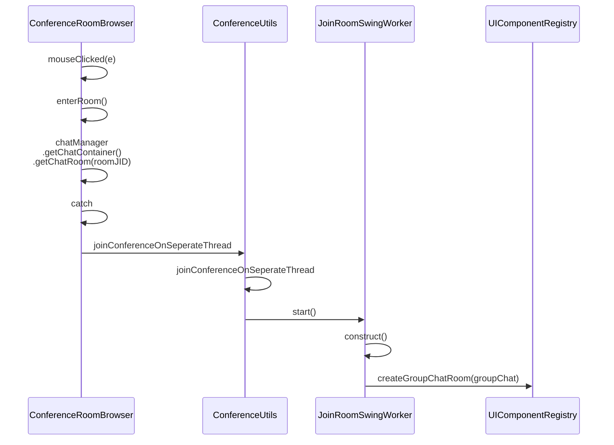
```mermaid
sequenceDiagram
    ConferenceRoomBrowser->>ConferenceRoomBrowser: mouseClicked(e)
    ConferenceRoomBrowser->>ConferenceRoomBrowser: enterRoom()
    ConferenceRoomBrowser->>ConferenceRoomBrowser: chatManager<br>.getChatContainer()<br>.getChatRoom(roomJID)
    ConferenceRoomBrowser->>ConferenceRoomBrowser: catch
    ConferenceRoomBrowser->>ConferenceUtils: joinConferenceOnSeperateThread
    ConferenceUtils->>ConferenceUtils: joinConferenceOnSeperateThread
    ConferenceUtils->>JoinRoomSwingWorker: start()
    JoinRoomSwingWorker->>JoinRoomSwingWorker: construct()
    JoinRoomSwingWorker->>UIComponentRegistry: createGroupChatRoom(groupChat);

```


core/src/main/java/org/jivesoftware/spark/ui/rooms/GroupChatRoom.java


---


#### Getting participants

`core/src/main/java/org/jivesoftware/spark/ui/conferences/GroupChatParticipantList.java#169`

---

#### Receiving messages

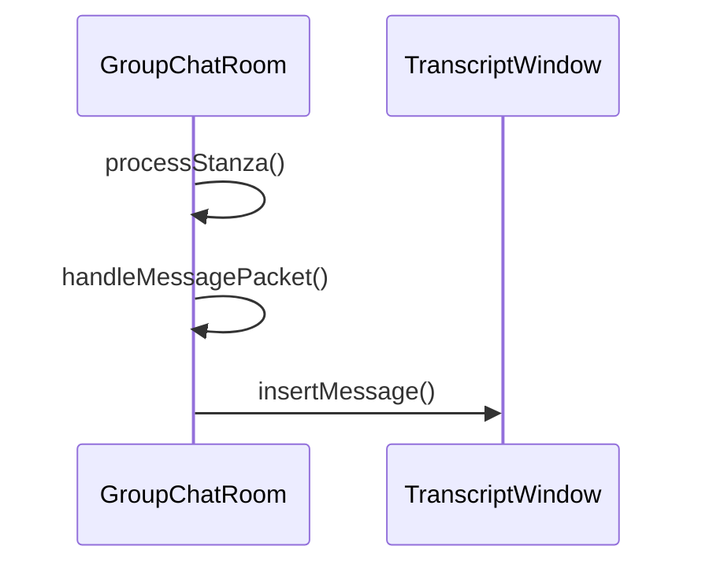
```mermaid
sequenceDiagram
    GroupChatRoom->>GroupChatRoom: processStanza()
    GroupChatRoom->>GroupChatRoom: handleMessagePacket()
    GroupChatRoom->>TranscriptWindow: insertMessage()
```


---

#### Send messages

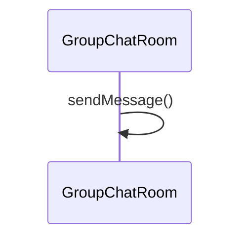
```mermaid
sequenceDiagram
    GroupChatRoom->>GroupChatRoom: sendMessage()
```


### fileupload

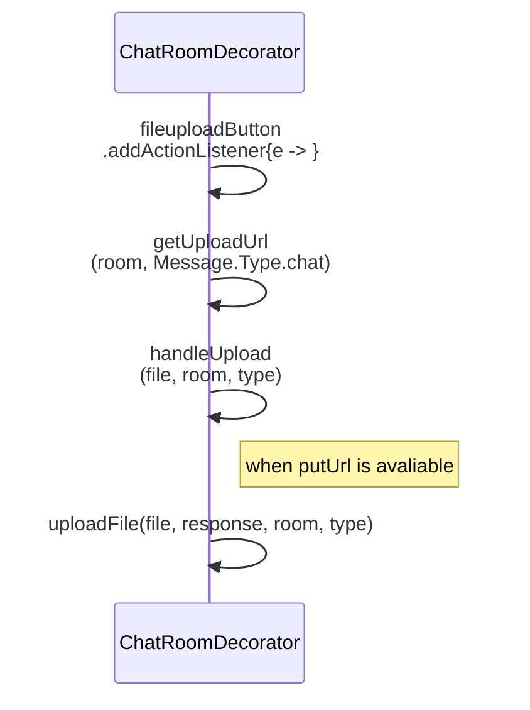
```mermaid
sequenceDiagram
    ChatRoomDecorator->>ChatRoomDecorator: fileuploadButton<br>.addActionListener{e -> }
    ChatRoomDecorator->>ChatRoomDecorator: getUploadUrl<br>(room, Message.Type.chat)
    ChatRoomDecorator->>ChatRoomDecorator: handleUpload<br>(file, room, type)
    Note right of ChatRoomDecorator: when putUrl is avaliable
    ChatRoomDecorator->>ChatRoomDecorator: uploadFile(file, response, room, type);
```

### toXML()

#### target
```xml
<iq xmlns='jabber:client' id='RKI49-1' type='get'>
    <request xmlns='urn:xmpp:http:upload:0'>
        <size>111</size>
        <filename>test.txt</filename>
    </request>
</iq>
```

#### example class, from spark
```java
public class UploadRequest extends IQ {
    public static final String NAMESPACE = "urn:xmpp:http:upload:0";

    private String filename;
    private long filesize;

    public String getUrl = null;
    public String putUrl = null;

    public UploadRequest(){super( "request", NAMESPACE );}

    public UploadRequest(String filename, long filesize){
        super( "request", NAMESPACE );
        this.filename = filename;
        this.filesize = filesize;
    }

    @Override
    protected IQChildElementXmlStringBuilder getIQChildElementBuilder( IQChildElementXmlStringBuilder buf ){
        buf.rightAngleBracket();
        buf.element("size", Long.toString( filesize ));
        buf.element("filename", filename);
        return buf;
    }
    //...
}
```

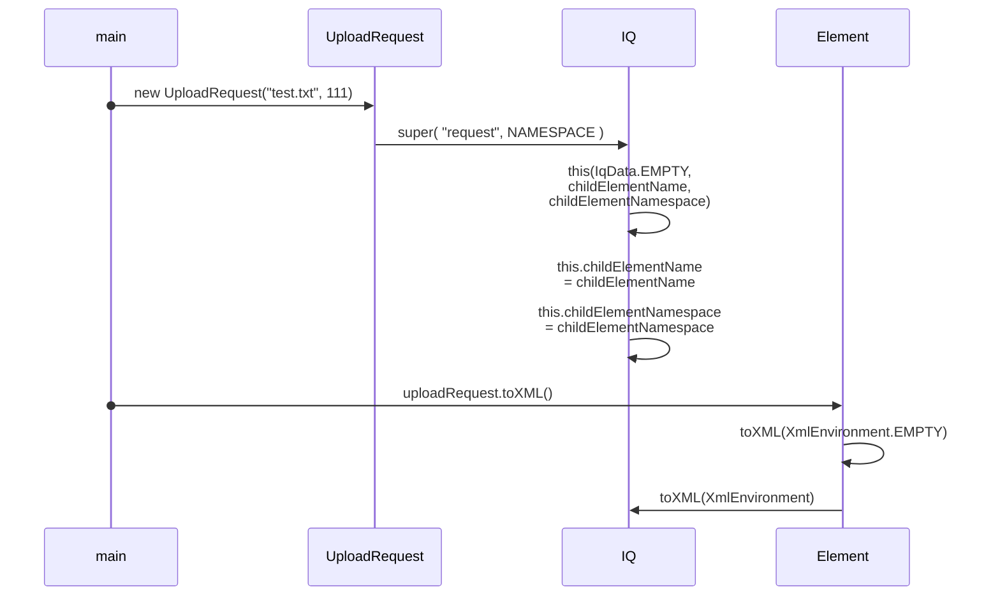
```mermaid
sequenceDiagram
    main()->>UploadRequest: new UploadRequest("test.txt", 111)
    UploadRequest->>IQ: super( "request", NAMESPACE )
    IQ->>IQ: this(IqData.EMPTY, <br>childElementName, <br>childElementNamespace)
    IQ->>IQ: this.childElementName <br>= childElementName<br><br>this.childElementNamespace <br>= childElementNamespace
    main()->>Element: uploadRequest.toXML();
    Element->>Element: toXML(XmlEnvironment.EMPTY)
    Element->>IQ: toXML(XmlEnvironment)
```

```mermaid
sequenceDiagram
    IQ->>IQ: toXML(XmlEnvironment)
    IQ->>XmlStringBuilder: new (this, <br>enclosingXmlEnvironment)
    XmlStringBuilder->>XmlStringBuilder: this( , , , )
    XmlStringBuilder->>XmlStringBuilder: halfOpenElement
    Note right of XmlStringBuilder:  sb.append('<').append(name) 
    XmlStringBuilder->>XmlStringBuilder: xmlnsAttribute(xmlNs);
    Note right of XmlStringBuilder:  append namespace;
    IQ->>IQ: appendInnerXml(buf)
    IQ->>IQ: new IQChildElementXmlStringBuilder(<br>getChildElementName(), <br>getChildElementNamespace(), <br>null, xml.getXmlEnvironment())
    IQ->>IQ: xml.closeElement(iqChildElement.element);
    IQ->>IQ: buf.closeElement(IQ_ELEMENT);
```

#### parse xml

```xml
<iq type="result" id="GHKEU-415" from="httpfileupload.d113" to="117@d113/Spark">
    <slot xmlns="urn:xmpp:http:upload:0">
        <put url="https://d117:7443/httpfileupload/o6TAo87Xw-1IzjxhX204zYxTYOI/0test"/>
        <get url="https://d117:7443/httpfileupload/o6TAo87Xw-1IzjxhX204zYxTYOI/0test"/>
    </slot>
</iq>
```

```java
public class UploadRequest extends IQ {
    //...
    public static class Provider extends IQProvider<UploadRequest>  {
        public Provider() { super(); }

        public UploadRequest parse(XmlPullParser parser, int i, XmlEnvironment xmlEnvironment) throws XmlPullParserException, IOException {
            final UploadRequest uploadRequest = new UploadRequest();

            boolean done = false;
            while ( !done ) {
                XmlPullParser.Event eventType = parser.next();

                if ( eventType == XmlPullParser.Event.START_ELEMENT ) {
                    if ( parser.getName().equals( "put" ) ) {
                        uploadRequest.putUrl = parser.getAttributeValue(null, "url");
                    }
                    else if ( parser.getName().equals( "get" ) ) {
                        uploadRequest.getUrl = parser.getAttributeValue(null, "url");
                    }
                }

                else if ( eventType == XmlPullParser.Event.END_ELEMENT ) {
                    if ( parser.getName().equals( "slot" ) ) {
                        done = true;
                    }
                }
            }
            return uploadRequest;
        }
    }
}
```


### messages saving


