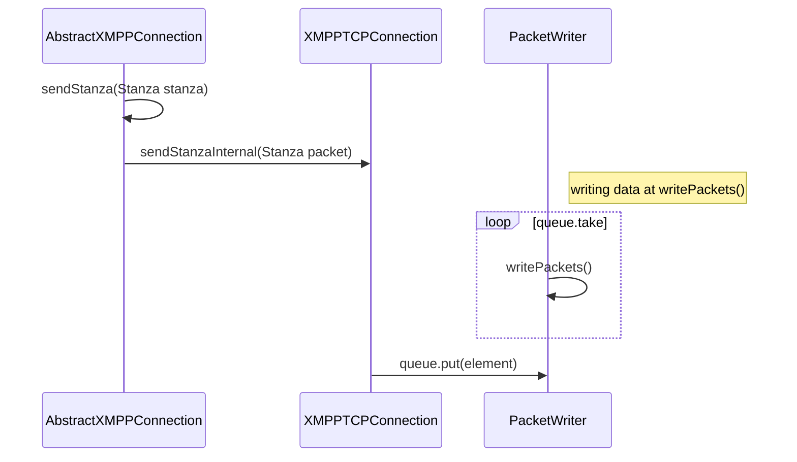
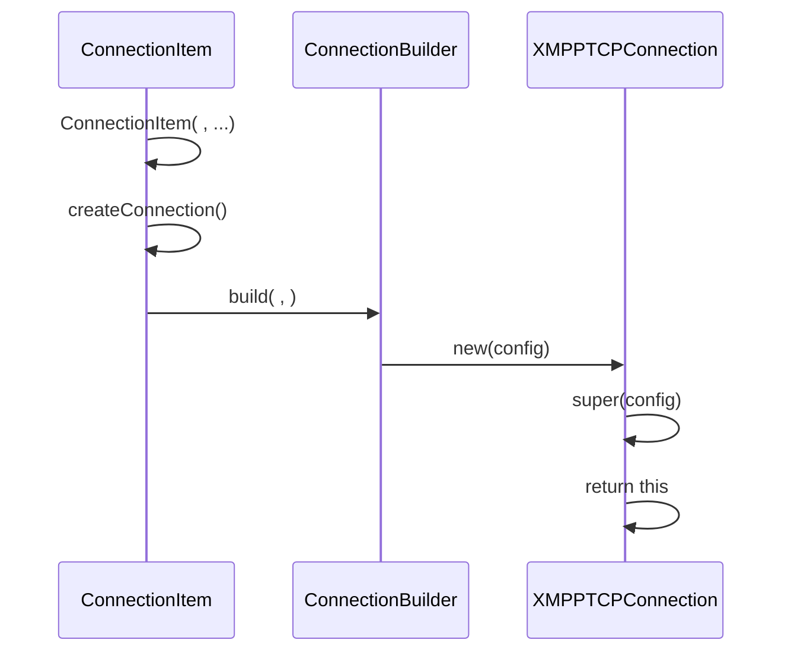
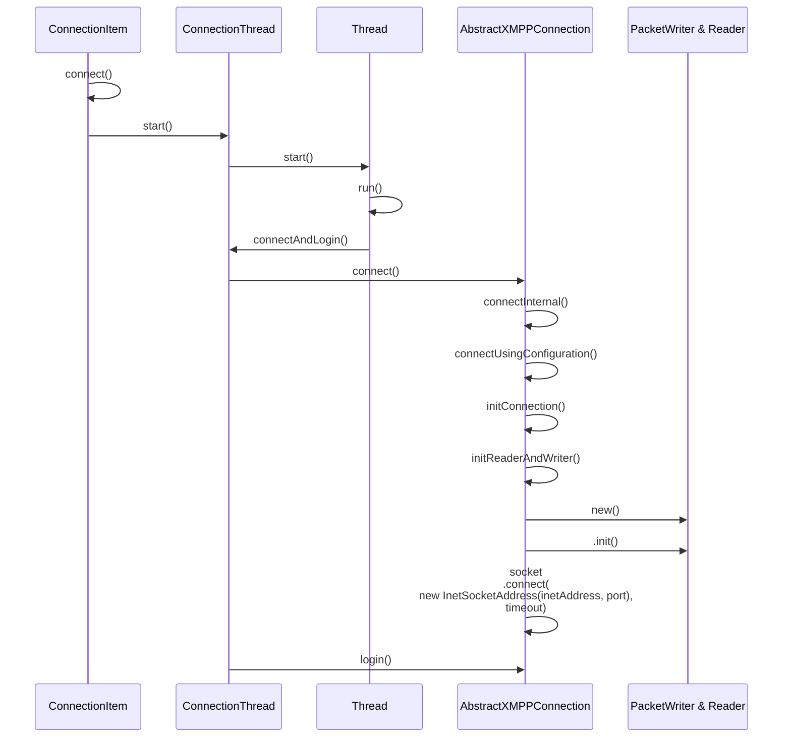
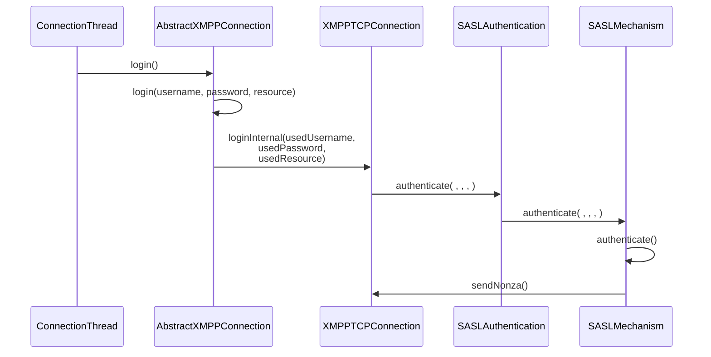
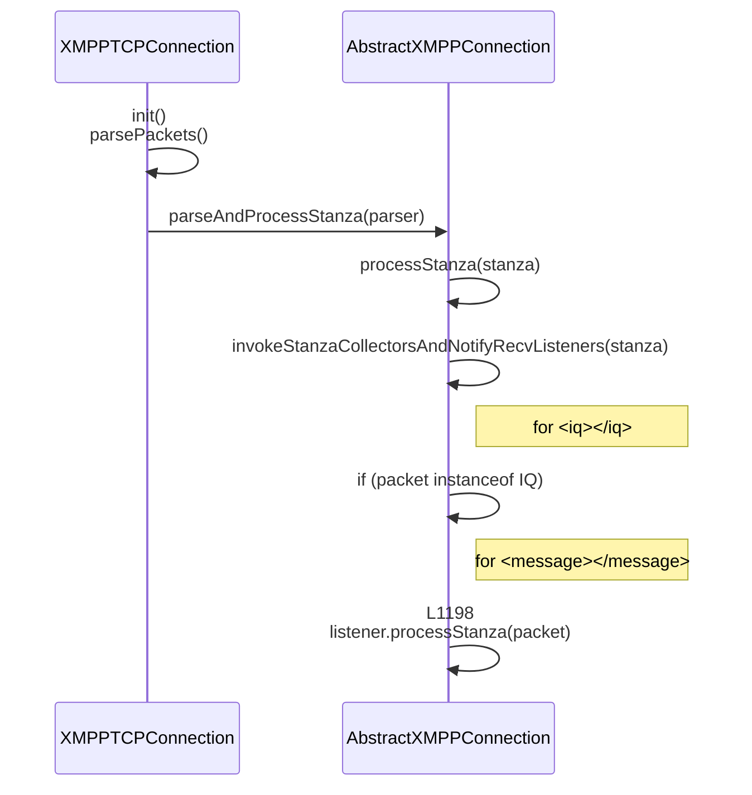
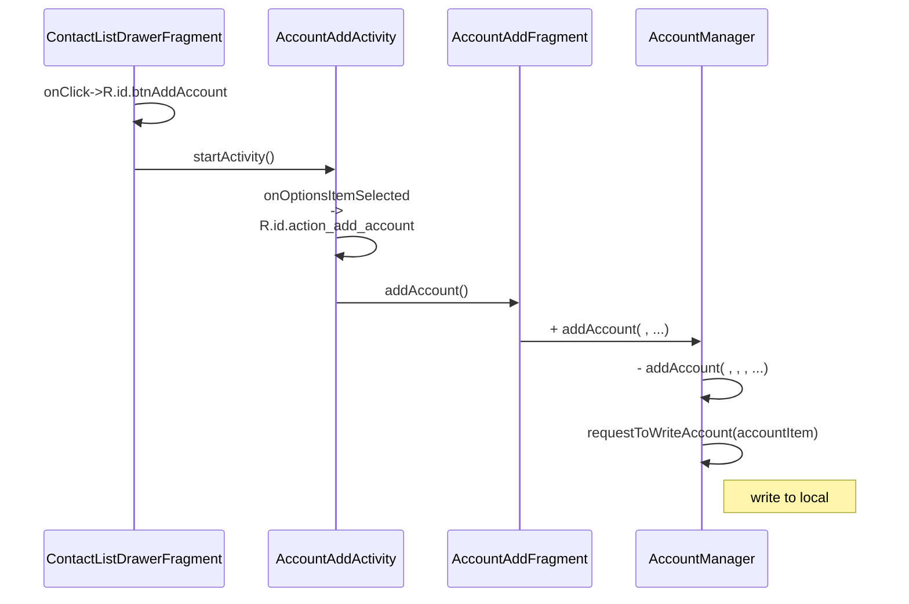
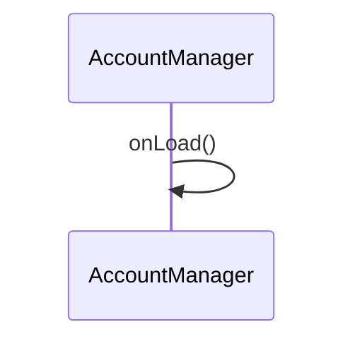

## x

### Branch

branch: develop  
last commit: Up\version/to/644  

### Configs
as 2021.1.1.23-windows

jdk 1.8-211

- build.gradle r

from
```gradle
// Top-level build file where you can add configuration options common to all sub-projects/modules.
buildscript {
    repositories {
        jcenter()
        google()
        maven { url 'https://maven.fabric.io/public' }
    }
    dependencies {
        classpath 'com.android.tools.build:gradle:3.4.2'
        classpath "io.realm:realm-gradle-plugin:3.1.1"
        classpath 'com.neenbedankt.gradle.plugins:android-apt:1.8'
        classpath 'com.frogermcs.androiddevmetrics:androiddevmetrics-plugin:0.4'
        classpath 'io.fabric.tools:gradle:1.25.4'
        classpath 'com.google.gms:google-services:4.2.0'
    }
}

allprojects {
    repositories {
        jcenter()
        google()
        maven { url "https://jitpack.io" }
        maven { url 'https://oss.sonatype.org/content/repositories/snapshots' }
        maven { url 'http://igniterealtime.org/repo' }
        maven { url 'https://maven.fabric.io/public' }
    }
}

```


to
```gradle
// Top-level build file where you can add configuration options common to all sub-projects/modules.
buildscript {
    repositories {
        jcenter()
        google()
        maven { url 'https://maven.fabric.io/public' }
        maven { url 'https://repo1.maven.org/maven2'}
        maven {url 'https://maven.aliyun.com/repository/public'}
        maven {url 'https://maven.aliyun.com/repository/central'}
        maven {url "https://igniterealtime.org/repo/"}
    }
    dependencies {
        classpath 'com.android.tools.build:gradle:3.4.2'
        classpath "io.realm:realm-gradle-plugin:3.1.1"
        classpath 'com.neenbedankt.gradle.plugins:android-apt:1.8'
        classpath 'com.frogermcs.androiddevmetrics:androiddevmetrics-plugin:0.4'
        classpath 'io.fabric.tools:gradle:1.25.4'
        classpath 'com.google.gms:google-services:4.2.0'
    }
}

allprojects {
    repositories {
        jcenter()
        google()
        maven { url "https://jitpack.io" }
        maven { url 'https://oss.sonatype.org/content/repositories/snapshots' }
        maven { url 'http://igniterealtime.org/repo' }
        maven { url 'https://maven.fabric.io/public' }
        maven { url 'https://repo1.maven.org/maven2'}
        maven {url 'https://maven.aliyun.com/repository/public'}
        maven {url 'https://maven.aliyun.com/repository/central'}
        maven {url "https://igniterealtime.org/repo/"}
    }
}

```

#### build.gradle a

from
```gradle
ext {
   smackVerstion = 'xxxxxx'
}
```

to
```gradle
ext {
   smackVerstion = '4.2.1-SNAPSHOT'
}

ext {
   smackVerstion = '4.2.1-beta1'
}
```

---

from
```gradle
implementation "com.github.str4tocaster.smack:smack-android-extensions:$smackVerstion"
implementation "com.github.str4tocaster.smack:smack-experimental:$smackVerstion"
implementation "com.github.str4tocaster.smack:smack-tcp:$smackVerstion"
implementation "com.github.str4tocaster.smack:smack-resolver-dnsjava:$smackVerstion"
```

to
```gradle
implementation "org.igniterealtime.smack:smack-android-extensions:$smackVersion"
implementation "org.igniterealtime.smack:smack-experimental:$smackVersion"
implementation "org.igniterealtime.smack:smack-tcp:$smackVersion"
implementation "org.igniterealtime.smack:smack-resolver-dnsjava:$smackVersion"
```


#### TLSMode

from
```java
SecurityMode.legacy;
```

to
```java
SecurityMode.required;
```

#### XMPPTCPConnection

or use `XMPPTCPConnection` from library.

```java
ConnectionConfiguration.SecurityMode.legacy 
```

to
```java
SecurityMode.required
```

#### BookmarksManager

```java
bookmarkManager.cleanCache();
```
to
```java
//bookmarkManager.cleanCache();
```

### Important components

#### XMPPTCPConnection.java#connection#reading#writing

- `org.jivesoftware.smack.tcp`
  - `XMPPTCPConnection.java`
    - Creates a socket connection to an XMPP server.
    - `protected class PacketReader`
      - Reading data from input stream of socket by binding `packetReader.parser = PacketParserUtils.newXmppParser(reader)` and  
        reading `parser.next();` 
    - `protected class PacketWriter`
      - Pending packets sent to block queue, blocking read to packets from the queue by `nextStreamElement()`, then send to server  
        check out `PacketWriter-writePackets()`

##### Send data

PacketWriter initialization see also   
[connect-to-server](#connect-to-server-1)



`XMPPTCPConnection.java#PacketWriter`
```java
private void writePackets() {
    //...
    openStream();
    while (!done()) {
        Element element = nextStreamElement();
        //...
    }
    //...
}

private Element nextStreamElement() {
    //...
    packet = queue.take();
    //...
    return packet;
}
```

##### Read data

`XMPPTCPConnection.java`
```java
private void initReaderAndWriter() throws IOException {
    //...
    InputStream is = socket.getInputStream();
    reader = new BufferedReader(new InputStreamReader(is, "UTF-8"));
    //...
}
```


```java
//Resets the parser using the latest connection's reader.
void openStream() throws SmackException, InterruptedException {
    //...
    packetReader.parser = PacketParserUtils.newXmppParser(reader);
    //...
}
```

<br/>  


When to `openStream`

Initialize stream
```java
private void writePackets() {
    try {
        openStream();
    }
}
```
<br/>

Reset stream
```java
private void parsePackets() {
    try {
        while (!done) {
            switch (eventType) {
                case XmlPullParser.START_TAG:
                    switch (name) {
                        case "proceed":
                            // L1059 Secure the connection by negotiating TLS
                            openStream();
                            break;                            
                        case Success.ELEMENT:
                            // L1099
                            openStream();
                            break;
                        case Compressed.ELEMENT:
                            // L1110
                            openStream();
                            break;
                    }
            }
        }
    }
}

```


<br/>  

`XMPPTCPConnection.java#PacketReader`
```java
private void parsePackets() {
    //...
    int eventType = parser.getEventType();
    while (!done) {   
        eventType = parser.next();
    }
    //...
}
```


### Important app components 

- `BaseManagerInterface.java (com.xabber.android.data)`
- `OnPacketListener (com.xabber.android.data.connection.listeners)`
  - `VCardManager (com.xabber.android.data.extension.vcard)`
  - `AvatarManager (com.xabber.android.data.extension.avatar)`
  - `AttentionManager (com.xabber.android.data.extension.attention)`
  - `NextMamManager (com.xabber.android.data.extension.mam)`
  - `XTokenManager (com.xabber.android.data.extension.xtoken)`
  - `ChatMarkerManager (com.xabber.android.data.extension.chat_markers)`
  - `ReceiptManager (com.xabber.android.data.message)`
  - `SSNManager (com.xabber.android.data.extension.ssn)`
  - `PushManager (com.xabber.android.data.push)`
  - `MUCManager (com.xabber.android.data.extension.muc)`
  - `XMPPAuthManager (com.xabber.android.data.xaccount)`
  - `PresenceManager (com.xabber.android.data.roster)`
    - Process contact's presence information.
  - `ChatStateManager (com.xabber.android.data.extension.cs)`
  - `LastActivityInteractor (com.xabber.android.data.extension.iqlast)`
    - Receive Last Activity for user.
  - `MessageManager (com.xabber.android.data.message)`


- `AbstractChat.java (com.xabber.android.data.message)`
  - Chat instance

- `ConnectionItem.java (com.xabber.android.data.connection)`
- `AccountItem.java (com.xabber.android.data.account)`


### Connect to server 

[accept client connection](#accept-client-connection)

#### create connection



---

#### connect to server


---

#### login

https://datatracker.ietf.org/doc/html/rfc4422#autoid-6

```
C: Request authentication exchange
S: Initial challenge
C: Initial response
<additional challenge/response messages>
S: Outcome of authentication exchange
```

```

15:15:43.620 com.xabber.android.beta I/Smack: 
SENT (1): <auth xmlns='urn:ietf:params:xml:ns:xmpp-sasl' mechanism='SCRAM-SHA-1'>biwsbj1waG9uZTEscj1AXEppJX1TXFM9b1RrWXJkVUoqQVZfVD9ES0o3QTV9Vw==</auth>

15:15:43.722 com.xabber.android.beta I/Smack: 
RECV (1): <challenge xmlns="urn:ietf:params:xml:ns:xmpp-sasl">cj1AXEppJX1TXFM9b1RrWXJkVUoqQVZfVD9ES0o3QTV9V2NhMGY1ZmM3LTY2NDItNGY1Zi05ZDg2LWNmMGM0ZDlkNTIyMSxzPWJTWnk3L25SMHdQMjNuSE5JaWRPZXZLeTl0WVJ2YjNqLGk9NDA5Ng==</challenge>

15:15:43.747 com.xabber.android.beta I/Smack: 
SENT (1): <response xmlns='urn:ietf:params:xml:ns:xmpp-sasl'>Yz1iaXdzLHI9QFxKaSV9U1xTPW9Ua1lyZFVKKkFWX1Q/REtKN0E1fVdjYTBmNWZjNy02NjQyLTRmNWYtOWQ4Ni1jZjBjNGQ5ZDUyMjEscD11a25Xc2V6dk9Fd3ExdlFObFN2ZWFkdzEyOW89</response>

15:15:43.765 com.xabber.android.beta I/Smack: 
RECV (1): <success xmlns="urn:ietf:params:xml:ns:xmpp-sasl">dj1qeE91TmE3ZytJTlBtZjBJMjJ3YlltUFA5UG89</success>

-------------------------------------------------------------------------------------------------------------------------------------------------------------------------

15:15:46.962 org.jivesoftware.openfire.nio.NettyConnectionHandler - Handler on /192.168.0.113:5222--/192.168.0.35:51616 
received: <auth xmlns='urn:ietf:params:xml:ns:xmpp-sasl' mechanism='SCRAM-SHA-1'>biwsbj1waG9uZTEscj1AXEppJX1TXFM9b1RrWXJkVUoqQVZfVD9ES0o3QTV9Vw==</auth>

15:15:46.974 org.jivesoftware.openfire.nio.NettyConnection - 
Sending: <challenge xmlns="urn:ietf:params:xml:ns:xmpp-sasl">cj1AXEppJX1TXFM9b1RrWXJkVUoqQVZfVD9ES0o3QTV9V2NhMGY1ZmM3LTY2NDItNGY1Zi05ZDg2LWNmMGM0ZDlkNTIyMSxzPWJTWnk3L25SMHdQMjNuSE5JaWRPZXZLeTl0WVJ2YjNqLGk9NDA5Ng==</challenge>

15:15:47.035 org.jivesoftware.openfire.nio.NettyConnectionHandler - Handler on /192.168.0.113:5222--/192.168.0.35:51616 
received: <response xmlns='urn:ietf:params:xml:ns:xmpp-sasl'>Yz1iaXdzLHI9QFxKaSV9U1xTPW9Ua1lyZFVKKkFWX1Q/REtKN0E1fVdjYTBmNWZjNy02NjQyLTRmNWYtOWQ4Ni1jZjBjNGQ5ZDUyMjEscD11a25Xc2V6dk9Fd3ExdlFObFN2ZWFkdzEyOW89</response>

15:15:47.040 org.jivesoftware.openfire.nio.NettyConnection - 
Sending: <success xmlns="urn:ietf:params:xml:ns:xmpp-sasl">dj1qeE91TmE3ZytJTlBtZjBJMjJ3YlltUFA5UG89</success>    
```





### Packets receiving



### Add contacts

#### components

- `com.xabber.android.data.roster`
  - `AccountRosterListener.java`
  - `GroupManager.java`
  - `PresenceManager.java`
  - `RosterManager.java`

- `com.xabber.android.data.extension.iqlast`
  - `LastActivityInteractor.java`

### Add account



### Query account



## Spk res to AD


when importing code of spark, cause gradle doesn't import any packages about swing, naming, so it has to be done by repacking jar.


`jmod extract java.desktop.jmod --dir ./output`

`jar cf java-desktop-17.jar -C java.desktop\classes .`


`D: && cd D:\jdk17-jar`  
`D:\liaoyj\DevelopmentResources\jdk-17.0.9\bin\jmod extract D:\liaoyj\DevelopmentResources\jdk-17.0.9\jmods\java.desktop.jmod --dir .\java.desktop`  

`D:\liaoyj\DevelopmentResources\jdk-17.0.9\bin\jar cf java-desktop-17.jar -C .\java.desktop\classes .`
