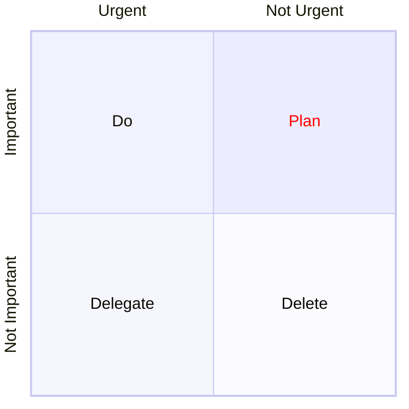

```mermaid
%%{init: {"quadrantChart": {"chartWidth": 400, "chartHeight": 400}, "themeVariables": {"quadrant1TextFill": "#ff0000"} }}%%
quadrantChart
  x-axis Urgent --> Not Urgent
  y-axis Not Important --> "Important"
  quadrant-1 Plan
  quadrant-2 Do
  quadrant-3 Delegate
  quadrant-4 Delete
  control of brain: [0.15, 0.90]
  body maintenance: [0.25, 0.75]
  major skills: [0.75, 0.85]
  English: [0.65, 0.70]
  interferences of volition: [0.75, 0.25]****
```




