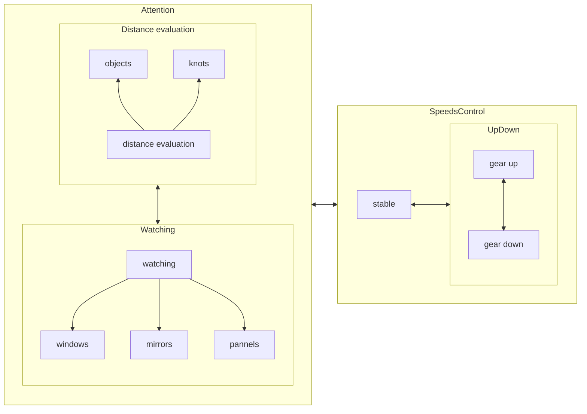

| gear  | range | upshift at | dest  | downshift at | dest  |
| :---: | :---: | :--------: | :---: | :----------: | :---: |
|   1   | 00-20 |    #15+    |  +2   |              |       |
|   2   | 05-30 |    #25+    |  +3   |     #10-     |  -1   |
|   3   | 15-40 |    #35+    |  +4   |     #20-     |  -2   |
|   4   | 25-50 |    #45+    |  +5   |     #30-     |  -3   |
|   5   | 35-60 |            |       |     #40-     |  -4   |

https://www.yoojia.com/wenda/597250.html?fromtype=top1

### steering wheel

↪️↩️🔄🔃

``` 
 initial state
    _______
   /       \
  |         |
  |————○————|
  |    |    |
   \___|___/
 
 1/4, from ↩️              
    _______
   /   |   \
  |    |    |
  |----○    |
  ||||.|    |
   \||.|___/


 half lap, from ↩️              
    _______
   /||.|   \
  ||||.|    |
  |————○————|
  |||||.    |
   \|||.___/

 3/4 lap, from ↩️
    _______
   /||.|.||\
  ||||.|.||||
  ||||.○----|
  ||||.|    |
   \||.|___/

 a lap, from 🔃              
    _______
   /       \
  |         |
  |————○————|
  |    |    |
   \___|___/

```


### shift gears

```
    1   3   5
    │   │   │
    ├───┼───┤
    │   │   │    
    2   4   R
```
moving gear lever, from center 
- gear 1: from left to top
- gear 2: from left to down
- gear 3: center to top
- gear 4: center to bottom
- gear 5: right to top
- gear R: right to bottom

---

0. to step clutch down
1. to move gear lever to target gear


### upshift 

before upshift, to speed up to target gear.

### downshift

before downshift, to speed down to target gear.  

### State conversion when driving



### Environment evaluation

