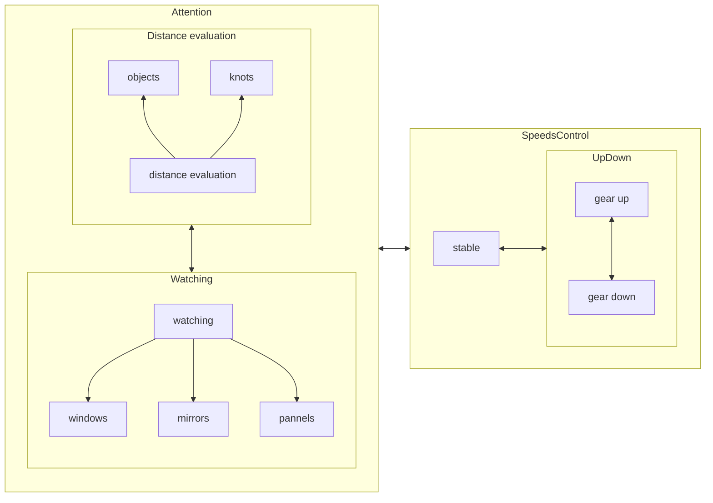

| gear  | range | gear up at | dest  | gear down at | target |
| :---: | :---: | :--------: | :---: | :----------: | :----: |
|   1   | 00-20 |    #15+    |  +2   |              |
|   2   | 05-30 |    #25+    |  +3   |     10-      |   -1   |
|   3   | 15-40 |    #35+    |  +4   |     20-      |   -2   |
|   4   | 25-50 |    #45+    |  +5   |     30-      |   -3   |
|   5   | 35-60 |            |       |     40-      |   -4   |

https://www.yoojia.com/wenda/597250.html?fromtype=top1

### State conversion when driving

### Environment evaluation

