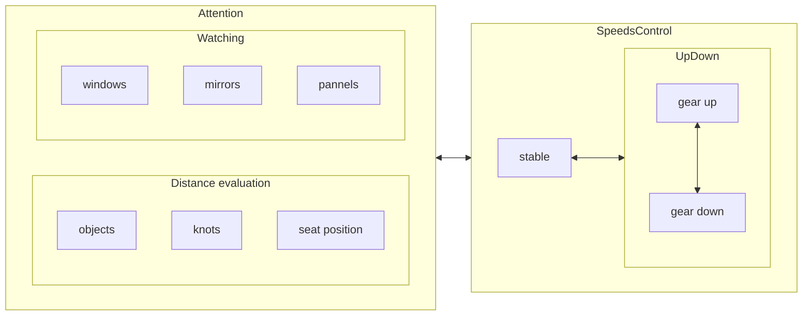

to check that speed ranges again.

| gear  | upshift at | dest  | downshift at | dest  | range | range2 |
| :---: | :--------: | :---: | :----------: | :---: | :---: | :----: |
|   1   |    #15+    |  +2   |              |       | 00-20 | 00-20  |
|   2   |    #25+    |  +3   |     #10-     |  -1   | 05-30 | 10-30  |
|   3   |    #35+    |  +4   |     #20-     |  -2   | 15-40 | 20-40  |
|   4   |    #45+    |  +5   |     #30-     |  -3   | 25-50 | 30-50  |
|   5   |            |       |     #40-     |  -4   | 35-60 | 50-??  |

https://www.cnblogs.com/arxive/p/5551052.html

https://www.yoojia.com/wenda/597250.html?fromtype=top1


### shift gears

0. to step clutch down
1. to move gear lever to target gear

---

moving gear lever, from center 
- gear 1: from left to top
- gear 2: from left to down
- gear 3: center to top
- gear 4: center to bottom
- gear 5: right to top
- gear R: right to bottom
  
```
    1   3   5 
    │   │   │
    ├───┼───┤
    │   │   │
    2   4   R
```

<details>
<summary>6 gears</summary>

```
    R   1   3   5 
    │   │   │   │
    └───┼───┼───┤
        │   │   │
        2   4   6
```

</details>


---

### upshift 

before upshifting, to speed up a range like `[1-4]5`, then shift to target gear.

### downshift

before downshifting, to speed down a range like `[1-4]0`, then shift to target gear.  

### steering wheel

↪️↩️🔄🔃

``` 
 initial state
    _______
   /       \
  |         |
  |————○————|
  |    |    |
   \___|___/
 
 1/4 lap, from ↩️              
    _______
   /   |   \
  |    |    |
  |----○    |
  ||||.|    |
   \||.|___/


 half lap, from ↩️              
    _______
   /||.|   \
  ||||.|    |
  |————○————|
  |||||.    |
   \|||.___/

 3/4 lap, from ↩️
    _______
   /||.|.||\
  ||||.|.||||
  ||||.○----|
  ||||.|    |
   \||.|___/

 a lap, from 🔃              
    _______
   /       \
  |         |
  |————○————|
  |    |    |
   \___|___/

```

### State conversion when driving



### Environment evaluation

### Weather estimation

