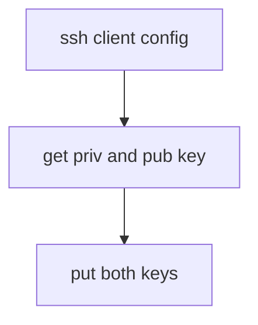
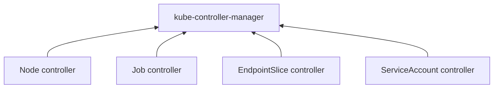
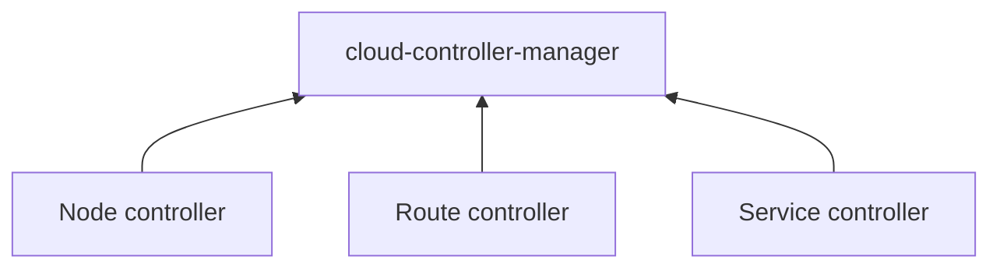
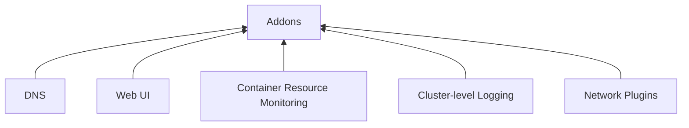
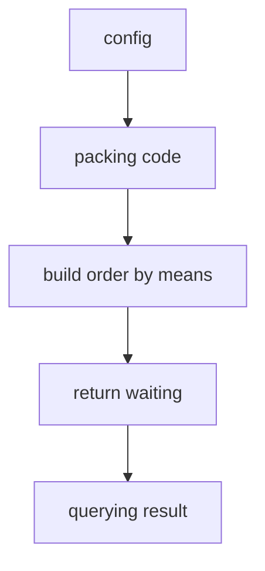
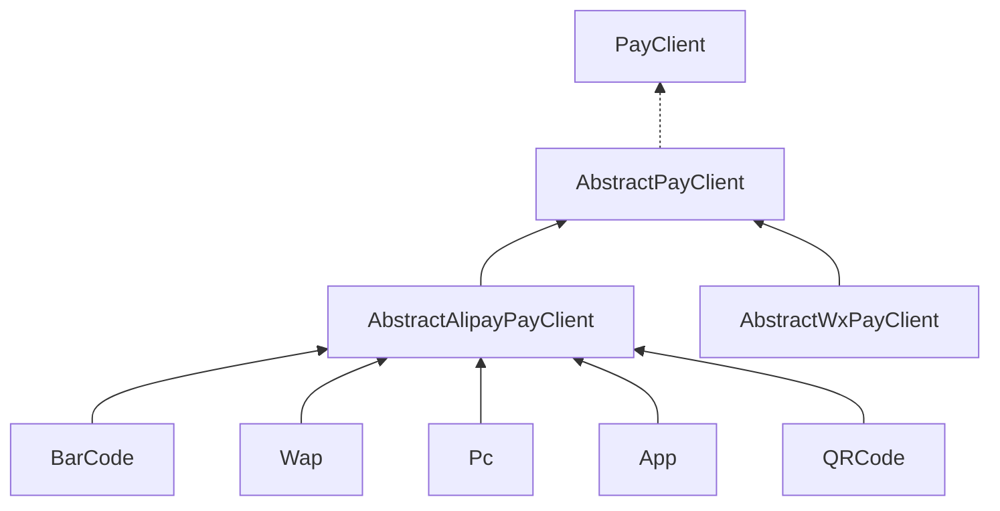

# Archived log

### 24-01-31
#### summary meeting
#### documenting for meeting
#### reading history 
[examples uml](https://www.visual-paradigm.com/guide/uml-unified-modeling-language/what-is-uml/)
[specification](https://www.omg.org/spec/UML)


### 24-01-30
#### mongodb concepts
- collections: common, capped collection, clustered collection
- views: views(no to disk), on-demand materialized view(to disk)
- document:structure, Document Size Limit, BSON types
- query api: Aggregation pipelines, CRUD Operations

#### uml
- association 
- aggregation

#### mysql
- lag()(lagging current row within partition) over(order by field)(for parting partitions)

### 24-01-29
#### es concepts
- use scenarios: searching、analysing
- inverted index: `keys -> values` to `values -> keys`
- data structure: `index = collection of documents, each document is collection of fields`
- Quering types
  - structured queries.
  - full text queries.
  - complex queries that combine the two.

#### sql
- questions
- `having, group by`
- `between ... and ...`
- `dateField <= 'date'`
- `DATE_SUB('2019-07-27',INTERVAL 30 day)`
- `DATE_ADD('2019-07-27',INTERVAL -29 day)`

#### mongodb

- [bsontypes](https://www.mongodb.com/docs/manual/reference/bson-types/#std-label-bson-types)

#### virtual box
- remote desktop

#### reading history
- [w3s sql](https://www.w3schools.com/sql/default.asp)

### 24-01-26
#### es
- query api: search, post filter, sort, query and filter context calculate **relevance score**
- mapping: dynamic mapping, explicit mapping 

#### jmeter
- [tutorial](https://segmentfault.com/a/1190000021818653)
- [web test](https://jmeter.apache.org/usermanual/build-web-test-plan.html)

#### canal(mysql data to somewhere)
- [doc](https://github.com/alibaba/canal)

### 24-01-25
#### NGINX configuration
- config hierarchy: `http->server->location`
- config folder and config files uses
    - `include conf.d/*.conf` inside `nginx.conf`, which is root config.
    - in conf.d folder only `server` and `location` block inside files.

#### ssh abnormal because of updating
- before `ssh -t root@192.168.0.242 'cd /home/x ; bash'`
- after `ssh -t root@192.168.0.242 "cd /home/x ; bash"`

#### terminal exceptions
- reinstall operating system to win10

#### reading history
- [mardown snippet](https://blog.csdn.net/qq_36171287/article/details/118732360)

### 24-01-24
#### ssh priv/pub key sign in(win to linux)



#### rocketmq

- Summaried message types: commom msg, timed msg, tx msg
    - senarios
- Comprehended deeply to XA pattern
Object Names and IDs

#### k8s
- Labels and Selectors
- running pods in service

### 24-01-23

#### k8s

running pods in service

##### Management techniques(Kubernetes Object Management)
* [object definition](https://kubernetes.io/docs/reference/generated/kubernetes-api/v1.29/#api-groups)


Management technique | Operates on	| Recommended environment |	Supported writers |	Learning curve
|:---|:---:|:---:|:---:|:---:|
Imperative commands	             | Live objects	        | Development projects	| 1+	| Lowest
Imperative object configuration	 | Individual files	    | Production projects	  | 1	  | Moderate
Declarative object configuration | Directories of files	| Production projects	  | 1+	| Highest

##### kube-controller-manager(control plane)

- Node controller: Responsible for noticing and responding when **nodes** go down.
- Job controller: Watches for Job objects that represent **one-off tasks**, then creates Pods to run those tasks to completion.
- EndpointSlice controller: Populates EndpointSlice objects (to provide **a link** between Services and Pods).
- ServiceAccount controller: Create default **ServiceAccounts** for new namespaces.


##### cloud-controller-manager(control plane)



 lets you link your cluster into your cloud provider's API, and separates out  
 the components that interact with that cloud platform *from components that  
 only interact with your cluster.*


- Node controller: For checking the cloud provider to determine if a node has been   
  deleted in the cloud after it - stops responding
- Route controller: For setting up routes in the underlying cloud infrastructure
- Service controller: For creating, updating and deleting cloud provider load balancers

##### Addons


#### shell script
* sed
* commands generation

#### payment


#### mermaid
- shapes

#### reading history
- [md snippet](https://www.jianshu.com/p/a87e9ca2d208)

### 24-01-22

#### disk magement

- extends the logic volume: creates a partition, adds to Free PE, extends to logic volume.
* [extends Free PE size](https://www.linuxtechi.com/extend-volume-group-size/)
* [extends Free PE size 2](https://blog.csdn.net/qq_40137850/article/details/110630758)

#### mermaid

- flowchart directions: TB,TD; BT; LR; RL
- classDiagram 

#### sftp(client)

### 24-01-20
#### kubernetes
* config
* service manages and routes pods by selector

#### postgresql
* 9.5 because of win7
#### 

### 24-01-19 (E)
#### E
- (vscode plugin) Markdown Preview Mermaid Support

#### mermaid for .md
- class diagram
- procedure diagram 

#### Alipay




#### backend

* mapstruct
    * usages
    * BeanUtil
* global exception handler

#### k8s concepts(a lot)
- components 
    - control panel components(api, scheduler, etcd, controller manager)
    - node components(kubelet, kube-proxy, crt)
    - addons
- networkmodel, Services, Load Balancing, and Networking
    
- workloads
    - pods
- workloads management apis
    - deployment 
    - statefule set
    - daemonset


#### reading history
- [k8s concepts](https://kubernetes.io/zh-cn/docs/concepts/overview/)

### 24-01-18

#### springboot
* dependencies usages
* modularized design
* [data definition](https://www.iocoder.cn/Spring-Boot/MapStruct)

#### mybatis
* [mybatis annotation](https://www.baeldung.com/mybatis)
* [mybatis](https://mybatis.org/mybatis-3/getting-started.html)
* Data accessing means for dal
    * Combinded search, mb-p(from ry-p)
    * Searching all in one, hibernate(from eladmin)
    * Searching all in one, mybatis(from ry)

#### maven pom
* dependency management 
* plugin configuration 
* compiler
    * configuration for customized annotation processor  
* compile-mojo
    * [compile-mojo](https://maven.apache.org/plugins/maven-compiler-plugin/compile-mojo.html)


#### reading history 
* [pom references](https://maven.apache.org/pom.html)
* [spring boot dm](https://docs.spring.io/spring-boot/docs/current/reference/htmlsingle/?spm=5176.28103460.0.0.23fd3f993VMmKo#using.build-systems.dependency-management)
* [Write-a-Compiler](https://norasandler.com/2017/11/29/Write-a-Compiler.html)

### 24-01-17
#### configuration to jpa testing
* dependency
* h2 configured, hibernate naming strategy and format_sql
* repositories and beans to tables configured 
* unit test context configured, because of no the whole app
* conflict with normal running 

#### podam

* [java.sql.timestamp](https://github.com/mtedone/podam/issues/212)
```java
if (Timestamp.class.equals(attributeMetadata.getPojoClass())) {
    return PodamUtils.getIntegerInRange(0, 999999999);
} else {
    return super.getInteger(attributeMetadata);
}
```

### 24-01-16
#### jpa testing
* spring context
* h2
* app

#### naming when using existing db
```
https://stackoverflow.com/questions/32165694/spring-hibernate-5-naming-strategy-configuration
@Bean
public LocalContainerEntityManagerFactoryBean entityManagerFactory(DruidDataSource dataSource) {
    final LocalContainerEntityManagerFactoryBean em = new LocalContainerEntityManagerFactoryBean();
    em.setDataSource(dataSource);
    em.setPackagesToScan(new String[] {
            "me.zhengjie.modules.system.domain",
            "me.zhengjie.modules.mnt.domain",
            "me.zhengjie.modules.quartz.domain"
    });
    final Properties hibernateProperties = new Properties();
    hibernateProperties.put("hibernate.implicit_naming_strategy", SpringImplicitNamingStrategy.class.getName());
    hibernateProperties.put("hibernate.physical_naming_strategy", SpringPhysicalNamingStrategy.class.getName());
    em.setJpaVendorAdapter(new HibernateJpaVendorAdapter());
    em.setJpaProperties(hibernateProperties);
    return em;
}
```


### 24-01-15
#### spring boot testing
* testing with mybatis
    * test-based env: yml, context, h2 db
    * creating sql, removing sql
    * integrated with existed services and mappers
* testing with spring data jpa

#### reading history
* [jpa](https://www.baeldung.com/spring-jpa-test-in-memory-database)

### 24-01-12
```
time.sleep(3)
pyautogui.moveTo(303,75)
time.sleep(3)
pyautogui.dragTo(1090,477,duration=5)
```

#### note
* saving file
* considering different files, like download file, capture screen.

#### vue
* crud component
#### java
* common response

#### python
* same node, because of same array.
* spider action-oriented, a simulation for user actions.
* action wrapper flowcharts
* responsibility of chain, decorator

#### reading history
* [coordinate](https://www.xitongzhijia.net/soft/192065.html)

### 24-01-11 E()
#### E
* Code reading, idea 2021.2.2 and [restter](https://zhile.io/2020/11/18/jetbrains-eval-reset-deprecated.html/comment-page-2#comments)

#### vue & devtools
* slot: default, named `<tag #slotName></tag>`
* props

#### uml & code note

#### scss & sass & crud components
* {}
* indented

#### reading history
* [sqlitebrowser](https://sqlitebrowser.org/blog/version-3-12-0-released/)
* [crud components](https://kailong110120130.gitee.io/vue-element-plus-admin-doc/hooks/useCrudSchemas.html)
* [pygui doc](https://pyautogui.readthedocs.io/en/latest/mouse.html#mouse-movement)
* [py generic](https://docs.python.org/zh-cn/3/library/typing.html?highlight=%E6%B3%9B%E5%9E%8B#user-defined-generic-types)

### 24-01-10 E(3)
#### E
* PyAutoGui | capture
* vscode code block highlight：ctrl+,打开搜索框输入brack pair找到如下图的两个红框将其选为active即可
* 程序员jiankang指南

#### codetour, vscode

* [doc](https://github.com/microsoft/codetour?tab=readme-ov-file#codetour-flavored-markdown)
* [idea](https://plugins.jetbrains.com/plugin/19227-codetour)

* workspace at `.tour` within project root.
* references steps, by number: `[#1]`, by title: `[title][#1]`
* references tours, by number: `[tour#1]`, by title: `[title][tour]`
* references files, `[file][.\file.html]` from workspace. **must** `.\` or `./`

#### vue3
* elementsui-plus
* update:field
* a children component communicates with outside 


### 24-01-09 E(3)

#### E
* (markdown all-in-one)
* apifox
* codetour

#### vscode
* md-preview plugins

#### maven
* jdk21
* setting JAVA_HOME with particular version in /bin/mvn

#### vue3
* custom component
* vite: `ImportMetaEnv` type of .env.
* watchers: triggered when listened data is changed.
* define things in SFC use definexxx
* code reading tool

#### py 

<details>
    <summary>py</summary>

```python

# download path
# https://chromedriver.chromium.org/capabilities
prefs = {
    'download.default_directory': downloadDir,  # 设置默认下载路径
    "profile.default_content_setting_values.automatic_downloads": 1,  # 允许多文件下载
}
# options.add_experimental_option("debuggerAddress", "127.0.0.1:18080")
options.add_experimental_option("prefs", {})
options.debugger_address = "127.0.0.1:18080"

#create folder and copying file
import os
import shutil

if __name__ == '__main__':
    source_file = r"D:\liaoyj\Developer\Python\object-oriented\config.ini"
    folder_path = r"D:\liaoyj\Developer\Python\object-oriented\atest"

    if not os.path.exists(folder_path):
        os.mkdir(folder_path)

    shutil.copy(source_file, folder_path)
```

</details>


### 24-01-08 (E4)
#### (E)
* reading word separately
* (ban ads by searching script via debugging)
* (wrapped environment in project, e.g menv.bat)
* vscode bookmark

#### mall
* tables on vscode by reverse engineering.
* custom component 

#### config
* vite: index.html, .env(.ts), plugins
* ts: compilerOptions、include, declared some components to use、exclude, declared things not to use.

#### pinia like a db
* stores data when app running.
* defining after init

#### 


### 24-01-05
#### uml
* understanding the multiplicity of relationships, for opposite use.

#### vue2
* app structure, routerview structure
* template grammar
* v-bind, v-on, v-model
* scaffold

#### vue3
* installing node with tricks on win7, suppressed warning by added environment.
* packing tool vite 
* debugging very easy, just run it.

#### reading history
* [uml2.0#Bi-directional (standard) association
](https://developer.ibm.com/articles/the-class-diagram/)

### 24-01-04
#### code generation(singular), yudao-module-infra
* use template engine and data to fill template predefined in project.
* configurations for templates, CodegenEngine#320#initBindingMap
* code: yudao-module-infra-biz > controller > admin > codegen
* template: yudao-module-infra-biz > resource

#### er-diagram

<details>
    <summary>pictures</summary>


    

    
</details>


#### uml & flowcharts
* flowcharts: oval, box, diamond, parallelogram
* class diagram: aggregation, association, dependency, realization, generalization
* flowcharts
    * Oval symbol    : Terminal
    * Parallelogram  : Input/Output
    * Diamond symbol : Decision
    * Box            : Processing
    * Circle         : Connectors


<details>
    <summary>description</summary>
    
```

Contact ————————◆ AddressBook 
   0..*         0..*
-contains

Contact: be contained in AddressBook object zero or more.
AddressBook: be contained in Contact obj zero or more.

a ———— ◆ b：这表示组合（Composition）关系。实心菱形（◆）意味着类a包含或拥有类b的实例，并对b的生命周期负责。如果类a被销毁，则其包含的所有b实例也将随之销毁。这是一种强耦合关系，通常用于表示“部分-整体”的关系，其中部分不能脱离整体独立存在。

a ———— ◇ b：这表示聚合（Aggregation）关系。空心菱形（◇）表达的是类a包含或拥有类b的实例，但b实例可以独立于a存在，即使没有a，b也可以作为一个独立的对象存在于系统中。这是一种相对弱一些的耦合关系，体现的是“整体由部分组成，但部分可以属于多个整体或独立存在”。

```
    
</details>

#### reading history
* [er-diagrams](https://www.lucidchart.com/pages/er-diagrams)
* [er-diagrams2](https://drawio-app.com/blog/entity-relationship-diagrams-with-draw-io/)
* [class diagrams](https://drawio-app.com/blog/uml-class-diagrams-in-draw-io/)


### 24-01-03
#### openfeign
* extension to interface: FeignClient ----> ServiceInterface <---- Controller

#### uml
* implementations, generalizations, dependencies, aggregations

#### py
* chain of responsibility for file processor
* py context in generic
* also in polymorphic
* reconstruct folder

#### reading history
* [uml2](https://sparxsystems.com/resources/tutorials/uml2/index.html)

### 24-01-02 cploar(ingress)
#### open feign
* create client
* reference client by name and create interface 
* call interface 


#### spring gateway
* basic usage
* using with nacos by configuration
* using with registry of nacos
* canary strategy

#### miniprogram
* template
* configs, app.js, app.json, wxss
* grammar wxml

#### projectreactor
* mono object, definition of actions.
    * timeline left to right, circle, vertical line, dotted line, X mark, box and text inside it.

#### java
* functional interface, with override-equivalent signatures inherited from superinterfaces
* class
    * A member class of an interface is implicitly static so is never considered to be an inner class.
    
    
#### reading history
* [projectreactor](https://projectreactor.io/docs/core/release/reference/index.html)
* [mono](https://projectreactor.io/docs/core/release/reference/index.html#mono)
* [marks](https://projectreactor.io/docs/core/release/reference/index.html#howtoReadMarbles)
* [functional interface](https://docs.oracle.com/javase/specs/jls/se11/html/jls-9.html#jls-9.8)

<details>
    <summary>Pending</summary>    
   
* s
    * smartgit 18.2
    * debug: call stack、trail from thrown error、debugger from chrome and vue devtools
    * instructions from anywhere, e.g:cmd help
    * configuration
    * distributed methodologies for programming
    * 依赖包版本统一
    * 国内软件包代理
    * 查看更新日志
    * 二进制数据结构   
    * spacesniffer
* 文档 https://datatracker.ietf.org/doc/html/rfc6749
* 度量方法 https://blog.csdn.net/Sunnyside_/article/details/116460238
* -------https://www.geeksforgeeks.org/
* https://mirrors.tuna.tsinghua.edu.cn/help/AOSP/
* https://www.github-zh.com/
* 二进制 https://juejin.cn/post/7116515847635468318#heading-14
* https://riteme.site/blog/2016-3-12/2-3-tree-and-red-black-tree.html#_5

```txt

### 
####  
#### 
#### 

```
</details>

### 23-12-29

#### [py di](https://github.com/ets-labs/python-dependency-injector)
* create a container, @inject on method.

#### spring boot(2.7.8) non-web, annotation-based application
##### SpringApplication#304#createApplicationContext()
* `DefaultApplicationContextFactory`
    * `#46#create()`
    * `#57#getFromSpringFactories()`
        * BiFunction<ApplicationContextFactory, WebApplicationType, T> action
            * Caller, Argument, Return type

* (spring framework 5.3.x) loading classes from META-INF/spring.factories
    * `SpringFactoriesLoader#95#loadFactories`
    * `SpringFactoriesLoader#144`
        * breakpoint at `#147` url processing, urls can be filepathes on filesystem, network addresses(ftp, ws, http), filenames within jar...
        * `spring-core:5.3.x#PropertiesLoaderUtils#143#fillProperties` loading from InputStream

##### SpringApplication#307#refreshContext(context)
* `AbstractApplicationContext#504#refresh()`
* `prepareRefresh() -> getEnvironment()` is `StandardServletEnvironment()`
* `obtainFreshBeanFactory() -> GenericApplicationContext#getBeanFactory()`


#### reading history
* [di_in_python](https://python-dependency-injector.ets-labs.org/introduction/di_in_python.html)

#### BiFunction
```
public interface Greeting {String greeting(String something);}

public class Hi implements Greeting{
    @Override
    public String greeting(String something) {
        System.out.println("Hi " + something);
        return "Hi";
    }}
    
public class Hello implements Greeting{
    @Override
    public String greeting(String something) {
        System.out.println("hello "+something);
        return "hello";
    }
}


    @Test
    public void biFunctionTest(){

        Greeting hello = new Hello();
        Greeting hi = new Hi();

        caller(Greeting::greeting, hello, "joey");
        caller(Greeting::greeting, hi, "chandler");
//        BiFunction<ApplicationContextFactory, WebApplicationType, ConfigurableApplicationContext> create = ApplicationContextFactory::create;
    }

    public void caller(BiFunction<Greeting, String, String> action, Greeting candidate, String something){
        action.apply(candidate, something);
    }
    
    
hello joey
Hi chandler

```

#### Supplier
* just a callback to get objects.

```

    @Test
    public void supplierTest(){

        Hello caller = caller(Hello::new);
        caller.greeting("joey1");
    }

    public <T> T caller(Supplier<T> defaultResult){
        return defaultResult.get();
    }
```


### 23-12-28
#### string segmentation
* done for using pandas as string segmentation tool.
* enhancement for for loop \[\]
* enhancement for dependencies use.

### 23-12-27
#### string segmentation
* on another machine has the same situation, then install the library of VC++ 15-22 fix that problem cannot run python.exe
* found that xlwings can't work normally when it be packed as exe runnable file. tried on another library called "Pandas", it can work when be packed to exe but a need to alter operation of excel.

#### mysql 
* [LeetCode#1341](https://leetcode.cn/problems/movie-rating/description/?envType=study-plan-v2&envId=sql-free-50)
    * querying respectively
    * union (all)
* [LeetCode#577](https://leetcode.cn/problems/employee-bonus/description/?envType=study-plan-v2&envId=sql-free-50)
    * be careful null value
* [LeetCode#596](https://leetcode.cn/problems/classes-more-than-5-students/?envType=study-plan-v2&envId=sql-free-50)
    * where | group by | having
    * where, could not be used with aggregation functions, processing limitation to single line.
    * having, used with functions, processing grouping to a result set.
    
#### 

### 23-12-26
#### string segmentation
* help colleage to fix environments on computer by intalling vs c++ 15-22.
* enhancements for using program, just two things to do, one is editing config.ini and creating workspace, another one is clicking launch.bat

#### mysql
* [LeetCode#1251](https://leetcode.cn/problems/average-selling-price/description/?envType=study-plan-v2&envId=sql-free-50)
    * group by
        * SUM
        * Round(value, points)
        * IFNULL(calculated,default)
    * inner query must have a alias
        * ... from ( select ... ) A ...
* [LeetCode#1075](https://leetcode.cn/problems/project-employees-i/?envType=study-plan-v2&envId=sql-free-50)
    * functions: ROUND(value,points), IFNULL(value,default), AVG(value), SUM()

```SQL

# 1251
SELECT
    product_id,
    IFNULL(Round(SUM(sales) / SUM(units), 3), 0) AS average_price
FROM (
    SELECT
        Prices.product_id AS product_id,
        Prices.price * UnitsSold.units AS sales,
        UnitsSold.units AS units
    FROM Prices 
    LEFT JOIN UnitsSold ON Prices.product_id = UnitsSold.product_id
    AND (UnitsSold.purchase_date BETWEEN Prices.start_date AND Prices.end_date)
) T 
GROUP BY product_id;

```


#### 

### 23-12-25
#### string segmentation
* reconized and separated by zh
* marked some strings which are't processed.
* updated doc

#### elasitcsearch
* using json data and added some date for the purpose to test
* common search, ranges search, compound search
* text analysis, unstructured text into structured text for body of email, body of article.

#### spring context 5.3.25
* starting to load configurations [refresh#545](org/springframework/context/support/AbstractApplicationContext.java)

* getting package to scan [parse#119](org/springframework/context/annotation/ComponentScanAnnotationParser.java)

#### reading history
* [spring context, doScan](org/springframework/context/annotation/ClassPathBeanDefinitionScanner.java#272)
* [names for testing](https://github.com/aruljohn/popular-baby-names)

### 23-12-22
#### string processing
* done for filling file.

#### decorator in python
* class decorator
* method decorator

#### spring boot running
* ConfigurationClassPostProcessor
* AbstractApplicationContext.java#invokeBeanFactoryPostProcessors(beanFactory);
* package path from environment
* scanning annotation qualified under path

#### reading history
* [decorators](https://www.runoob.com/w3cnote/python-func-decorators.html)

### 23-12-21
#### -kafka
* event(files in a foler), producer, consumer, topics(like a foler), partitioned(for topic), broker

#### send email
* configing via ssmtp
* sending via mail provided by mailutils

#### reading history
* [mailutils doc](https://mailutils.org/manual/mailutils.html)
* [mailutils 配置](https://blog.csdn.net/u010953692/article/details/121744436)
* [concepts](https://kafka.apache.org/documentation/#intro_concepts_and_terms)
  * An **event** records the fact that "something happened" in the world or in your business.


### 23-12-20
#### rabbitmq
* Direct exchange(Empty string). default action, bound to queue with a routing key.
* Fanout exchange. by the relationship bound to queue(s), sending message to all bound queue(s).
* Topic exchange. it has a particular pattern to route message to queue.
* Headers exchange. using the key value pair as header to route message.
* batch mode. 
* requeue, when message is sent failed within particular counts.
* transaction message, working with @Transaction

#### linux
* redirect input and output
    * 0(stdin),1(stdout),2(stderr),3+(file descriptor)
    * \>(redirecting stdout and overwrited), >>(redirecting stdout and appended)
    * &>(redirecting stdout, stderr and ... ), &>>
    * < ,stdin
* pipeline
    * cat file | grep str
* awk
    *  ip addr | grep 'inet ' | tee ip
    *  awk -F"/" '{system("echo " $1)}' ip    

#### reading history
* 在多个消费者进程共同分摊消费压力的情况下如何保证消息被顺序消费
    * 生产者和消费者根据不同hashkey绑定到不同的消息队列
* [linux io重定向](https://www.cnblogs.com/gao0722/p/15026546.html)

### 23-12-19
#### zookpeer
* concepts: znode, ephemeral node, Sequence Nodes, watch 
* service discovery, configuration center, auto-refreshing, multi-profile

#### rabbitmq
* concepts: publisher, consumer, message, exchange(maillbox or post office), bindings(to route messages to queues)
* message statuses: acknowledged, rejected, negative acknowledgements
* examples

#### spring framework
* key interfaces: BeanFactory and its subinterfaces, application context and its subinterfaces and classes implemented it
* context hierarchy, refresh().
* bean initialization

#### reading hisory
* [amqp-concepts](https://www.rabbitmq.com/tutorials/amqp-concepts.html)

### 23-12-18
#### reactor programming 
* future、computableFuture
#### load balancer
* choose instances via service discovery by the version、tag、weight
#### wechat pubaccount

#### reading history
* [ComputableFuture](https://www.cnblogs.com/cao-lei/p/17241132.html)
* [supplier](https://blog.csdn.net/Maxiao1204/article/details/131673060)
* [FutureTask](java/util/concurrent/FutureTask.java)
* [loadbalancer](https://docs.spring.io/spring-cloud-commons/docs/4.0.4/reference/html/#spring-cloud-loadbalancer)
* [global-filters](https://docs.spring.io/spring-cloud-gateway/docs/4.0.6/reference/html/#global-filters)
* [writing-custom-global-filters](https://docs.spring.io/spring-cloud-gateway/docs/4.0.6/reference/html/#writing-custom-global-filters)

### 23-12-15 appending via tab 
#### innodb cluster
* dissolve cluster
#### ndb cluster
* on windows, starting failed, because of the slash problems to directory, can't open the .log
* on linux, the installation tutorial can't map to the downloaded resources, so to be hung up.
    * configured three unubtus which are server version.

```
[ndbd]

HostName=198.51.100.40 # Hostname or IP address

NodeId=3 # Node ID for this data node
# on this machine
DataDir=/usr/local/mysql/data # Directory for this data node's data files
```

#### mybatis

#### reading history
* ssh -t root@192.168.0.240 'cd  /home/x/ ; bash'
* [ubuntu doc#Static IP address assignment](https://ubuntu.com/server/docs/network-configuration)

### 23-12-14
#### innodb cluster
* There are differences after configured innodb cluster, group replication is stated by shell not from mysql's commands, subnetworks maybe to alter as needed also, and look at carefully to the \*.err to find somthing out.
* Checking out steps previously, in order not to do repeatedly.
* ipv6 support

```
addtional config from .err output
[mysqld]
group_replication_ip_allowlist= "169.254.0.0/12"
```

#### mgr requirements and limitations
* primary key on every talbe
* concurrent DDL & DML, serializable, Foreign Keys with Cascading Constraints, are'nt support on muti-primary mode

#### mysql administration
* show variables, show status, mysql schema
* Chapter 27 MySQL Performance Schema

#### bean factory

#### reading history
* 5.1.13 IPv6 Support

### 23-12-13
#### transaction
* xExtended Architecture
* profile from maven

#### innodb cluster
* based on MGR, to provide some features to management, like routing, configuring, adminapi, add, remove
* group replication, innodb cluster, shell, router.

#### remote mysql shell
* configured on win10
* conflict with bind-address
* 8.0.25

#### annotation processor


#### reading history
* [baeldung](https://www.baeldung.com/)
* [it github](https://github.com/eugenp/tutorials)
* [jta](https://www.baeldung.com/jee-jta)
* [innodb cluster](https://dev.mysql.com/doc/mysql-shell/8.0/en/mysql-innodb-cluster.html)

### 23-12-12
#### mgr
* deferences with common replication: failover, master selection, multi-primary, consistency
* plugin mechanism MySQL Server <-> Group Plugin
* testing: connection, failover
* limitations: 9 nodes in a group, transations limited in 5 seconds when messages are large enough during copying between members.
    * variables: compression_threshold, max_message_size

#### tx of spring, dependencies conflict, based on existed projects testing.

#### ndb(in-memory)
* concepts: management node, data node, sql node(api node)

#### reading history
* [tabby](https://github.com/Eugeny/tabby)
* [configuring ip manually](https://blog.csdn.net/weixin_44654329/article/details/121920813)
* [网关](https://blog.csdn.net/QJing_shijia/article/details/116448245)
* [网卡](https://blog.csdn.net/yilovexing/article/details/126424086)
* [17.1.3, Replication with Global Transaction Identifiers]()

### 23-12-11
#### mysql data types
* numeric types
    * tinyint(2^8), smallint(2^16), mediumint(2^24), int(2^32)(integer), bigint(2^64)
    * decimal, DECIMAL(M,S)
    * float, double
* date types
    * date, e.g 2000-11-04
    * datetime[(fraction)], e.g: datatime(3), 2000-11-04 11:04:04.222
    * timestamp[(fraction)](timezone related), e.g: timestamp(3), 2000-11-04 11:04:04.222
* mysql group replication(single primary)
    * feature: master selection
    * version is mysql 8.0.35

#### reading history
* [mysql8.0.35 install](https://blog.csdn.net/weixin_55629817/article/details/134381183)
* [fixed-point-types](https://dev.mysql.com/doc/refman/8.0/en/fixed-point-types.html)
* [integer-types](https://dev.mysql.com/doc/refman/8.0/en/integer-types.html)
* [floating-point-types](https://dev.mysql.com/doc/refman/8.0/en/floating-point-types.html)
* [datetime](https://dev.mysql.com/doc/refman/8.0/en/datetime.html)
* [mysql reference8.0#18.1.3.1 Single-Primary Mode]()

### 23-12-8
#### posgresql
* array
* json
    * operators
        * ->key
        * ->index(object, for an array)
        * ->>index(text, for an array)
        * #>>{array,index}

#### spring security
* filter hierarchy
    * a initialization system derived from abstraction layer, interfaces and wrapperd interfaces also abstract classes added some common features.
* filter theory in running
    * used a proxy as servlet filter it delegates all actions from spring security filter.
* used by the auto configuration

#### shiro details
* configuration
* Realm

#### reading history
* [security servlet/architecture](https://docs.spring.io/spring-security/reference/5.8/servlet/architecture.html)
* [json operator](https://www.postgresql.org/docs/10/functions-json.html)

### 23-12-7
#### tricks
* to select text by double clicks, then set bookmark.
* ctrl+shift+v, ignored format
* alt+f7, found usages
#### redis
* serializer
    * jdk，string，json
    * because data to be sent to redis is binary.
* pipeline
    * accelerate processing
* maxmemory policies    
* Bloom Filter

#### websocket
* saving connections
* broadcast and one-to-one

#### oauth2
* roles, client; ro; as; rs
* models, code; implicit; pwd; client
* details
#### reading history
* [redis distributed](https://www.iocoder.cn/Fight/Why-do-we-do-distributed-use-Redis/?self)
    * 6、Redis 和数据库双写一致性问题
    * 7、如何应对缓存穿透和缓存雪崩问题
    * 8、
* [websocket](https://www.iocoder.cn/Spring-Boot/WebSocket/)

### 23-12-6
#### spring security
* usage
* context building
    * impl -> context, holder held a impl
    * actions of impl delegate to holder strategy class identified by storage type(global, thread local, inheritable thread local)
* **authentication**, infos to use to authenticate. **AuthenticationProvider** to perform the action which is true authenticating, **ProviderManager** held a list of AuthenticationProvider that will been tried in order until one hit.
* StringSegmentation2
    * RawOrders > SortedOrders > calling all handlers in order
#### oauth2 sso
* authorization details, has scopes stored in redis.

### 23-12-5
* object creation in python by type(), but doesn't have code hint, because it differentiate form the class object.
* details in vue components usage, mixins; mixed use with component(curd), debugger of chrome and vue devtools
* comprehension to sso, it can login only once, shared in a software system.

### 23-12-4
* marked
* java usage
* enhancements for python usage


### 23-11-23---12-1
#### classifying text
* by regular expression or **compound ways** to match the text with tags
* to sort the found result via position which is came from matching, because of ordering result required
    * miscellaneous 
        * bordering problems, from tag mainly
        * sorting problems, by the equivalent values, if not, can use other values to redo this
        * callback problem, according to programming language
* according the handler to perform really splitting actions and return final result 
* with the final result to do the final action of putting which is stricted by requirements 

---


### 23-11-27
#### todo
* [ ] 1. replace chars in column g, except for chinese inside brackets indicated by brackets matching algorithm.
* [ ] 2. coding for mathing requirements.
* [ ] 3. to select processed orders in a cell of column G. 

#### the hardest things
* separating chinese
    * exceptions
        * in brackets: (), （）, （), (）, \[\], (\], \[), （], \[）, 【】.
        * nested brackets, parenthesis matching algorithm.
* testing quickly 
    * editor to perform matching to regular expression.


### 23-11-26

```python
class Solution:
    def merge(self, intervals: List[List[int]]) -> List[List[int]]:
        intervals.sort(key=lambda x: x[0])

        merged = []
        for interval in intervals:
            # 如果列表为空，或者当前区间与上一区间不重合，直接添加
            if not merged or merged[-1][1] < interval[0]:
                merged.append(interval)
            else:
                # 否则的话，我们就可以与上一区间进行合并
                merged[-1][1] = max(merged[-1][1], interval[1])

        return merged


'''
a = [0, 9]
b = [2, 6]

a[1] > b[0], overlapped


'''

# Press the green button in the gutter to run the script.
if __name__ == '__main__':
    import re

    left = ['（', '[', '【']
    right = ['）', ']', '】']
    strs = '【啦（啦，啦，啦）啦，啦】哈哈，你好（嘻；嘻，嘻,嘻），多大的[噜噜，噜噜]，多大的【卡卡，噜噜】'
    dq = deque()
    poss = []

    pattern = re.compile(r'\（|\）|[|]|【|】')

    for it in pattern.finditer(strs):
        seg = strs[it.start():it.end()]
        if left.__contains__(seg):
            dq.append(it.start())

        elif right.__contains__(seg):
            e = dq.pop()
            poss.append([e, it.start()])

        # print(seg)

    ranges = Solution().merge(poss)
    print(ranges)

    validPoss = []
    for x in re.compile(r'，').finditer(strs):
        contained = False
        for r in ranges:
            xs = x.start()
            r0 = r[0]
            r1 = r[1]
            cd1 = r0 <= x.start() <= r1

            if cd1:
                if contained is False:
                    contained = True
                    break

        if contained is False:
            validPoss.append(x.start())

    validPoss.insert(0,0)
    validPoss.insert(len(validPoss), len(strs))
    print(validPoss)

    for idx in range(0, len(validPoss) -1 ):
        print(strs[validPoss[idx]:validPoss[idx+1]])

```

#### regular expression
* greedy mode and non-greedy mode
* finding by another expression

### 23-11-23
#### reading explanation
* can be comprehended content
* can not be comprehended content
    * taking and writing 
* watch out other characters of string
    * numbers
    * special characters
    * other language
* can not be processed content by computer
* regular expression 
    * watch out the characters of pattern, like: -
* the hardest thing is format

```
import re

pattern = re.compile(r'[\d+!@#$%^&*()?-=+]')  # 匹配字符串中的特殊符号
result = pattern.findall('Hello! H=ow123 ar-e you?')
print(result)
```

###  23-11-22
#### SpEL
* querying and manipulating object graph at runtime

#### transaction of spring
* imperative transaction and declarative transaction
* conceps: atomicity, consistency, isolation, durability
* rollback by undolog

#### sprinboot自动装配原理
* 自动配置注解、组件扫描注解多个注解，构成SpringApplication注解
* 注解处理器，扫描META-INF/spring.factories

#### spring boot jpa
* test case，pageable，criteria
* apply DataSource manually

#### 消息队列和rpc
* 异步和同步通信

#### reading history
pd https://blog.csdn.net/qq_43263647/article/details/105377215

###  23-11-\[14-21\]
#### todo
* 处理结果不正确，因为访问单元格方式的问题，尝试分块处理和按单元格读取数据
* 将无法处理的和特殊的进行标记

#### 文本处理
* 利用非统一的条件逐渐统一格式

### 23-11-14
#### todo
* [ ] kubernetes
* [ ] preparation for string segmentation 

#### preparation for string segmentation
* powerful tools
    * python-3.8(full, not embedded) and its doc
    * xlwings for operation of excel and its doc
    * pycharm2020 and reseter

#### xlwings

#### k8s
* (node(pod(containers))), 对象

#### reading history
* [对象](https://kubernetes.io/zh-cn/docs/concepts/overview/working-with-objects/)
* [对象管理](https://kubernetes.io/zh-cn/docs/concepts/overview/working-with-objects/object-management/)

### 23-11-13
#### todo
* [x] to join a node into kubeadm cluster
* [x] to restore data by xtrabackup

#### kubernetes
* concepts
    * a pod is a container group.
* configured another virtual machine as a worker node, no need to run kubeadm init.
* ran `kubeadm join` command in order to get in the cluster. `kubeadm join your ip:6443 --token your token --discovery-token-ca-cert-hash sha256:your hash`
* running command to check out the cluster status on master node(also called control panel node). `kubectl get nodes`
* pulling an image to test cluster, here is nginx.
* checking out nginx status and visting on browser via the opened port. `kubectl get pod,svc`
* high available for control panel.

#### xtrabackup
* before resotring, to be prepared bacause of copying at runtime.` xtrabackup --prepare --apply-log-only --target-dir=bkps`, `--apply-log-only` according to full backup or incremental backup.
* do restore by `xtrabackup --copy-back --target-dir=bkps/`

#### dubbo usages
* [api](https://github1s.com/apache/dubbo/blob/HEAD/dubbo-demo/dubbo-demo-api/dubbo-demo-api-consumer/src/main/java/org/apache/dubbo/demo/consumer/Application.java)
* [xml](https://github1s.com/apache/dubbo/blob/HEAD/dubbo-demo/dubbo-demo-xml/dubbo-demo-xml-provider/src/main/resources/spring/dubbo-provider.xml#L35)

#### reading history
* [calico.yaml](https://github.com/projectcalico/calico/blob/master/manifests/calico.yaml)
* [setting cgroup](https://blog.csdn.net/u012140251/article/details/109999714)
* [pods](https://kubernetes.io/docs/concepts/workloads/pods/)

---

<details>
    <summary>测试kubernetes集群</summary>     
    
在master中执行，在Kubernetes集群中创建一个pod，验证是否正常运行：
    
```txt
$ kubectl create deployment nginx --image=nginx
$ kubectl expose deployment nginx --port=80 --type=NodePort
$ kubectl get pod,svc
NAME                        READY   STATUS    RESTARTS   AGE
pod/nginx-f89759699-lgg76   1/1     Running   0          2m34s

NAME                 TYPE        CLUSTER-IP       EXTERNAL-IP   PORT(S)        AGE
service/kubernetes   ClusterIP   10.96.0.1        none        443/TCP        11m
service/nginx        NodePort    10.106.148.244   none        80:31990/TCP   2m30s
    
```

使用浏览器访问：http://任意一个nodeIP:31990 
    
如果使用代理需要注意代理的干扰

</details>

---
    
### 23-11-10

#### kubeadm initialization
* the problem of downloading images, needed to use cn proxy to do with crictl, then to reset tag appropriately with ctr cmd.
* by log

#### xtrabackup
* IMPORTANT, versions both of xtrabakcup and mysql must are the same! e.g: xtrabackup version 8.0.30-23 based on MySQL server 8.0.30 Linux (x86_64)
* Trying its backup feature.

#### reading history
* [Ubuntu安装mysql](https://blog.csdn.net/weixin_43441262/article/details/129672673)
* [Ubuntu安装特定版本mysql](https://blog.csdn.net/qq_42108074/article/details/133000359)
* [crictl tag](https://blog.csdn.net/xingzuo_1840/article/details/128833061)
* [xtrabackup](https://blog.csdn.net/wanghailan1818/article/details/120407990)

#### vms

<details>
    <summary>initialization of kubeadm </summary> 
    
The versions and network are a snake hole!!!

Kubeadm cluster setup

Requirements

* Linux, here is ubuntu 20.04(LTS).
    * To select a appropriate version, because of docker engine required.
        * [system requirements](https://docs.docker.com/engine/install/#server)
    * Trun off the swap.
* Container runtime, here is docker engine.
    * Notice that this docker engine uses differs to ordinary docker, it has an interface layer 
    called cri-dockerd with which communicate to docker, pls check out official doc.
        * [cri-dockerd](https://kubernetes.io/zh-cn/docs/setup/production-environment/container-runtimes/#docker)
* Installation for kubeadm, kubectl, kubelet, see also official documentation.
* [Cgroup details](https://kubernetes.io/zh-cn/docs/tasks/administer-cluster/kubeadm/configure-cgroup-driver/)
* Images pulling needed to be retaged
    * using proxy: crictl pull registry.cn-hangzhou.aliyuncs.com/google_containers/pause:3.6
    * example: ctr -n k8s.io i tag registry.aliyuncs.com/google_containers/coredns:v1.10.1 registry.k8s.io/coredns/coredns:v1.10.1
* Installation for network plugin, here is calico
    * [plugins](https://kubernetes.io/docs/concepts/cluster-administration/addons/#networking-and-network-policy)
* Checking statuses, see also ##Command line references

 Command line references

```txt

#To query images
kubeadm config images list

# Pull an image with cn proxy 
docker pull registry.cn-hangzhou.aliyuncs.com/google_containers/pause:3.6

# crictl usages
almost to docker

# Set tag with ctr
ctr -n k8s.io i tag registry.aliyuncs.com/google_containers/coredns:v1.10.1 registry.k8s.io/coredns/coredns:v1.10.1

https://blog.csdn.net/xingzuo_1840/article/details/128833061

#init 
setenforce 0

swapoff -a

kubeadm init  --v=5 

Deprecated: kubeadm init   --image-repository registry.aliyuncs.com/google_containers   --v=5 

kubectl apply -f http://192.168.0.116:8089/resource/weave-daemonset-k8s.yaml

kubectl apply -f http://192.168.0.116:8089/resource/kube-flannel.yml

kubectl apply -f http://192.168.0.116:8089/resource/calico.yaml

# Network enhancements 
cat > /etc/sysctl.d/k8s.conf << EOF
net.bridge.bridge-nf-call-ip6tables = 1
net.bridge.bridge-nf-call-iptables = 1
EOF
sysctl --system  #生效

# To query status
kubectl get pods -n kube-system

kubectl get pod --all-namespaces

kubectl get nodes

kubectl cluster-info

docker info | grep Cgroup

cat /var/lib/kubelet/config.yaml | grep cgroup


# log
cat /var/log/syslog | tail -20

kubectl logs etcd-x-virtualbox -n kube-system

journalctl -xeu kubelet

docker tag coredns/coredns:1.10.1 registry.k8s.io/coredns/coredns:v1.10.1

crictl tag registry.aliyuncs.com/google_containers/coredns:v1.10.1 registry.k8s.io/coredns/coredns:v1.10.1

# reset
kubeadm reset;

rm -rf $HOME/.kube/;ipvsadm --clear

docker tag registry.k8s.io/kube-apiserver:v1.28.3 registry.k8s.io/kube-apiserver:v1.6.5

rm -rf /etc/kubernetes;rm -rf /var/lib/kubelet;rm -rf /var/lib/etcd;rm -rf /var/lib/cni;rm -rf /var/run/calico;rm -rf /var/run/flannel;rm -rf /usr/local/bin/kubectl;rm -rf /usr/local/bin/kubeadm;rm -rf /usr/local/bin/kubelet;

sudo apt-get install -y apt-transport-https ca-certificates curl gpg;curl -fsSL https://pkgs.k8s.io/core:/stable:/v1.28/deb/Release.key | sudo gpg --dearmor -o /etc/apt/keyrings/kubernetes-apt-keyring.gpg;echo 'deb [signed-by=/etc/apt/keyrings/kubernetes-apt-keyring.gpg] https://pkgs.k8s.io/core:/stable:/v1.28/deb/ /' | sudo tee /etc/apt/sources.list.d/kubernetes.list

sudo apt-get install -y kubelet kubeadm kubectl;sudo apt-mark hold kubelet kubeadm kubectl

# docker proxy

vim /etc/systemd/system/docker.service.d/http-proxy.conf 

```
    
</details>

### 23-11-09
#### todo
* [ ] kubernetes
* [ ] mysql

### mysql
* select、insert

#### kubernetes
* reinstall
* 网络问题，镜像问题，独立配置docker代理
* 镜像国内，改tag
* 容器接口

#### reading history
* mysql并发写入 https://blog.csdn.net/weixin_45604164/article/details/131132205
* mysql并发写入 https://juejin.cn/post/6941268421073960968#heading-3


### 23-11-08
#### todo
* [ ] kubernetes

#### kubeadm initialization
* failed, because of network connection.
* network unstable, because of machine.

##### problems
* image proxy
* network interface
* NAT interface to VM
* stop sometime, needed to be restarted https://stackoverflow.com/questions/56737867/the-connection-to-the-server-x-x-x-6443-was-refused-did-you-specify-the-right
* trun off swap
* flannel network addon https://www.cnblogs.com/pengpengboshi/p/15518513.html

#### reading history
* [trun off swap The connection to the server x.x.x.:6443 was refused]( https://stackoverflow.com/questions/56737867/the-connection-to-the-server-x-x-x-6443-was-refused-did-you-specify-the-right)
* [netwrok plugin](https://blog.csdn.net/m0_55691056/article/details/129935920)

### 23-11-07
#### todo
* [x] minikube
* [x] kubernetes
* [x] ssh server on win

#### kubernetes
* minikube, forwarding
* kubeadm, kubectl, kind
* installation for kubuctl kubeadm on ubuntu specified version

#### ssh
* installation
* powershell as remote ternimal

#### docker
* docker cli
* containerize an app
* working at muti-container apps
* installation on ubuntu 22.04

### 23-11-06
#### todo
* [ ] Jenkins
* [ ] shell

#### Jenkins
* used for testing, deplying, delivering, building
* installation, plugins installation & configuration: jdk, maven, git, ssh
* tutorial: git clone, compiled with tools configured, pushed via ssh to server and run finally. 
* other configs: Dingding notification, email notification for built result.

#### git on win7
* git config --system core.longpaths true

#### shell
* -f filename.*
* ps, ps -ef | grep /work/projects/lab-41-demo01 | grep -v "grep" | awk '{print $2}'
* for ((i = 0; i < 60; i++))
* https://github.com/yudaocode/SpringBoot-Labs/blob/master/lab-41/deploy.sh

#### minikube
* creation problems, dashboard, deployment, images pushing

#### reading
* jenkins initialization https://www.iocoder.cn/Jenkins/install/?self
* docker tutorial https://www.iocoder.cn/Docker/good-collection/
* shell教程 https://www.runoob.com/linux/linux-shell-test.html

### 23-11-03
#### todo
* [ ] mysql
* [x] quartz & xxl-job
* [ ] apollo    
* [x] kubernetes
* [x] docker

#### quartz
* with spring boot, defining jobDeatil, combined scheduler(to schedule jobs) and jobDeatil with Trigger.

#### xxl-job
* Configuration for xxl-job, downloading source code, to modify some configurations as needed, 
* Creating job on app, scheduling job on xxl-job server.

#### kubernetes
* Installation for kubectl、minikube
* Take minukube with a image to deploy a project.

#### docker
* features, installation, pull an image
* concepts: container(sandboxed process), image(isolated file system)
* containerize an app completed by Dockerfile and muti-container app completed by docker-compose.yml

#### reading history
* What is kubernetes https://kubernetes.io/docs/concepts/overview/#why-you-need-kubernetes-and-what-can-it-do
* Docker guides https://docs.docker.com/get-started/overview/
* Dockerfile reference https://docs.docker.com/engine/reference/builder/#format
* Quartz https://www.iocoder.cn/Spring-Boot/Job/
* Xxl-job https://www.iocoder.cn/XXL-JOB/install

### 23-11-02
#### pending
* spring cloud stream, spring cluud bus

#### rocketmq concepts
* producer, consumer, queue, subscription, topic(manager layer), consumer group(manager layer)
* Manager layer is responsible to authenticate, configure, manage.

#### kafka concepts
* event(files in a foler), producer, consumer, topics(like a foler), partitioned(for topic), broker

#### spring cloud stream | bus

#### spring cloud config
* use git(github, gitlab, db, local file, redis) as configuration files.
* configs: git address, branch, certificate | (username & pwd), auto-refresh configed by .yaml & @RefreshScope & webhook, spring cloud bus & webhook.

#### reading history
* reocketmq concepts and more https://rocketmq.apache.org/zh/docs/domainModel/01main
* kafka concepts https://kafka.apache.org/documentation/#intro_concepts_and_terms
* spi https://github.com/Snailclimb/JavaGuide/blob/main/docs/java/basis/spi.md
    
### 23-11-01
#### spring ioc
* ioc控制反转构造、工厂、或者实例化之后再设置，BeanFactory、ApplicationContext负责初始化、配置bean，通过配置文件xml，注解等

#### mq
* rk顺序消息，通过逻辑id指定消息队列，广播消息，刷新配置等，定时消息提供的时间比较短，不适合计划任务
* rocketmq事务消息详细流程，
    * 半事务消息确认broker和生产者状态，而后是本地事务执行并向broker报告状态，commit | rollback，如果都没有则broker会向生产者发起事务回查，再次向broker报告状态。

#### 阅读记录
* [git断点]( https://www.cnblogs.com/omage/p/15235145.html)
* [gradle国内](https://blog.csdn.net/m0_67060810/article/details/131270431)
* [ssh配置]( https://blog.csdn.net/john1337/article/details/109465781)
* [root密码](https://blog.csdn.net/dmedaa/article/details/107992159)
* [vtbox空间调整](https://blog.csdn.net/weixin_38750084/article/details/90685295)
* [docker代理](https://www.cnblogs.com/linjiangCN/p/16135203.html) 

### 23-10-31
* jpa orm
* hibernate orm
* sharding sphere词法分析、tokenizer、sqlstatement组装
* Jakarta api
    * @column @id @Many2many
* console usages of jpa & hibernate of idea
    * it's a convenience for testing or developing 
    * it's required to config naming strategy & DataSource 
    * accelerated the business development
* 阅读记录
    * hibernate https://www.javaguides.net/2019/12/hibernate-5-many-to-many-annotation-mapping-example.html
    * Jakarta persistence https://www.javaguides.net/2018/12/jpa-entity-class-basics.html

### 23-10-30
* repo的使用方式，方法名描述条件，生成JPQL语句
* 用户口令加密，spring security passwordEncoder
* redis集群搭建
    * 配置地址：端口：集群配置文件名：开启集群
    * linux与windows稍有不同，需根据注释做一点修改
* 支付接入，sdk<->适配层<->业务代码
* 阅读记录，在说一次，版本是大坑
    * redis集群 https://blog.csdn.net/qq_42815754/article/details/82912130
    * redis集群 https://www.cnblogs.com/caoweixiong/p/14235807.html

### 23-10-27
* elasticsearch，使用作用，使用方式api
    * 版本是大坑，es-springboot-sf-spring data es，还有可能少这少那的。
        * https://docs.spring.io/spring-data/elasticsearch/docs/current/reference/html/#preface.versions
    * spring data es with spring boot, 连接配置，模板文档，操作   
    * 使用ElasticsearchOperations、CrudRero相关api，处理数据添加、修改、删除、搜索操作，条件构造by string or class builder    
* zipkin，使用，结构，span概念
* 阅读记录
    * 教程3.Spring Data Elasticsearch https://www.iocoder.cn/Spring-Boot/Elasticsearch/
    * example https://github1s.com/thombergs/code-examples/blob/master/spring-boot/spring-boot-elasticsearch/src/main/java/io/pratik/elasticsearch/repositories/ProductRepository.java#L18
    * https://www.cnblogs.com/coderxz/p/13268417.html#31-%E6%A6%82%E8%BF%B0%E9%87%8D%E8%A6%81
    * https://blog.csdn.net/aa119101/article/details/124889659
    * https://www.baeldung.com/spring-data-elasticsearch-tutorial

### 23-10-26
* nacos配置中心使用，命名空间、分组、id列表、注入、自动刷新，拼写检查参数动态更新
* linux nginx 下用alias配置可访问文件夹
* 注意虚拟机需分配显存否则控制台显示出错
* zk搭配db
* zipkin链路追踪

### 23-10-25
* nacos leader选举、心跳保持
* nacos集群，failed because of machines。
* 项目文件夹管理
* shell script，函数，控制流if for while case
* 配置开源项目主从同步，出现错误，Xtrabackup备份工具
    * 运行时将主从关系建立，数据库导入从库，导致积压的binlog和新数据主键冲突，手动删除冲突数据
    * master删除slave无法找到数据，使用命令跳过错误
    * master更新slave无法找到，手工修复
* 阅读记录
    * See also the common steps https://dev.mysql.com/doc/refman/8.0/en/replication-howto.html
    * 从库出现的问题 https://blog.csdn.net/alan_liuyue/article/details/80935746
    * Xtrabackup https://blog.csdn.net/wanghailan1818/article/details/120407990

### 23-10-24
* mysql初始化配置，主从同步，数据库写错
* spring cloud 动态链接匹配，依赖注册中心
* 打包，多机运行，了解分布式集群动态运行，上线下线，断点查看uri转换结果
* 阅读记录
    * diagram https://devopscube.com/wp-content/uploads/2019/09/unnamed-1024x512.png.webp
    * 初始化 https://blog.csdn.net/sinat_36461778/article/details/109234081
    * 主从同步 https://blog.csdn.net/liuhenghui5201/article/details/113567248
    * https://blog.csdn.net/mingzaiwang/article/details/128656107
    * eng https://devopscube.com/setup-mysql-master-slave-replication/
    * 多主多从 https://blog.csdn.net/qq_25179481/article/details/116430663
    * 主从同步延迟 https://blog.csdn.net/hao_yunfeng/article/details/82392261

### 23-10-23
* mapstruct，内部类映射，重复定义一波class，classDto，classDto用做参数
* mbp，使用，大致原理。
* 主从同步，没有数据，配置用户，连接状态正常，参数正常

### 23-10-20
* 修复VietnameseSpellchecker初始化，添加单例检查，accelerated
* 添加ed2MaxSize，ed2加速，opt
* 了解spring 配置顺序、log配置 日志输出文件配置、应用事件监听器 appRunner bean懒加载
* servelt

### 23-10-19
* 修改校验语言，使用validator，配置文件
* 自定义validator，注解，逻辑处理类，从yaml注入配置
* 选择性加载配置，map映射，校验，可复用validator
* 以常量为线索，想办法做成变量。
* 阅读记录
    * custom validator, see also other articles https://www.baeldung.com/spring-validate-list-controller

### 23-10-18
* todo，越南语判断中文
    * 正则匹配大小写子母
* 全局验证消息处理
    * 使用spring validation
    * 配合@ExceptionHandler捕获相应异常
* 请求响应拦截
    * 使用包装流的方式，将请求流读出来，然后在创建流并放入请求并继续过滤
* 自动配置装载
    * 注解与配置文件的前缀，嵌套式类结构装载，方便在配置类上使用
* 阅读记录
    * 请求拦截，包装流 https://blog.csdn.net/wl_Honest/article/details/121564269
    * actuator https://www.cnblogs.com/caoweixiong/p/15325382.html

### 23-10-17
* 中文敏感词词典
* 修改敏感词请求与响应,list
* 找了一些越南语敏感词词库
* 修改了累的初始化方式spring boot的方式注册
    
### 23-10-16
* 越南语过滤特殊字符、数字、邮箱、特殊单词等
* 换行符制表符包含下修正错词起始位置
* 修改了请求响应格式
* 全文翻译的环境下取消编辑距离为2的样本查找方式

### 23-10-13
* 开源越南语分词，测试用例，适配器模式接入，修改分词结果和过程，并添加返回位置
* 词典做修改返回结果限定
* 了解分词过程二进制双重索引的思想
* 阅读记录
    * https://github1s.com/datquocnguyen/RDRsegmenter

#### 二进制运算
https://github1s.com/languagetool-org/languagetool/blob/HEAD/languagetool-core/src/main/java/org/languagetool/tagging/ManualTagger.java

Note that: #76 & #136

<details>
<summary>code</summary>

```
 @Test
    public void calculation(){
        int num1 = 2;
        int num2 = 99999;
        int num3 = -5;

        String formatted = "";
        String tempStr = "";
        int tempRes = 0;

        tempStr = Integer.toBinaryString(num1);
        formatted = String.format("%32s", tempStr).replaceAll("(.{8})", "$1 ");
        System.out.println("binary num1 2    : "+formatted );

        tempStr = Integer.toBinaryString(num2);
        formatted = String.format("%32s", tempStr).replaceAll("(.{8})", "$1 ");
        System.out.println("binary num2 99999: "+formatted );

        tempStr = Integer.toBinaryString(num3);
        formatted = String.format("%32s", tempStr).replaceAll("(.{8})", "$1 ");
        System.out.println("binary num3 -5   : "+formatted );


        tempRes = num1 << 8;
        System.out.println("\nnum1 << 8");

        tempStr = Integer.toBinaryString(num1);
        formatted = String.format("%32s", tempStr).replaceAll("(.{8})", "$1 ");
        System.out.println("before: binary num1: "+formatted);

        tempStr = Integer.toBinaryString(tempRes);
        formatted = String.format("%32s", tempStr).replaceAll("(.{8})", "$1 ");
        System.out.println("after : binary num1: "+formatted);


        tempRes = num2 >> 8;
        System.out.println("\nnum2 >> 8");

        tempStr = Integer.toBinaryString(num2);
        formatted = String.format("%32s", tempStr).replaceAll("(.{8})", "$1 ");
        System.out.println("before: binary num2: "+formatted);

        tempStr = Integer.toBinaryString(tempRes);
        formatted = String.format("%32s", tempStr).replaceAll("(.{8})", "$1 ");
        System.out.println("after : binary num2: "+formatted);

        /*
        无符号的意思是将符号位当作数字位看待。
        即无论值的正负，都在高位补0.
        * */
        tempRes = num3 >>> 3;
        System.out.println("\nnum3 >>> 3");

        tempStr = Integer.toBinaryString(num3);
        formatted = String.format("%32s", tempStr).replaceAll("(.{8})", "$1 ");
        System.out.println("before: binary num3: "+formatted);

        tempStr = Integer.toBinaryString(tempRes);
        formatted = String.format("%32s", tempStr).replaceAll("(.{8})", "$1 ");
        System.out.println("after : binary num3: "+formatted);


        tempRes = num1 | num2;
        System.out.println("\nnum1 | num2");

        tempStr = Integer.toBinaryString(num1);
        formatted = String.format("%32s", tempStr).replaceAll("(.{8})", "$1 ");
        System.out.println("before: binary num1: "+formatted);

        tempStr = Integer.toBinaryString(num2);
        formatted = String.format("%32s", tempStr).replaceAll("(.{8})", "$1 ");
        System.out.println("before: binary num2: "+formatted);

        tempStr = Integer.toBinaryString(tempRes);
        formatted = String.format("%32s", tempStr).replaceAll("(.{8})", "$1 ");
        System.out.println("after : binary res : "+formatted);


        tempRes = num1 & num2;
        System.out.println("\nnum1 & num2");

        tempStr = Integer.toBinaryString(num1);
        formatted = String.format("%32s", tempStr).replaceAll("(.{8})", "$1 ");
        System.out.println("before: binary num1: "+formatted);

        tempStr = Integer.toBinaryString(num2);
        formatted = String.format("%32s", tempStr).replaceAll("(.{8})", "$1 ");
        System.out.println("before: binary num2: "+formatted);

        tempStr = Integer.toBinaryString(tempRes);
        formatted = String.format("%32s", tempStr).replaceAll("(.{8})", "$1 ");
        System.out.println("after : binary res : "+formatted);


        tempRes = num1 ^ num2;
        System.out.println("\nnum1 ^ num2");

        tempStr = Integer.toBinaryString(num1);
        formatted = String.format("%32s", tempStr).replaceAll("(.{8})", "$1 ");
        System.out.println("before: binary num1: "+formatted);

        tempStr = Integer.toBinaryString(num2);
        formatted = String.format("%32s", tempStr).replaceAll("(.{8})", "$1 ");
        System.out.println("before: binary num2: "+formatted);

        tempStr = Integer.toBinaryString(tempRes);
        formatted = String.format("%32s", tempStr).replaceAll("(.{8})", "$1 ");
        System.out.println("after : binary res : "+formatted);


        tempRes = ~ num2;
        System.out.println("\n~ num2");

        tempStr = Integer.toBinaryString(num2);
        formatted = String.format("%32s", tempStr).replaceAll("(.{8})", "$1 ");
        System.out.println("before: binary num2: "+formatted);


        tempStr = Integer.toBinaryString(tempRes);
        formatted = String.format("%32s", tempStr).replaceAll("(.{8})", "$1 ");
        System.out.println("after : binary res : "+formatted);
    }
```

```

    @Test
    public void calculation2(){
        int num1 = 2;
        int num2 = 99999;
        int num3 = -5;

        String formatted = "";
        String tempStr = "";
        int tempRes = 0;

        tempStr = Integer.toBinaryString(num1);
        formatted = String.format("%32s", tempStr).replaceAll("(.{8})", "$1 ");
        System.out.println("binary num1 2        : "+formatted );

        tempStr = Integer.toBinaryString(num2);
        formatted = String.format("%32s", tempStr).replaceAll("(.{8})", "$1 ");
        System.out.println("binary num2 99999    : "+formatted );


        tempStr = Integer.toBinaryString(num2 << 8);
        formatted = String.format("%32s", tempStr).replaceAll("(.{8})", "$1 ");
        System.out.println("99999 << 8           : "+formatted );


        int compacted = num2 << 8 | num1;
        tempStr = Integer.toBinaryString(compacted);
        formatted = String.format("%32s", tempStr).replaceAll("(.{8})", "$1 ");
        System.out.println("99999 << 8 | 2       : "+formatted );


        tempStr = Integer.toBinaryString(compacted >>> 8);
        formatted = String.format("%32s", tempStr).replaceAll("(.{8})", "$1 ");
        System.out.println("get num2 out         : "+formatted );


        tempStr = Integer.toBinaryString(compacted & num1);
        formatted = String.format("%32s", tempStr).replaceAll("(.{8})", "$1 ");
        System.out.println("get num1 out         : "+formatted );
    }

```

</details>

<details>
<summary>输出</summary>
    
```
位运算

binary num1 2    :                                  10 
binary num2 99999:                 1 10000110 10011111 
binary num3 -5   : 11111111 11111111 11111111 11111011 

num1 << 8
before: binary num1:                                  10 
after : binary num1:                         10 00000000 

num2 >> 8
before: binary num2:                 1 10000110 10011111 
after : binary num2:                          1 10000110 

num3 >>> 3
before: binary num3: 11111111 11111111 11111111 11111011 
after : binary num3:    11111 11111111 11111111 11111111 

num1 | num2
before: binary num1:                                  10 
before: binary num2:                 1 10000110 10011111 
after : binary res :                 1 10000110 10011111 

num1 & num2
before: binary num1:                                  10 
before: binary num2:                 1 10000110 10011111 
after : binary res :                                  10 

num1 ^ num2
before: binary num1:                                  10 
before: binary num2:                 1 10000110 10011111 
after : binary res :                 1 10000110 10011101 

~ num2
before: binary num2:                 1 10000110 10011111 
after : binary res : 11111111 11111110 01111001 01100000 


binary num1 2        :                                  10 
binary num2 99999    :                 1 10000110 10011111 
99999 << 8           :        1 10000110 10011111 00000000 
99999 << 8 | 2       :        1 10000110 10011111 00000010 
get num2 out         :                 1 10000110 10011111 
get num1 out         :                                  10 

```

```
交换两个变量

a ^ b = b ^ a  
a ^ a = 0  
a ^ b ^ c = (a ^ b) ^ c = a ^ (b ^ c)
a ^ b ^ b = (b ^ b = 0) = a    


a = 2, b = 3  

a = a ^ b  
b = a ^ b // (a ^ b) ^ b  
a = a ^ b // (a ^ b) ^ (a ^ b) ^ b  

a = 3, b = 2     
```

</details>
    
### 23-10-12
* oauth2授权过程
    * implicit https://datatracker.ietf.org/doc/html/rfc6749#autoid-41
    * authorization code https://datatracker.ietf.org/doc/html/rfc6749#autoid-35
    * username password https://datatracker.ietf.org/doc/html/rfc6749#autoid-45
    * refresh https://datatracker.ietf.org/doc/html/rfc6749#autoid-57
    * redis缓存数据，mysql记录数据
* 使用refreshtoken刷新accesstoken过程
    * 前端请求拦截中
    * 未过期

### 23-10-11
* sharding sphere
    * 使用 https://shardingsphere.apache.org/document/legacy/3.x/document/cn/manual/sharding-jdbc/usage/transaction/
    * @Transaction、@ShardingSphereTransacionType(Type)
* pom
    * inheritance relation
    * plugins usages，指定一些个性化配置
* spring security configuration
    * https://spring.io/blog/2022/02/21/spring-security-without-the-websecurityconfigureradapter    
    * 详细了解用户校验过程
        * spring security配置，主要了解是token过滤
        * 框架对token处理方式，请求完成即删除。To keep the context is the newest or to avoid some problems.
* 拦截方法调用并获得其返回值，替换框架内的默认配置
    * MethodInvokingFactoryBean
* 阅读记录
    * annotationProcessorPats https://maven.apache.org/plugins/maven-compiler-plugin/compile-mojo.html    
    
### 23-10-10
* dubbo
    * 定义并配置好provider、consumer，
    * provider中须设置service by a dubbo way
    * consumer中须引用provider by a dubbo way
    * [spring way](https://github1s.com/apache/dubbo-samples/blob/HEAD/1-basic/dubbo-samples-spring-boot/dubbo-samples-spring-boot-consumer/src/main/java/org/apache/dubbo/springboot/demo/consumer/Task.java)
    * [xml way](https://github1s.com/apache/dubbo-samples/blob/HEAD/1-basic/dubbo-samples-spring-xml/src/main/resources/spring/dubbo-demo-provider.xml)
* 分布式事务
    * https://blog.csdn.net/qq_41432730/article/details/122373098
    * https://www.cnblogs.com/UpGx/p/15534695.html
    * 了解seata at mode 启动到rollback详细执行过程，入栈出栈
* 实际跟踪体会分库分表、读写分离执行过程
    * 分库、分表逻辑表达式
* 多对多 https://blog.csdn.net/qq_42524262/article/details/98383977       
    * (Type A)resultMap > (Type B)collection
    * (Type B)resultMap > (Type A)collection
* 阅读记录
    *  https://www.cnblogs.com/wanglijun/p/8916790.html
    *  https://github.com/seata/seata-samples/blob/master/nacos/Readme.md
    *  https://github.com/mtjsoft/wanandroid

### 23-10-09
* resultMap
    * 基本的映射关系
        * tag id
        * tag result      
    * 一对一
        * resultMap > association
    * 一对多
        * resultMap > collection
    * 嵌套查询
        * resultMap > association with inner select, collection with inner select.
        * needed to be configed a **column** for inner select.
    * 数据嵌套
        * resultMap > association, collection
        * 提示TooManyResultsException
        * 参考开源项目做法，最后尝试发现需要额外设置一个id才ok
    * DateTime与timestamp，timestamp能自动根据时区换算时间     

### 23-10-08
* 事务隔离级别
    * READ UNCOMMITTED、READ COMMITTED、REPEATABLE READ、SERIALIZABLE
    * 读未提交、读已提交、(不)可重复读、幻读
* 三大日志
    * [教程](https://blog.csdn.net/lveex/article/details/118873638)
    * binlog，记录更改数据库的操作，用于主从复制
    * redolog
    * undolog
* MVCC
    * 保持数据的一致性和隔离性。通过在每个数据行上维护多个版本的数据来实现的。
    * 数据支撑
        * 隐藏字段
        * [ReadView](https://dev.mysql.com/doc/dev/mysql-server/latest/classReadView.html#a970ecfbb482cf9b2a441be4fc99a23a4)
            * m_up_limit_id <= trx_id || trx_id < m_low_limit_id
    * 一致性读
* rocketmq与spring boot的详细使用
    * 配置与rocketmq的连接
    * 定义生产者、消费者，最后启动两者
* 阅读记录
    * [读写分离](https://github.com/Snailclimb/JavaGuide/blob/main/docs/high-performance/read-and-write-separation-and-library-subtable.md)
    * [MySql事务](https://github.com/Snailclimb/JavaGuide/blob/main/docs/database/mysql/mysql-questions-01.md#mysql-%E4%BA%8B%E5%8A%A1)
    * [事务隔离级别总结](https://github.com/Snailclimb/JavaGuide/blob/main/docs/database/mysql/transaction-isolation-level.md#%E4%BA%8B%E5%8A%A1%E9%9A%94%E7%A6%BB%E7%BA%A7%E5%88%AB%E6%80%BB%E7%BB%93)
    * [MySQL三大日志](https://github.com/Snailclimb/JavaGuide/blob/main/docs/database/mysql/mysql-logs.md#undo-log)
    * [MySQL MVCC](https://github.com/Snailclimb/JavaGuide/blob/main/docs/database/mysql/innodb-implementation-of-mvcc.md)

### 23-10-07
* https://github.com/Snailclimb/JavaGuide/blob/main/docs/high-performance/read-and-write-separation-and-library-subtable.md#%E4%BB%80%E4%B9%88%E6%98%AF%E5%88%86%E5%BA%93
* 读写分离，主从复制
    * 将读分流到从库，减轻主库的压力
    * 需解决主从复制延迟
        * 一致性要求高的应当总是请求主库
* 分表分库
    * 解决数据库或表数据量过大的问题
    * 垂直与水平
    * 处理大量数据
* ShardingSphere
    * [examples](https://github1s.com/yudiandemingzi/spring-boot-sharding-sphere)
    * [XA分布式事务](https://dev.mysql.com/doc/refman/8.0/en/xa.html) 
    * [XA分布式事务2](https://blog.csdn.net/soonfly/article/details/70677138)
        * 两阶段提交协议，一阶段准备提交并记录行为，二阶段TM决定提交或回滚       
    * 配置读写分离
        * 主从库信息，读写分离逻辑配置负载均衡策略
    * 配置分表
        * 主从库信息，并配置分表策略，按照主键id范围
    * 配置分库分表
        * 主从库信息，并配置分库分表策略，按照不同的字段


### 23-9-28
#### mysql数据库索引
* 优缺点
    * 优点，加速查询、数据唯一性，适用于频繁查询的数据
    * 缺点，占据存储空间，数据量少优势不明显，维护索引需要开销
* 分类
    * 数据结构，BTree、hash
    * 存储方式，聚簇索引、非聚簇索引
    * 应用方式，主键、普通、唯一、复合
* B树
    * 添加，不满定义，通过分离与合并平衡
    * 删除后，不满定义，通过分离与合并平衡
#### 提供聚合性操作方法，封装通用操作
* procedure & function in mysql
    * 预定义sql，模块化某些业务        
* trigger
    * NEW & OLD，校验规则、日志记录    
### 23-9-27
#### rkmq
* 消费者分类
    * PushConsumer、SampleConsumer、PullConsumer
* 重复消息
    * Idempotent，利用唯一记录来防止，例如redis，数据库记录等
* 事务消息
    * 事务分支分块处理，利用多个部分，处理器分块或处理过程分块，协同工作，根据不同分支事务状态执行提交、重试、回滚操作，尽最大可能保证小细粒度  逻辑的正确性从而来尽可能保证事务一致性，分布式架构下事务可能受网络、机器状态、分布式应用状态等因素干扰。
* 消费重试
    * 应用场景，处理失败，失败量小
    * 错误使用
        * 文档指出不应当将错误纠正操作应用在业务中，大量错误纠正堆积可能产出不可预见的问题。
    * 不同消费者的重试策略在间隔、次数、状态轮转上有些差异，核心动作大体都是消费、确认、进入死信、待消费等。
* rkmq集群，一主一从，从节点须跟随主节点的namesrv
#### 调试技巧，filed monitoring、abstract methods、catch special exception。
#### java unsafe
### 23-9-26
* Synchronized
    * block, using monitor instructions
    * method, using flag of ACC_SYNCHRONIZED
* AQS
    * 使用CLH队列+volatile+cas来管理线程并发，每个节点即为某个线程阻塞调用，对外抽象出一套条件判断机制，当无法获得锁时线程进入队列等待唤醒，类似于状态机轮转机制。
    * CountdownLatch
        * tryAcquireShared，在此给予判断结束等待的条件(利用AQS的state)
        * tryReleaseShared，在此尝试结束等待，对应countDown
    * ReentrantLock
        * LinkedBlockingQueue
        * LinkedBlockingDeque
* rocketmq消息顺序消费问题，使用id或hash取模消息队列保证在同一消息队列
    * 异步刷盘
* ThreadLocalMap    

---

### 23-9-25
* 回顾切面编程
    * Aspect(Advice(Pointcut(Join point(A method execution))))
* Spring security核心组件
    * 定义抽象行为Authentication、AuthenticationManager
    * ProviderManager基本实现，AuthenticationProvider有多种拓展检查方法
* websocket
    * wsutil
        * 处理用户状态，add，remove，etc
        * map，根据wssession，保存当前在线用户
        * 发送消息
    * handler类
        * 用户所发送的消息对应不同消息处理器，验证消息、点对点消息、广播消息
### 23-9-22
* shell
    * 变量定义，变量自增，if、while、for、function
    * 利用shell为nginx集群编写自动启动脚本，失败则kill keepalived，启用slave节点，还可配置邮件通知
* spring security OAuth2
    * 授权模式不同，结果差不多
    * 授权服务器
        * 发放授权
    * 资源服务器
        * 需要token访问
    * 通过教程了解二维码登录过程
        * web
        * scan
        * authentication and result
### 23-9-21
* kafka集群配置
    * linux虚拟机配置好zk，kfk
        * kfk broker.id、port、host.name、zookeeper.connect
    * 主题分区与并行消费者数量对应问题
    * 删除主题问题，多个节点并不一定删的玩，其他节点可能存在监听
* euraka集群配置
    * 较为简单，官方提供现成应用，仅需应用层配置即可
    * 分别声明对方url，两个注册中心互相注册
* dubbo spi机制
### 23-9-20
* jwt
    * 构成header.palyload.signature
    * 验证流程
    * 微服务下用法，redis saved
* nio
    * single thread and event loop-driven
    * buffer* <-> channel* <-> selector
* zookeeper
    * Installed on ubuntu vm
    * 单机配置、运行
    * 集群配置id、端口、标识、监听和选举端口，运行
        * leader，flower，flower
    * 开启集群会话，通过添加/删除节点，并各节点验证
### 23-9-19
#### nginx集群
* 复制一份Ubuntu，两份nginx和keepalived
* 参考并配置keepalived vrrp实例，
    * 虚拟路由
    * 统一id
    * 主从配置
    * 网卡
* 测试
#### Shiro
* subject、principles、credentials、realm
* 开源项目，拓展授权realm使用realm执行认证，realm内与数据库进行联通
#### reading shitory
* [nginx集群](https://blog.csdn.net/zxd1435513775/article/details/102508573)
### 23-9-18
* nginx
    * 特定服务器托管静态内容配置
    * 代理服务器配置
    * 负载均衡模式和负载均衡使用，
    * round robin
    * least connection
    * ip-hash
    * cookie持久化，默认模式和plus模式
        * 默认是只与特定服务器建立建立，ip-hash
        * plus模式则是使用nginx通过多种策略处理
* sentinel
    * 通过代码和操作
    * 流量控制、熔断机制
    * 热点参数控制
    * 系统自适应
* spring cloud bus-rocketmq
    * 通过代码实际
    * 发布、订阅、广播
### 23-9-15
* \[spring cloud stream\]
    * 静态了解其工作过程
* seata + nacos + dubbo + mysql sample
    * seata配置，与nacos、mysql连接
    * 自行创建事务操作记录表
    * 文档提到的内容组件中确实，需要手动在nacos中添加响应配置
    * 创建响应地业务数据库和表，数据表和事务回滚记录表
    * 顺序运行账号、订单、库存，最后测试，最后手动跑异常
    * 日志中，new global branch tc、branch tc*、exception -> roll back branchs and global branch
    * tc roll back
* dubbo使用，spring boot
    * 注册中心
    * 接口远程调用实现  
* 
### 23-9-14
* spring cloud stream
    * binder, creating bindings, creating of bindings according to the implementation of mq middleware.
    * bindings(in or out) == bridges, identity(app side) <--bridge--> destination(mq side, seen via log)
    * binder可以适配多种mq
* seata
    * RM TM TC 协同工作，保证分布式事务一致性。
    * AT mode
        * 写隔离，本地锁和全局锁协同使用确保一致
        * 读隔离，全局锁+SELECT ... FOR UPDATE，确保读已提交
        * 出错按表或策略回滚(afterimage != currentimage)
* sentinel
    * 流量控制，请求整形，例如限制每秒请求数量
    * 熔断降级，防止请求堆积造成崩溃范围扩大
* nginx
    * 基本指令
    * 多服务器配置
### 23-9-13
* gateway
    * predicate配置
        * 灵活路由匹配条件，可以是任何与请求相关的信息，cookie、路径等
    * filter配置项
        * 对请求和响应进行过滤重写，例如重写路径
* rocket mq
    * 生产、消费、消息、网关
    * win7 配置，卡在C:/Program
    * ubuntu配置，地址问题，conf指定namesrvAddr和broker
### 23-9-12
* vue模块化设计思想
    * 从根出发，多个vue子组件实例，而子组件又可拥有子组件，以此类推，构成组件树
* 表单组件双向绑定
    * v-model双向，双向驱动
    * v-bind单项，数据驱动ui
* mixins
    * 混入多个部分使用较多或较核心的功能，拓展当前组件，组件数据优先级最高
* spring cloud
    * 环境配置，nacos
    * gateway
        * 配置id、uri、路由匹配、过滤配置
    * nacos
        * 微服务注册中心配置，提供注册中心地址、服务名、命名空间、组信息等
    * spring cloud feign
        * 抽象层携带spring风格
        * 实现层为RESTful api层
        * 使用抽象层调用服务        
### 23-9-11
* vue组件definition
    * 创建
        * new Vue()
        * export default (AssignmentExpression){}
* 嵌套路由的设置
    * root router view > 404, login, ...
    * root router view > layout router view
        * layout router view > component1, componentN  
* 自定义指令
    * 全局使用，权限检查
    * Vue.directive("expression", () => {})
* 自定义属性
    * export default { props: \["e1", "e2"\] }
* 模板语法
    * {{ property }}
    * v-bind:property="value" -> :property
    * v-on:event.decorator="event" -> @event
    * v-if="condition"
    * v-else-if="condition"
    * v-else
    * v-for="(item,index) in items"
    * v-for="(value, name, index) in object"
* .npmrc的优先级
    * the highest in cli
    * second highest in project
* quartz
    * integration with spring
    * 基础用法
    * 配置
        * store
        * threadpool
        * clustered or singular    

---

### 23-9-08
* 柱状图最大面积
    * 左右
* 配套前端项目
    * 调试配置
    * 全局前置守卫
        * if token
            * if routers
            * else logout
        * else
            * if in white list
                * entering 
            * else 
                * login
    * Store存储应用状态
    * 网络请求拦截配置
        * request&response,令牌检查和刷新
    * 应用配置
        * package.json
        * vue.config.js
            * webpack
### 23-9-07
* -
    * 刷题
    * java
    * [移动端]
* 单调栈变形题，结合以往的经验，单数组，再重复查找一次
* 回顾了滑动窗口题目，利用单调性维护窗口内最大值
* 两数相处题目，不可使用乘除求余，通过题解了解到，利用除法的性质，使用位运算加逼近
* redis消息队列，启动时向容器中注册，特定的操作发送消息，消费者受到后执行操作，更新缓存
* 防止重复操作，幂等性，通过redis分布式锁+AOP拦截方法执行实现，上锁失败则视为幂等性操作，通过注解使用
    
### 23-9-06
* 当前电脑node环境缺失，在另一台电脑配置node
* 运行配套前端，断点动态跟踪运行状态
    * 路由权限验证
    * 数据库权限验证
    * 配置加载
    * 自定义Advisor，advice & pointcut
    * 了解路由权限定义 模块:功能:操作
* rdm工具查看redis
* 通过之前的题目回顾单调栈，了解到单调性核心含义是体现单调性，可以用数组代替更为高效一点
### 23-9-05
* 
    * 刷题
    * 服务器应用
    * 移动应用
* 尝试，单调栈，双数据集，题意，比对关系
* 服务期应用
    * 安全配置
        * OAuth2 token检查
        * 用户登录状态、权限、认证状态
        * 路由权限配置，配置类，在注解中使用简短表达式检查权限
        * 数据权限配置，自定义注解，拓展MethodInterceptor，将权限包裹在方法执行前后
    * 应用全局配置
        * 某类解析
        * -dev, -local
        * spring.factory指定处理器
   
### 23-9-04
* gradle加速编译
* 演绎编码，边界值，模拟流程，不同路径2，有障碍物
* 单调栈，打破单调性，某题目，最高温度。
* 某题目，接雨水，暴力法，双指针，单调栈
* [编译系统,.bp, .mk]
### 23-9-01   
* 复习动态规划
    * 简单题，通过通用解题方式再次理解
    * 整数拆分。状态枚举+转移，重点在于根据题意，找寻合适的遍历范围和被拆分的数字。
* compose tutorial app
    * drawing 
* 类的连接过程
    * verifying
        * ensures that the binary representation of a class or interface is structurally correct
        * If the binary representation of a class or interface does not satisfy the static or structural constraints listed in §4.9, then a  VerifyError must be thrown at the poit
        * If an attempt by the Java Virtual Machine to verify a class or interface fails because an error is thrown that is an instance of  LinkageError (or a subclass)
    * preparing
        * Preparation involves creating the static fields for a class or interface and initializing such fields to their default values
        * 
    * resolution of symbolic references
        * Resolution is the process of dynamically determining concrete values from
symbolic references in the run-time constant pool.
        * class & interface，
            * 使用类加载器去解析，失败抛出异常
            * 数组类，递归解析
        * field
            * 当前类，父类，继续父类   
    
### 23-8-31
* 背包问题理解零钱兑换
* class文件结构
    * 16进制；u1 u2 u4 -> u\d byte；C-Type notation
    * Field Descriptors
        * FieldType
            * BaseType，B C D F I J S Z
            * ObjectType，L ClassName  ;
            * ArrayType，\[ ComponentType
    * 常量池
        * 缓存各种数据供jvm重用
        * CONSTANT_*
    * field
        * Each field is described by a  field_info structure.
        * access_flags; name_index; descriptor_index; attributes
    * method
        * is described by a  method_info structure
        * access_flags; name_index; descriptor_index; attributes
    * Attributes
        * Attributes are used in the  ClassFile ,  field_info ,  method_info , and Code_attribute structures of the  class file format
* kt流
    * 提供异步计算并逐个异步返回计算结果的能力，操作符对流进行拦截和预处理。    
    
### 23-8-30
* HunspellRule
    * 单词拼写检查规则，词典使用Hunspell工具实现，底层为C++。
* WordRepeatRule
    * 通过判断单词状态和单词，并与上一个词的匹配结果而且跳过空格来检查某个词之前是否存在重复词，如果重复则匹配相对应的建议修改结果。
* SimpleReplaceRule
    * 与英语类似，该匹配规则使用预定的映射文本，用来检查哪些在拼写上较为相似的词。主要的检查逻辑都封装在一个抽象父类中，在对文本进行检查后再与已加载好的规则进行匹配，匹配成功则返回对应的修改建议、消息等。
* SpaceBeforeRule
    * 匹配高棉语介词前是否有空格，利用预定义的正则表达式来匹配。
* UnpairedBracketsRule
    * 提供起始符号和终止符号给父类用以判断括号或符号是否匹配，() [] "" '' 等。

### 23-8-29
* 柬埔寨语模块，
    * 使用Hunspell词典进行拼写检查
    * 使用二进制词典添加词性标注
    * 其他规则检查与英语模块类似
        * xml下每一个rule标签规则
        * 或者依赖其他资源的java规则
    * 回顾了分词过程，除了一般的单词外，需要处理语言特殊表达例如短语之类的还有url、邮箱、标点符号、特殊符号等特殊内容
* 大小写转换过滤特殊字符
    
### 23-8-28
* 处理大小写，用大小写字符串，编写api方法
    * 判断大小写，首字母大小写
    * 大小写转换
* 根据大小写，返回响应形式结果
    * 编写测试用例
* 更新词典，7w+
* 修改trie，取消忽略重复
* 添加VietnameseSpellchecker单例对外提供检测
    
### 23-8-25
* 迁移之前编辑距离算法到java，编写工具用以生成样本
* 二进制状态机使用复杂，使用基于map的前缀树，越南语词典
* 一番操作，参考开源项目的越南语词典，构建词典
* 编写测试用例检验样本、词典、拼写检查
* uppercase and lowercase and to filer results and word checking.
    
### 23-8-24
* EnglishWordRepeatRule
    * 代码中静态添加忽略重复的词。例如：A can can be opened by knives.
    * 检查当前单词与前一个单词是否相同，如果是被忽略的词，则视为允许。
* WordRepeatBeginningRule
    * 检查句子开头与句子后续内容是否存在重复的副词。
* WordCoherencyRule
    * 基于预定义的规则，检查单词的近似错误拼写。
* ContractionSpellingRule
    * 基于预定义的key-value pair进行缩写检查。
* EnglishWrongWordInContextRule
    * 检查一些易错的关联的上下文组合，例如:   
        right: sing a song  
        error: sign a song  
* MultipleWhitespaceRule
    * 单词间多余空格检查
* SentenceWhitespaceRule
    * 检查句子间是否有空格
    * 跳过第一个句子后再判断前后两个句子中前句末尾是否存在空格。
    
### 23-8-23
* Morfologik{Country}SpellerRule
    * 形如标题的规则，对应着不同国家的英语。
    * 分析其层次关系
        * 不同的英语字典资源
        * 过滤敏感词、加载英语字典
        * 实现真正的匹配
* grammar.xml和style.xml
    * 解析和结构
    * chunks标识短语单词
        * B-NP-singular|E-NP-singular
        * I-NP-plural
    * 合并allRules
* DashRule中杠分歌词
    * 加载资源到双数组前缀树
* a & anRule
    * 加载资源，并匹配，匹配不到再判断是否为元音开头
* DiacriticsRule
    * 使用预定义的词与词的映射，将单词转换为正确的携带音调拼写，主要针对英语中的外来词。
* EnglishFor{value}FalseFriendRule
    * 匹配不同口音英语的易错词，法国、荷兰等。
    * 使用一个通用父类，懒加载的匹配缓存，对应多种口音。
    
### 23-8-22
* bitmap，二进制运算，输出详细strs
* fullScreenIntent 自动跳转到将要跳转的Activity
* 学习sp
    
### 23-8-21
* 所有形态单词，44+w
* 二进制数据结构，优点  
* 回顾token checks，句子分析，添加记录
* 验证权限机制，aspect、joint point、pointcut、advice

### 23-8-18
* docker拉去卡在最后一点，Ubuntu虚拟机，ssh，配置了hunspell工具
* 二进制状态机getEndNode
* 敏感词替换，context
* 集成sensitive word check

### 23-8-17
* 所有配置初始化，
    * context
    * 格式化匿名抽象类
        * 获取所有格式化类后，new 出WordFormatInit，并将其保存至Context，因为匿名类异步初始化的缘故，每次检查时将其逐个添加至Pipeline，再从Pipeline中抽取每个格式化类进行格式化。
    * 检查策略
    * 敏感词
* 格式化类，
    * 大小写、半圆角
* 规则过滤类处理方式
    * url、邮箱、数字
* 白名单黑名单
    * 初始化敏感词词典时处理拒绝或否定词，将deniedList和allowedList进行匹配，最后返回不包含在allowedList的所有数据。

### 23-8-16
* 文本【中英文，混合DFA，白名单】到DFA
* 结构表现
* trie查询
* 执行trie查新前，特殊字符检查规则，邮箱网址数字
* 自定义替换策略
* 样式处理，英文【大小写，半圆角，重复】
* https://github.com/houbb/sensitive-word

### 23-8-15
* TODO
    * 构造二进制字典的过程, .txt -> .dict
    * 验证构造结果
* 尝试hunspell，env
* 利用工具，.txt和.aff所有形态单词 to .txt，
* JLanguageTool工具分析句子给Speller添加token，拼写检查
* 添加单词频度和字典信息
* log依赖冲突，拦截rq rs

### 23-8-14
* 了解他多种检查规则
* 根据编辑距离的不同而初始化speller
* 梳理

### 23-8-11    
* 装载单词类型的人工标注，tags
* 获取单词tags，多种tagger比如大小写，获取建议替换，并且通过supplier异步地从字典中查找建议替换
* 直接使用tags进行规则匹配，近似词匹配，存在多种匹配规则，

### 23-8-10
* 添加router，自定义拼写检查的返回结果，返回一些主要的信息，错误位置，建议替换，位置等。
* 句子，单词匹配lemmas(词干分析)，
* bitset作为索引，大量数据，，查找rule数组

### 23-8-9
* 尝试集成核心模块到一个服务端程序，错误，排查出logger错误，与spring logger冲突
* 暂时搁置logger冲突，将核心功能实现，
* 发现该项目代码比较复杂，对核心功能存在多层封装，比如添加会员检查之类的，许多代码不具备参考意义
* 但是测试代码比较具有参考意义，只测试核心功能，
* 统一出现问题，最后将languagetool依赖和服务器程序依赖分开管理。参考测试

### 23-8-8
* 构造fsa，偏移计算构造arcs，
* fsa5的访问边的操作，二进制偏移运算，size，比对bit
* 将必要，pom，创建spellchecker

### 23-8-7
* 创建二进制字典使用
    * 文本字典
    * hunspell，所有形态的单词
    * java工具类，读取二进制，依据算法处理二进制流，成为符合目标状态机定义的流。转成状态机字典， 
* header写入读取，偏移，bit操作
* 分析状态机，arc，header(optional)，一个bit，边，节点。地址
* 使用了很多位运算，去创建、查询   
* 调试查看不便，需要转换
* https://aclanthology.org/W98-1305/

### 23-8-4
* morfologik，拼写检查，需要提供字典，语法则依赖xml规则  
* maxEditDistance
* FSA
* 句子的话，提取bad word，
* 了解xml标签定义
    * token,rule,message等
* 正则匹配处理时态否定等缩写，特殊字符，连字符
* (word<字典)>tag，标记单词状态，单复数，动词形态，形容词形态等，标点符号，是否为句子等。

### 23-8-3
* 比较完整的
* 英语语法检查，单词拼写，基于规则
* 字典，语料，规则       
* 提供一个服务器，和gui程序
* 规则加载器，解析xml
* 规则定义，解析，匹配
* transformers

### 23-8-2
* 生成样本，需要使用越南语字母
* 修改检查，
* 修复真机通知渠道
* 越南语特性，找到undersea，断句
* nplrule英语语法

### 23-8-1
* 查找到拼写检查
    * levenshtein
    * 根据距离产生的样本
    * distance不超3
    * 改成越南语，
    * 越南语的构成，拼写
* 敏感词检测
    * kmp，bf
    * 状态机
    * 字典

```
 720 1080
 
rawImgWidth 720
rawImgHeight 500
scaledRate 1.5
scaledImgWidth 1080 = 720*1.5
scaledImgHeight 750 = 500*1.5

movableX 180 = (scaledImgWidth - rawImgWidth) / 2
movableY 125 = (scaledImgHeight - rawImgHeight) / 2
(overflowed value relevant to the rawImg)

rawOpacity 1
movableDistance [-movableY, movableY]
distanceAndOpacityRate rawOpacity / movableY

currentOpacity currentDistance * distanceAndOpacityRate

currentOpacity 1 - (currentDistance * distanceAndOpacityRate)

considering zoom in and out.
to reset the offet of y.
opacity = 1 - ((offsetY - imageMovableY) * opacityRate)
opacity == 0, quit
```