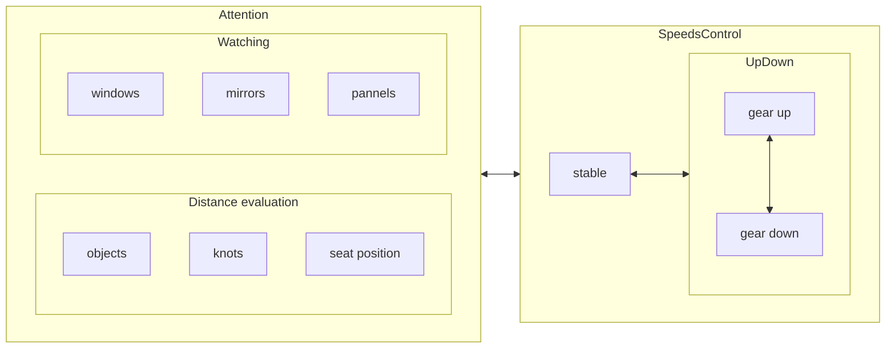

to check that speed ranges again.

| gear  | upshift at | dest  | downshift at | dest  | range | range2 |
| :---: | :--------: | :---: | :----------: | :---: | :---: | :----: |
|   1   |    #15+    |  +2   |              |       | 00-20 | 00-20  |
|   2   |    #25+    |  +3   |     #10-     |  -1   | 05-30 | 10-30  |
|   3   |    #35+    |  +4   |     #20-     |  -2   | 15-40 | 20-40  |
|   4   |    #45+    |  +5   |     #30-     |  -3   | 25-50 | 30-50  |
|   5   |            |       |     #40-     |  -4   | 35-60 | 50---- |

https://www.cnblogs.com/arxive/p/5551052.html

https://www.yoojia.com/wenda/597250.html?fromtype=top1


### Initial state checking 

- rearview mirror: left, right, inside.
- lights: headlight(dipped headlight, headlights on full beam), turn signal, clearance lamp, emergency light, fog light.
- wiper wash, hand brake, gears
- seatbelt

### lights

turn signal, up for right, down for left.

### shift gears

0. to a speed wanted, to speed up or down via accelerator or break.
1. releasing accelerator or break.
2. to step clutch down.
3. to move gear lever to target gear.
4. releasing clutch.
5. keeping speed.


---

moving gear lever, from center 
- gear 1: from left to top
- gear 2: from left to down
- gear 3: center to top
- gear 4: center to bottom
- gear 5: right to top
- gear R: right to bottom
  
```
    1   3   5 
    │   │   │
    ├───┼───┤
    │   │   │
    2   4   R
```

<details>
<summary>6 gears</summary>

```
    R   1   3   5 
    │   │   │   │
    └───┼───┼───┤
        │   │   │
        2   4   6
```

</details>


---

### upshift 

before upshifting, to speed up a range like `[1-4]5`, then shift to target gear.

### downshift

before downshifting, to speed down a range like `[1-4]0`, then shift to target gear.  

### steering wheel

↪️↩️🔄🔃

``` 
 initial state
    _______
   /       \
  |         |
  |————○————|
  |    |    |
   \___|___/
 
 1/4 lap, from ↩️              
    _______
   /   |   \
  |    |    |
  |----○    |
  ||||.|    |
   \||.|___/


 half lap, from ↩️              
    _______
   /||.|   \
  ||||.|    |
  |————○————|
  |||||.    |
   \|||.___/

 3/4 lap, from ↩️
    _______
   /||.|.||\
  ||||.|.||||
  ||||.○----|
  ||||.|    |
   \||.|___/

 a lap, from 🔃              
    _______
   /       \
  |         |
  |————○————|
  |    |    |
   \___|___/

```

### State conversion when driving



### Environment evaluation

### Weather estimation

### Cost to car

```javascript

class CostOfCarForMaintainence {
    constructor() {
        this.insurance = 2000
        this.parking = 400 * 12
        this.maintain = 2000

        this.costs = this.insurance + this.parking + this.maintain
    }
}

class CostOfCarForWorking {
    constructor() {
        this.gasForHundredMiles = 7
        this.priceOfLitre = 8

        this.milesForWorkADay = 15
        this.hundredMilesForWork = (this.milesForWorkADay * 20) / 100.0
        this.gasForMonth = (this.hundredMilesForWork * this.gasForHundredMiles * this.priceOfLitre)
        this.gasForYear = (this.gasForMonth * 12)

        this.costs = this.gasForYear
    }
}


class CostOfCarForGoingHome {
    constructor() {
        this.gasForHundredMiles = 7
        this.priceOfLitre = 8

        this.milesForATrip = 300
        this.timesOfTrip = 4

        this.costForToll = 150

        this.costs = (((this.milesForATrip * this.timesOfTrip) / 100) * this.gasForHundredMiles * this.priceOfLitre) + (this.costForToll * this.timesOfTrip)
    }
}

var costOfCarForMaintainence = new CostOfCarForMaintainence()
var costOfCarForWorking = new CostOfCarForWorking()
var costOfCarForGoingHome = new CostOfCarForGoingHome()

console.log("costOfCarForMaintainence", costOfCarForMaintainence)
console.log("costOfCarForWorking", costOfCarForWorking)
console.log("costOfCarForGoingHome", costOfCarForGoingHome)

console.log("all ￥：" + costOfCarForMaintainence.costs + costOfCarForWorking.costs + costOfCarForGoingHome.costs)

// rent 

class CostOfRentCarForSpringFestval {
    constructor() {
        this.days = 5
        this.costOfADay = 310


        this.gasForHundredMiles = 7
        this.priceOfLitre = 8

        this.milesForATrip = 300
        this.timesOfTrip = 2

        this.costOfAToll = 0

        this.costOfToll = this.costOfAToll * this.timesOfTrip
        this.costOfCar = this.days * this.costOfADay
        this.costOfGas = (((this.milesForATrip * this.timesOfTrip) / 100) * this.gasForHundredMiles * this.priceOfLitre)
        this.costs = this.costOfCar +
            this.costOfGas +
            this.costOfToll
    }
}

var costOfRentCarForSpringFestval = new CostOfRentCarForSpringFestval()
console.log(costOfRentCarForSpringFestval)


```
